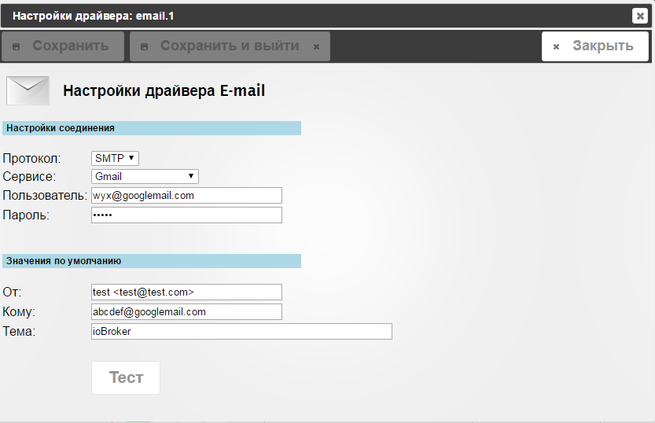
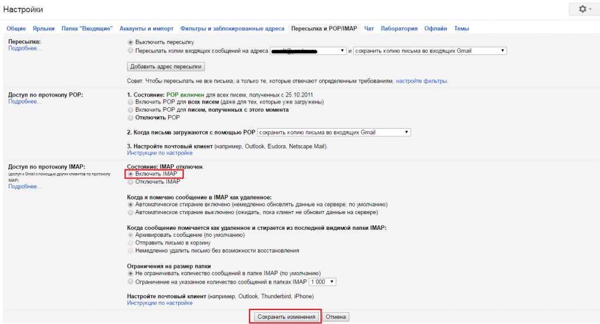
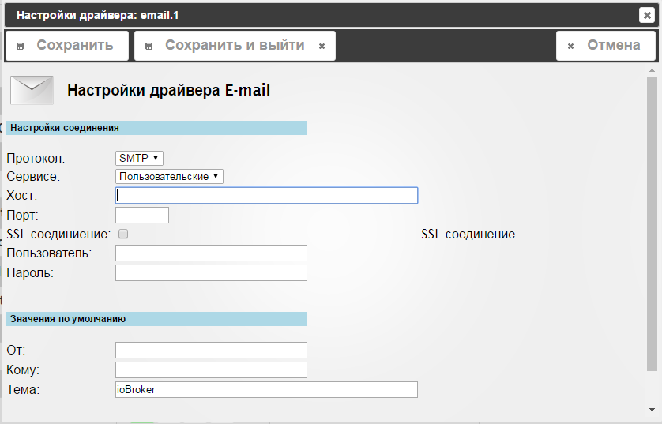
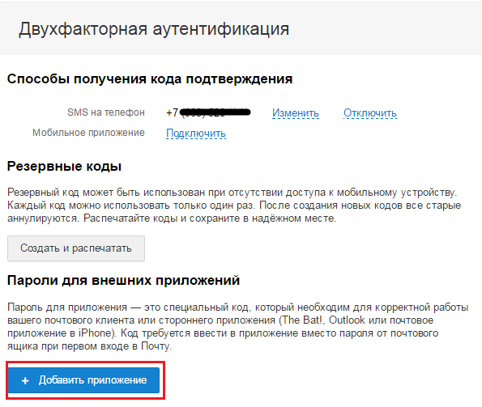
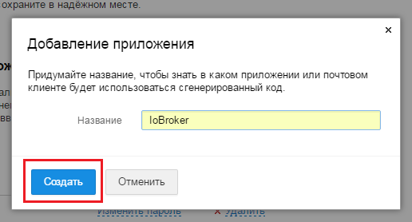
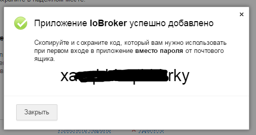
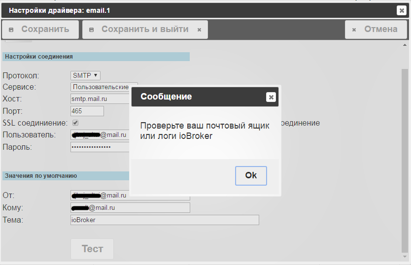

## Описание

Драйвер Email используется для отправки из IoBroker электронных писем на указанный в настройках электронный почтовый ящик.

##  Информация

##  Настройка

После установки драйвера необходимо сделать настройки, указав данные для подключения к почтовому серверу. [

 **Протокол:** используемый протокол для отправки почты - SMTP. **Сервис**: используемый почтовый сервис. **Пользователь**: логин пользователя для подключения к сервису (в большинстве случаем это полный электронный адрес со знаком @). **Пароль**: пароль пользователя **От**: тут указывается email отправителя (обычно совпадает с полем **Пользователь) *** **Кому**: указывается Email получателя письма * **Тема**: общаая для всех, тема письма. * *Есть возможность задать произвольное значение в скрипте. **Важно!** Для использования драйвера на почтовых сервисах, использующих двухэтапную аутентификацию на сервере, вам необходимо  в настройках вашего почтового сервиса разрешить использование сторонних почтовых программ и установить пароль для подключение сторонней программы к вашему серверу почты. Это может снизить безопасность вашего почтового аккаунта.

## Поддерживаемые сервисы

На данный момент драйвер поддерживает следующие почтовые сервисы:

*   1und1
*   AOL
*   DebugMail.io
*   DynectEmail
*   FastMail
*   GandiMail
*   Gmail
*   Godaddy
*   GodaddyAsia
*   GodaddyEurope
*   hot.ee
*   Hotmail
*   iCloud
*   mail.ee
*   Mail.ru
*   Mailgun
*   Mailjet
*   Mandrill
*   Naver
*   Office365
*   OpenMailBox
*   Postmark
*   QQ
*   QQex
*   SendCloud
*   SendGrid
*   SES
*   SES-US-EAST-1
*   SES-US-WEST-2
*   SES-EU-WEST-1
*   Sparkpost
*   web.de
*   Yahoo
*   Yandex
*   Zoho
*   Пользовательские     //_Позволяет указать почтовый сервис не из списка, с произвольными данными подключения._

## Пример использования

Для отправки почты из ваших скриптов в Javascript адаптере используются следующий синтаксис:

<pre class="lang:default decode:true">// Отправить письмо из всех инстанций драйвера email
sendTo("email", "Текст письма");

// Отправить письмо с определенной инстанции драйвера email
sendTo("email.1", "Текст письма");

// Можно задать произвольную тему и другие параметры письма
sendTo("email", {
    from:    "iobroker@mydomain.com",
    to:      "aabbcc@gmail.com",
    subject: "Сообщение от ioBroker",
    text:    "Тестовой письмо!"
});

// Отправка вложений
sendTo("email", {
    attachments: [
       // Использование файла на диске для вложения в письмо
       {path: "/pathToImage/picture1.jpg"},
       {   // Использование URL ссылки на файл для вложения в письмо
            filename: 'license.txt',
            path: 'https://raw.github.com/andris9/Nodemailer/master/LICENSE'
       }
    ]
});

// Отправка письма в HTML формате
sendTo("email", {
    html: "
Встроенное изображение: 
",
    attachments:[
        {path: "path/to/file/image1.jpg", cid: "image1"}
    ]
});</pre>

Если вы пишете свой собственный драйвер, то для отправки письма из другого драйвера используется функция **adapter.sendTo.**

<pre class="lang:default decode:true">adapter.sendTo("email", "Текст письма");</pre>

## Пример настройки

### Настройка gmail

Попробуем настроить драйвер на примере сервиса Gmail Первым делом необходимо в настройках почты включить доступ по протоколу IMAP: [

 Внимание!  возможно потребуется снизить безопасность доступа к вашему аккаунту google. Если вы используете двухэтапную аутентификацию на google то понадобится еще изменить настройки доступа к аккаунту для ненадежных приложений. Прочитать что это такое, можно на справочной [странице](https://support.google.com/accounts/answer/6010255) гугла. Так же понадобится добавить пароль для стороннего приложения, прочитать про это можно на  этой [странице](https://support.google.com/accounts/answer/185833). После внесения всех настроек, нажимаем кнопку **Тест** [

 И если все настройки правильные то должно появится сообщение о успешной отправке письма. [

### Настройка к произвольному сервису

Рассмотрим пункт настройки сервиса - **Пользовательские**. В качестве примера попробуем подключить наш драйвер к сервису mail.ru. Выбираем в настройках Сервис - Пользовательские: [

 Идем на сайт почтового сервиса и находим, в справке или настройках, параметры для подключения сторонних почтовых программ. Ищем там данные для подключения к почтовому сервису: [

 Из этого списка нас интересует только подключение к серверу исходящей почты (SMTP). И так как у меня включена двухфакторная аутентификация на сервисе, то необходимо получить пароль для почтовой программы добавив новое приложение в настройках почтового ящика: [

 Вводим произвольное название нашего приложения и жмем Создать: [

 Вводим текущий пароль доступа и  нам выдается пароль, который нужно скопировать в настройки нашего драйвера email в поле **Пароль ** [

 Указываем все полученные данные в настройках нашего драйвера, жмем кнопку **Тест** ивидим сообщение о успешной отправке письма. На этом наши настройки закончены. [

