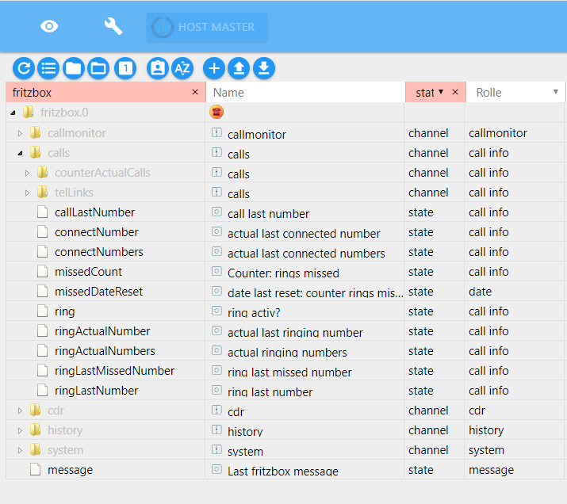

   
Fritzbox
========

|Stand der Doku |11.01.2019                      |
|----------------|---------------------------------|
| Entwickler     |ruhr70                          |
| Kategorie      |Hardware                        |
| Keywords       |Fritzbox, AVM, Telefon, Anruf   |
| Abhängigkeiten |Freigeschalteter FB-Callmonitor |
| Lizenz         |MIT                             |

AVM Fritz!Box®
--------------

Bei der Fritz!Box (Eigenschreibweise des Herstellers AVM) handelt es sich um die
am weitesten verbreiteten Router auf dem Markt.

Es gibt mittlerweile Modelle für alle gängigen Internet-Anschlussarten: DSL-,
Kabel-, Mobilfunk- und Glasfaserzugänge.

Adapter Fritzbox
----------------

Der Adapter stellt eine Verbindung zwischen Fritzbox (kurz FB) und ioBroker her
und stellt Daten und Listen über Anrufe zur Verfügung.

Voraussetzungen vor Installation
--------------------------------

Der Datenaustausch erfolgt über den in der FB integrierten *Callmonitor*. Um
diesen zu aktivieren, ruft man von einem angeschlossenen Telefon folgende Nummer
an:

\#96\*5\* – Callmonitor einschalten

\#96\*4\* – Callmonitor ausschalten

Konfiguration
-------------

### Settings

`Hier ist lediglich zu aktivieren, welche Daten in welcher Form übermittelt werden sollen´

Weitere Informationen im Forum <a href="https://forum.iobroker.net/viewtopic.php?f=20&t=3344&hilit=fritzbox" title="Titel">
in diesem Thread</a>

### Autosetup

s. Settings

Instanz
-------

Unter *Instanzen* des ioBrokers finden sich die installierte Instanz des
Adapters. Links ist im Ampelsystem visualisiert, ob der Adapter aktiviert und
verbunden ist.

Platziert man den Mauszeiger auf ein Symbol, erhält man Detailinformationen.

Objekte des Adapters
--------------------

Im Bereich Objekte werden in einer Baumstruktur alle von der FB dem Adapter
übermittelten Werte, Listen und Informationen dargestellt (s. Einstellungen).

Direkt im Instanzordner *fritzbox.x* findet sich der Datenpunkt *Message* mit
Datum, Uhrzeit und Art der letzten Aktion.

Nachfolgend werden die jeweiligen Kanäle und die darin angelegten Datenpunkte
kurz beschrieben.

### Kanal callmonitor:

Datenpunkte zeigen in Realtime die Anrufe

| **Datenpunkt** | **Beschreibung**                                                      |
|----------------|-----------------------------------------------------------------------|
| all            | Anzeige von Datum, Uhrzeit und Rufnummer; ein und ausgehend           |
| call           | Anzeige von Datum, Uhrzeit und Rufnummer; ausgehend                   |
| connect        | Anzeige von Datum, Uhrzeit und Rufnummer einer bestehenden Verbindung |
| ring           | Anzeige von Datum, Uhrzeit und Rufnummer ausgehender Anrufe           |

### Kanal calls

Innerhalb dieses Kanals werden 2 weitere Kanäle sowie einige Datenpunkte
angelegt:

| **Datenpunkt**       | **Beschreibung**                            |
|----------------------|---------------------------------------------|
| callLastNumber       | Zuletzt gewählte Rufnummer                  |
| connectNumber        | Letztes aktuell verbundenes Gespräch        |
| connectNumbers       | alle aktuell verbundenen Gespräche          |
| missedCount          | Zähler verpasste Anrufe                     |
| missedDateReset      | Datum letzter Zähler-Reset                  |
| ring                 | Signal eingehender Anruf                    |
| ringActualNumber     | Rufnummer eines aktuell eingehenden Anrufs  |
| RingActualNumbers    | Rufnummern aller aktuell eingehenden Anrufe |
| ringLastMissedNumber | Rufnummer letzter                           |
| ringLastNumber       | Rufnummer des letzten eingehenden Anrufs    |

#### counterActualCalls

Hier werden in Realtime die Werte der verschiedenen Zähler aktueller Anrufe
aufgeführt:

| **Datenpunkt** | **Beschreibung**                                     |
|----------------|------------------------------------------------------|
| allActiveCalls | Anzahl aller aktiven Anrufe (bestehende, eingehende) |
| callCount      | Anzahl ausgehender Anrufe                            |
| connectCount   | Anzahl bestehender Verbindungen                      |
| ringCount      | Anzahl aktuell eingehender Anrufe                    |

#### telLinks

Die unten aufgeführten Datenpunkte sind als Link formatiert, so dass die
entsprechende Nummer über den Link anwählbar ist (z.B. über ein Widget in VIS):

| **Datenpunkt**          | **Beschreibung**                             |
|-------------------------|----------------------------------------------|
| callLastNumberTel       | Letzter eingehender Anruf                    |
| ringLastMissedNumberTel | Letzter verpasster Anruf                     |
| ringLastNumberTel       | Wahlwiederholung, zuletzt gewählte Rufnummer |

### Kanal cdr

Diese Datenpunkte stellen Informationen in formatierter Form zur Verfügung (s.
Einstellungen)

| **Datenpunkt** | **Beschreibung**         |
|----------------|--------------------------|
| html           | Letzter Anruf            |
| json           |                          |
| missedHTML     | Letzter verpasster Anruf |
| missedJSON     |                          |
| txt            | Letzter Anruf            |

### Kanal history

Diese Datenpunkte stellen Tabellen formatierter Form zur Verfügung. Welche
Informationen übermittelt werden, kann in den Einstellungen festgelegt werden

| **Datenpunkt**  | **Beschreibung** |
|-----------------|------------------|
| allTableHTML    |                  |
| allTableJSON    | Alle Anrufe      |
| allTableTxt     |                  |
| missedTableHTML | Verpasste Anrufe |
| missedTablejSON |                  |

### Kanal system

| **Datenpunkt** | **Beschreibung**                                           |
|----------------|------------------------------------------------------------|
| deltaTime      | Deltazeit zwischen ioBroker-Systemzeit und Fritzbox in sec |
| deltaTimeOK    | Prüfergebnis (true/false)                                  |

FAQ
===

F: Es gibt den Fritzbox- und den TR-064-Adapter, der auch auf FB-Callmonitor
zugreift. Wo sind die Unterschiede, müssen beide Adapter installiert sein?

A: Der Fritzbox-Adapter stammt aus der Anfangsphase und stellte von den
möglichen Informationen des Routers lediglich die zur Verfügung, die Anrufe
betrafen.

TR-064 kann als Weiterentwicklung betrachtet werden, da dieser Adapter viel
umfangreichere Informationen bietet, z.B. über die an der FB angemeldeten
Geräte.

Im Prinzip reicht es, wenn einer der beiden Adapter installiert ist. Da aber viele
langjährige Benutzer den FB-Adapter nutzen und darauf ihre
Visualisierung aufgebaut haben, bleibt er weiterhin verfügbar, wird aber nicht
mehr weiterentwickelt.

Neueinsteigern wird empfohlen, den <a href="https://github.com/ioBroker/ioBroker.docs/tree/master/docs/adapterref/docs/iobroker.tr-064" title="Titel">TR-064-Adapter</a> zu installieren.

