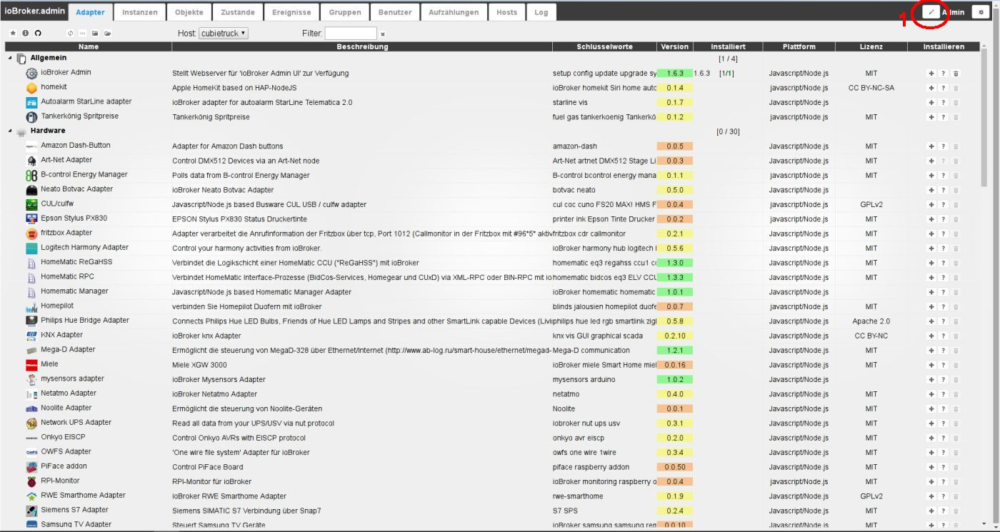

## ausführliche Beschreibung

Der Adapter admin dient der Bedienung der gesamten ioBroker-Installation. Er stellt ein Webinterface zur Verfügung. Dieses wird unter der `<IP-Adresse des Servers>:8081` aufgerufen. Dieser Adapter wird direkt bei der Installation von ioBroker angelegt.

Über das vom Adapter zur Verfügung gestellte GUI können u.a. folgenden Funktionen abgerufen werden:

*   Installation weiterer Adapter
*   Zugriff auf Objektübersicht
*   Zugriff auf die Zustandsübersicht der Objekte
*   Zugriff auf Benutzer und Gruppen Administration
*   Zugriff auf das Logfile
*   Verwaltung der Hosts

## Installation

Dieser Adapter wird direkt bei der Installation von ioBroker angelegt eine manuelle Installation ist nicht notwendig

## Konfiguration

#### IP

Hier wird die IP-Adresse unter der der Adapter erreichbar ist eingegeben. Verschiedene Ipv4 und Ipv6 Möglichkeiten stehen zur Auswahl. 
**Default ist 0.0.0.0\. Dies darf nicht verändert werden!**

#### Port

Hier wird der Port, unter der der Administrator aufgerufen werden kann eingestellt. Falls auf dem Server mehrere Webserver laufen muss dieser Port angepasst werden, damit es nicht zu Problemen wegen doppelter Portvergabe kommt.

#### Verschlüsselung

Soll das sichere Protokoll https verwendet werden ist hier ein Haken zu setzen.

#### Authentifikation

Soll eine Authentifizierung erfolgen ist hier ein Haken zu setzen.

## Bedienung

Über den Webbrowser die folgende Seite aufrufen: 

`<IP-Adresse des Servers>:8081`

## Reiter

Die Hauptseite des Administrators besteht aus mehreren Reitern. In der Grundinstallation werden die Reiter wie in der Abbildung angezeigt. Über das Bleistift-Icon rechts oben (1) können nach der Installation zusätzlicher Adapter weitere Reiter hinzugefügt werden. Dort können auch Reiter deaktiviert werden um eine besser Übersicht zu erhalten.

Ausführliche Informationen sind in den Seiten hinterlegt, die über die Überschriften verlinkt sind.

### [Adapter](admin/tab-adapters.md)

Hier werden die verfügbaren und installierten Adapter angezeigt und verwaltet.

### [Instanzen](admin/tab-instances.md)

Hier werden die bereits über den Reiter Adapter installierten Instanzen aufgelistet und können entsprechend konfiguriert werden.

### [Objekte](admin/tab-objects.md)

Die verwalteten Objekte (z.B. die Geräte/Variablen/Programme der CCU). Hier können Objekte angelegt und gelöscht werden. 
Über die _Pfeil hoch_ und _Pfeil runter_ Knöpfe können ganze Objektstrukturen hoch- oder runtergeladen werden. 
Ein weiterer Knopf ermöglicht die Anzeige der Expertenansicht.

Werden Werte in roter Schrift angezeigt, sind sie noch nicht bestätigt (`ack = false`).

### [Zustände](admin/tab-states.md)

Die aktuellen Zustände der Objekte.

### [Ereignisse](admin/tab-events.md)

Eine Liste der laufenden Aktualisierung der Zustände.

### [Gruppen](admin/tab-groups.md)

Hier werden die angelegten Usergruppen angelegt und die Rechte verwaltet

### [Benutzer](admin/tab-users.md)

Hier können Benutzer angelegt und zu den bestehenden Gruppen hinzugefügt werden.

### [Aufzählungen](admin/tab-enums.md)

Hier werden die Favoriten, Gewerke und Räume aus der Homematic-CCU aufgelistet.

### [hosts](admin/tab-hosts.md)

Informationen über den Rechner, auf dem ioBroker installiert ist. 
Hier kann die aktuelle Version des js-Controllers upgedated werden. 
Liegt eine neue Version vor, erscheint die Beschriftung des Reiters in grüner Farbe.

### [Log](admin/tab-log.md)

Hier wird das log angezeigt

Im Reiter Instanzen kann bei den einzelnen Instanzen der zu loggende Loglevel eingestellt werden. 
In dem Auswahlmenü wird der anzuzeigende Mindest-Loglevel ausgewählt. 
Sollte ein Error auftreten, erscheint die Beschriftung des Reiters in roter Farbe.

Nach der Installation zusätzlicher Adapter können noch weitere Reiter über das 
Bleistift-Icon oben rechts (1) aktiviert werden. Die Beschreibung dieser 
Reiter befindet sich bei dem entsprechenden Adapter.

### [Systemeinstellungen](admin/tab-system.md)

In dem sich hier öffnenden Menü werden Einstellungen wie Sprache, Zeit- und Datumsformat sowie 
weitere systemweite Einstellungen getätigt. 

 

Auch die Repositorien und Sicherheitseinstellungen können hier eingestellt werden. 
Eine tiefergehende Beschreibung ist über den Link in dem Titel dieses Abschnitts zu erreichen.

## Changelog
### 5.0.2 (2020-12-26)
* (bluefox) Merged the changes from admin4

### 5.0.0 (2020-09_23)
* (bluefox) The tile view implemented for the file browser

### 4.2.1 (2021-01-12)
* (Apollon77) Also allow pre-prelease versions for dependency checks

### 4.2.0 (2021-01-08)
* (bluefox) Support of new Let's Encrypt (only with js-controller 3.2.x)

### 4.1.13 (2021-01-08)
* (bluefox) Support of new Let's Encrypt (only with js-controller 3.2.x)

### 4.1.12 (2020-12-12)
* (bluefox) Corrected the error with empty names in enums

### 4.1.11 (2020-11-22)
* (theimo1221) Prevent Duplicate Event Handling on Dropdown Checkboxes
* (paul53) fix Objects dialog

### 4.1.10 (2020-10-08)
* (bluefox) Corrected the icons of the custom tabs. 

### 4.1.8 (2020-09-03)
* (bluefox) Fixed editing of the objects with % sign in the ID.

## License

The MIT License (MIT)

Copyright (c) 2014-2020 bluefox <dogafox@gmail.com>