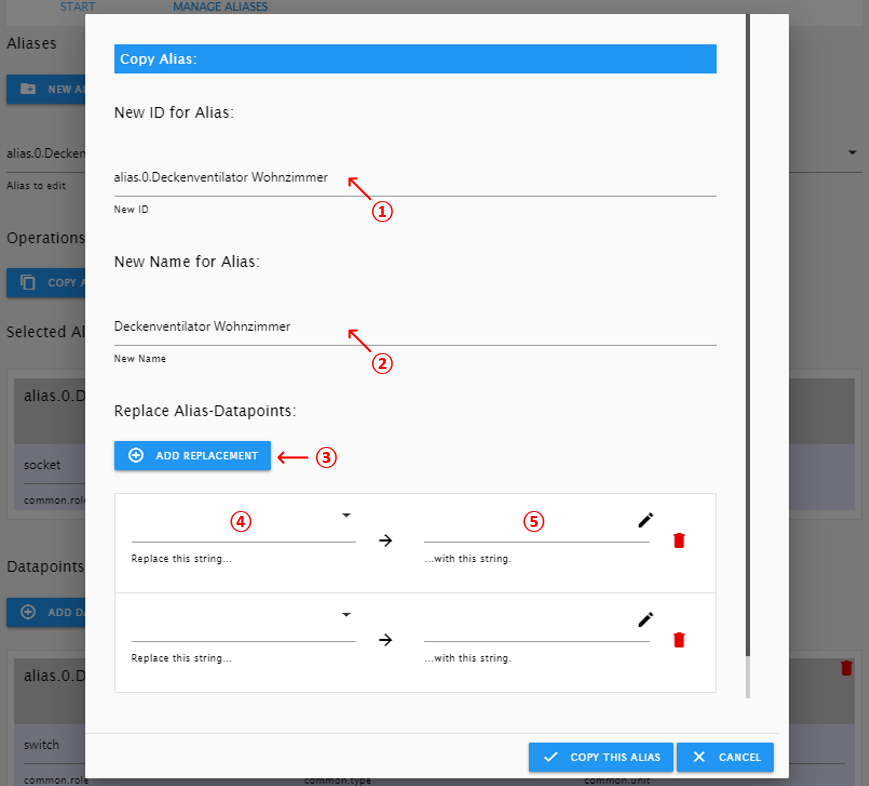

# IoBroker.alias-manager
## Alias-Manager-Adapter für ioBroker
Verwaltet und erstellt Aliase.

## Quick Intro

* (1) Klicken Sie auf "ALIASEN VERWALTEN".
* (2) Um einen neuen Alias zu erstellen, klicken Sie auf 'NEUE ALIAS' oder
* (3) Wählen Sie einen vorhandenen Alias zum Bearbeiten aus

* (1) Sie finden dann einen Bereich mit allgemeinen Einstellungen dieses Alias, wie dem Namen oder der allgemeinen Rolle
* (2) Nachfolgend finden Sie eine Liste mit allen Datenpunkten des Alias
* (3) Sie können dieser Liste Alias-Datenpunkte hinzufügen, indem Sie entweder einen leeren hinzufügen oder einen vorhandenen iobroker-Datenpunkt auswählen und seine Einstellungen auf einen neuen Alias-Datenpunkt kopieren
* (4) Sie können Datenpunkte löschen, indem Sie auf das Müllsymbol klicken
* Jeder Datenpunkt verfügt über mehrere Felder, um ihn zu konfigurieren:
    * Im grauen Bereich können Sie den Namen festlegen oder den Datenpunkt löschen
    * Im blauen Bereich können Sie die Rolle, den Typ und - optional - die Einheit konfigurieren
* Im grünen Bereich können Sie optional min und max festlegen und festlegen, ob der Datenpunkt schreibgeschützt sein soll (common.write ist deaktiviert) und ob auf seinen Wert zugegriffen werden kann (common.read ist aktiviert - was für die meisten die richtige Einstellung ist Fälle)
* Im roten Bereich können Sie:
* (5) Konfigurieren Sie den ursprünglichen ioBroker-Datenpunkt, mit dem dieser Alias-Datenpunkt verknüpft ist. Beide (der ursprüngliche Datenpunkt und der Alias-Datenpunkt) können gut synchron gehalten werden.
* (6) Außerdem können Sie Konvertierungsfunktionen für Lesen und Schreiben konfigurieren.
* Beispiel: Wenn Sie `` val / 10`` als "Read-Function" einstellen, beträgt der Wert des Aias-Datenpunkts immer 10 Prozent des ursprünglichen Datenpunkts.
* In den meisten Fällen möchten Sie dann `` val * 10`` als "Write-Function" konfigurieren, um dieses Verhältnis auch beim Schreiben in den Alias-Datenpunkt beizubehalten.
* Weitere Informationen hierzu finden Sie in der ioBroker-Dokumentation zu Aliasen unter https://www.iobroker.net/#en/documentation/dev/aliases.md

* (1) Wenn Sie auf 'ALIAS KOPIEREN' klicken, um oder zu kopieren
* (2) Wenn Sie 'Alias umbenennen', um den Alias umzubenennen, wird das folgende Dialogfeld geöffnet:

 \ Hier können Sie:

* (1) Stellen Sie eine neue ID ein und
* (2) Legen Sie einen neuen allgemeinen Namen für den Alias fest
* (3) Durch Klicken auf 'ERSATZ HINZUFÜGEN' können Sie der folgenden Liste Zeilen hinzufügen, wo Sie können:
    * (4) Geben Sie eine Zeichenfolge ein, nach der gesucht und durch (5) diese Zeichenfolge ersetzt wird
* Mit dieser Funktion können Sie schnell die ursprünglichen ioBroker-Datenpunkte ändern, mit denen Ihre Alias-Datenpunkte verknüpft sind
* Beispiel:
* Sie haben einen Fan mit mehreren Datenpunkten wie "SET", "ERROR" und "UNREACH"
* Diese Alias-Datenpunkte sind mit ursprünglichen Datenpunkten wie "hm-rpc.0.JEQ0698034.1.STATE", "hm-rpc.0.JEQ0698034.0.ERROR" und "hm-rpc.0" verknüpft .JEQ0698034.0.UNREACH``
* Wenn Ihr Gerät defekt ist und durch ein neues ersetzt werden muss, ändert sich die Seriennummer beispielsweise in ASDF1234
* Um alle Links in allen Alias-Datenpunkten auf einmal zu aktualisieren, können Sie nach `` hm-rpc.0.JEQ0698034`` suchen und durch `` hm-rpc.0.ASDF1234`` ersetzen
* Dies ist auch nützlich, wenn Sie neue Aliase erstellen, die einem alten ähnlich sind. Kopieren Sie einfach den Alias, legen Sie eine neue ID und einen neuen Namen fest und verwenden Sie die Ersetzungsfunktion, um die verknüpften Datenpunkte anzupassen

* Nach dem Ändern der Einstellungen können Sie:
* (1) Speichern Sie alle geänderten Alias-Datenpunkte auf einmal, indem Sie auf 'ALLE ÄNDERUNGEN SPEICHERN' oder klicken
* (2) Speichern Sie nur einen Datenpunkt, indem Sie auf "ÄNDERUNGEN SPEICHERN" klicken.
* (3) Schließlich können Sie den gesamten Alias löschen, indem Sie auf "ALIAS LÖSCHEN" klicken.

## Changelog

### 0.0.8 (2021-03-22)
* (sbormann) Added ability to create alias-datapoint from existing datapoint.

### 0.0.7 (2021-03-21)
* (sbormann) Fixed typos.
* (sbormann) Changed the way ioBroker-Objects are fetched (much faster).
* (sbormann) Added copy-button to datapoints.
* (sbormann) Empty fields are now removed (before they were set to null).
* (sbormann) Changed mode to onlyWWW.

### 0.0.6 (2021-01-18)
* (sbormann) Added delete datapoint.
* (sbormann) Some fixes .

### 0.0.1
* (sbormann) Initial release.

## License
MIT License

Copyright (c) 2021 Sebastian Bormann <sebastian@bormann.net>

Permission is hereby granted, free of charge, to any person obtaining a copy
of this software and associated documentation files (the "Software"), to deal
in the Software without restriction, including without limitation the rights
to use, copy, modify, merge, publish, distribute, sublicense, and/or sell
copies of the Software, and to permit persons to whom the Software is
furnished to do so, subject to the following conditions:

The above copyright notice and this permission notice shall be included in all
copies or substantial portions of the Software.

THE SOFTWARE IS PROVIDED "AS IS", WITHOUT WARRANTY OF ANY KIND, EXPRESS OR
IMPLIED, INCLUDING BUT NOT LIMITED TO THE WARRANTIES OF MERCHANTABILITY,
FITNESS FOR A PARTICULAR PURPOSE AND NONINFRINGEMENT. IN NO EVENT SHALL THE
AUTHORS OR COPYRIGHT HOLDERS BE LIABLE FOR ANY CLAIM, DAMAGES OR OTHER
LIABILITY, WHETHER IN AN ACTION OF CONTRACT, TORT OR OTHERWISE, ARISING FROM,
OUT OF OR IN CONNECTION WITH THE SOFTWARE OR THE USE OR OTHER DEALINGS IN THE
SOFTWARE.