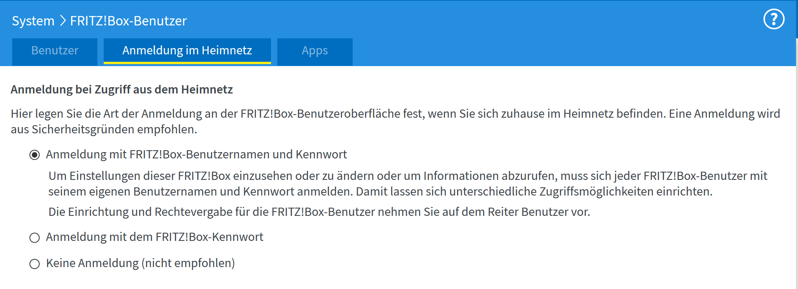

# Installationshinweise

## FritzBox Einstellungen

es muß ein Benutzer angelegt sein, der Zugriff auf die DECT Objecte hat

falls ein spezieller user angelegt wurde (also nicht admin für iobroker benutzt wird), dann sind die Berechtigungen zu setzen und die Voreinstellung das sich nur admin anmeldet, muß auf Benutzer umgestellt werden.

## Adapter Einstellungen

* IP mit vorangestellten "http://" eingeben
* Polling Intervall kann beliebig gewählt werden (Voreinstellung 5min=300sec). Dies ist notwendig um Bedienung ausserhalb von ioBroker nachzuführen, da die FritzBox keine automatischen Updates liefert.

## Adapter Start

mit dem Start des Adapters wird folgendes getan:
* die FW der Fritzbox wird abgefragt und im log geschrieben (manche Fritzboxen antworten darauf nicht und dies erzeugt ein Fehler).
* die Datenpunkte (Objekte) werden für Devices angelegt
* die Datenpunkte (Objekte) für Gruppen werden angelegt
* die Objekte werden mit Daten versorgt

Die folgenden Objekte werden nur einmalig beim Start geschrieben:
* id
* fwversion
* manufacturer
* productname
* masterdviceid
* members

## Thermostatfunktion

Das Thermostat kann im Automatikmodus betrieben werden (Temperaturregelung) und hierbei wird auf die Solltemperatur geregelt.
Die Solltemperatur kann die Komfortemperatur, die Absenktemperatur oder eine selbst gewählte Temperatur sein.

Zusätzlich kann das Ventil komplett geschlossen werden und die entspricht dem Zustand OFF.
Die andere Richtung kann mit ON auch vorgewählt werden und würde einem BOOST oder Saunamodus entsprechen (nicht vergessen es wieder regeln zu lassen ;-) ).

Diese derzeitig 3 Betriebsarten sind mit 0, 1 oder 2 im Datenpunkt mode vorwählbar.
Bei der Vorwahl von 0-AUTO wird die letzte Solltemperatur angewählt.

### Temperatur mit Offset
Es besteht die Möglichkeit die gemessene Temperatur in der FritzBox zu korrigieren, dazu gibt man die gemessene Temperatur an und es ergibt sich ein Offset. Dieser Offset wird für den Datenpunkt .temp mit berücksichtigt. Hier erhält man also die interne Temperaturmessung.
Die intern im Heizkörperregler benutzte Ist-Temperatur (actualtemp), wird durch den Offset auch verändert. D.h. der HKR regelt intern auf den korrigierten Wert.
Vergleichbar für den Soll-/Istverlaufs ist demnach atualtemp und targettemp.

## Troubleshooting

Es ist ratsam das log anzuschauen, sofern nicht aussagekräftig oder zu wenig Information ist der debug modus über die Experteneinstellung der Instanz vorzuwählen.

## Changelog
### 0.2.3
* skip updating values, when device not present

### 0.2.2
* added FritzDECT400 incl. testing
* removed offset in temp value
* new datapoint offset
* added template for switches
* added template testing

### 0.2.1
* gulp added
* correction for DECT100 without temperature (caused a stop in creation of objects)
* template creation corrected
* my templates added in admin page

### 0.2.0
* compact mode

### 0.1.5
* reading and activation of templates added
* correction of actual temperature in DECT200 and COMET (now offset recognized)
* password now hidden typed and encrypted
* new datapoint actualtemp for Comet
* fritzapi 0.10.5

### 0.1.4
* button added, only send the timestamp of last click
* fritzapi 0.10.4

### 0.1.3
* windowopenactiv added to thermostat

### 0.1.2
* errorcode string->number
* batterylow -> boolean
* switch in admin for non native API call for battery charge in % (shall prevent 403 message logs)

### 0.1.1
* switch for GuestWLAN when no access is granted and polling creates an error
* check for devices in admin page for better access to the xml/json stream from fritzbox
* admin v3 implemented

### 0.1.0
* major code change to use the xml stream instead the dedicated API-commands for the dedicated values
* creation of objects according the feedback from fritzbox
* support of groups
* still usage of non-universal object names
* more objects

### 0.0.14
* correction of temp offset influence

### 0.0.13
* DECT200 voltage new object
* DECT200 mode/lock value polling
* Comet mode as number and not array
* ADMIN v3

### 0.0.12
* changed state to  mode AUTO/OFF/ON for thermostat (including datapoint lasttarget when going back to AUTO)
* added name state for thermostat
* DECT100 temperature reading
* Contact reading

### 0.0.11
* added state OFF/ON for thermostat

### 0.0.10
* change to object oriented interface
* getOSversion when starting for log

### 0.0.9
* values '1' accepted for ON
* values '0' accepted for OFF

### 0.0.8
* messages info-> debug
* values 1/true/on/ON accepted for ON
* values 0/false/off/OFF accepted for OFF

### 0.0.7
* current temp of Comet/DECT300
* cyclic polling GuestWLAN

### 0.0.6
* correction targettemp in DECT200 section

### 0.0.5
* setTemp on COMET
* GuestWlan corrected

### 0.0.4
* cyclic status polling

### 0.0.3
* user now configurable

### 0.0.2
* metro widget for Dect200
* smartfritz-promise->fritzapi
* running version, tested with 1x DECT200 and Fritzbox FW=6.51 on Win10 with 4.5.0 and raspberry 4.7.0

### 0.0.1
* running version, tested with 1x DECT200 and Fritzbox FW=6.30

## License

The MIT License (MIT)

Copyright (c) 2018 - 2019 foxthefox <foxthefox@wysiwis.net>