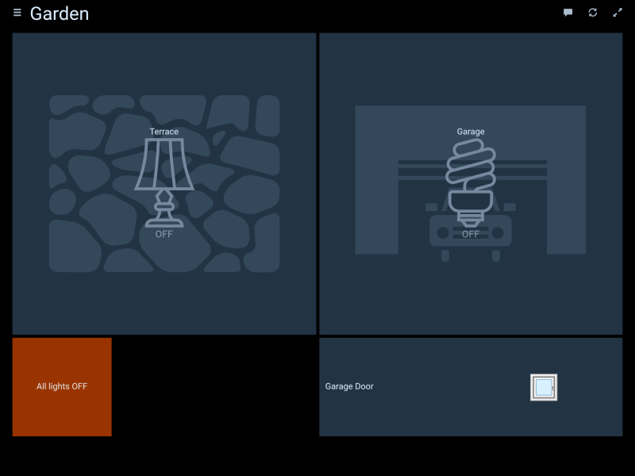
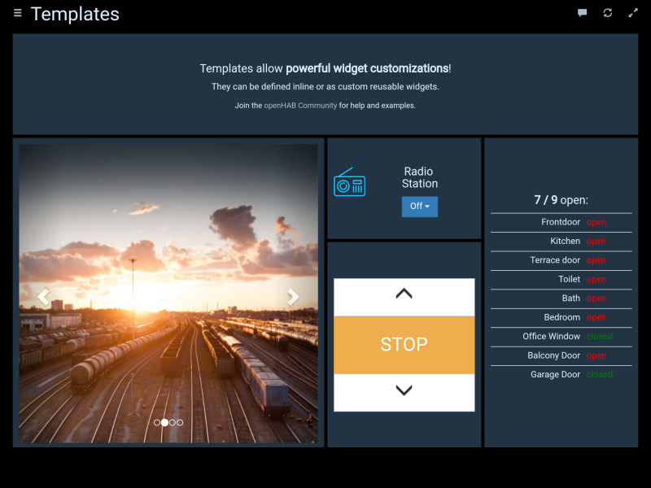

# IoBroker.habpanel
HABPanel ist eine leichtgewichtige Dashboard-Oberfläche für ioBroker, die auf OpenHAB HABpanel basiert.

Es verfügt insbesondere über einen eingebetteten Dashboard-Designer, mit dem Schnittstellen einfach direkt auf dem Zielgerät erstellt werden können.

## Installation
** Wichtig! ** Dieser Adapter kann nicht direkt von Github installiert werden. Nur ab npm.

## Fertig machen
- Wenn Sie zum ersten Mal mit einem neuen Browser oder Gerät auf HABPanel zugreifen, sollte ein eher leerer Bildschirm angezeigt werden. Folgen Sie dem Lernprogramm und klicken Sie zunächst auf das Symbol in der oberen rechten Ecke (oder tippen Sie darauf).
- Sie befinden sich jetzt im Bearbeitungsmodus. Ein Link (_ "Neues Dashboard hinzufügen" _) sowie ein Link "Erweiterte Einstellungen" _ wurden angezeigt.
- Wenn Sie zuvor HABPanel verwendet und einige Bedienfeldkonfigurationen auf dem Server gespeichert haben, gehen Sie zu _ "Erweiterte Einstellungen" _ und klicken Sie auf Ihre vorherige Konfiguration - diese wird sofort wiederhergestellt. Oder erstellen Sie Ihr erstes Dashboard: Klicken / tippen Sie auf den Link _ "Neues Dashboard hinzufügen" _ und geben Sie ihm einen Namen.
- Klicken / tippen Sie auf die Dashboard-Kachel, um den Dashboard-Editor aufzurufen
- Fügen Sie Ihr erstes Widget hinzu: Wählen Sie das Menü _ "Widget hinzufügen" _ und wählen Sie einen Widget-Typ (sagen wir Dummy - ein einfaches Widget, das den Status eines Elements anzeigt).
- Verschieben Sie das Widget per Drag & Drop und ändern Sie die Größe mit dem weißen Chevron. Es wird angezeigt, wenn Sie auf das Widget klicken
- Klicken Sie auf die drei Punkte in der oberen rechten Ecke des Widgets, um das Kontextmenü aufzurufen, und wählen Sie _ "Bearbeiten ..." _
- Passen Sie einige Einstellungen an (Name, openHAB-Element usw.) und bestätigen Sie Ihre Änderungen
- Speichern Sie Ihre Konfiguration, indem Sie auf die Schaltfläche Speichern klicken
- Klicken / tippen Sie auf _Run_, um Ihr Dashboard in Aktion zu sehen. - Verwenden Sie die Zurück-Schaltfläche Ihres Browsers oder den Pfeil, um zum Zeichenbrett zurückzukehren
- Wenn Sie mit Ihren Dashboards zufrieden sind, kehren Sie zu _ "Erweiterte Einstellungen" _ zurück und klicken / tippen Sie auf _ "Aktuelle Konfiguration in einer neuen Bedienfeldkonfiguration speichern" _; Dadurch wird es wie oben beschrieben auf dem openHAB 2-Server gespeichert und zur Wiederverwendung verfügbar gemacht.

## Screenshots

## Changelog
### 0.4.3 (2020-08-22)
* (bluefox) The compatibility to socket.io 3.0.13 provided 

### 0.4.1 (2020-02-10)
* (Apollon77) compatibility to web 3.0

### 0.3.5 (2019-04-15)
* (yaming116) bugfix i18n

### 0.3.4 (2019-02-04)
* (janfromberlin) button widget did not handle primitive boolean commands
* (matthiasgasser) fix time series query start date, adapted end date

### 0.3.3 (2019-02-02)
* (janfromberlin) fix button toggle functionality for true/false

### 0.3.2 (2019-01-30)
* (foxthefox) chart and timeline functionality fixed

### 0.3.1 (2019-01-27)
* (foxthefox) chart and timeline functionality added

### 0.2.6 (2019-01-14)
* (jogibear9988) bugfix selection element

### 0.2.5 (2019-01-14)
* (jogibear9988) bugfix format strings

### 0.2.4 (2019-01-13)
* (jogibear9988) bugfix template widget

### 0.2.3 (2019-01-11)
* (jogibear9988) upgrade to current openhab version

### 0.1.7 (2017-05-20)
* (bluefox) add to welcome screen

### 0.1.6 (2017-05-15)
* (bluefox) initial commit

## License
Copyright 2017-2020 bluefox <dogafox@gmail.com>

Eclipse Public License