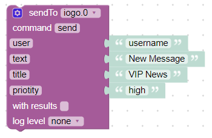

# IoBroker.iogo
=================

Dieser Adapter fügt der Smarthome-App ioGo (https://play.google.com/store/apps/details?id=de.nisnagel.iogo) zusätzliche Funktionen hinzu.
Bitte navigieren Sie zu Einstellungen / Konto, um sich mit E-Mail und Passwort anzumelden.
Nach dem Erstellen eines Kontos in der App können Sie diesen Adapter für die Push-Benachrichtigung verwenden.
Zusätzlich speichert dieser Adapter den aktuellen Status Ihrer Smarthome-Geräte.

## Aufbau
Sie sollten Ihre Kontoinformationen (E-Mail / Passwort) festlegen. Danach den Adapter starten.

## Verwendungszweck
Sie können eine Nachricht an alle authentifizierten Benutzer über messageBox ```sendTo('iogo', 'New message')``` oder an einen bestimmten Benutzer ```sendTo('iogo', {user: 'Username', text: 'Test message'})``` senden.
Benutzer muss zuvor erstellt werden (lesen Sie bitte die Anwendungsdokumentation für weitere Details).

Es ist möglich, mehrere Empfänger anzugeben (trennen Sie die Benutzernamen einfach durch Komma). Zum Beispiel: Empfänger: "Benutzer1, Benutzer4, Benutzer5"

Beispiel für das Senden einer benutzerdefinierten Benachrichtigung mit Javascript:

```
sendTo('iogo', {
    user:                   'Username',
    text:                   'New message',
    title:                  'VIP News'
});
```

Und ein Beispiel mit Blockly:



Rückrufe werden ebenfalls unterstützt:

```
sendTo('iogo', {title: 'News', text: 'New message'}, function (res) {
    console.log('Sent to ' + res + ' users');
});
```

**Möglichkeiten**:

- *user* Einzelner Benutzer oder Liste von Benutzern
- *text* Der Nachrichtentext der Benachrichtigung
- *title* Der Titel der Benachrichtigung

## PRO-Funktionen
Pro-Funktionen stehen ab dem Kauf eines monatlichen / jährlichen Abonnements in der ioGo App sofort zur Verfügung.

### Bilder ###
Senden Sie einfach den Pfad zu Ihrem Bild anstelle von Text. ```sendTo('iogo.0', 'absolute/path/file.png')```

```
sendTo('iogo', {
    user:                   'Username',
    text:                   'New message',
    title:                  'VIP News',
    url:                    'absolute/path/file.png'
});
```

## Changelog
### 0.3.0
* (nisio) added support of compact mode

### 0.2.x
* (nisio) added pro features

### 0.1.x
* (nisio) initial release

## License
The MIT License (MIT)

Copyright (c) 2018 Nis Nagel <support@nisnagel.de>

Permission is hereby granted, free of charge, to any person obtaining a copy
of this software and associated documentation files (the "Software"), to deal
in the Software without restriction, including without limitation the rights
to use, copy, modify, merge, publish, distribute, sublicense, and/or sell
copies of the Software, and to permit persons to whom the Software is
furnished to do so, subject to the following conditions:

The above copyright notice and this permission notice shall be included in
all copies or substantial portions of the Software.

THE SOFTWARE IS PROVIDED "AS IS", WITHOUT WARRANTY OF ANY KIND, EXPRESS OR
IMPLIED, INCLUDING BUT NOT LIMITED TO THE WARRANTIES OF MERCHANTABILITY,
FITNESS FOR A PARTICULAR PURPOSE AND NONINFRINGEMENT. IN NO EVENT SHALL THE
AUTHORS OR COPYRIGHT HOLDERS BE LIABLE FOR ANY CLAIM, DAMAGES OR OTHER
LIABILITY, WHETHER IN AN ACTION OF CONTRACT, TORT OR OTHERWISE, ARISING FROM,
OUT OF OR IN CONNECTION WITH THE SOFTWARE OR THE USE OR OTHER DEALINGS IN
THE SOFTWARE.