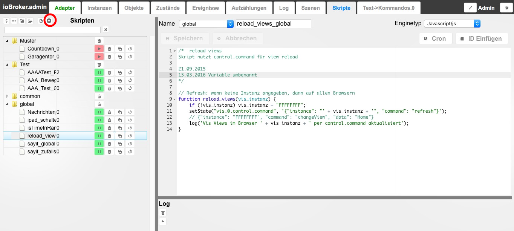

** Hinweis: Momentan beinhaltet die Englishe Version viel mehr infomation und wir empfehlen die zu lesen**

Der javascript-Adapter dient dazu komfortabel Skripte zu erstellen, editieren und zu verwalten.

## Konfiguration
[Hier ist mehr darüber](https://github.com/ioBroker/ioBroker/wiki/ioBroker-Adapter-javascript#konfiguration)

   Die eigentliche Konfiguration besteht aus der Eingabe von zusätzlichen zu ladenden npm-Module (durch Komma getrennt), sowie der Geo-Koordinaten, die für diverse Berechnungen benutzt werden sollen. Um die Koordinaten zu erhalten, kann man z.B. _google maps_ ziemlich weit aufzoomen und an der gewünschten Stelle anklicken. Die Koordinaten werden dann angezeigt. Nach dem Speichern muss der Adapter noch über die rote Play-Taste aktiviert werden aktiviert werden.

* * *

## Bedienung

Bei der Installation wird ein weiterer Reiter _Scripte_ in der _Admin_-Oberfläche gezeigt. Hier wird ein neuer Ordner angelegt indem auf das (+) in der Symbolleiste (roter Kreis) geklickt wird.  Ein neues Skript wird über das "leere Blatt"-Icon links davon angelegt. Ein Fenster öffnet sich und fragt den Namen und Speicherort in der Ordnerstruktur ab. 

### Ordner- und Dateiliste

Die Ordnerstruktur kann nach eigenem Wunsch angelegt werden. Der Speicherort hat keine Auswirkungen auf die Funktionalität des Skriptes. Neben der Baumstruktur gibt es eine Listenansicht. Ein Suchfeld erleichtert das Wiederfinden von Skripten. Damit ein Skript läuft, muss es links in der Ordnerstruktur durch klick auf den roten _Play_-Knopf aktiviert werden. Zum Stoppen auf den grünen _Pause_-Knopf drücken. Für jedes Skript wird ein neues Objekt angelegt. Es trägt den Skriptnamen mit dem Zusatz `_enabled` und liegt im Ordner `javascript.Instanz.ScriptEnabled`. Das Objekt zeigt mit (`true/false`) an, ob das Skript läuft. Der Zustand kann auch gesetzt werden, um das Skript ein-/auszuschalten. Skripte, die im Ordner _global_ gespeichert wurden, sind globale Skripte. Diese werden intern vor jedes andere Skript kopiert, also vorher abgearbeitet. Somit lassen sich globale Funktionen auf mehrere Skripte anwenden. Variablen in globalen Skripten können in anderen Skripten benutzt werden. Aber Achtung: Jedes Skript hat seinen eigenen Variablen-Raum. Man kann Variablen in globalen Skripten also nicht dazu benutzen um Werte zwischen Skripten auszutauschen. Dazu müssen zwingend Objekte (States) genutzt werden.  

### Editor

Nach dem Anlegen öffnet sich rechts der Editor für _Javascript_. Einige Beispielskripte finden sich [hier](http://www.iobroker.net/docu/?page_id=2786&lang=de).

#### Name

Hat man vorher einen Namen vergeben, wird dieser hier angezeigt und kann geändert werden.

#### Speicherort

In diesem Dropdown werden alle angelegten Ordner angezeigt. Zur Zeit sind sie in der chronologischen Folge ihrer Erstellung sortiert.

#### Enginetyp

hier kann ausgewählt werden, ob mit der _javascript_ oder der _coffeescript_ engine gearbeitet werden soll.

#### Log

Rechts unten findet sich das Log-Fenster für die Ausgabe aller das markierte Skript betreffende Logs. Die Logs werden nach dem Abspeichern/Neustart des Skriptes angezeigt.

* * *

## Tipps

### Backup

Um Skripte im Zweifel wiederherstellen zu können, sei die Sicherung per _Copy & Paste_ empfohlen.

### Test-Instanz

Es hat sich bewährt, zum Testen von neuen Skripten, eine weitere Javascript-Instanz anzulegen und das Skript in dieser Instanz zu starten. 
Hinter dem Skriptnamen lässt sich per Dropdown die gewünschtes Instanz einstellen. 
Sollte im Skript ein schwerwiegender Fehler sein, beendet sich nur diese zusätzliche Testinstanz, nicht die Produktivinstanz. 

## Changelog

### 5.2.9 (2021-09-02)
* (Apollon77) Make sure day of weeks is an array (Sentry IOBROKER-JAVASCRIPT-7Y)
* (bluefox) Report to sentry is disabled in GUI if sentry is deactivated
* (bluefox) Fixed many GitHub issues

### 5.2.8 (2021-07-22)
* (bluefox) Fixed the debug of scripts

### 5.2.7 (2021-07-17)
* (bluefox) Fixed error in rules

### 5.2.6 (2021-07-16)
* (bluefox) Added fallback for admin4

### 5.2.3 (2021-07-08)
* (agross) Fix imports like "rxjs/operators" for versioned npm modules

## License

The MIT License (MIT)

Copyright (c) 2014-2021 bluefox <dogafox@gmail.com>,

Copyright (c) 2014      hobbyquaker