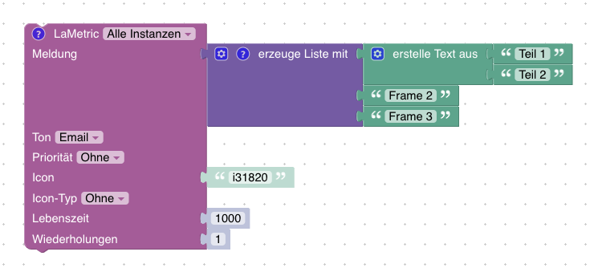
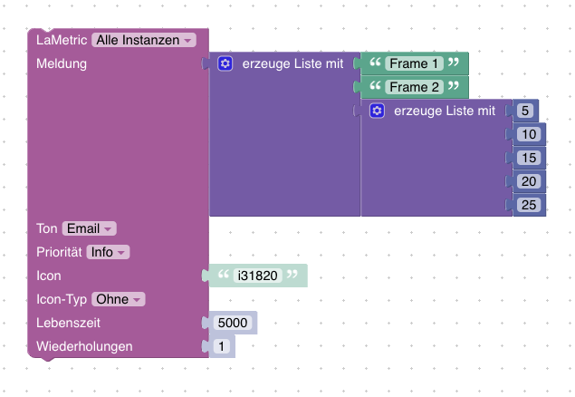

# IoBroker.lametric
Mit diesem Adapter können Sie Statusinformationen zu Ihrer LaMetric-Zeit abrufen und Benachrichtigungen an diese senden.
Sie benötigen lediglich die IP-Adresse Ihres Geräts und den API-Entwicklerschlüssel.

## Aufbau
Getestet mit LaMetric Firmware *2.0.28* und *2.1.2* (empfohlen)

Sie können Ihren persönlichen Schlüssel [Hier](https://developer.lametric.com/) erhalten.


## Verwendung
Weitere Informationen zu Benachrichtigungen finden Sie hier: https://lametric-documentation.readthedocs.io/en/latest/reference-docs/device-notifications.html

## Eigenschaften
- Displayhelligkeit einstellen (Prozent, Auto-Modus / Manueller-Modus)
- Stellen Sie die Lautstärke ein (Prozent)
- Bildschirmschoner konfigurieren (aktivieren / deaktivieren, zeitbasiert, wenn es dunkel ist)
- Aktivieren / Deaktivieren Sie Bluetooth und ändern Sie den Bluetooth-Namen
- Zwischen Apps wechseln (weiter, vorher, zu einer bestimmten App gehen)
- Blockierte Benachrichtigungen senden (mit konfigurierbarer Priorität, Sound, Symbolen, Text, ...)
- Steuern Sie spezielle Apps wie Radio, Stoppuhr und Wetter

Funktionen sind durch die [offizielle API-Funktionen](https://lametric-documentation.readthedocs.io/en/latest/reference-docs/lametric-time-reference.html) begrenzt.

## Blockbeispiele
Sie können eine einfache Zeichenfolge als Nachricht verwenden, die als einzelner Frame angezeigt wird


Um mehrere Frames anzuzeigen, können Sie auch ein Array als Nachricht bereitstellen



Wenn Sie Diagrammrahmen verwenden möchten, müssen Sie ein Array von Zahlen als Rahmen angeben



## Meine Daten (DIY)
LaMetric bietet eine App (auf dem integrierten App-Markt) zum Abfragen benutzerdefinierter Daten. Diese App heißt [Meine Daten DIY](https://apps.lametric.com/apps/my_data__diy_/8942). Dieser Adapter erstellt einen neuen Status im erforderlichen Format.
Mit dem Simple API Adapter können Sie die Daten zur LaMetric Time übertragen.

```ioBroker LaMetric Adapter -> State with Frame information <- Simple API Adapter <- My Data DIY App <- LaMetric```

### Konfiguration (mit Authentifizierung)
1. Installieren Sie den [Simple API ioBroker Adapter] (https://github.com/ioBroker/ioBroker.simple-api).
2. Erstellen Sie einen neuen ioBroker-Benutzer namens "lametric" mit einem benutzerdefinierten Kennwort (z. B. HhX7dZl3Fe).
3. Fügen Sie den Benutzer "lametrisch" zur Gruppe "Benutzer" hinzu.
4. Installieren Sie diese *My Data DIY* App auf Ihrer LaMetric Time (verwenden Sie Market)
5. Öffnen Sie die App-Einstellungen *Meine Daten (DIY)* und konfigurieren Sie die einfache API-URL (siehe unten).
6. Gehen Sie zur Adapterkonfiguration und konfigurieren Sie die Frames mit Ihren benutzerdefinierten Informationen (Symbol und Text).

```
http://172.16.0.219:8087/getPlainValue/lametric.0.mydatadiy.obj/?&user=lametric&pass=HhX7dZl3Fe
```

** Aktualisieren Sie ggf. IP, Port, Benutzer und Passwort in der URL! **

### Konfiguration (ohne Authentifizierung)
1. Installieren Sie den [Simple API ioBroker Adapter] (https://github.com/ioBroker/ioBroker.simple-api).
2. Installieren Sie diese *My Data DIY* App auf Ihrer LaMetric Time (verwenden Sie Market)
3. Öffnen Sie die App-Einstellungen *Meine Daten (DIY)* und konfigurieren Sie die einfache API-URL (siehe unten).
4. Gehen Sie zur Adapterkonfiguration und konfigurieren Sie die Frames mit Ihren benutzerdefinierten Informationen (Symbol und Text).

```
http://172.16.0.219:8087/getPlainValue/lametric.0.mydatadiy.obj/
```

** Stellen Sie sicher, dass IP und Port in der URL aktualisiert werden, falls erforderlich! **

## Skripte
Um die Nachricht in Ihrer la-Metrik anzuzeigen, senden Sie einfach eine Nachricht mit dem Skriptadapter an diese Instanz:

```JavaScript
sendTo(
    "lametric.0",
    "notification",
    {
        priority: "[info|warning|critical]",
        iconType: "[none|info|alert]",
        sound: "<string from sound list>",
        lifeTime: <milliseconds>,
        icon: "<icon>",
        text: "<string|array>",
        cycles: <integer>
    }
);
```

Beispiel Einzelbild:

```JavaScript
sendTo(
    "lametric.0",
    "notification",
    {
        priority: "info",
        iconType: "none",
        sound: "cat",
        lifeTime: 5000,
        icon: "i31820",
        text: "test",
        cycles: 1
    }
);
```

Beispiel für mehrere Frames:

```JavaScript
sendTo(
    "lametric.0",
    "notification",
    {
        priority: "info",
        iconType: "none",
        sound: "cat",
        lifeTime: 5000,
        icon: "i31820",
        text: ["frame 1", "frame 2", "frame 3"],
        cycles: 1
    }
);
```

Beispiel, um einige Informationen zyklisch anzuzeigen:

```JavaScript
let i = 0;
function show() {
    console.log('Show ' + i);
    sendTo(
        "lametric.0",
        "notification",
        {
            priority: "info",
            iconType: "info",
            lifeTime: 5000,
            icon: "",
            text: "Hi " + i,
            cycles: 1
        }
    );
    i++;
}
setInterval(show, 10000);
show();
```

## Changelog

### 1.1.0

* (klein0r) Added support for My Data (DIY)

### 1.0.1

* (klein0r) Added chart data support to notification

### 1.0.0

* (klein0r) First stable release
* (klein0r) Added iobroker sentry
* (klein0r) Added brightness and volume limit information (min, max)

### 0.0.10

* (klein0r) Switched to axios lib

### 0.0.9

* (klein0r) Added missing translations
* (GermanBluefox) Improved Blockly and main.js

### 0.0.8

* (klein0r) Updated dependencies

### 0.0.7

* (klein0r) fixed blockly

### 0.0.6

* (klein0r) switched to setTimeout instead of setInterval, improved logging and fixes eslint complaints

### 0.0.5

* (klein0r) Fixed notification, html, updated github template, enable and disable screensaver

### 0.0.4

* (klein0r) Refactored blockly sendTo / notifications

### 0.0.3

* (klein0r) Added app switching support, refactored everything
* (bluefox) The deletion of the actual shown information was added

### 0.0.2

* (Sigi74) Change message_value for variables message
* (Sigi74) Leave sound none

### 0.0.1

* (klein0r) initial release

## License

The MIT License (MIT)

Copyright (c) 2020 Matthias Kleine <info@haus-automatisierung.com>

Permission is hereby granted, free of charge, to any person obtaining a copy
of this software and associated documentation files (the "Software"), to deal
in the Software without restriction, including without limitation the rights
to use, copy, modify, merge, publish, distribute, sublicense, and/or sell
copies of the Software, and to permit persons to whom the Software is
furnished to do so, subject to the following conditions:

The above copyright notice and this permission notice shall be included in
all copies or substantial portions of the Software.

THE SOFTWARE IS PROVIDED "AS IS", WITHOUT WARRANTY OF ANY KIND, EXPRESS OR
IMPLIED, INCLUDING BUT NOT LIMITED TO THE WARRANTIES OF MERCHANTABILITY,
FITNESS FOR A PARTICULAR PURPOSE AND NONINFRINGEMENT. IN NO EVENT SHALL THE
AUTHORS OR COPYRIGHT HOLDERS BE LIABLE FOR ANY CLAIM, DAMAGES OR OTHER
LIABILITY, WHETHER IN AN ACTION OF CONTRACT, TORT OR OTHERWISE, ARISING FROM,
OUT OF OR IN CONNECTION WITH THE SOFTWARE OR THE USE OR OTHER DEALINGS IN
THE SOFTWARE.