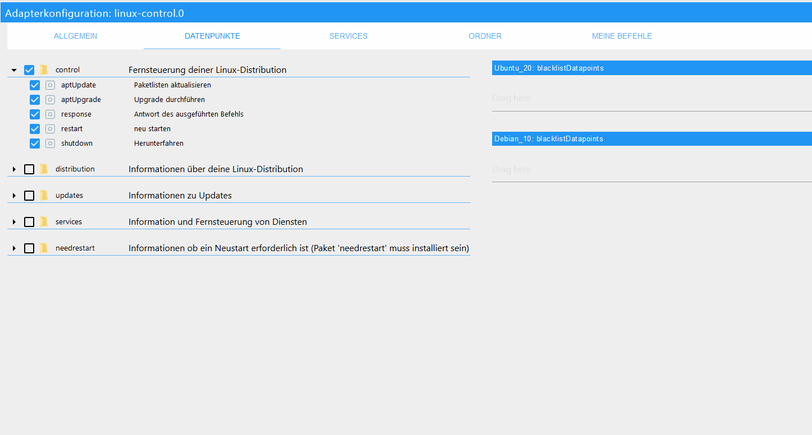

# IoBroker.linux-control
## Linux Control Adapter für ioBroker
[![paypal] (https://www.paypalobjects.com/en_US/i/btn/btn_donateCC_LG.gif)](https://www.paypal.com/cgi-bin/webscr?cmd=_s-xclick&hosted_button_id=VWAXSTS634G88&source=url)

Steuern Sie Linux-Geräte und erhalten Sie Informationen zu Ihrem System

** Dieser Adapter verwendet Sentry-Bibliotheken, um Ausnahmen und Codefehler automatisch an die Entwickler zu melden. ** Weitere Details und Informationen zum Deaktivieren der Fehlerberichterstattung finden Sie unter [Sentry-Plugin-Dokumentation](https://github.com/ioBroker/plugin-sentry#plugin-sentry)! Sentry Reporting wird ab js-controller 3.0 verwendet.

## Aufbau
### Allgemeines

| Einstellung | Beschreibung |
|-------|-----------|
| aktiviert | aktiviert oder deaktiviert die Aktualisierung des Hosts |
| Datenpunkt-ID | ID, unter der alle Datenpunkte gespeichert werden sollen |
| IP | IP-Adresse Ihres Linux-Geräts |
| Port | SSH Port Ihres Linux-Geräts |
| Abfrageintervall | Abfrageintervall in Minuten.  Um die Abfrage zu deaktivieren, können Sie &#39;0&#39; verwenden oder leer lassen |
| user | ssh user für login |
| password / passpharse | ssh Passwort für die Anmeldung oder passpharse, wenn Sie einen rsa-Schlüssel verwenden |
| benutze Sudo | mit sudo |
| rsa key | Pfad und Dateiname Ihres rsa-Schlüssels. Zugriffsrechte müssen verfügbar sein! |
| Zeitüberschreitung | Verbindungszeitüberschreitung |

### Datenpunkte

Der Adapter erstellt vordefinierte Datenpunkte mit Informationen und der Möglichkeit, das Linux-Gerät zu steuern. Diese können hier ausgewählt werden.
Darüber hinaus können für jeden einzelnen Host einzelne Datenpunkte oder ganze Kanäle per Drag & Drop auf die Blacklist gesetzt werden, sodass sie nicht für den Host erstellt werden.

Hinweis: Wenn Sie den gesamten Kanal zur Blacklist hinzufügen möchten, müssen Sie den Kanalknoten per Drag & Drop auf die Blacklist ziehen. Nur dann wird der gesamte Kanal ignoriert - siehe Screenshot unten:

** Aufgrund der vielen verschiedenen Linux-Distributionen wird diese Funktion nur mit Debian 10, Ubuntu 18/20 LTS getestet! **

### Dienstleistungen

Wenn das Abrufen von Diensten unter Datenpunkten aktiviert ist, können Sie hier pro Host festlegen, für welche Dienste nur Informationen abgerufen werden sollen.

** Aufgrund der vielen verschiedenen Linux-Distributionen wird diese Funktion nur mit Debian 10, Ubuntu 18/20 LTS getestet! **

### Ordner

Hier können Sie Informationen zur Größe der Ordner, zur Anzahl der in diesen Ordnern enthaltenen Dateien und zum Zeitstempel der letzten Änderung in diesem Ordner abrufen.

** Aufgrund der vielen verschiedenen Linux-Distributionen wird diese Funktion nur mit Debian 10, Ubuntu 18/20 LTS getestet! **

| Einstellung | Beschreibung |
|-------|-----------|
| aktiviert | aktiviert oder deaktiviert die Aktualisierung des Ordners |
| Host | Host, der verwendet werden soll |
| Datenpunkt-ID | ID, unter der alle Datenpunkte gespeichert werden sollen |
| Pfad | Pfad des Ordners |
| Dateinamenmuster | Muster für Dateinamen, die regonisiert werden sollen. |
| Einheit | Einheit für Größe |
| Dezimalstellen | Dezimalstellen |
| Anzahl der Dateien | Datenpunkt für die Anzahl der Dateien erstellen |
| letzte Änderung | Datenpunkt für den Zeitstempel der letzten Änderung in diesem Ordner erstellen |

### Meine Befehle

Hier können sehr individuelle Befehle definiert und dann in Ihre eigenen definierten Datenpunkte geschrieben werden.
Es ist wichtig, dass die abgerufenen Daten im richtigen Typ übertragen werden! Der Typ muss dann entsprechend konfiguriert werden.

| Einstellung | Beschreibung |
|-------|-----------|
| aktiviert | aktiviert oder deaktiviert die Aktualisierung des Befehls |
| Host | Host, der verwendet werden soll |
| Datenpunkt-ID | ID, unter der Datenpunkte gespeichert werden sollen |
| Abfrageintervall | Unterschiedliches Abfrageintervall in Sekunden nur für den Befehl. Zum Deaktivieren verwenden Sie `0` oder lassen Sie das Feld leer, dann wird das Abfrageintervall vom Host verwendet |
| Befehl | Befehl, der verwendet werden soll   Wenn Sie einen Benutzer verwenden, der `sudo` benötigt, müssen Sie Ihrem eigenen Befehl `sudo -S` hinzufügen! |
| Befehl | Befehl, der verwendet werden soll   Wenn Sie einen Benutzer verwenden, der &quot;sudo&quot; benötigt, müssen Sie &quot;sudo -S&quot; zu Ihrem eigenen Befehl hinzufügen! |
| Typ | Typ des Datenpunkts |
| Einheit | Einheit des Datenpunkts |

## Changelog

<!--
    Placeholder for the next version (at the beginning of the line):
    ### __WORK IN PROGRESS__
-->

### 1.0.1 (2020-11-04)
* (Scrounger) translation for polling interval optimized

### 1.0.0 (2020-09-30)
* (Scrounger) bump to stable

### 0.3.7 (2020-09-19)
* (Scrounger) subscribe bug fix for user commands

### 0.3.6 (2020-09-17)
* (Scrounger) Bug fix for function needrestart if sudo is used

### 0.3.5 (2020-09-15)
* (Scrounger) Fixed some errors reported via Sentry

### 0.3.4 (2020-09-09)
* (Scrounger) bug fixes

### 0.3.3 (2020-09-09)
* (Scrounger) bug fix for datapoints creation

### 0.3.2 (2020-09-07)
* (Scrounger) performance optimizations
* (Scrounger) Fixed some errors reported via Sentry

### 0.3.1 (2020-08-23)
* (Scrounger) datapoint info lastRefresh added

### 0.3.0 (2020-08-23)
* (Scrounger) button to manual refresh a single host added
* (Scrounger) userCommand: ignore polling interval if type is button
* (Scrounger) userCommand: individual polling intervals added
* (Scrounger) userCommand: bug fix if sudo is used
* (Scrounger) refresh services info after using command
* (Scrounger) services command: bug fix for using sudo

### 0.2.7 (2020-08-17)
* (Scrounger) option to deactive polling for hosts added
* (Scrounger) bug fixes for using sudo

### 0.2.6 (2020-08-15)
* (Scrounger) Node-SSH bug fix

### 0.2.5 (2020-08-15)
* (Scrounger) sentry error handling optimized
* (Scrounger) info datapoints added, isOnline changed to info.is_online

### 0.2.4 (2020-08-12)
* (Scrounger) datapoint isOnline added
* (Scrounger) settings: styles optimized
* (Scrounger) userCommand: null values if response is null or empty
* (Scrounger) bug fixes

### 0.2.3 (2020-08-09)
* (Scrounger) bug fixes

### 0.2.2 (2020-08-09)
* (Scrounger) bug fixes

### 0.2.1 (2020-08-09)
* (Scrounger) bug fixes

### 0.2.0 (2020-08-08)
* (Scrounger) optional folder datapoints for count of files and last change added
* (Scrounger) enable options for hosts, folders and user commands added
* (Scrounger) using sudo implemented
* (Scrounger) type array for user commands added
* (Scrounger) ignore whole datapoints node by using drag and drop 
* (Scrounger) error handling for user commands improved
* (Scrounger) Sentry implemented
 

### 0.1.0 (2020-05-20)
* (Scrounger) added datapoints blacklist configurable for each host individually
* (Scrounger) added poll interval configurable for each host individually
* (Scrounger) configuration bug fixes

### 0.0.3 (2020-05-16)
* (Scrounger) added services whitelist configurable for each host individually

### 0.0.1
* (Scrounger) initial release

## License
MIT License

Copyright (c) 2020 Scrounger <scrounger@gmx.net>

Permission is hereby granted, free of charge, to any person obtaining a copy
of this software and associated documentation files (the "Software"), to deal
in the Software without restriction, including without limitation the rights
to use, copy, modify, merge, publish, distribute, sublicense, and/or sell
copies of the Software, and to permit persons to whom the Software is
furnished to do so, subject to the following conditions:

The above copyright notice and this permission notice shall be included in all
copies or substantial portions of the Software.

THE SOFTWARE IS PROVIDED "AS IS", WITHOUT WARRANTY OF ANY KIND, EXPRESS OR
IMPLIED, INCLUDING BUT NOT LIMITED TO THE WARRANTIES OF MERCHANTABILITY,
FITNESS FOR A PARTICULAR PURPOSE AND NONINFRINGEMENT. IN NO EVENT SHALL THE
AUTHORS OR COPYRIGHT HOLDERS BE LIABLE FOR ANY CLAIM, DAMAGES OR OTHER
LIABILITY, WHETHER IN AN ACTION OF CONTRACT, TORT OR OTHERWISE, ARISING FROM,
OUT OF OR IN CONNECTION WITH THE SOFTWARE OR THE USE OR OTHER DEALINGS IN THE
SOFTWARE.