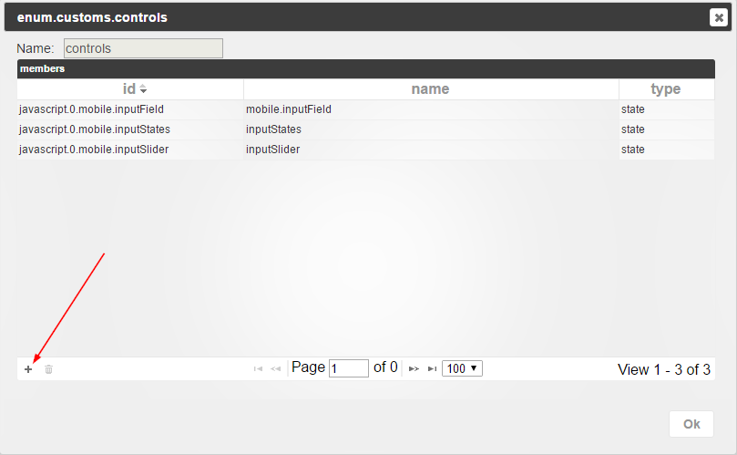
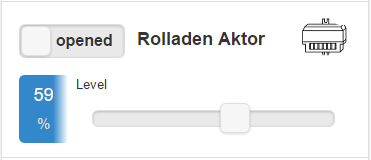

# IoBroker.mobile
jQuery Mobile-basierte Benutzeroberfläche.


## Verwendung
Um die mobile Benutzeroberfläche verwenden zu können, müssen Sie die logische Struktur in admin erstellen.

Zum Beispiel: Gehen Sie zur Registerkarte "Aufzählungen" und erstellen Sie eine neue Aufzählung, z. "Zoll".


Erstellen Sie eine neue Aufzählungsgruppe in "enum.customs", z. "Kontrollen" 

Fügen Sie "enum.customs.controls" einige Zustände hinzu 



Gehen Sie zur mobilen Seite, klicken Sie auf "Info" (oben rechts) und klicken Sie auf "Aktualisieren", um Objekte von ioBroker zu laden. 

Nach dem Nachladen können Sie zu "Zoll => Kontrollen"  gehen

## Unterstützte Typen
### Schieberegler:


    - role = "level.dimmer"
    - role = "level.blind"
    - Die Rolle besteht aus "Ebene", common.type ist "number", common.write ist "true" und common.max ist definiert
    - common.type = "number", common.write ist "true" und common.max ist definiert

Beispiel:

```
{
  "_id": "javascript.0.mobile.inputSlider",
  "type": "state",
  "common": {
    "name": "Slider",
    "type": "number",
    "read": true,
    "write": true,
    "min": 0,
    "max": 100
  },
  "native": {}
}
```

### Schaltflächen (müssen explizit im Bearbeitungsmodus sichtbar sein):


    - Rolle besteht aus "Knopf"
    - Rolle besteht aus "Aktion"

Schaltflächen sind standardmäßig unsichtbar. Sie schreiben nur "wahr", wenn sie gedrückt werden.

Beispiel:

```
{
  "_id": "javascript.0.mobile.inputButton",
  "type": "state",
  "common": {
    "name": "Button",
    "role": "button",
    "type": "boolean",
    "write": true
  },
  "native": {}
}
```

### Schalter:


    - common.type = "boolean", common.write ist "true"

Beispiel:

```
{
  "_id": "javascript.0.mobile.inputSwitch",
  "type": "state",
  "common": {
    "name": "Switch",
    "type": "boolean",
    "write": true
  },
  "native": {}
}
```

### Mit Eingabefeld einstellen:


    - common.type = "number", common.max ist undefiniert, common.write ist "true", common.states ist undefiniert

Beispiel:

```
{
  "_id": "javascript.0.mobile.inputNumber",
  "type": "state",
  "common": {
    "name": "Number",
    "type": "number",
    "write": true
  },
  "native": {}
}
```

### Mit Status setzen:


    - common.type = "number", common.max ist undefiniert, common.write ist "true", common.states ist definiert

Beispiel:

```
{
  "_id": "javascript.0.mobile.inputNumber",
  "type": "state",
  "common": {
    "name": "Number",
    "type": "number",
    "write": true,
    "states": {
          "1": "Value 1",
          "2": "Value 2"
        }
  },
  "native": {}
}
```

### Booleschen Wert anzeigen:


    - common.write ist "false" und common.type ist "boolean"

Beispiel:

```
{
  "_id": "javascript.0.mobile.valueBoolean",
  "type": "state",
  "common": {
    "name": "Boolean value",
    "type": "bolean"
  },
  "native": {}
}
```

### Wert anzeigen:


    - common.write ist "false" und common.type ist nicht "boolean"

Beispiel:

```
{
  "_id": "javascript.0.mobile.valueNumber",
  "type": "state",
  "common": {
    "name": "Number value",
    "type": "number",
    "unit": "%"
  },
  "native": {}
}
```

## Machen:
- Bearbeiten des Symbols
- Einige Widgets mit mehr Symbolen anzeigen
- Tablet-Ansicht

## Changelog
### 1.0.1 (2020-08-22)
* (bluefox) The compatibility to socket.io 3.0.13 provided

### 1.0.0 (2019-01-30)
* (ldittmar) Add translations
* (ldittmar) Some fixes

### 0.5.0 (2019-01-24)
* (Hirsch-DE) The multilingual names were fixed

### 0.4.12 (2017-11-14)
* (Apollon77) update adapter type

### 0.4.11 (2017-07-12)
* (BasGo) Fixed blind states

### 0.4.10 (2016-11-08)
* (bluefox) Better cloud support

### 0.4.9 (2016-10-29)
* (bluefox) Fix rooms rendering
* (bluefox) add green, red, blue, white types

### 0.4.8 (2016-10-09)
* (bluefox) implement type blind

### 0.4.7 (2016-09-10)
* (bluefox) make narrow screen on wide displays
* (bluefox) fix some widgets

### 0.4.6 (2016-09-03)
* (bluefox) support of custom images
* (bluefox) fix input number and select value

### 0.4.5 (2016-07-01)
* (bluefox) fix open first page

### 0.4.4 (2016-06-24)
* (bluefox) reload if problems occur

### 0.4.3 (2016-06-24)
* (bluefox) just check invalid objects

### 0.4.2 (2016-06-14)
* (bluefox) update version number

### 0.4.1 (2016-05-12)
* (bluefox) fix control of logical states

### 0.4.0
* (bluefox) add theme switcher

### 0.3.0
* (bluefox) fix problem with room names with spaces
* (bluefox) implement side panel

### 0.2.2
* (bluefox) fix locations in edit mode
* (bluefox) enable visibility of indicators

### 0.2.1
* (bluefox) fix some errors

### 0.2.0
* (bluefox) sorting and edit name

### 0.1.1
* (bluefox) fix errors for some devices

### 0.1.0
* (bluefox) edit of visibility

### 0.0.4
* (bluefox) first version. No edit possible.

## License
The MIT License (MIT)

Copyright (c) 2015-2019 bluefox <dogafox@gmail.com>

Permission is hereby granted, free of charge, to any person obtaining a copy
of this software and associated documentation files (the "Software"), to deal
in the Software without restriction, including without limitation the rights
to use, copy, modify, merge, publish, distribute, sublicense, and/or sell
copies of the Software, and to permit persons to whom the Software is
furnished to do so, subject to the following conditions:

The above copyright notice and this permission notice shall be included in
all copies or substantial portions of the Software.

THE SOFTWARE IS PROVIDED "AS IS", WITHOUT WARRANTY OF ANY KIND, EXPRESS OR
IMPLIED, INCLUDING BUT NOT LIMITED TO THE WARRANTIES OF MERCHANTABILITY,
FITNESS FOR A PARTICULAR PURPOSE AND NONINFRINGEMENT. IN NO EVENT SHALL THE
AUTHORS OR COPYRIGHT HOLDERS BE LIABLE FOR ANY CLAIM, DAMAGES OR OTHER
LIABILITY, WHETHER IN AN ACTION OF CONTRACT, TORT OR OTHERWISE, ARISING FROM,
OUT OF OR IN CONNECTION WITH THE SOFTWARE OR THE USE OR OTHER DEALINGS IN
THE SOFTWARE.