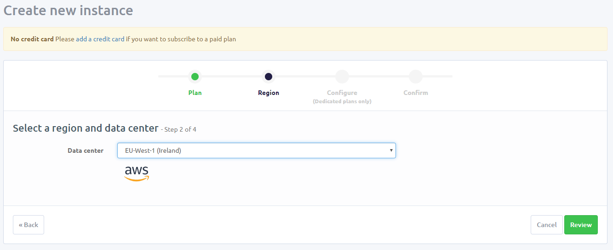
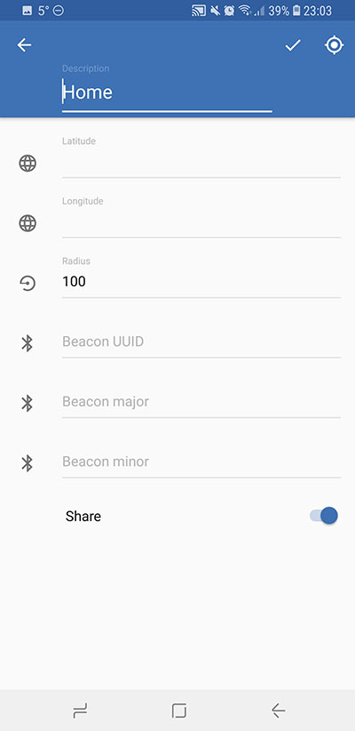

# IoBroker.downracks [OwnTracks] (https://owntracks.org/) ermöglicht es Ihnen, Ihren eigenen Standort zu verfolgen. Sie können Ihr privates Standorttagebuch erstellen oder es mit Ihrer Familie und Freunden teilen. OwnTracks ist Open Source und verwendet offene Protokolle für die Kommunikation, sodass Sie sicher sein können, dass Ihre Daten sicher und privat bleiben. Sie finden die entsprechenden Smartphone-Apps im [Apple App Store (iOS)] (https://itunes.apple.com/us/app/mqttitude/id692424691?mt=8) oder im [Google Play Store (Android)](https://play.google.com/store/apps/details?id=org.owntracks.android).
**Inhaltsverzeichnis**

1. [Funktionen] (Nr. 1-Funktionen)
2. [Setup Anweisungen] (# 2-Setup-Anweisungen)
   1. [using MQTT server] (# 21-verbindungskonfiguration-using-mqtt-server)
   2. [using MQTT client] (# 22-verbindungskonfiguration-using-mqtt-client)
   3. [Zusätzliche Konfiguration] (# 23-Zusätzliche Konfiguration-mit-entweder-mqtt-Server-oder-Client)
3. [Channels & States] (# 3-Kanäle - Staaten)
   1. [Standorte] (Nr. 31-Standorte)
   2. [Benutzer] (# 32-Benutzer)
4. [Changelog] (# changelog)
5. [Lizenz] (# Lizenz)

## 1. Eigenschaften
tbd

## 2. Setup-Anweisungen
Sie müssen ioBroker.owntracks in Verbindung mit den [MQTT-Adapter](https://github.com/ioBroker/ioBroker.mqtt) einrichten, die als Abhängigkeit installiert werden. Die MQTT-Adapter können entweder als MQTT-Server oder als MQTT-Client eingerichtet werden.

Die folgenden Tabellen zeigen einen Vergleich:

| Methode | Vorteile / Nachteile |
| ------ | ------------- |
| MQTT-Server | ![# c5f015] (https://placehold.it/15/c5f015/000000?text=+) Vollständig verschlüsselte Nutzdaten möglich <br> ! [# f03c15] (https://placehold.it/15/f03c15/000000?text=+) Einrichtung eines [dynamischen DNS (DynDNS)] (https://en.wikipedia.org/wiki/Dynamic_DNS) erforderlich <br> ! [# f03c15] (https://placehold.it/15/f03c15/000000?text=+) Öffnen Sie in Ihrer Routerkonfiguration den für die Kommunikation erforderlichen Port ([Weitere Informationen hier](https://owntracks.org/booklet/guide/broker/#firewall)) |
| MQTT-Client | ! [# c5f015] (https://placehold.it/15/c5f015/000000?text=+) Vollständig verschlüsselte Nutzdaten möglich <br> ! [# f03c15] (https://placehold.it/15/f03c15/000000?text=+) Die Verwendung eines Internet-MQTT bedeutet, dass der gesamte Datenverkehr über einen unbekannten Anbieter geleitet wird ([Weitere Informationen hier] (https:// owntracks) .org / booklet / guide / scenarios / # mqtt-mode)) <br> ! [# f03c15] (https://placehold.it/15/f03c15/000000?text=+) Unterstützung für TLS nur möglich, wenn beim jeweiligen Anbieter verfügbar |

** WICHTIGER HINWEIS: ** Die Zustände in ioBroker.downracks werden generiert, wenn die spezifische Nutzlast empfangen wird! Dies bedeutet, dass die Standorte in ioBroker generiert werden **, wenn der Benutzer den Standort zum ersten Mal verlässt oder betritt **.
Nachfolgend sehen Sie die Zielstruktur ([Eine detaillierte Liste finden Sie unter Kanäle und Bundesstaaten](#channels--states)):

[![Struktur] (img / structure.png)](../../../en/adapterref/iobroker.owntracks/img/structure.png)

### 2.1. Verbindungskonfiguration (mit MQTT-Server)
Sie müssen die folgenden Schritte ausführen, um ioBroker.owntracks über den MQTT-Server einzurichten:

1. Richten Sie ein DynDNS ein, das auf Ihre IP-Adresse verweist, und öffnen Sie einen Port in Ihrem Router
2. Konfigurieren Sie den MQTT-Adapter als Server mit dem entsprechenden Port
3. Konfigurieren Sie alle Clients mit den Servereinstellungen

#### 2.1.1. Richten Sie DynDNS und Port ein
Wenn Sie einen lokalen MQTT-Server in ioBroker einrichten, müssen Sie ein dynamisches DNS (DynDNS) einrichten, das immer auf Ihre aktuelle IP-Adresse verweist, und einen Port in Ihrem Router für Kommunikationszwecke öffnen.

Richten Sie daher ein DynDNS Ihrer Wahl ein, das auf Ihre IP-Adresse verweist, z. B. https://www.noip.com/.
Registrieren Sie sich, um ein Konto zu erstellen, und wählen Sie einen Hostnamen Ihrer Wahl, z. `example.ddns.net`. Bitte beachten Sie, dass diese Hostnamen nach 30 Tagen auf dem kostenlosen Konto verfallen. Sie müssen sich also regelmäßig anmelden, um sie weiterhin zu aktivieren.

Sobald das DynDNS eingerichtet ist, konfigurieren Sie Ihren Router so, dass das DynDNS jeweils aktualisiert wird.
Wenn Sie eine FRITZ! Box besitzen, navigieren Sie zu `Internet` - §§SSS_1§ - §§SSSSS_2§ und konfigurieren Sie diese entsprechend Ihren Anmeldeinformationen:

[![MQTT-Server - Router-DynDNS-Konfiguration] (img / mqtt_server_router_dyndns.png)](../../../en/adapterref/iobroker.owntracks/img/mqtt_server_router_dyndns.png)

Öffnen Sie außerdem einen Port an Ihrem Router, der auf die lokale IP-Adresse Ihres ioBroker verweist.
Navigieren Sie dazu zu `Internet` - `Freigaben` - `Portfreigaben` und wählen Sie `Gerät für Freigaben hinzufügen`. Wählen Sie Ihre ioBroker-Instanz im Feld `Gerät` und klicken Sie auf `Neue Freigabe`:

[![MQTT-Server - Router-Port-Konfiguration] (img / mqtt_server_router_adddevice.png)](../../../en/adapterref/iobroker.owntracks/img/mqtt_server_router_adddevice.png)

Wählen Sie im Popup `Portfreigabe` und dann

- "Andere Anwendung" auswählen,
- Geben Sie einen beliebigen Namen in das Feld "Bezeichnung" ein.
- als Protokoll `TCP` auswählen,
- Geben Sie Ihren gewünschten Port in alle "Port" -Felder ein (z. B. 1987).

[![MQTT-Server - Router-Port-Konfiguration] (img / mqtt_server_router_port.png)](../../../en/adapterref/iobroker.owntracks/img/mqtt_server_router_port.png)

Speichern Sie alles und Sie sind mit diesem Schritt fertig.

#### 2.1.2. Konfigurieren Sie den MQTT- und den Owntracks-Adapter
Gehen Sie jetzt zu ioBroker und erstellen Sie eine neue Instanz des MQTT-Adapters.
Wählen Sie als Typ `Server/Broker` und geben Sie den oben ausgewählten Port ein, der in Ihrer Routerkonfiguration (z. B. 1987) geöffnet wurde.

[![Konfiguration der MQTT-Serververbindung] (img / mqtt_server_connection.png)](../../../en/adapterref/iobroker.owntracks/img/mqtt_server_connection.png)

Wählen Sie im Abschnitt `Authentication settings` beliebige `User` und `Password` Ihrer Wahl. Diese werden für den nächsten Schritt benötigt.

Wechseln Sie in ioBroker.mqtt zur Registerkarte _MQTT SETTINGS_ und ändern Sie die folgenden Einstellungen:

| Einstellung | Konfiguration | Hinweis |
| ------- | ------------- | ---- |
| Präfix für alle Themen | _leer lassen_ | |
| Maske zum Veröffentlichen eigener Staaten | mqtt.0. * | Ersetzen Sie 0 durch Ihre ioBroker.mqtt-Instanz |
| Nur bei Änderung veröffentlichen | `yes` | |
| Veröffentlichen Sie Zustände auf subscribe | `yes` | |
| Trace-Ausgabe für jede Nachricht | `no` | |
| Sende auch Zustände (ack = true) | `no` | |
| Verwenden Sie unterschiedliche Themennamen für set and get | `no` | |
| Verwenden Sie unterschiedliche Themennamen für set and get | `no` | |

Wählen Sie abschließend die konfigurierte MQTT-Instanz im ioBroker.owntracks-Adapter aus und legen Sie optional (jedoch dringend empfohlen) einen Verschlüsselungsschlüssel Ihrer Wahl fest:

[![Owntracks Adapter settings] (img / owntracks_server_settings.png)](../../../en/adapterref/iobroker.owntracks/img/owntracks_server_settings.png)

#### 2.1.3. Konfigurieren Sie alle Clients
Folgende Einstellungen müssen in der Android / iOS-App vorgenommen werden:

| Android-Einstellung | Konfiguration |
| ------- | ------------- |
| Verbindung / Modus | `MQTT private` |
| Verbindung / Host / Port | Von Ihnen gewählter Hafen (z. B. `1987`) |
| Verbindung / Host / WebSockets | `false` (es sei denn, Sie wissen, was Sie tun) |
| Verbindung / Identifikation / Benutzername | Die im vorherigen Schritt | gewählten `User` |
| Verbindung / Identifikation / Passwort | Die im vorherigen Schritt | gewählten `Password` |
| Verbindung / Identifikation / Passwort | Das im vorherigen Schritt gewählte "Passwort" |
| Verbindung / Identifikation / DeviceID | Name des Geräts oder der Person (kann beliebig sein) |
| Verbindung / Sicherheit / TLS | `off` |
| Verbindung / Sicherheit / TLS | `off` |
| Erweiterter / Verschlüsselungsschlüssel | __highly recommended__: Passphrase für die Verschlüsselung (im vorherigen Schritt ausgewählt) |

Überprüfen Sie abschließend, ob Owntracks über den Eintrag "Status" in der Schublade mit der ioBroker-Instanz verbunden ist:


Wenn alles erfolgreich eingerichtet wurde, erstellt ioBroker.owntracks die unten aufgeführten Kanäle und Status.

### 2.2. Verbindungskonfiguration (mit MQTT-Client)
Sie müssen die folgenden Schritte ausführen, um ioBroker.owntracks über den MQTT-Client einzurichten:

1. Richten Sie einen externen MQTT-Server ein, der online gehostet wird, z. [CloudMQTT] (https://www.cloudmqtt.com/)
2. Konfigurieren Sie MQTT Cloud Broker und konfigurieren / authentifizieren Sie Clients
3. Konfigurieren Sie den MQTT-Adapter als Client mit den entsprechenden Einstellungen (URL, Port und Authentifizierung von ioBroker).
4. Konfigurieren Sie alle Clients mit den Servereinstellungen

#### 2.2.1. Richten Sie einen externen MQTT-Server ein
Gehen Sie zu [https://www.cloudmqtt.com/](https://www.cloudmqtt.com/) und melden Sie sich mit einem neuen Konto an.
Erstellen Sie eine neue Instanz, wählen Sie einen Plan aus (der kostenlose Plan namens _Cute Cat_ funktioniert einwandfrei) und nennen Sie ihn _ioBroker_:


Fahren Sie mit dem nächsten Schritt fort, indem Sie auf _Region auswählen_ klicken und das Datenzentrum in Ihrer Nähe auswählen, z. _EU-West-1 (Irland) _:



Überprüfen Sie Ihre Einstellungen, indem Sie auf _Review_ und anschließend auf _Create Instance_ klicken.

#### 2.2.2. Konfigurieren Sie MQTT Cloud Broker
Rufen Sie nach dem Erstellen der Instanz _SETTINGS_ auf und setzen Sie `Use username as clientid` auf `Yes`:


__Vor allem__ Gehen Sie zu _USERS & ACL_ und fügen Sie die gewünschten Benutzer für die von Ihnen verwendeten Clients (z. B. Smartphones) hinzu. Fügen Sie außerdem einen bestimmten Benutzer für Ihren ioBroker hinzu:


Fügen Sie abschließend die erforderliche _ACL_ für die jeweiligen Benutzer weiter unten auf derselben Seite hinzu. Tun Sie dies durch

1. Wählen Sie "Thema"
2. Wählen Sie den Benutzer aus
3. Geben Sie das Muster `owntracks / #` ein
4. Wählen Sie sowohl "Lesen" als auch "Schreiben"

Ihr Ergebnis sollte folgendermaßen aussehen:


Wenn Sie CloudMQTT erfolgreich eingerichtet haben, erhalten Sie Nachrichten, die über die _WEBSOCKET-Benutzeroberfläche_ angezeigt werden können.

#### 2.2.3. Konfigurieren Sie den MQTT-Adapter
Für diesen Schritt finden Sie die erforderlichen Informationen im Abschnitt _DETAILS_ von CloudMQTT:


Rufen Sie nach dem Einrichten Ihres MQTT-Cloud-Brokers ioBroker auf und richten Sie eine MQTT-Instanz ein.
In den folgenden Tabellen wird die Zuordnung von der CloudMQTT-Detailseite zu Ihrer ioBroker.mqtt-Konfiguration gezeigt:

| CloudMQTT-Einstellung | Konfiguration von ioBroker.MQTT | Beispiel |
| ----------------- | --------------------------- | ------- |
| Server | URL | `m24.cloudmqtt.com` |
| - | Sicher | `yes` |
| - | Sicher | `yes` |

Für _Authentication settings_ können Sie jeden Benutzer verwenden, der über _ACL_ auf CloudMQTT autorisiert wurde (siehe oben).
Wechseln Sie in ioBroker.mqtt zur Registerkarte _MQTT SETTINGS_ und ändern Sie die folgenden Einstellungen:

| Einstellung | Konfiguration | Hinweis |
| ------- | ------------- | ---- |
| Muster abonnieren | `#` | |
| Präfix für alle Themen | _leer lassen_ | |
| Nur bei Änderung veröffentlichen | `yes` | |
| Eigene Zustände auf connect | veröffentlichen `yes` | |
| Trace-Ausgabe für jede Nachricht | `no` | |
| Sende auch Zustände (ack = true) | `no` | |
| Verwenden Sie unterschiedliche Themennamen für set and get | `no` | |
| Kunden ID | `iobroker` | __Dieser Benutzer muss über _ACL_ in CloudMQTT__ | autorisiert sein |
| Nur bei Änderung veröffentlichen | `yes` |
| Nur bei Änderung veröffentlichen | `yes` |

Wechseln Sie schließlich zu Ihrer ioBroker.owntracks-Instanz und wählen Sie auch die konfigurierte MQTT-Instanz aus

Wählen Sie abschließend die konfigurierte MQTT-Instanz im ioBroker.owntracks-Adapter aus und legen Sie optional (jedoch dringend empfohlen) einen Verschlüsselungsschlüssel Ihrer Wahl fest:

[![Owntracks Adapter settings] (img / owntracks_client_settings.png)](../../../en/adapterref/iobroker.owntracks/img/owntracks_client_settings.png)

#### 2.2.4. Konfigurieren Sie alle Clients
Folgende Einstellungen müssen in der Android / iOS-App vorgenommen werden:

| Android-Einstellung | Konfiguration |
| ------- | ------------- |
| Verbindung / Modus | `MQTT private` |
| Verbindung / Host / Port | CloudMQTT Sevrer-Port (z. B. `24247`) |
| Verbindung / Host / WebSockets | `false` |
| Verbindung / Identifikation / Benutzername | Ein `User`, der in Schritt 2 über _ACL_ eingerichtet wurde (so) |
| Verbindung / Identifikation / Passwort | Jeweilige `Password` dieses Benutzers |
| Verbindung / Identifikation / Passwort | Jeweiliges "Passwort" dieses Benutzers |
| Verbindung / Identifikation / DeviceID | Name des Geräts oder der Person (kann beliebig sein) |
| Verbindung / Sicherheit / TLS | `off` (sofern Sie keinen bezahlten Plan haben) |
| Verbindung / Sicherheit / TLS | "Aus" (es sei denn, Sie haben einen bezahlten Plan) |
| Erweiterter / Verschlüsselungsschlüssel | __highly recommended__: Passphrase für die Verschlüsselung (im vorherigen Schritt ausgewählt) |

Überprüfen Sie abschließend, ob Owntracks über den Eintrag "Status" in der Schublade mit der ioBroker-Instanz verbunden ist:


Wenn alles erfolgreich eingerichtet wurde, erstellt ioBroker.owntracks die unten aufgeführten Kanäle und Status.

### 2.3. Zusätzliche Konfiguration (entweder mit MQTT-Server oder -Client)
#### 2.3.1 Avatar Konfiguration (innerhalb des ioBroker.owntracks Adapters)
Sie können für jeden Benutzer ein Symbol definieren. Einfach per Drag & Drop oder per Mausklick Ihr Bild hochladen. Es wird automatisch auf 64x64 skaliert.
__Der Name muss in OwnTracks App gleich DeviceID sein .__

#### 2.3.2 Regions Konfiguration
Um Standorte innerhalb des Abwärtsstrecken-Adapters einzurichten, müssen Sie Regionen in der Android / iOS-App für Abwärtsstrecken erstellen.
Gehen Sie dazu in der Schublade auf "Regionen"


Erstellen Sie eine neue Region, indem Sie oben rechts auf das Pluszeichen (+) klicken


Verwenden Sie die Standortschaltfläche in der rechten oberen Ecke, um den aktuellen Standort abzurufen, oder geben Sie sie selbst in Breiten- und Längengrad ein. Geben Sie außerdem einen Radius für den Standort an. Wenn Sie den Ort teilen, erhalten Ihre Freunde (siehe in der Schublade der Android / iOS-App) eine Benachrichtigung, wenn Sie einen Ort betreten / verlassen.



## 3. Kanäle und Bundesstaaten
Wenn Sie ioBroker.owntracks erfolgreich eingerichtet haben, werden die folgenden Kanäle und Status erstellt **, wenn die entsprechende Nutzlast empfangen wurde **:

### 3.1. Standorte
Für jeden Ort innerhalb von `locations.<locationId>`

| Staat | Beschreibung (mögliche Werte) |
|:----- |:----------------------------- |
| ```accuracy``` | Genauigkeit der geografischen Koordinaten des Standorts |
| ```creationDatetime``` | Datum-Uhrzeit der Erstellung Uhrzeit des Standorts |
| ```history``` | Verlauf der Benutzer, die den Standort betreten / verlassen |
| ```locationId``` | Standort-ID des Standorts |
| ```locationName``` | Standortname des Standorts |
| ```presence``` | Anzeige, ob ein Benutzer am Standort anwesend ist [```true``` oder ```false```] |
| ```refreshed``` | Zeitstempel der letzten Änderung innerhalb des Standorts |
| ```refreshedDatetime``` | Datum-Uhrzeit der letzten Änderung innerhalb des Standorts |
| ```users``` | Benutzer an Ort und Stelle präsentieren |
| `` `Benutzer``` | Benutzer an Ort und Stelle präsentieren |

### 3.2. Benutzer
Für jeden Benutzer innerhalb von `locations.<userId>`

| Kanal | Staat | Beschreibung (mögliche Werte) |
|:------- |:----- |:----------------------------- |
| ```location``` | ```current``` | Aktueller Standort des Benutzers |
| ```location``` | ```enteredDatetime``` | Datum-Uhrzeit, zu der der Benutzer den aktuellen Standort eingegeben hat |
| ```location``` | ```history``` | Verlauf des Benutzers, der Standorte betritt / verlässt |
| ```location``` | ```last``` | Letzter Standort des Benutzers |
| ```location``` | ```left``` | Zeitstempel, mit dem der Benutzer den letzten Standort verlassen hat |
| ```location``` | ```leftDatetime``` | Datum-Uhrzeit, zu der der Benutzer den letzten Standort verlassen hat |
| - | ```accuracy``` | Genauigkeit von Breite / Länge |
| - | ```alt_accuracy``` | Genauigkeit der Höhe |
| - | ```altitude``` | Höhe |
| - | ```battery``` | Geräteakkustand für den Benutzer |
| - | ```connection``` | Verbindungstyp des Benutzers <br> - ```w```: Das Telefon ist mit einer WiFi-Verbindung verbunden <br> - ```o```: Telefon ist offline <br> - ```m```: mobile Daten |
| - | ```encryption``` | Verschlüsselungsstatus für den Benutzer [```true``` oder ```false```] |
| - | ```latitude``` | Latitude |
| - | ```longitude``` | Längengrad |
| - | ```refreshed``` | Zeitstempel der letzten Aktualisierung |
| - | ```refreshedDatetime``` | Datum-Uhrzeit der letzten Aktualisierung |
| - | ```userConnected``` | Verbindungsstatus des Benutzers [```true``` oder ```false```] |
| - | ```userId``` | Benutzer-ID des Benutzers |
| - | ```userName``` | Benutzername des Benutzers |
| - | ```userTid``` | Tracker ID des Benutzers |
| - | ```velocity``` | Geschwindigkeit für den Benutzer |
| - | `` `Geschwindigkeit``` | Geschwindigkeit für den Benutzer |

## Changelog

### 1.0.0-beta.3 (2019-05-XX) [IN DEVELOPMENT]
- (zefau) FEATURE: Regions can now be maintained through ioBroker and published / received from all connected clients
   - (zefau) FEATURE: added possibilty to publish all regions / waypoints from Android / iOS to ioBroker
   - (zefau) FEATURE: added possibilty to publish regions / waypoints from ioBroker to all conneced clients

### 1.0.0-beta.2 (2019-05-14)
- (zefau) BUG: fixed issue with deeply nested history on both locations and users
- (zefau) BUG: fixed issue with transition event being reported multiple times

### 1.0.0-beta.1 (2019-05-01)
Refactored entire code and removed all MQTT package dependencies (to avoid / fix security issues and reduce complexity). Thus, added [MQTT adapter as dependency](https://github.com/ioBroker/ioBroker.mqtt) to manage all MQTT communication.
This major change comes with the following advantages:
- use both MQTT server as well as MQTT client (to use Internet MQTT server, such as [CloudMQTT](https://www.cloudmqtt.com/)) functionality (this adapter subscribes to foreign states of MQTT adapter)
- user avatars available in both server and client variant
- support TLS and websockets

## License
The MIT License (MIT)

Copyright (c) 2019 Zefau <zefau@mailbox.org>

Copyright (c) 2016-2019 bluefox <dogafox@gmail.com>

Permission is hereby granted, free of charge, to any person obtaining a copy
of this software and associated documentation files (the "Software"), to deal
in the Software without restriction, including without limitation the rights
to use, copy, modify, merge, publish, distribute, sublicense, and/or sell
copies of the Software, and to permit persons to whom the Software is
furnished to do so, subject to the following conditions:

The above copyright notice and this permission notice shall be included in
all copies or substantial portions of the Software.

THE SOFTWARE IS PROVIDED "AS IS", WITHOUT WARRANTY OF ANY KIND, EXPRESS OR
IMPLIED, INCLUDING BUT NOT LIMITED TO THE WARRANTIES OF MERCHANTABILITY,
FITNESS FOR A PARTICULAR PURPOSE AND NONINFRINGEMENT. IN NO EVENT SHALL THE
AUTHORS OR COPYRIGHT HOLDERS BE LIABLE FOR ANY CLAIM, DAMAGES OR OTHER
LIABILITY, WHETHER IN AN ACTION OF CONTRACT, TORT OR OTHERWISE, ARISING FROM,
OUT OF OR IN CONNECTION WITH THE SOFTWARE OR THE USE OR OTHER DEALINGS IN
THE SOFTWARE.