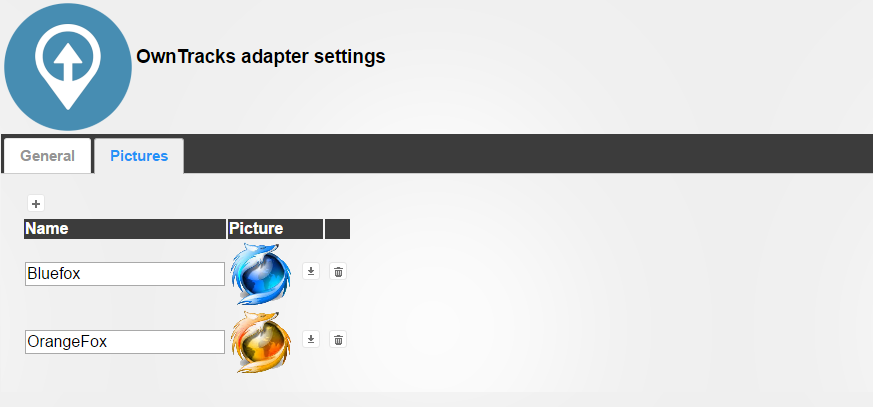

# Verschoben zu https://github.com/iobroker-community-adapters/ioBroker.owntracks

# IoBroker.owntracks
[OwnTracks](http://owntracks.org/) ist eine App für Android und iOS.

Die App sendet Ihre Position (Position des Geräts) kontinuierlich an einen bestimmten Server. In unserem Fall handelt es sich um einen ioBroker-Server. Entweder wird das MQTT-Protokoll für die Kommunikation oder der Adapter ioBroker.cloud / ioBroker.iot verwendet.

Link für:

- Android: [https://play.google.com/store/apps/details?id=org.owntracks.android yes(https://play.google.com/store/apps/details?id=org.owntracks .Android)
- iOS: [https://itunes.apple.com/de/app/owntracks/id692424691?mt=8(((ttps://itunes.apple.com/de/app/owntracks/id692424691?mt=8)

## Anweisungen zum Einrichten
### Verbindungskonfiguration (mit MQTT-Server)
Der OwnTracks Adapter startet an Port 1883 (konfigurierbar) eines MQTT-Servers, um die Nachrichten von Geräten mit Koordinaten zu empfangen.
Das Problem ist, dass dieser Server vom Internet aus erreichbar sein muss.
Normalerweise gibt es einen Router oder eine Firewall, die für die Weiterleitung von Datenverkehr konfiguriert werden muss.

### App & Adapter Konfiguration
In der Android / iOS-App bzw. im ioBroker-Adapter müssen folgende Einstellungen festgelegt werden:

- Verbindung / Modus - MQTT privat
- Verbindung / Host / Host - IP-Adresse Ihres Systems oder Ihrer DynDNS-Domäne. Z.B. http://www.noip.com/ kann anstelle der IP-Adresse den Domänennamen verwenden.
- Verbindung / Host / Port - 1883 oder Ihr Port an Ihrem Router
- Verbindung / Host / WebSockets - false
- Verbindung / Identifikation / Benutzername - iobroker
- Verbindung / Identifikation / Passwort - von den Adaptereinstellungen
- Verbindung / Identifikation / Geräte-ID - Name des Geräts oder der Person. Für dieses Gerät werden die Zustände erstellt. Z.B. Wenn Geräte-ID "Mark" ist, werden nach dem ersten Kontakt folgende Status erstellt:

    - owntracks.0.users.Mark.longitude
    - owntracks.0.users.Mark.latitude

- Verbindung / Identifikation / TrackerID - Kurzname des Benutzers (bis zu 2 Buchstaben), um ihn auf die Karte zu schreiben.
- Verbindung / Sicherheit / TLS - aus
- Erweiterter / Verschlüsselungsschlüssel - optional, wird jedoch empfohlen: Fügen Sie zur Verschlüsselung eine Passphrase hinzu

Stellen Sie sicher, dass owntracks über den Eintrag "Status" in der Schublade mit der iobroker-Instanz verbunden ist:

### WICHTIGE NOTIZ!
** Die Zustände in ioBroker werden generiert, wenn die spezifische Nutzlast empfangen wird !! Dies bedeutet, dass die Standorte in ioBroker generiert werden, wenn der Benutzer den Ort zum ersten Mal verlässt oder betritt. ** Unten sehen Sie die Zielstruktur

### Regionskonfiguration
Um Standorte innerhalb des owntracks-Adapters einzurichten, müssen Sie Regionen in der owntracks Android / iOS-App erstellen.
Gehen Sie dazu in der Schublade zu "Regionen"

Erstellen Sie eine neue Region, indem Sie auf das Pluszeichen (+) in der oberen rechten Ecke klicken

Verwenden Sie die Positionsschaltfläche in der oberen rechten Ecke, um den aktuellen Standort abzurufen, oder geben Sie ihn in Latitude und Longitude selbst ein. Geben Sie außerdem einen Radius für den Standort an. Wenn Sie den Standort freigeben, erhalten Ihre Freunde (siehe Schublade der Android / iOS-App) eine Benachrichtigung, wenn Sie einen Standort betreten oder verlassen.

### Icon-Einstellungen (im ioBroker.owntracks-Adapter)
Sie können für jeden Benutzer ein Symbol definieren. Einfach per Drag & Drop oder per Mausklick Ihr Bild hochladen. Es wird automatisch auf 64x64 skaliert.

Der Name muss der DeviceID in der OwnTracks-App entsprechen.

## Changelog

### 0.6.2 (2019-02-14)
* (zefau) Added support for [ioBroker compact mode](https://forum.iobroker.net/viewtopic.php?f=24&t=20387#p213466)
* (zefau) Added support for Gulp translations

### 0.6.0 (2019-01-27)
* (zefau) Added Admin v3 / materialized support
* (zefau) Added option for websockets in the adapter settings

### 0.5.1 (2019-01-25)
* (zefau) fixed an error when connection got closed

### 0.5.0 (2018-10-14)
* (zefau) Added support for locations

### 0.4.0 (2018-10-14)
* (zefau) Added support for encryption key

### 0.3.0 (2018-06-05)
* (matspi) Fix handling of publish messages

### 0.2.0 (2017-01-03)
* (jp112sdl) added two properties timestamp and datetime

### 0.1.1 (2016-09-05)
* (bluefox) add pictures

### 0.1.0 (2016-09-04)
* (bluefox) initial release

## License
The MIT License (MIT)

Copyright (c) 2016-2017 bluefox<dogafox@gmail.com>

Permission is hereby granted, free of charge, to any person obtaining a copy
of this software and associated documentation files (the "Software"), to deal
in the Software without restriction, including without limitation the rights
to use, copy, modify, merge, publish, distribute, sublicense, and/or sell
copies of the Software, and to permit persons to whom the Software is
furnished to do so, subject to the following conditions:

The above copyright notice and this permission notice shall be included in
all copies or substantial portions of the Software.

THE SOFTWARE IS PROVIDED "AS IS", WITHOUT WARRANTY OF ANY KIND, EXPRESS OR
IMPLIED, INCLUDING BUT NOT LIMITED TO THE WARRANTIES OF MERCHANTABILITY,
FITNESS FOR A PARTICULAR PURPOSE AND NONINFRINGEMENT. IN NO EVENT SHALL THE
AUTHORS OR COPYRIGHT HOLDERS BE LIABLE FOR ANY CLAIM, DAMAGES OR OTHER
LIABILITY, WHETHER IN AN ACTION OF CONTRACT, TORT OR OTHERWISE, ARISING FROM,
OUT OF OR IN CONNECTION WITH THE SOFTWARE OR THE USE OR OTHER DEALINGS IN
THE SOFTWARE.