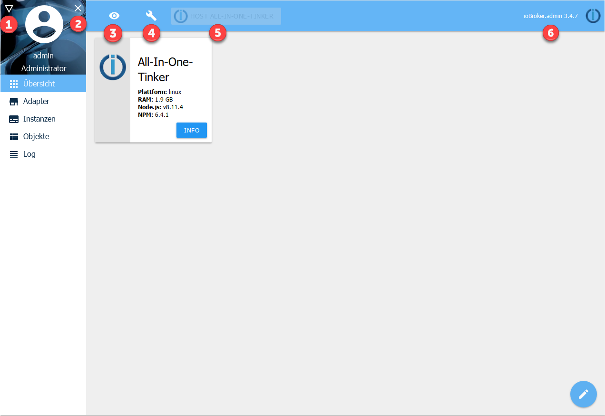

# Einleitung

!> **Wegen des Umfangs der Dokumentation ist dies nur eine Übersicht, ausführliche 
Informationen sind in den Seiten hinterlegt, die über die Überschriften der 
Abschnitte zu den Reitern verlinkt sind. Bitte die Überschriften anklicken.**

Der Adapter Admin dient der Bedienung der gesamten ioBroker-Installation. Er stellt 
ein Webinterface zur Verfügung. Dieses wird unter der 
``<IP-Adresse des Servers>:8081`` aufgerufen. Dieser Adapter wird direkt 
bei der Installation von ioBroker angelegt.

Über das vom Adapter zur Verfügung gestellte GUI können u.a. folgenden 
Funktionen abgerufen werden:

* Installation weiterer Adapter
* Zugriff auf Objektübersicht
* Zugriff auf die Zustandsübersicht der Objekte
* Zugriff auf Benutzer und Gruppen Administration
* Zugriff auf das Logfile
* Verwaltung der Hosts

## Installation
Dieser Adapter wird direkt bei der Installation von ioBroker angelegt eine manuelle 
Installation ist nicht notwendig

## Konfiguration (im Reiter Instanzen)

### IP
Hier wird die IP-Adresse unter der der Adapter erreichbar ist eingegeben. Verschiedene Ipv4 und Ipv6 Möglichkeiten stehen zur Auswahl. Default ist 0.0.0.0. Dies darf nicht verändert werden!

### Port
Hier wird der Port, unter der der Administrator aufgerufen werden kann eingestellt. 
Falls auf dem Server mehrere Webserver laufen muss dieser Port angepasst werden, 
damit es nicht zu Problemen wegen doppelter Portvergabe kommt.

### Verschlüsselung
Soll das sichere Protokoll https verwendet werden ist hier ein Haken zu setzen.

### Authentifikation
Soll eine Authentifizierung erfolgen ist hier ein Haken zu setzen.

## Bedienung
Über den Webbrowser die folgende Seite aufrufen: ``<IP-Adresse des Servers>:8081``

## Reiter
Die Hauptseite des Administrators besteht aus mehreren Reitern. In der Grundinstallation 
werden die Reiter wie in der Abbildung angezeigt. Über das Dreieck-Icon links oben (1) 
können nach der Installation zusätzlicher Adapter weitere Reiter hinzugefügt werden. 
Dort können auch Reiter deaktiviert werden um eine besser Übersicht zu erhalten.

Über das **X**  (2) kann die Menüleiste mit den Reitern ausgeblendet werden um 
auf mobilen Geräten mehr Platz zu schaffen.

Ausführliche Informationen sind in den Seiten hinterlegt, die über die Überschriften 
verlinkt sind.

### [Übersicht](overview.md)
Hier werden alle Seiten mit eigenem Webinterface sowie Informationen zu den 
Hosts angezeigt.

### [Adapter](adapter.md)
Hier werden die verfügbaren und installierten Adapter angezeigt und verwaltet.

### [Instanzen](instances.md)
Hier werden die bereits über den Reiter Adapter installierten Instanzen aufgelistet 
und können entsprechend konfiguriert werden.

### [Objekte](objects.md)
Die verwalteten Objekte Strukturen und Datenpunkte der Geräte, die über Adapter 
eingebunden sind. Hier können Objekte angelegt und gelöscht werden. Über die 
"Pfeil hoch"" und ""Pfeil runter"" Buttons können ganze Objektstrukturen 
hoch- oder runtergeladen werden.

Werden Werte in roter Schrift angezeigt, sind sie noch nicht vom Empfänger 
bestätigt (ack = false).

### [Aufzählungen](enums.md)
Hier werden die Favoriten, Gewerke und Räume aus der Homematic-CCU aufgelistet.

### [Log](log.md)
Hier wird das log angezeigt

Im Reiter Instanzen kann bei den einzelnen Instanzen der zu loggende Loglevel 
eingestellt werden. In dem Auswahlmenü wird der anzuzeigende Mindest-Loglevel 
ausgewählt. Sollte ein Error auftreten, erscheint die Beschriftung des Reiters in roter Farbe.

### [Ereignisse](events.md)
Eine Liste der laufenden Aktualisierung der Zustände.

### Benutzer
Hier können Benutzer angelegt und zu den bestehenden Gruppen hinzugefügt werden.

### [Skripte](scripts.md)

### hosts
Informationen über den Rechner, auf dem ioBroker installiert ist. Hier kann die 
aktuelle Version des js-Controllers upgedated werden. Liegt eine neue Version vor, 
erscheint die Beschriftung des Reiters in grüner Farbe.

## [Systemeinstellungen](settings.md) (Schraubenschlüssel-Icon)
In dem sich hier öffnenden Menü werden Einstellungen wie Sprache, Zeit- und 
Datumsformat sowie weitere systemweite Einstellungen getätigt.

Auch die Repositorien und Sicherheitseinstellungen können hier eingestellt werden.
