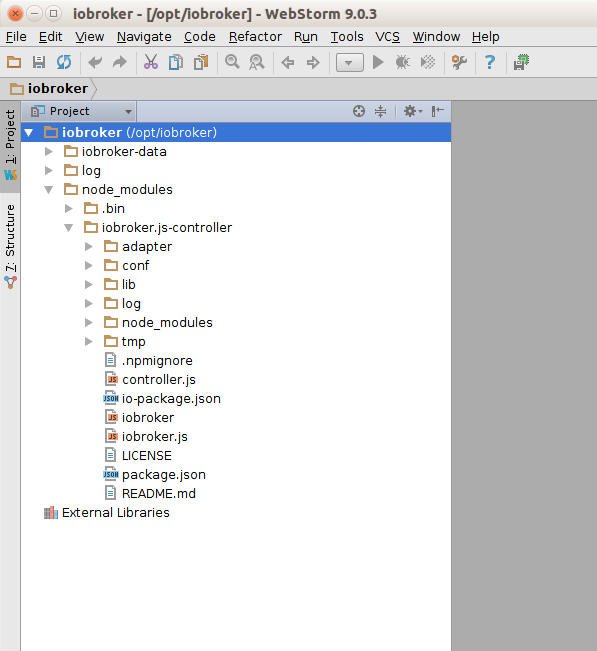

# WebStorm
Auf dieser Seite zeigen wir Ihnen, wie Sie eine ioBroker-Entwicklungsumgebung installieren und einrichten.
WebStorm wird für die Hauptentwicklung verwendet, möglicherweise ist [Visual Studio Code](./vscode.md) eine Alternative.

Diese Dokumentation ist wie ein "Kochbuch", aber ohne Erklärungen zu Javascript, NodeJS, HTML5 usw.

## Installation von WebStorm
### Linux
*Hinweis: Je nach Linux Distribution kann die Installation abweichen. Hier wird die Installation auf Ubuntu 18.04 beschrieben.*
 1. Gehen Sie auf die Webseite von [jetBrains](https://www.jetbrains.com/webstorm/download/#section=linux) und laden Sie WebStorm für Linux herunter
 2. Öffnen Sie ein Terminal und wechseln Sie in das Download-Verzeichnis
 3. Entpacken Sie die Datei mit `sudo tar xfz WebStorm-*.tar.gz -C /opt/` in das Verzeichnis /opt/
 4. Wechseln Sie in den Ordner /opt/WebStorm-*/bin/ und geben Sie `./webstorm.sh` ein
 5. Auf dem Welcome Screen können Sie dann unter `Konfigurieren -> Desktop Eintrag erstellen` die jeweiligen Einträge erstellen, damit Sie später, das Programm über die grafische Oberfläche starten können

### Windows 10
 1. Gehen Sie auf die Webseite von [jetBrains](https://www.jetbrains.com/webstorm/download/#section=windows) und laden Sie WebStorm für Windows herunter
 2. Führen Sie die WebStorm.*.exe aus und folgen Sie dem Installationswizard

## Installation von Node.js
### Linux
*Hinweis: Je nach Linux Distribution kann die Installation abweichen. Hier wird die Installation auf Ubuntu 18.04 beschrieben.*
 1. Öffnen Sie ein Terminal und installieren Sie curl mit dem Befehl `sudo apt-get install curl`
 2. Sobald curl installiert ist können Sie das jeweilig gewünschte PPA hinzufügen. Das PPA unterscheidet sich je nach Version die Sie installieren wollen. Wir empfehlen Ihnen mit der aktuellen  LTS Version zu arbeiten. Zum Zeitpunkt der Erstellung dieser Anleitung ist dies Node.js 10. Der Befehl dafür lautet `curl -sL https://deb.nodesource.com/setup_*.x | sudo -E bash -` -> z.B. `curl -sL https://deb.nodesource.com/setup_10.x | sudo -E bash -`
 3. Dann können Sie Node installieren `sudo apt-get install nodejs`
 4. Um zu Überprüfen ob die Installation erfolgreich war können Sie die Versionen von Node.js und npm abfragen `node -v` bzw. `npm -v`
 
 ### Windows 10
  1. Gehen Sie auf die Website von [Node.js](https://nodejs.org/en/download/) und laden Sie den Windows Installer (.msi) 64-bit herunter
  2. Führen Sie die node-v*-x64.msi aus und folgen dem Installationswizard

## Installation von ioBroker
### Linux
*Hinweis: Je nach Linux Distribution kann die Installation abweichen. Hier wird die Installation auf Ubuntu 18.04 beschrieben.*
 1. Öffnen Sie ein Terminal und installieren Sie die notwendigen Build Tools für die Installation von ioBroker. Dies können Sie mit folgendem Befehl `sudo apt-get install -y build-essential libavahi-compat-libdnssd-dev libudev-dev libpam0g-dev`
 2. Da Sie curl durch die Node.js Installation bereits installiert haben sollten, können Sie gleich mit der Installation von ioBroker fortfahren `curl -sL https://iobroker.net/install.sh | bash -`
 3. Folgen Sie dem Installationswizard. Ist die Installation abgeschlossen öffnen Sie Ihren Browser mit http://localhost:8081. Sie sollten den Begrüßungsbildschirm von ioBroker sehen.

### Windows 10
 1. Erstellen Sie den Ordner ioBroker im Root-Verzeichnis ihres Laufwerkes. z.B. C:\ioBroker
 2. Öffnen Sie eine Eingabeaufforderung und welchseln sie in das ioBroker Verzeichnis z.B. `cd /d C:\ioBroker`
 3. Starten Sie die Installation des ioBroker's mit dem Befehl `npm install iobroker` und folgen Sie dem Installationswizard. Ist die Installation abgeschlossen öffnen Sie Ihren Browser mit http://localhost:8081. Sie sollten den Begrüßungsbildschirm von ioBroker sehen.
 

## Konfigurieren Sie WebStorm, um den ioBroker auszuführen und zu debuggen
1. Öffnen Sie WebStorm mit `. / Webstorm.sh`
2. Klicken Sie auf Datei -> "Neues Projekt aus vorhandenen Dateien ..."
3. Wählen Sie Folgendes aus ...

  

4. Wählen Sie Ihr ioBroker-Verzeichnis ... (klicken Sie mit der rechten Maustaste auf das Verzeichnis, um das Projektstammverzeichnis festzulegen)

   

5. Ihr neues WebStorm-Projekt sollte so aussehen ...

  

### Erstellen Sie den ioBroker "Run Configuration"
1. Gehen Sie zu Ausführen -> "Konfiguration bearbeiten ...".

2. Wählen Sie das "+" aus und fügen Sie eine NodeJS-Konfiguration wie in der folgenden Abbildung hinzu ...

## So starten Sie ioBroker über WebStorm
1. Starten Sie ioBroker mit der Auswahl ...

    

2. Sie fragen sich vielleicht, wie Sie ioBroker stoppen können? Öffnen Sie ein Terminal in WebStorm und geben Sie Folgendes ein ...

    

## So debuggen Sie einen ioBroker-Adapter
In diesem Kapitel erfahren Sie, wie Sie einen ioBroker-Adapter wie "iobroker.hmm" debuggen können.
Starten Sie den ioBroker wie zuvor erwähnt. Verwenden Sie nicht den "Debug-Modus". Verwenden Sie für ioBroker nur den "Run-Modus".
Installieren Sie einen Adapter wie ioBroker.hmm von der Befehlszeile aus wie folgt 

Konfigurieren Sie den WebStorm "Debug-Einstellungen" ...

Gehen Sie zur ioBroker-Webseite http:// localhost: 8081 und installieren Sie den iobroker.hmm-Adapter: 

Nach der Installation des Adapters müssen wir die Adapterinstanz deaktivieren ...

... weiter 

... am Ende sollten Sie dieses Ergebnis sehen: 

Nun zurück zu WebStorm. Öffnen Sie die Datei hmm.js und setzen Sie einen Haltepunkt wie diesen: 

Beginnen Sie mit dem Beheben des iobroker.hmm-Adapters: 

Wenn Sie am ersten Haltepunkt anhalten, können Sie die nächsten Schritte steuern, indem Sie 1) das Programm fortsetzen. 2) Schritt vorbei: 
