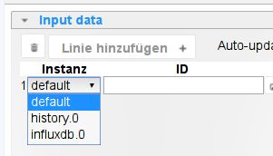
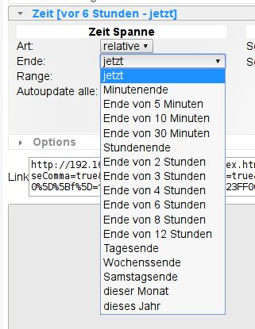

# Flot
The adapter is used to graphically display measured values. With it you can visualize the data logged with a history adapter. On the one hand, directly when a logged data point is called via the History icon in the Objects tab, but it can also be used as a separate application for the simultaneous display of several data points.

[![] (Img / flot-2_ioBroker_Adapter_Flot_001.jpg)](../../../de/adapterref/iobroker.flot/img/flot-2_ioBroker_Adapter_Flot_001.jpg)A so generated chart can be displayed in an iFrame widget in .vis

* * *

#  **Configuration**
[![] (Img / flot-2_ioBroker_Adapter_Flot_000.jpg)](../../../de/adapterref/iobroker.flot/img/flot-2_ioBroker_Adapter_Flot_000.jpg) A configuration is not necessary. This is why the configuration menu is not offered here.

* * *

#  **Operation**
The editor of the Flot adapter is called via `<IPdesServers>:8082/flot/edit.html/` or via the hyperlink in the Instances tab of the admin adapter.

The input fields are divided into 4 blocks:

####  [![] (Img / flot-2_ioBroker_Adapter_Flot_Groups.jpg)](../../../de/adapterref/iobroker.flot/img/flot-2_ioBroker_Adapter_Flot_Groups.jpg)
##  **Input data (1)**
The currently installed version is displayed on the top right.

[![] (Img / flot-2_ioBroker_Adapter_Flot_Input_Data.jpg)](../../../de/adapterref/iobroker.flot/img/flot-2_ioBroker_Adapter_Flot_Input_Data.jpg)

### Delete settings (trash can)
Clears all entries in this chart. When invoking /flot/edit.html/, the most recently edited project is usually called in the editor. However, if you want to create a completely different chart, you can use this button to reset all settings to default values.

Add ### line
Another line is added to the bottom of the table below. This gets assigned another color.

### Auto update
If the preview image in the lower half of the page is to be updated with each change, this checkbox must be activated. This can take some time on very complex charts. By default, this checkbox is not activated.

If the checkbox is activated, the **_ Update Preview _** button disappears to the right above the preview window, otherwise the preview would be updated.

### Place Booleans
With this button, the graph is divided into several vertically superimposed sections, in each of which the state of a data point is displayed. This provides a better overview of Boolean data points (on / off; true / false)

### Data point parameter
The following table defines the parameters with which the respective data points are to be displayed

#### Instance
Here it is determined from which history instance the logged data should be taken for the graph.

default refers to the default instance for data collection specified in the system settings. The other points correspond to the installed instances.

#### ID
Here, the data point to be displayed is selected. The data point must be logged in the _ **Objects** _ tab of the adapter _ **Admin** _ with the history instance selected under _ **Instance** _.

#### Art
Here, the selection of the way of representing the data points in the line takes place

[![] (Img / flot-2_ioBroker_Adapter_Flot_Input_Data_Art.jpg)](../../../de/adapterref/iobroker.flot/img/flot-2_ioBroker_Adapter_Flot_Input_Data_Art.jpg)

** - minmax (default): ** Both the highest and the lowest value within the aggregation interval are displayed

** - medium: ** The mean value within the aggregation interval is displayed

** - min: ** Both the lowest value within the aggregation interval is displayed

** - max: ** The highest value within the aggregation interval is displayed

** - total: ** It will be the ??? Value displayed within the aggregation interval

** - if changed: ** Only values are displayed if the value changes

#### Chart Type
Here it is determined in which form the data should be displayed.

[![] (Img / flot-2_ioBroker_Adapter_Flot_Input_Data_Chart_Type.jpg)](../../../de/adapterref/iobroker.flot/img/flot-2_ioBroker_Adapter_Flot_Input_Data_Chart_Type.jpg)

** Line: ** The data is displayed as lines. The individual points are connected as a straight line.

** Bar: ** Each individual measuring point of the data is displayed as a vertical bar. This representation is recommended only for a few measuring points.

** Scatter plot: ** The data is displayed as isolated points. The individual points are not connected.

** Steps: ** The data is displayed as lines. The individual points are connected horizontally as a straight line until the next change. At the time of the change, a step is entered.

** Spline: ** The data is displayed as lines. The individual points are connected to each other as a curved curve.

#### Fill (0-1)
Here you can specify whether a surface should be drawn between the drawn line and the X-axis (or the line through 0). A value between 0 and 1 (for example, 0.4) indicates the coverage of the color (0 = transparent, 1 = opaque).

#### Points
If you want to highlight the measurement points in addition to the line, you can tick this checkbox.

#### Colour
The color with which the data for this data point should be displayed can be entered as Hex (# FF0000), rgb (rgb (21, 120, 210)) or as rgba (rgba (0, 0, 255, 0.6)). If you click on the field, a rgba color picker opens in which the value can be determined graphically.

#### Min
Here you can enter the minimum value for the Y-axis. If no value is entered, the axis is scaled dynamically.

#### Max
Here you can enter the maximum value for the Y axis. If no value is entered, the axis is scaled dynamically.

#### Units
Here you can specify a unit for the scaling of the Y-axis

#### Y-axis
There are several ways in which the Y-axis of each data point can be represented. By default, a separate Y axis is drawn for each data point. However, this can easily become confusing. Therefore, there are the following options.

[![] (Img / flot-2_ioBroker_Adapter_Flot_Input_Data_Y_Achse.jpg)](../../../de/adapterref/iobroker.flot/img/flot-2_ioBroker_Adapter_Flot_Input_Data_Y_Achse.jpg)

** - nothing: ** for this data point no own Y-axis should be drawn.

** - left: ** the y-axis for this data point should be drawn to the left of the chart

** - right: ** the y-axis for this data point should be drawn to the right of the chart

** - left colored: ** the y-axis for this data point should be drawn to the left of the chart in the color of the data point

** - right color: ** the Y-axis for this data point should be drawn to the right of the chart in the color of the data point

#### X axis
There are several ways in which the x-axis of each data point can be represented. By default, a separate x-axis is drawn for each data point. However, this can easily become confusing. Therefore, there are the following options.

[![] (Img / flot-2_ioBroker_Adapter_Flot_Input_Data_X_Achse.jpg)](../../../de/adapterref/iobroker.flot/img/flot-2_ioBroker_Adapter_Flot_Input_Data_X_Achse.jpg)

** - nothing: ** for this data point no own Y-axis should be drawn.

** - top: ** the x-axis for this data point should be drawn above the chart

** - below: ** the x-axis for this data point should be drawn below the chart

** - above colored: ** the x-axis for this data point should be drawn above the chart in the color of the data point

** - colored below: ** the x-axis for this data point should be drawn under the chart in the color of the data point

#### Surname
Here you can specify a name for the data point, which is also displayed in the legend. If nothing is entered here, the full data point name is used.

#### More
Behind this icon hide more settings

[![] (Img / flot-2_ioBroker_Adapter_Flot_Input_Data_more.jpg)](../../../de/adapterref/iobroker.flot/img/flot-2_ioBroker_Adapter_Flot_Input_Data_more.jpg)

** X offset: ** In order to set the curve off the Y axis, a value can be entered here by which amount this reduction should be carried out.

** Y-Offset: ** In order to set the curve off the X-axis, a value can be entered here by which amount this reduction should be carried out. This will u.a. prevents the lineweight from overshadowing the x-axis

** X axis ticks: ** Number of X axis markers

** Y-axis ticks: ** Number of Y-axis markers

** ØL: ** Thickness of the line in pixels

** ØS: ** Thickness of the shadow in pixels

** Common Y-axis: ** default = each line has its own axis, each number represents the corresponding line

** NULL as: ** This determines how the line should be drawn if there is no data.

default: no line;

Ignore null values: Line continues horizontally

Use 0 instead of zero: the line is pulled to the value 0.

** Smoothing: ** Smoothing the curve. In principle, a moving average is drawn over the set number of points.

** After comma: ** Number of decimal places.

#### Delete data point (trash can)
Click on this icon to delete the entire line of the table with all settings.

## Markings (2)
With this option horizontal lines can be entered into a chart to show thresholds. The markers may also indicate areas (e.g., comfort zone at temperature or humidity). Then an upper and lower trigger must be specified.

### Add a new marker
Click this button to insert another row in the table below to define another marker.

### Marking parameters
The properties of a selected marker are set in one line each:

#### Line ID
Here a data series from the chart is selected. This is necessary so that the marking is based on the values of the associated Y-axis.

#### Upper value or ID
Here, either an absolute value or a data point, which is to be considered a trigger for the upper limit of the range, is entered. The data point can be searched via the object explorer.

#### Lower value or ID
Here you can enter either an absolute value or a data point, which should be the trigger for the lower limit of the range. The data point can be searched via the object explorer.

#### Colour
The color with which the lines for this marking should be displayed can be entered as Hex (# FF0000), rgb (rgb (21, 120, 210)) or as rgba (rgba (0, 0, 255, 0.6)). If you click on the field, a rgba color picker opens in which the value can be determined graphically.

#### To fill
Here you can specify whether a surface should be drawn between the drawn line, or between the line and the X-axis (or the line through 0).

#### ØL
Thickness of the line in pixels

#### ØS
Thickness of the shadow in pixels

#### Text
Here you can enter information about the marker that appears in the chart.

#### Text position
You can specify whether this information should be displayed on the right or left Y-axis.

#### Text offset
This is the distance to the marking line. The value can be specified as positive or negative.

#### Text size
Text size in px. Also an indication in pt is possible

#### Text color
The color with which the information for this marking should be displayed can be entered as Hex (# FF0000), rgb (rgb (21, 120, 210)) or as rgba (rgba (0, 0, 255, 0.6)). If you click on the field, a rgba color picker opens in which the value can be determined graphically.

## Time (3)

### Period of time
#### Art
Here you can choose between static and relative.

[![] (Img / flot-2_ioBroker_Adapter_Flot_Zeit_statisch.jpg)](../../../de/adapterref/iobroker.flot/img/flot-2_ioBroker_Adapter_Flot_Zeit_statisch.jpg)

With static fixed time points are defined, with relative the time ranges at a variable time, like e.g. _**today**_.

#### The End
This point may be a fixed time, or, if relatively selected, a variable repeating time, depending on the setting in the overlying point _ **Type** _.

#### Range
Here you enter the time range (the duration) over which the X-axis should display the data.

[![] (Img / flot-2_ioBroker_Adapter_Flot_Zeit_relativ_Range.jpg)](../../../de/adapterref/iobroker.flot/img/flot-2_ioBroker_Adapter_Flot_Zeit_relativ_Range.jpg)

#### Autoupdate all:
This value determines how often the display of the data points in the chart is to be updated automatically:

[![] (Img / flot-2_ioBroker_Adapter_Flot_Zeit_autoupdate.jpg)](../../../de/adapterref/iobroker.flot/img/flot-2_ioBroker_Adapter_Flot_Zeit_autoupdate.jpg)

If e.g. With Homematic wireless sensors, the data changes only every 3 minutes anyway, a more frequent refresh is not necessary.

### Aggregation
This point is used to reduce the amount of data in the chart. You can specify the number of logged points per data point (number) or the time interval of the individual points in seconds.

## Options (4)
The fourth block contains a lot of additional options to make a chart handsome [![] (Img / flot-2_ioBroker_Adapter_Flot_Options_all.jpg)](../../../de/adapterref/iobroker.flot/img/flot-2_ioBroker_Adapter_Flot_Options_all.jpg)

### Appearance
#### Width
Specifies how wide the chart should be displayed. Specification in px.

#### Height
Indicates how high the chart should be displayed. Specification in px.

#### No frame
Select whether to draw a border around the entire area of the chart, axes and their labels

#### Window background
The color with which this window should be filled can be entered as Hex (# FF0000), rgb (rgb (21, 120, 210)) or as rgba (rgba (0, 0, 255, 0.6)). If you click on the field, a rgba color picker opens in which the value can be determined graphically. This parameter refers to the entire area including the axes with their labels.

#### User chart background
If this checkbox is activated, the pulldown menu underneath disappears and an input field appears instead.

#### Chart background
This parameter only refers to the background of the actual chart. If the checkbox is activated then your own description or rgb (a) color can be entered. If not, you can choose from various pull-down backgrounds in the pull-down menu.

#### Y-label color
The color with which the label of the Y-axis is to be displayed can be entered as Hex (# FF0000), rgb (rgb (21, 120, 210)) or as rgba (rgba (0, 0, 255, 0.6)). If you click on the field, a rgba color picker opens in which the value can be determined graphically.

This color does not apply if the data point description _ **Y-axis right / left has been colored** _.

#### X-label color
The color with which the label of the X-axis is to be displayed can be entered as Hex (# FF0000), rgb (rgb (21, 120, 210)) or as rgba (rgba (0, 0, 255, 0.6)). If you click on the field, a rgba color picker opens in which the value can be determined graphically.

This color does not apply if ** was selected in the data point description ** _ X-axis right / left colored _ **.

#### Frame color
The color with which the frame is to be drawn around the actual chart can be entered as Hex (# FF0000), rgb (rgb (21, 120, 210)) or as rgba (rgba (0, 0, 255, 0.6)). If you click on the field, a rgba color picker opens in which the value can be determined graphically.

#### Grid color
The color with which the grid is to be drawn on the chart background can be entered as Hex (# FF0000), rgb (rgb (21, 120, 210)) or as rgba (rgba (0, 0, 255, 0.6)) , If you click on the field, a rgba color picker opens in which the value can be determined graphically.

#### Border width
Specification of the border width to be drawn around the chart background. Specification in px.

### Bar Settings
The values entered here only apply if the chart type is set to cash.

#### Fill color
The color with which a fill of the bars is to be drawn can be entered as Hex (# FF0000), rgb (rgb (21, 120, 210)) or as rgba (rgba (0, 0, 255, 0.6)). If you click on the field, a rgba color picker opens in which the value can be determined graphically.

#### Show labels
If you want to display the name of the data points on the bar, you can determine the position of this name here.

** nothing: ** no name

** above: ** above the bar

** top bottom: ** above inside the bar below the top edge

** below: ** below in the bar

** in the middle: ** halfway up the beam

#### Bar width
Specification of the bar width in px

#### Label font size
Specification of the font size in px

#### Label color
The color with which the designation of the bars should be displayed can be entered as Hex (# FF0000), rgb (rgb (21, 120, 210)) or as rgba (rgba (0, 0, 255, 0.6)). If you click on the field, a rgba color picker opens in which the value can be determined graphically.

### Labeling
This category deals with the possible labeling of the chart

#### Labeling
Here you can set a label that should appear in or on the chart. In most cases this will be the title of the chart.

#### Labeling position
The title can be placed at different places on the chart. These are available via the pull-down menu.

#### Title color
The color to be shown with the title of the chart can be entered as Hex (# FF0000), rgb (rgb (21, 120, 210)) or as rgba (rgba (0, 0, 255, 0.6)). If you click on the field, a rgba color picker opens in which the value can be determined graphically.

#### Title size
The font size of the label can be specified in% of a standard size, in px or in pt. If the chart is to be displayed later in a scalable window, the size in% is recommended.

### Options
In this category additional items and features are configured to give the chart the finishing touch.

#### Show legend
Here you can choose if a legend should be displayed and if so, where it will be placed. In order for the legend not to obscure the curves, the position is usefully dependent on how the chart is structured.

#### Columns in legend
For a large number of data points, it may be useful to display the data points in the legend in multiple columns.

#### Legend Opacity (0-1)
The color density of the legend was given with values from 0 to 1 (0 = transparent, 1 = dense)

#### Legend background
The color with which the background of the legend is to be displayed can be entered as Hex (# FF0000), rgb (rgb (21, 120, 210)) or as rgba (rgba (0, 0, 255, 0.6)). If you click on the field, a rgba color picker opens in which the value can be determined graphically.

#### Hover details
If this checkbox is checked, the data for the curve is displayed when you move the mouse over the line.

#### Time Format
By default, the time format is used as specified in the system settings. Alternatively, many other forms can be used for the chart.

#### Use comma
If this checkbox is checked, a comma is used as the decimal separator. Otherwise, the decimal point is used

#### Activate zoom and push
Activating this checkbox allows the charts in the live view to be zoomed and moved by mouse movements in the timeline.

#### No 'Edit' button
If this checkbox is activated, the "pencil icon" in the upper right corner of the chart window will not be displayed. Otherwise, this icon opens this chart in edit mode

#### Animation
Here you can specify whether this should be immediately available when opening the chart, or if it is built up by an animation. This determines the duration of this animation.

## Link
In this field, all the data configured in the previous menus are summarized in text form. If you copy this link at vis into an iFrame widget the chart will be displayed completely. The button _ **in the window** _ opens another tab in the browser and displays the chart there. This page can be bookmarked to save the chart. The button _ **Update preview** _ shows the last changes in the preview window. If the checkbox autoupdate is checked under _ **input data** _, this button is not available. The preview window then updates automatically with each change

## Changelog

### 1.9.2 (2018-08-18)
* (Seqway) Translations

### 1.9.1 (2018-06-04)
* (bluefox) Added dashed lines
* (bluefox) All JS files together are concatenated
* (bluefox) Show days of week (dow) in time axis.

### 1.8.0 (2018-05-04)
* (bluefox) Optimize communication

### 1.7.9 (2018-05-01)
* (bluefox) Added support of multi-languages in names

### 1.7.7 (2018-03-04)
* (Apollon77) fix month range

### 1.7.6 (2018-02-16)
* (Apollon77) remove alert windows from errors, log instead

### 1.7.5 (2018-01-13)
* (bluefox) try to fix small error

### 1.7.4 (2018-01-05)
* (bluefox) The loading via cloud is fixed

### 1.7.1 (2017-12-14)
* (bluefox) Fixed the loading of presets
* (bluefox) Added new date formats for X axis

### 1.7.0 (2017-10-17)
* (bluefox) Add presets

### 1.6.2 (2017-08-12)
* (bluefox) Show chart at start

### 1.6.1 (2017-03-25)
* (bluefox) Change edit layout

### 1.5.9 (2017-02-27)
* (bluefox) New color picker
* (bluefox) If 'none' for title selected => do not show any title
* (bluefox) add date format 'dd.mm.'

### 1.5.8 (2017-02-01)
* (bluefox) Add series as X ticks

### 1.5.7 (2017-01-26)
* (bluefox) Small fix in smoothing algorithm

### 1.5.6 (2016-11-04)
* (bluefox) fix marking line

### 1.5.4 (2016-10-13)
* (bluefox) remove area, line plot
* (bluefox) add fill value, points option

### 1.5.3 (2016-10-08)
* (bluefox) Allow using of IDs in the marking
* (bluefox) Support of filled markings

### 1.5.2 (2016-09-30)
* (bluefox) fix range and offset if month or year
* (bluefox) fix after comma settings

### 1.5.1 (2016-09-15)
* (bluefox) Filter IDs depends on storage instance

### 1.5.0 (2016-09-10)
* (bluefox) Support of marking lines

### 1.4.0 (2016-08-30)
* (bluefox) support bar chart (only one bar chart possible)

### 1.3.5 (2016-08-14)
* (bluefox) support of web-sockets force

### 1.3.4 (2016-07-23)
* (nobodyMO) Add app support
* (nobodyMO) Fix for jquery to the current version in vis

### 1.3.3 (2016-06-16)
* (bluefox) remove RTL direction in id field

### 1.3.2 (2016-06-13)
* (bluefox) add settings for border color and border width
* (bluefox) make splines work

### 1.3.1 (2016-06-07)
* (bluefox) add spline file

### 1.3.0 (2016-05-29)
* (bluefox) add animation
* (bluefox) remove smoothing, because does not work
* (bluefox) try to add splines, but it does not work always

### 1.2.5 (2016-05-28)
* (bluefox) do not include nulls by smoothing

### 1.2.4 (2016-05-27)
* (bluefox) show edit button

### 1.2.3 (2016-05-25)
* (bluefox) fix digits after comma
* (bluefox) fix start and finish points

### 1.2.2 (2016-05-22)
* (bluefox) change default aggregation name
* (bluefox) add units in tooltip

### 1.2.1 (2016-05-13)
* (bluefox) implement loading indicator

### 1.2.0 (2016-05-05)
* (bluefox) implement zoom and pan
* (bluefox) support ms
* (bluefox) support m4
* (bluefox) support of pan and zoom on touchable devices
* (bluefox) support of 3 types of "null" handling: use nulls, use last value instead of null, use 0 instead of 0
* (bluefox) update interval in seconds
* (bluefox) smoothing and "after comma" per variable

### 1.1.0 (2016-04-09)
* (bluefox) change splash screen
* (bluefox) ignoreNull per variable
* (bluefox) fix x axis

### 1.0.0 (2016-04-09)
* (bluefox) enable editing of created charts
* (bluefox) enable set of label colors
* (bluefox) enable set of window background

### 0.2.6 (2016-02-24)
* (Pmant) remove ignore null per state

### 0.2.5 (2016-02-14)
* (Pmant) add ignore null per state
* (Pmant) change commonYAxis per state

### 0.2.4 (2016-01-31)
* (ldsign) Title/help attribute for lineWidth and ShadowSize table head
* (ldsign) option for shadowSize
* (nobodyMO) Add option commonYAxis
* (bluefox) add favicon and title

### 0.2.3 (2016-01-26)
* (ldsign) user selectable time (hours/minutes) for static timeArt

### 0.2.2 (2015-12-17)
* (bluefox) fix SelectID for safary

### 0.2.1 (2015-12-14)
* (Smiling_Jack) support of new History concept
* (Smiling_Jack) new editor & working on axis
* (bluefox) add onchange aggregation
* (Smiling_Jack) add ignoreNull
* (Smiling_Jack) working on flot nav
* (bluefox) import old settings

### 0.1.1 (2015-07-13)
* (bluefox) fix time format

### 0.1.0 (2015-07-10)
* (bluefox) lines are implemented

### 0.0.2 (2015-07-09)
* (bluefox) implement title and sort points

### 0.0.1 (2015-03-27)
* (bluefox) initial commit

## License
The MIT License (MIT)

Copyright (c) 2014-2018 bluefox<dogafox@gmail.com>