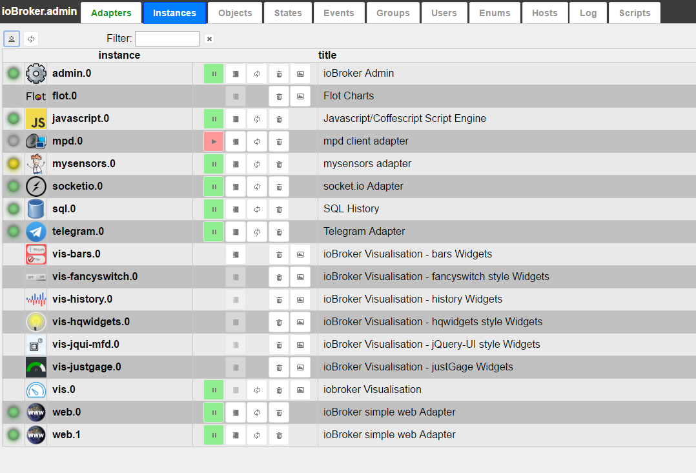
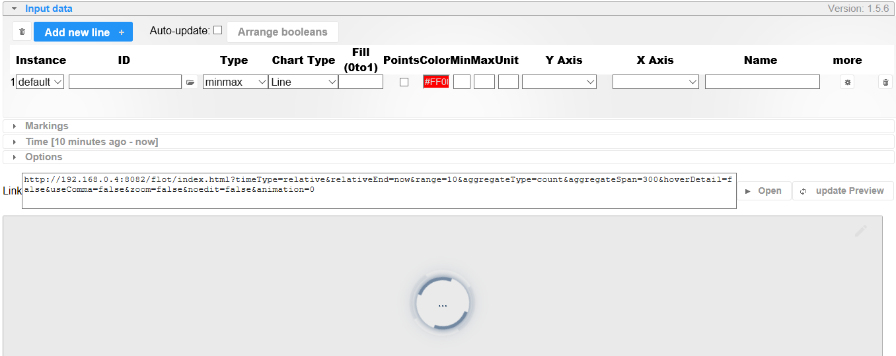
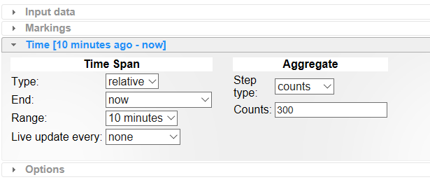
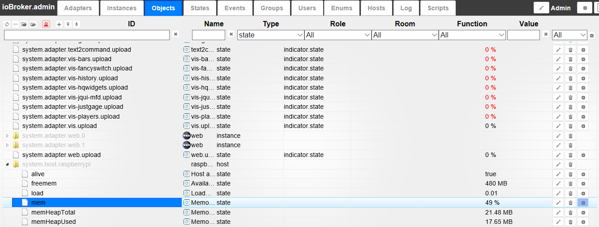
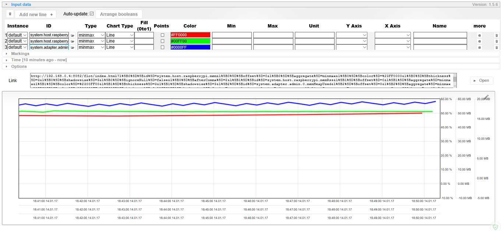
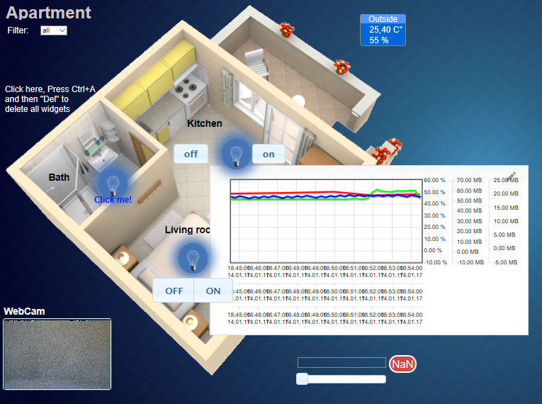

# Flot - Charts

## Desctiption

[Flot](http://www.flotcharts.org/) is JavaScript JQuery library for plotting, with a focus on the simple use, attractive appearance and 
interactive opportunities. ioBroker driver with the same name allows you to plot archived data (for access to historical data in 
the system should be installed driver History, SQL History or History with InfluxDB). It can be used as a standalone application 
for simultaneous display of several charts to analyze the different states of the system in time.

## Installation

Installation is on the **Driver** tab page of the [administration](http://www.iobroker.net/?page_id=4179&lang=en) system. 

In the driver group Visualization find a line called **Flot Charts**, and press the button with the plus icon in the right side of the line. 
You will see a pop-up window driver installation, after installation, it will automatically close. 

If all goes well, 
on the Setup driver tab appears **flot.0** installed instance of the driver. Please note that **Flot** driver must have access to 
historical data (DB), so the system must be installed and configured at 
least one driver from the **Storage** groups (History, SQL History or History with InfluxDB). 

For Flot also required driver Web, but it is usually installed automatically.



## Setting

The driver does not require special settings. It runs as a separate WEB-service on the web ioBroker system driver port (usually 8082). 
To get started with the driver, you must click on the button **Open the application** on the **Settings driver** tab in the line of the selected instance.

## Using

Flot charts window you can open the **Open app** button or type the link into your browser: `http://IP-адрес:8082/flot/edit.html` 
The window can be divided into three zones (top to bottom): Settings, URL page to display graphics and preview charts.



In order to display the graph in another application, or simply call again in a browser, you need to copy the generated URL, 
and it will again plot a graph with the specified parameters. If you want to change the graphics settings, insert the resulting 
URL in the browser string path, replacing ```index.html``` on ```edit.html```: 

```http://IP:8082/flot/**index**.html?params.... => http://IP:8082/flot/**edit**.html?params....```

### Input data

Setting the source data to draw a graph/graphs.

 


* You can add / delete the data series,
* The checkmark **Update once** allows you to apply the setting changes immediately after it (if not set, lower the Refresh button **updates** the preview charts in accordance with the settings),
* **ID** - you must use the buttons to select the variable to construct a time series (graphics) in the window only those variables that are configured to keep a history,
* **Driver** - You can choose from the list of driver instances, which is tied to a particular database, consequently data for construction will be requested from that database,
* **The shift in the X-axis** (shift on the Y axis) - You can specify a time period for which you need to move the chart to the right (deeper in the archive) or the absolute value of the shift on the Y axis,
* **Type** - points output mode on the chart (in the time group has a **Data Merge** (by time or number)setting - is taken a segment of the data and only rendered maximum, minimum, average, all values or special algorithms MinMax),
* **The type of graph** – drawing mode (Line, Area, Line with points,etc.),
* **Min**, **Max**, **Unit** - the interval on the Y axis (values) and units of measurements if not specified, the interval is automatically selected, units are taken from the ioBroker system,
* **Y Axis, X Axis** - position of the axes X and Y,
* **ØL**, **ØS** - the thickness of lines and size of the shadow graph,
* **Name** – value to show the name of the time series in the legend (if enabled), if not specified, take the value from the ioBroker (object name),
* **Coaxis Y** – the union of the Y-axis (values) for two or more time series,
* **NULL** as – interpretation of empty records the values of a variable (do not use, use a value of 0 or to take the previous),
* Settings **Smoothing and after the decimal point** – smoothing peaks graph and rounding values of the time series.

### Time

Setting time interval graph display data.



* Time interval **type** - relative (starting point is tied to the current time slot, and the ability to update automatically) and permanent (precise indication of the time frame),
* **Data Merge** - combine the values of time (in seconds), or a certain amount.

### Options

Here you can customize the appearance of the graphs, grids, axes and legends and captions. All settings are intuitive.


For example, you can add a few variables to records in the database (host variables work ioBroker - CPU load, memory and so on.). 
To do this, **objects** in the upper left corner of the tab, click the **Show system objects**, 
the table looking for a group **system.host.host’s_name**, drop-down list and insist to keep a history of selected variables (extreme right button at the prompt):

*   put a check **active** in the group **sql.o** (pre-configure an instance of the driver to work with the database),
*   other settings can be left default,
*   click the **Save** button.



     


 After a while, when the database will accumulate records to display on the chart, you can try to build a time series: 
 

  
## System integration

For example, consider the integration of graphics in the driver VIS visualization system ioBroker. 
There are several options you can place on the desktop object static-iFrame iframe group. 
In the settings you can specify the update interval (in ms), and then the graph will update and 
display the current data (if the timeline is set to the current time).



## Changelog

### 1.10.3 (2020-11-13)
* (Apollon77/harvey637) use browser timezone

### 1.10.2 (2020-08-09)
* (Apollon77/jlegen) colorpicker in flot edit page fixed

### 1.10.1 (2020-08-02)
* (sbormann) preset.html updated to allow german umlaute
* (Apollon77) add www directory to Github to allow GitHub installs

### 1.10.0 (2020-05-14)
* (sbormann) preset.html added to display a list of stored flot presets with direct links

### 1.9.2 (2018-08-18)
* (Seqway) Translations

### 1.9.1 (2018-06-04)
* (bluefox) Added dashed lines
* (bluefox) All JS files together are concatenated
* (bluefox) Show days of week (dow) in time axis.

### 1.8.0 (2018-05-04)
* (bluefox) Optimize communication

### 1.7.9 (2018-05-01)
* (bluefox) Added support of multi-languages in names

### 1.7.7 (2018-03-04)
* (Apollon77) fix month range

### 1.7.6 (2018-02-16)
* (Apollon77) remove alert windows from errors, log instead

### 1.7.5 (2018-01-13)
* (bluefox) try to fix small error

### 1.7.4 (2018-01-05)
* (bluefox) The loading via cloud is fixed

### 1.7.1 (2017-12-14)
* (bluefox) Fixed the loading of presets
* (bluefox) Added new date formats for X axis

### 1.7.0 (2017-10-17)
* (bluefox) Add presets

### 1.6.2 (2017-08-12)
* (bluefox) Show chart at start

### 1.6.1 (2017-03-25)
* (bluefox) Change edit layout

### 1.5.9 (2017-02-27)
* (bluefox) New color picker
* (bluefox) If 'none' for title selected => do not show any title
* (bluefox) add date format 'dd.mm.'

### 1.5.8 (2017-02-01)
* (bluefox) Add series as X ticks

### 1.5.7 (2017-01-26)
* (bluefox) Small fix in smoothing algorithm

### 1.5.6 (2016-11-04)
* (bluefox) fix marking line

### 1.5.4 (2016-10-13)
* (bluefox) remove area, line plot
* (bluefox) add fill value, points option

### 1.5.3 (2016-10-08)
* (bluefox) Allow using of IDs in the marking
* (bluefox) Support of filled markings

### 1.5.2 (2016-09-30)
* (bluefox) fix range and offset if month or year
* (bluefox) fix after comma settings

### 1.5.1 (2016-09-15)
* (bluefox) Filter IDs depends on storage instance

### 1.5.0 (2016-09-10)
* (bluefox) Support of marking lines

### 1.4.0 (2016-08-30)
* (bluefox) support bar chart (only one bar chart possible)

### 1.3.5 (2016-08-14)
* (bluefox) support of web-sockets force

### 1.3.4 (2016-07-23)
* (nobodyMO) Add app support
* (nobodyMO) Fix for jquery to the current version in vis

### 1.3.3 (2016-06-16)
* (bluefox) remove RTL direction in id field

### 1.3.2 (2016-06-13)
* (bluefox) add settings for border color and border width
* (bluefox) make splines work

### 1.3.1 (2016-06-07)
* (bluefox) add spline file

### 1.3.0 (2016-05-29)
* (bluefox) add animation
* (bluefox) remove smoothing, because does not work
* (bluefox) try to add splines, but it does not work always

### 1.2.5 (2016-05-28)
* (bluefox) do not include nulls by smoothing

### 1.2.4 (2016-05-27)
* (bluefox) show edit button

### 1.2.3 (2016-05-25)
* (bluefox) fix digits after comma
* (bluefox) fix start and finish points

### 1.2.2 (2016-05-22)
* (bluefox) change default aggregation name
* (bluefox) add units in tooltip

### 1.2.1 (2016-05-13)
* (bluefox) implement loading indicator

### 1.2.0 (2016-05-05)
* (bluefox) implement zoom and pan
* (bluefox) support ms
* (bluefox) support m4
* (bluefox) support of pan and zoom on touchable devices
* (bluefox) support of 3 types of "null" handling: use nulls, use last value instead of null, use 0 instead of 0
* (bluefox) update interval in seconds
* (bluefox) smoothing and "after comma" per variable

### 1.1.0 (2016-04-09)
* (bluefox) change splash screen
* (bluefox) ignoreNull per variable
* (bluefox) fix x axis

### 1.0.0 (2016-04-09)
* (bluefox) enable editing of created charts
* (bluefox) enable set of label colors
* (bluefox) enable set of window background

### 0.2.6 (2016-02-24)
* (Pmant) remove ignore null per state

### 0.2.5 (2016-02-14)
* (Pmant) add ignore null per state
* (Pmant) change commonYAxis per state

### 0.2.4 (2016-01-31)
* (ldsign) Title/help attribute for lineWidth and ShadowSize table head
* (ldsign) option for shadowSize
* (nobodyMO) Add option commonYAxis
* (bluefox) add favicon and title

### 0.2.3 (2016-01-26)
* (ldsign) user selectable time (hours/minutes) for static timeArt

### 0.2.2 (2015-12-17)
* (bluefox) fix SelectID for safary

### 0.2.1 (2015-12-14)
* (Smiling_Jack) support of new History concept
* (Smiling_Jack) new editor & working on axis
* (bluefox) add onchange aggregation
* (Smiling_Jack) add ignoreNull
* (Smiling_Jack) working on flot nav
* (bluefox) import old settings

### 0.1.1 (2015-07-13)
* (bluefox) fix time format

### 0.1.0 (2015-07-10)
* (bluefox) lines are implemented

### 0.0.2 (2015-07-09)
* (bluefox) implement title and sort points

### 0.0.1 (2015-03-27)
* (bluefox) initial commit

## License
The MIT License (MIT)

Copyright (c) 2014-2020 bluefox<dogafox@gmail.com>