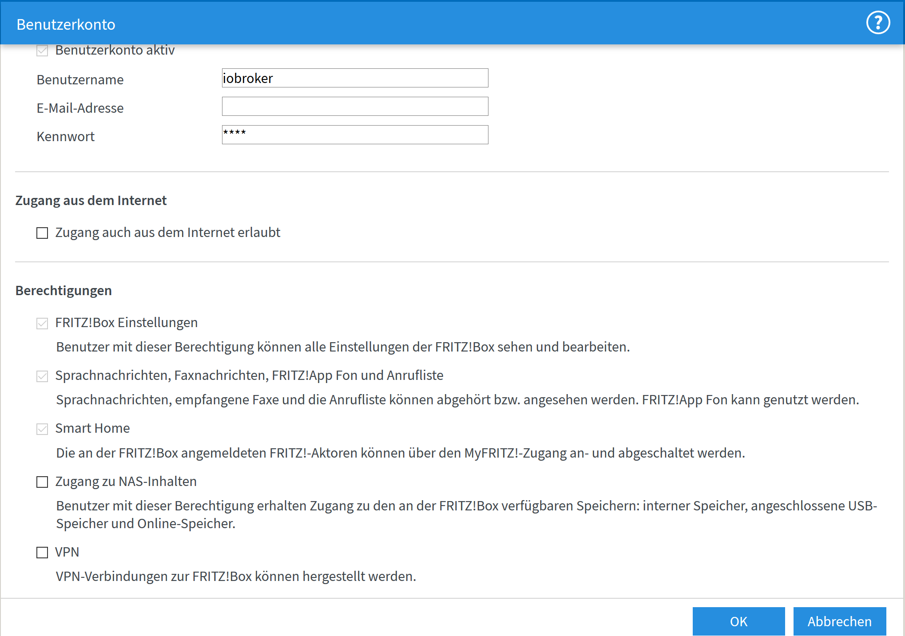

# Installation instructions
## FritzBox settings
A user must be created who has access to the DECT objects

if a special user has been created (ie not admin is used for iobroker), then the permissions have to be set and the default that only admin logs in must be changed to user.

## Adapter settings
* Enter IP with prefix "http://"
* Polling interval can be chosen arbitrarily (default 5min = 300sec). This is necessary for tracking outside of ioBroker, since the FritzBox does not provide automatic updates.

## Adapter Start
with the start of the adapter the following is done:

* the FW Fritzbox is queried and written in the log (some Fritz boxes do not answer and this generates an error).
* the data points (objects) are created for devices
* the data points (objects) for groups are created
* the objects are supplied with data

The following objects are written only once at startup:

* id
* fwversion
* manufacturer
* product name
* masterdviceid
* members

## Thermostat function
The thermostat can be operated in automatic mode (temperature control) and is controlled to the setpoint temperature.
The setpoint temperature can be the comfort temperature, the setback temperature or a self-selected temperature.

In addition, the valve can be completely closed and it corresponds to the OFF state.
The other direction can also be selected with ON and would correspond to a BOOST or sauna mode (do not forget to have it fixed again ;-)).

These currently 3 operating modes can be preselected with 0, 1 or 2 in the data point mode.
With the preselection of 0-AUTO, the last setpoint temperature is selected.

### Temperature with offset
It is possible to correct the measured temperature in the FritzBox, this is the measured temperature and there is an offset. This offset is taken into account for the data point .temp. Here you get the internal temperature measurement.
The actual temperature (actualtemp) used internally in the radiator controller is also changed by the offset. That the HKR internally regulates the corrected value.
Comparable for the target / Istverlaufs is therefore atualtemp and targettemp.

## Troubleshooting
It is advisable to look at the log, if not meaningful or too little information is to select the debug mode on the expert setting of the instance.

## Changelog
### 0.2.1
* gulp added
* correction for DECT100 without temperature (caused a stop in creation of objects)
* template creation corrected
* my templates added in admin page

### 0.2.0
* compact mode

### 0.1.5
* reading and activation of templates added
* correction of actual temperature in DECT200 and COMET (now offset recognized)
* password now hidden typed and encrypted
* new datapoint actualtemp for Comet
* fritzapi 0.10.5

### 0.1.4
* button added, only send the timestamp of last click
* fritzapi 0.10.4

### 0.1.3
* windowopenactiv added to thermostat

### 0.1.2
* errorcode string->number
* batterylow -> boolean
* switch in admin for non native API call for battery charge in % (shall prevent 403 message logs)

### 0.1.1
* switch for GuestWLAN when no access is granted and polling creates an error
* check for devices in admin page for better access to the xml/json stream from fritzbox
* admin v3 implemented

### 0.1.0
* major code change to use the xml stream instead the dedicated API-commands for the dedicated values
* creation of objects according the feedback from fritzbox
* support of groups
* still usage of non-universal object names
* more objects

### 0.0.14
* correction of temp offset influence

### 0.0.13
* DECT200 voltage new object
* DECT200 mode/lock value polling
* Comet mode as number and not array
* ADMIN v3

### 0.0.12
* changed state to  mode AUTO/OFF/ON for thermostat (including datapoint lasttarget when going back to AUTO)
* added name state for thermostat
* DECT100 temperature reading
* Contact reading

### 0.0.11
* added state OFF/ON for thermostat

### 0.0.10
* change to object oriented interface
* getOSversion when starting for log

### 0.0.9
* values '1' accepted for ON
* values '0' accepted for OFF

### 0.0.8
* messages info-> debug
* values 1/true/on/ON accepted for ON
* values 0/false/off/OFF accepted for OFF

### 0.0.7
* current temp of Comet/DECT300
* cyclic polling GuestWLAN

### 0.0.6
* correction targettemp in DECT200 section

### 0.0.5
* setTemp on COMET
* GuestWlan corrected

### 0.0.4
* cyclic status polling

### 0.0.3
* user now configurable

### 0.0.2
* metro widget for Dect200
* smartfritz-promise->fritzapi
* running version, tested with 1x DECT200 and Fritzbox FW=6.51 on Win10 with 4.5.0 and raspberry 4.7.0

### 0.0.1
* running version, tested with 1x DECT200 and Fritzbox FW=6.30

## License

The MIT License (MIT)

Copyright (c) 2018 - 2019 foxthefox <foxthefox@wysiwis.net>