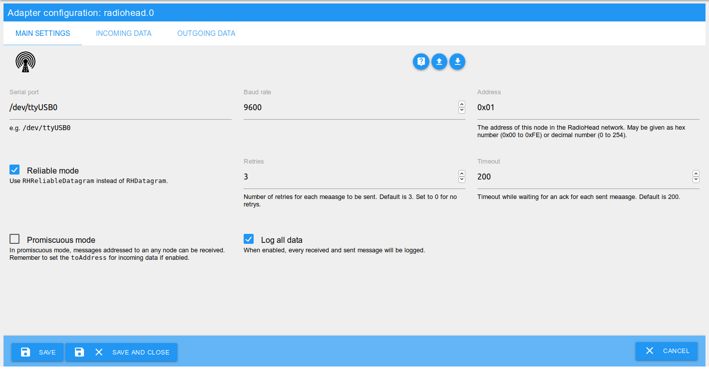
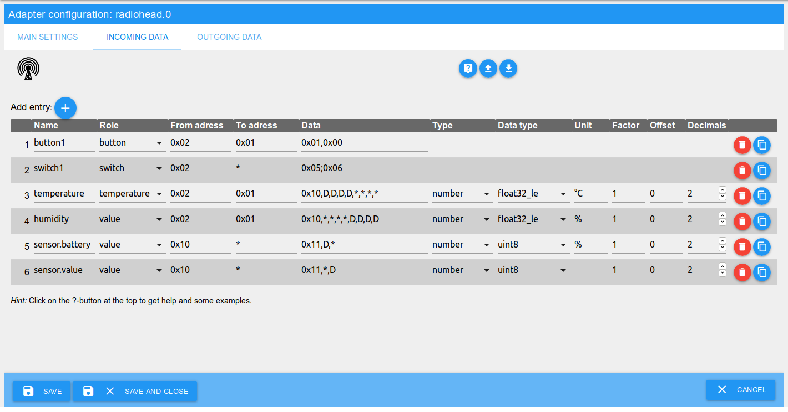
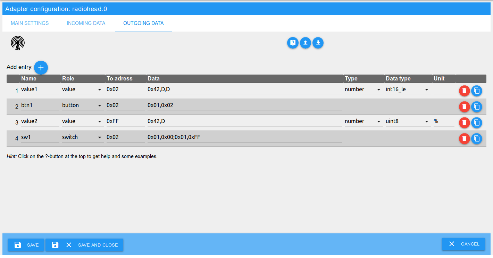

# ioBroker.radiohead

The adapter `radiohead` enables the connection of a RadioHead network to ioBroker.

The communication is done by a serial port.
To use radio hardware you may setup a microcontroller (e.g. an Arduino nano) as a serial-radio gateway.

[RadioHead](http://www.airspayce.com/mikem/arduino/RadioHead/) is a open source Packet Radio library for embedded microprocessors.
It provides addressed, reliable, retransmitted, acknowledged variable length messages.

## Features

* Receive messages/commands from other nodes in you local RadioHead network.
* Send messages/commands to other nodes in you local RadioHead network.
* Individually configurable objects for incoming and outgoing data.
* Possibility to send RadioHead messages by scripts.
* Possibility to evaluate received RadioHead messages by scripts.

If a message is received via the serial port which matches the pattern of an incoming data object, then the data will be extracted and written to the state of the object.

To send data the data is simply written to the state of an outgoing data object and the adapter will send it using the configured pattern.

## Installation

The adapter is available in the *stable* repository and can be installed via admin or cli.

Alternatively, a latest version can be installed using the *latest* repository or the URL `https://github.com/crycode-de/ioBroker.radiohead.git`.

## Configuration

The configuration screen consists of three tabs:
* Main settings
* Incoming data
* Outgoing data

### Main settings


#### Serial port
The serial port which is used for the RadioHead communication.

Examples:
* `/dev/ttyUSB0` (Linux)
* `COM1` (Windows)

#### Baud rate
The baud rate of the communication. This should be the same on every node in the RadioHead network.

Default is `9600`.

#### Address
The address of the ioBroker adapter in the RadioHead network.

May be given as hex number (`0x00` to `0xFE`) or decimal number (`0` to `254`).
Using `0xFF` (respectively `0`) is not possible, because this is the broadcast address.

#### Reliable mode
When using the reliable mode, for every sent message an acknowledgment (ACK) is expected.
If a message is not acknowledged within the given timeout, it will be send again.

If enabled `RHReliableDatagram` will be used instead of `RHDatagram`.

#### Retries
Number of retries for each message to be sent if no acknowledgment is received.

Default is `3`. Set to `0` for no retries.

#### Timeout
Timeout while waiting for an acknowledgment for each sent message.

Default is `200`.

#### Promiscuous mode
In promiscuous mode, messages addressed to an any node can be received.

Remember to set the toAddress for incoming data if enabled.

#### Log all data
When enabled, every received and sent message will be logged.


### Incoming data


#### Name
The name of the ioBroker object. Must be unique for incoming data of this adapter instance.

It's possible to create groups by using dots in the name.

For each record an object like `radiohead.<instance>.data.in.<name>` will be created.

#### Role
The role of the data is important for the processing of the received data.

Switches, buttons and indicators are evaluated as booleans.
All other roles are evaluated as numeric values by extracting them out of the received buffer.

#### From address
The address of the sender of the message in the RadioHead network.

May be given as hex number (`0x00` to `0xFE`) or decimal number (`0` to `254`).
It's also possible to use a `*` to allow any from address.

#### To address
The address of the receiver of the message in the RadioHead network.

May be given as hex number (`0x00` to `0xFF`) or decimal number (`0` to `255`).
It's also possible to use a `*` to allow any to address.

*Hint:* With disabled promiscuous mode, only messages addressed to the own address or the broadcast address `0xFF` (`255`) can be received.

#### Data
This is the data of the received message as individual comma separated bytes.
Based on this data, a received message is analyzed and processed.

May be given as hex number (`0x00` to `0xFF`) or decimal number (`0` to `255`).
As a wildcard for any byte a `*` can be used.

Data bytes to be extracted for the received value must be marked with a large `D` so that the data is recognized during processing. The number of consecutive `D` bytes depends on the selected data type.

**Special cases switch and indicator:**

For switches and indicators, two groups of data bytes separated by a semicolon can be specified.
The first group is for the `true` value and the second for the `false` value.
If only one group is specified, the current state is toggled on receiving.

**Examples:**
* Fixed byte `0x10`, 32-bit float number, 4 arbitrary bytes: `0x01,D,D,D,D,*,*,*,*`
* Two fixed bytes for a button: `0x01,0x00`
* Two groups of one byte each for a switch: `0x05;0x06`

#### Type
This is the type of the data in ioBroker.
Possible options are *number* and *boolean*. When using boolean, the received value will be converted into a boolean value (`true` or `false`).

#### Data type
The data type defines the type of data received and thus also the reading method from the data bytes.

See [Datatypes](#datatypes).

#### Unit
The unit of the value in ioBroker.

#### Factor und Offset
A factor that multiplies the received value and adds an offset to it.

`value = (value * factor) + offset`

#### Decimals
Number of decimals to which a received value is rounded (after factoring and offset calculation).


### Outgoing data


#### Name
The name of the ioBroker object. Must be unique for outgoing data of this adapter instance.

It's possible to create groups by using dots in the name.

For each record an object like `radiohead.<instance>.data.out.<name>` will be created.


#### Role
The role of the data is important for the processing of the data to send.

Switches, buttons and indicators are send as booleans.
All other roles are send as numeric values by embedding them into the buffer to send.

#### To address
The address of the receiver of the message in the RadioHead network.

May be given as hex number (`0x00` to `0xFF`) or decimal number (`0` to `255`).

For broadcast messages use the address `0xFF` (`255`).

#### Data
This is the data of the message to send as individual comma separated bytes.
Based on this data, a message to send is build.

May be given as hex number (`0x00` to `0xFF`) or decimal number (`0` to `255`).

The bytes where the value to send should be inserted must be marked with a large `D`. The number of consecutive `D` bytes depends on the selected data type.

**Special cases switch and indicator:**

For switches and indicators, two groups of data bytes separated by a semicolon can be specified.
The first group is for the `true` value and the second for the `false` value.
If only one group is specified, this group will be send every time.

**Examples:**
* Fixed byte `0x42`, 16-bit integer: `0x42,D,D`
* Two fixed bytes for a button: `0x01,0x02`
* Two groups of two bytes each for a switch: `0x01,0x00;0x01,0xFF`

#### Type
This is the type of the data in ioBroker.
Possible options are *number* and *boolean*. When using boolean, the value to send will be converted into `0x01` (`true`) or `0x00` (`false`).

#### Data type
The data type defines the type of data to send and thus also the writing method into the data bytes.

See [Datatypes](#datatypes).

#### Unit
The unit of the value in ioBroker.


## Datatypes

The following data types are available when receiving and sending data:

| Data type | Description | Value range | Data bytes |
|---|---|---|---|
| `int8` | Signed 8-bit integer | -128 to 127 | 1 |
| `uint8` | Unsigned 8-bit integer | 0 to 255 | 1 |
| `int16_le`, `int16_be` | Signed 16-bit integer | 0 to 32767 | 2 |
| `uint16_le`, `uint16_be` | Unsigned 16-bit integer | 0 to 65535 | 2 |
| `int32_le`, `int32_be` | Signed 32-bit integer | 0 to 4294967295 | 4 |
| `uint32_le`, `uint32_be` | Unsigned 32-bit integer | 0 to 4294967295 | 4 |
| `float32_le`, `float32_be` | 32-bit floating point number | -3.4E+38 to +3.4E+38, 7 Decimals | 4 |
| `double64_le`, `double64_be` | 64-bit floating point number | -1.7E+308 to +1.7E+30, 16 Decimals | 8 |

The endings `_le` and `_be` each designate the byte order for the data types with more than one byte. This depends on how the remote node sends or processes the data.

* `_le` - *little-endian*: least significant byte first
* `_be` - *big-endian*: most significant byte first


## Using in scripts

It's possible to send RadioHead messages or process received RadioHead messages in scripts.

### Sending with a script

For sending via a script the function `sendTo` can be used.

**Example:**
```js
sendTo('radiohead.0', 'send', {
    to: 0x02, // to address
    data: [0x01,0x02,255] // data bytes to send as an array or buffer
}, (ret) => {
    log('ret: ' + JSON.stringify(ret));
    // -> ret: {}
    if (ret.error) {
        log('error sending message', 'warn');
    }
});
```

If the message was not sent successfully, then `ret.error` is set to the corresponding error.

### Evaluate received messages in a script
For each received message, the object `radiohead.<instance>.data.incoming` is updated and the value is set to an object with the received data.
This change can be evaluated accordingly.

**Example:**
```js
on({id: "radiohead.0.data.incoming", change:'any'}, (obj) => {
    log('incoming changed: ' + JSON.stringify(obj.state.val));
    // -> incoming changed: {"data":[1,0],"length":2,"headerTo":1,"headerFrom":2,"headerId":47,"headerFlags":0}
});
```


## Adapter information

Each instance of the adapter provides the following information:

| Object | Description |
|---|---|
| info.connection | Indicator if the adapter is connected to the serial port |
| info.lastReceived | Timestamp when the last RadioHead message was received |
| info.lastSentOk | Timestamp when the last RadioHead message was sent successfully |
| info.lastSentError | Timestamp when the last RadioHead message was sent faulty |
| info.receivedCount | Number of received RadioHead messages |
| info.retransmissionsCount | Number of retries while sending a message |
| info.sentErrorCount | Number of faulty sent messages |
| info.sentOkCount | Number of successfully sent messages |

If necessary, the counters of the messages can be reset to 0 by writing to the object `actions.resetCounters`.

## Changelog
### 1.0.3 (2020-01-23)
* (Peter Müller) Better handling of changed objects in admin.
* (Peter Müller) Added `connectionType` in `io-package.json` and updated dependencies.

### 1.0.2 (2019-09-08)
* (Peter Müller) dependency updates and bugfixes

### 1.0.1 (2019-07-30)
* (Peter Müller) license  update

### 1.0.0 (2019-07-28)
* (Peter Müller) initial release

## License

Copyright (c) 2019 Peter Müller <peter@crycode.de>