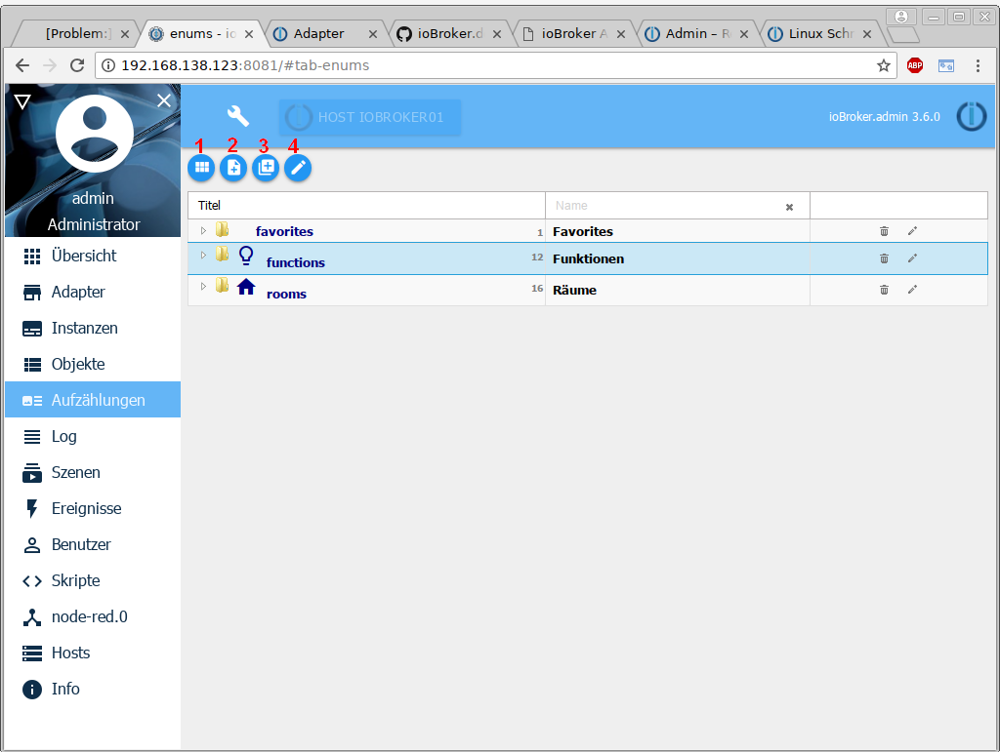

# The enumeration window
?> ***This is a wildcard*** .    Help with ioBroker and extend this article. Please note the [ioBroker style guide](community/styleguidedoc), so that the changes can be adopted more easily.

# The tab Enumerations
Here the favorites, functions and rooms are listed. If there is a HomeMatic installation, the lists contained in it are taken over. You can also create your own lists, which then can be used in scripts.

The first icon in the title bar can be used to switch to the list view. This view is used below:

## The title bar
The title bar contains icons for the most important processes. There is a context help for each icon. Just keep the mouse on the icon for a while.

### The icons in detail:
** 1.) Switching the view **

With this button you can switch between tile view and list view (toggle function)

** 2.) Create a new list **

With this button a new enumeration is created. This opens a new window

**Name**

Here the desired name for the enumeration is entered. Optionally, an icon for this enumeration can also be dragged and dropped into this field.

** ID retained **

This checkbox is deselected by default when creating a new enumeration because a new ID is created here.

In edit mode (s.u.) of an existing enumeration you can change the name without the ID.

**Preview**

Here the complete ID of the enumeration is displayed.

**Colour**

At this point a color can be selected with which the enumeration is to be marked.

In the tile view the tile is colored in this color, in the list view the line with the name of the enumeration in this color is underlined.

** 3.) Create a new category **

With this button, a new category (such as functions / rooms etc.) is created analogous to an enumeration.

** 4) Edit **

Via this button, the data points of an enumeration can be outdated. First you mark the desired enumeration with a mouse click and then activate the editing mode.

The screen is now divided into two parts:

The construction of the right half corresponds to that of [Objects page](opbjects.md).

Data points can be dragged from the right side by dragging them into the desired list on the left.

The deletion of a data point in the enumeration is done via the trashcan icon
