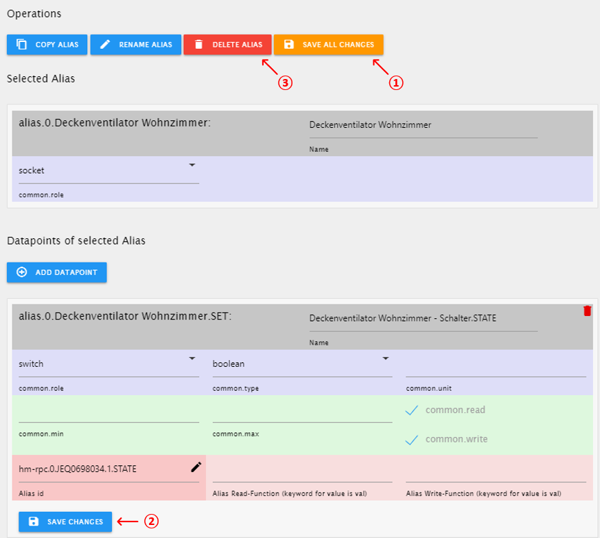
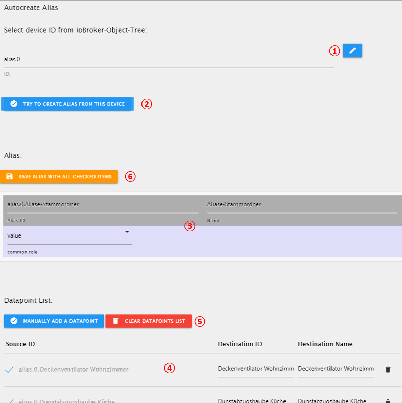

# IoBroker.alias-manager
## Адаптер alias-manager для ioBroker
Управляет псевдонимами и создает их.

## Краткое введение
### Управление псевдонимами

* (1) Нажмите «УПРАВЛЕНИЕ НИКНЕЙМАМИ».
* (2) Чтобы создать новый псевдоним, нажмите «NEW ALIAS» или
* (3) Выберите существующий псевдоним для редактирования

* (1) Затем вы найдете область с общими настройками этого псевдонима, такими как имя или общая роль
* (2) Ниже вы найдете список со всеми точками данных псевдонима.
* (3) Вы можете добавить alias-datapoints в этот список, либо добавив пустой, либо выбрав существующий iobroker-datapoint и скопировав его настройки в новый alias-datapoint.
* (4) Вы можете удалить точки данных, щелкнув значок мусора
* Каждая точка данных имеет несколько полей для ее настройки:
    * В серой области вы можете установить имя или удалить точку данных
    * В синей области вы можете настроить роль, тип и - необязательно - единицу
* В зеленой области вы можете установить необязательные минимальные и максимальные значения, а также определить, должна ли точка данных быть доступна только для чтения (common.write отключена) и можно ли получить доступ к ее значению (common.read включен - что будет правильной настройкой для большинства случаи)
* В красной области вы можете:
* (5) Настройте исходный ioBroker-datapoint, с которым связан этот псевдоним-datapoint. Оба (исходная точка данных и точка-псевдоним) должны быть синхронизированы.
* (6) Кроме того, вы можете настроить функции преобразования для чтения и записи.
* Пример: если вы установите «val / 10» как «Read-Function», значение aias-datapoint всегда будет 10 процентов от исходной точки данных.
* В большинстве случаев вам нужно сконфигурировать val * 10 как «Write-Function», чтобы также сохранить это соотношение при записи в alias-datapoint.
* Подробнее об этом читайте в документации ioBroker о псевдонимах по адресу https://www.iobroker.net/#en/documentation/dev/aliases.md

* (1) При нажатии на «КОПИРОВАТЬ АЛИАС» для копирования или
* (2) при «ПЕРЕИМЕНОВАНИИ АЛИАСА» для переименования псевдонима откроется следующее диалоговое поле:

 \ Здесь вы можете:

* (1) Установите новый идентификатор и
* (2) Установите новое общее имя для псевдонима
* (3) Нажав «ДОБАВИТЬ ЗАМЕНУ», вы можете добавить строки в следующий список, где вы можете:
    * (4) Введите строку, по которой будет выполняться поиск, и замените ее на (5) эту строку
* С помощью этой функции вы можете быстро изменить исходные точки данных ioBroker, ваши псевдонимы данных связаны с
* Пример:
* У вас есть вентилятор с несколькими точками данных, такими как SET, ERROR и UNREACH.
* Эти псевдонимы данных связаны с исходными точками данных, такими как hm-rpc.0.JEQ0698034.1.STATE, hm-rpc.0.JEQ0698034.0.ERROR и hm-rpc.0 .JEQ0698034.0.UNREACH
* Теперь, если ваше устройство сломано и его необходимо заменить новым, его серийный номер изменится, скажем, например, на ASDF1234.
* Чтобы обновить все ссылки во всех ваших alias-datapoints за один раз, вы можете выполнить поиск по запросу hm-rpc.0.JEQ0698034 и заменить его на hm-rpc.0.ASDF1234.
* Это также полезно при создании новых псевдонимов, похожих на старый. Просто скопируйте псевдоним, установите новый идентификатор и имя и используйте функцию замены, чтобы настроить связанные точки данных.

* После изменения настроек вы можете:
* (1) Сохраните все измененные псевдонимы данных за один раз, нажав «СОХРАНИТЬ ВСЕ ИЗМЕНЕНИЯ» или
* (2) Сохраните только одну точку данных, нажав «СОХРАНИТЬ ИЗМЕНЕНИЯ».
* (3) Наконец, вы можете удалить весь псевдоним, нажав «УДАЛИТЬ АЛИАС».

### Автосоздание псевдонима

* (1) Нажмите «АВТО СОЗДАТЬ АЛИАЗ».

* (1) Сначала выберите идентификатор устройства из дерева объектов ioBroker.
* (2) Затем нажмите «ПОПЫТАТЬСЯ СОЗДАТЬ АЛИАСЫ С ЭТОГО УСТРОЙСТВА».
* (3) После этого вы найдете определенные настройки для Псевдонима и
* (4) Список всех точек данных выбранного устройства
    * Все автоматически распознанные точки данных будут проверены (будут сохранены только отмеченные строки)
* При автоматическом распознавании для точки данных будет установлен «Идентификатор места назначения». Это будет соответствующая точка данных псевдонима (исходная точка данных будет связана с этим новым псевдонимом точки данных). Функция autocreate пытается сопоставить стандартные идентификаторы точек данных в зависимости от типа распознанного устройства. Однако вы можете изменить настройки по своему усмотрению, но каждый «Идентификатор места назначения» должен быть уникальным.
* И, наконец, вы можете ввести имя для точки назначения alias-datapoint.
* Все НЕ автоматически распознанные точки данных отображаются в списке без отметок. Вы можете вручную настроить параметры и установить флажок.
* (5) Вы также можете вручную добавить другие точки данных в этот список или очистить весь список
* (6) Затем вы можете сохранить новый псевдоним со всеми отмеченными (!) Точками данных (непроверенные точки данных будут отброшены)
* После этого вы автоматически перейдете на вкладку «УПРАВЛЕНИЕ АЛИАСАМИ», и откроется новый псевдоним, чтобы настроить его параметры по мере необходимости.

## Changelog

### 0.1.4 (2021-03-30)
* (sbormann) Updated dependencies.
* (sbormann) Removed bottom-border if used as tab.

### 0.1.3 (2021-03-29)
* (sbormann) Changed admin tab to singleton mode.

### 0.1.2 (2021-03-29)
* (sbormann) Fixed link to admin tab.
* (sbormann) Added translations.

### 0.1.1 (2021-03-28)
* (sbormann) Added alias-manager as tab to the ioBroker side menu.
* (sbormann) Added list of aliases to main tab.
* (sbormann) Enhanced open all / close all function for collapsibles.
* (sbormann) Added translations.

### 0.1.0 (2021-03-27)
* (sbormann) Alias-ID can now be an object with seperate datapoints for read and write.
* (sbormann) Alias-Datapoints can now be collapsed.
* (sbormann) Added Autocreate Alias function.

### 0.0.8 (2021-03-22)
* (sbormann) Added ability to create alias-datapoint from existing datapoint.

### 0.0.7 (2021-03-21)
* (sbormann) Fixed typos.
* (sbormann) Changed the way ioBroker-Objects are fetched (much faster).
* (sbormann) Added copy-button to datapoints.
* (sbormann) Empty fields are now removed (before they were set to null).
* (sbormann) Changed mode to onlyWWW.

### 0.0.6 (2021-01-18)
* (sbormann) Added delete datapoint.
* (sbormann) Some fixes .

### 0.0.1
* (sbormann) Initial release.

## License
MIT License

Copyright (c) 2021 Sebastian Bormann <sebastian@bormann.net>

Permission is hereby granted, free of charge, to any person obtaining a copy
of this software and associated documentation files (the "Software"), to deal
in the Software without restriction, including without limitation the rights
to use, copy, modify, merge, publish, distribute, sublicense, and/or sell
copies of the Software, and to permit persons to whom the Software is
furnished to do so, subject to the following conditions:

The above copyright notice and this permission notice shall be included in all
copies or substantial portions of the Software.

THE SOFTWARE IS PROVIDED "AS IS", WITHOUT WARRANTY OF ANY KIND, EXPRESS OR
IMPLIED, INCLUDING BUT NOT LIMITED TO THE WARRANTIES OF MERCHANTABILITY,
FITNESS FOR A PARTICULAR PURPOSE AND NONINFRINGEMENT. IN NO EVENT SHALL THE
AUTHORS OR COPYRIGHT HOLDERS BE LIABLE FOR ANY CLAIM, DAMAGES OR OTHER
LIABILITY, WHETHER IN AN ACTION OF CONTRACT, TORT OR OTHERWISE, ARISING FROM,
OUT OF OR IN CONNECTION WITH THE SOFTWARE OR THE USE OR OTHER DEALINGS IN THE
SOFTWARE.