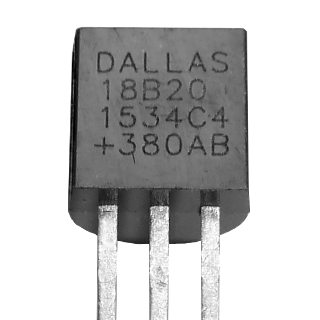
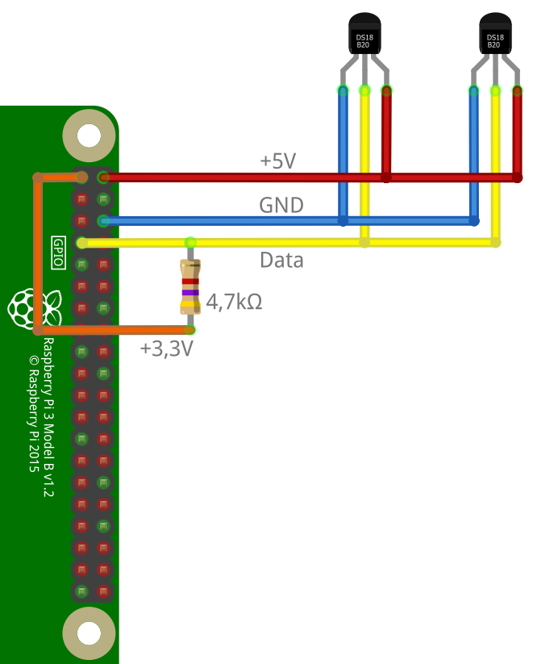

# IoBroker.ds18b20
Адаптер `ds18b20` позволяет напрямую интегрировать датчики температуры 1-Wire типа DS18B20 в ioBroker.

Требуется соответствующее оборудование с поддержкой шины 1-Wire (например, Raspberry Pi), а шина 1-Wire должна быть настроена для работы в системе (датчики перечислены в `/sys/bus/w1/devices/`).

Пример подключения датчиков DS18B20 к Raspberry Pi можно найти ниже.

## Особенности
* Считывание текущего значения температуры
* Автоматическое определение подключенных датчиков
* Обнаружение ошибок при запросе датчиков (контрольная сумма, ошибка связи, отключение устройства)
* Интервал запроса можно настроить для каждого датчика
* Округление и преобразование измеренного значения для каждого датчика можно настроить

## Установка
В настоящее время адаптер доступен в последней версии репозитория.

Кроме того, его можно установить по URL-адресу `https://github.com/crycode-de/ioBroker.ds18b20.git`.

## Конфигурация
В конфигурации адаптера **стандартный интервал опроса** для всех датчиков может быть установлен в миллисекундах. Минимум 500.

Отдельные датчики можно добавить вручную или через *Поиск датчиков* в таблице.


** адрес ** является 1-проводным адресом / идентификатором датчика, а также определяет идентификатор объекта.
Например, датчик с адресом `28-0000077ba131` получает идентификатор объекта `ds18b20.0.sensors.28-0000077ba131`.

** имя ** можно свободно выбрать для идентификации датчика.

Для каждого датчика можно указать дополнительный **интервал запроса** в миллисекундах.
Если поле оставлено пустым, применяется стандартный интервал запроса.
Минимум 500.

** unit ** определяет единицу, хранящуюся в объекте ioBroker для значения.
По умолчанию это `°C`.

Используя **Фактор** и **Смещение** можно настроить значение, считываемое датчиком, в соответствии с формулой `Wert = (Wert * Faktor) + Offset`.

** Десятичные разряды ** указывают, сколько разрядов после десятичной запятой округляется.
Округление происходит после расчета с коэффициентом и смещением.

** Ноль в случае ошибки ** определяет, как поступать с ошибками при считывании показаний датчика.
Если опция установлена, то значения `null` записываются в состояние датчика в случае ошибок.
Без этой опции состояние не обновляется в случае ошибок.

### Преобразование `°C` в `°F`
Чтобы измеренные температуры возвращались адаптером в `°F`, `1.8` следует использовать как коэффициент, а `32` как смещение.

## Действия
Путем записи в состояние `ds18b20.0.actions.readNow` можно запустить немедленное считывание всех или определенного датчика.

Чтобы вызвать немедленное считывание всех датчиков, в состояние должно быть записано ключевое слово `all`.

Если должен быть прочитан только определенный датчик, адрес или идентификатор объекта ioBroker датчика должен быть записан в состояние.

## Использование в скриптах
Адаптеру можно посылать команды для чтения данных датчиков или поиска датчиков.

### `readNow`
Команда `readNow` запускает немедленный запрос всего или определенного датчика.
Для запроса всех датчиков часть сообщения можно оставить пустой или использовать строку `all`.
Чтобы прочитать определенный датчик, в разделе сообщений должен быть указан адрес или идентификатор ioBroker ID датчика.

Команда `readNow` не возвращает никаких данных. Это только вызывает немедленное считывание показаний датчиков.

```js
sendTo('ds18b20.0', 'readNow');
sendTo('ds18b20.0', 'readNow', '28-0000077ba131');
```

### `read`
Один датчик можно прочитать с помощью команды `read`.
Адрес или идентификатор объекта ioBroker считываемого датчика должен быть указан в разделе сообщения.
Считанное значение можно обработать дальше с помощью функции обратного вызова.

```js
sendTo('ds18b20.0', 'read', '28-0000077ba131', (ret) => {
    log('ret: ' + JSON.stringify(ret));
    if (ret.err) {
        log(ret.err, 'warn');
    }
});
```

### `search`
Команда `search` выполняет поиск подключенных в данный момент датчиков 1-Wire и возвращает адреса датчиков, обнаруженных с помощью функции обратного вызова.

```js
sendTo('ds18b20.0', 'search', {}, (ret) => {
    log('ret: ' + JSON.stringify(ret));
    if (ret.err) {
        log(ret.err, 'warn');
    } else {
        for (let s of ret.sensors) {
            log('Sensor: ' + s);
        }
    }
});
```

## Информация об адаптере
Через состояние `ds18b20.*.info.connection` каждый экземпляр адаптера предоставляет информацию о том, все ли настроенные датчики доставляют данные.
Если последнее считывание со всех датчиков было успешным, это состояние - `true`.
Как только один из датчиков показывает ошибку, это состояние - `false`.

## DS18B20 на Raspberry Pi
Датчики температуры DS18B20 подключаются к Raspberry Pi, как показано на следующем рисунке.
Обратите внимание, что подтягивающий резистор должен быть подключен к + 3,3 В, а не к + 5 В, так как это может повредить GPIO.
В этом примере используется GPIO.04 (BCM).



Чтобы активировать шину 1-Wire на Raspberry Pi, необходимо добавить следующую строку в файл `/boot/config.txt`, а затем перезапустить Raspberry Pi.

```
dtoverlay=w1-gpio,gpiopin=4
```

Если все работает, подключенные датчики будут отображаться в `/sys/bus/w1/devices/`.

```
$ ls -l /sys/bus/w1/devices/
insgesamt 0
lrwxrwxrwx 1 root root 0 Nov  2 11:18 28-0000077b4592 -> ../../../devices/w1_bus_master1/28-0000077b4592
lrwxrwxrwx 1 root root 0 Nov  2 11:18 28-0000077b9fea -> ../../../devices/w1_bus_master1/28-0000077b9fea
lrwxrwxrwx 1 root root 0 Nov  2 10:49 w1_bus_master1 -> ../../../devices/w1_bus_master1
```

## Интеграция датчиков на удаленном Raspberry Pi
Также можно интегрировать датчики, подключенные к удаленному Raspberry Pi.
Для этого соответствующий каталог освобождается на удаленном Raspberry Pi с использованием *Samba* а затем монтируется в системе ioBorker.

### Конфигурация на удаленном Raspberry Pi
Установка Samba:

```sh
sudo apt install samba
```

Конфигурация в файле `/etc/samba/smb.conf`:

```ini
[ds1820]
path = /sys/devices/w1_bus_master1
comment = DS1820 Temperature sensors.
available = yes
browseable = yes
guest ok = yes
writeable = no
force user = root
force group = root
```

Затем перезапустите Samba, чтобы изменения вступили в силу:

```sh
sudo systemctl restart samba
```

### Конфигурация в системе ioBroker
Установка клиента Samba:

```sh
sudo apt install smbclient
```

Добавьте запись для монтирования в файл `/etc/fstab`:

```
//<IP-ADRESSE-REMOTE-RPI>/ds1820 /mnt/remote-ds1820 cifs defaults,vers=1.0 0 0
```

Создайте каталог для точки монтирования:

```sh
sudo mkdir -p /mnt/remote-ds1820
```

Каталог монтирования:

```sh
sudo mount /mnt/remote-ds1820
```

### Конфигурация адаптера
Затем в конфигурации адаптера системный путь для устройств 1-Wire должен быть установлен на точку монтирования `/mnt/remote-ds1820`.

Если датчики DS1820 также подключены напрямую к системе ioBroker, лучше всего создать второй экземпляр адаптера для удаленных датчиков.

## Changelog
### 1.1.5 (2020-10-14)
* (Peter Müller) Fixed incorrect data type of object
* (Peter Müller) Updated dependencies

### 1.1.4 (2020-02-03)
* (Peter Müller) Updated connectionType and dataSource in io-package.json.

### 1.1.3 (2020-01-23)
* (Peter Müller) Added `connectionType` in `io-package.json` and updated dependencies.

### 1.1.2 (2020-01-22)
* (Peter Müller) Better handling of changed objects in admin.

### 1.1.1 (2020-01-09)
* (Peter Müller) Fixed wrong communication errror detection on some sensors.

### 1.1.0 (2019-11-11)
* (Peter Müller) Own implementation of reading the sensor data.
* (Peter Müller) Fixed bug on decimals rounding.
* (Peter Müller) 1-wire devices path is now configurable.

### 1.0.3 (2019-11-03)
* (Peter Müller) Added documentation about DS18B20 at a Raspberry Pi; Dependencies updated

### 1.0.2 (2019-10-07)
* (Peter Müller) Display error message when tried to search for sensors without adapter running.

### 1.0.1 (2019-10-01)
* (Peter Müller) Type changed to hardware, Renamed command, Added missing documentation

### 1.0.0 (2019-09-09)
* (Peter Müller) initial release

## License

Copyright (c) 2019-2020 Peter Müller <peter@crycode.de>

### MIT License

Permission is hereby granted, free of charge, to any person obtaining
a copy of this software and associated documentation files (the
"Software"), to deal in the Software without restriction, including
without limitation the rights to use, copy, modify, merge, publish,
distribute, sublicense, and/or sell copies of the Software, and to
permit persons to whom the Software is furnished to do so, subject to
the following conditions:

The above copyright notice and this permission notice shall be
included in all copies or substantial portions of the Software.

THE SOFTWARE IS PROVIDED "AS IS", WITHOUT WARRANTY OF ANY KIND,
EXPRESS OR IMPLIED, INCLUDING BUT NOT LIMITED TO THE WARRANTIES OF
MERCHANTABILITY, FITNESS FOR A PARTICULAR PURPOSE AND
NONINFRINGEMENT. IN NO EVENT SHALL THE AUTHORS OR COPYRIGHT HOLDERS BE
LIABLE FOR ANY CLAIM, DAMAGES OR OTHER LIABILITY, WHETHER IN AN ACTION
OF CONTRACT, TORT OR OTHERWISE, ARISING FROM, OUT OF OR IN CONNECTION
WITH THE SOFTWARE OR THE USE OR OTHER DEALINGS IN THE SOFTWARE.