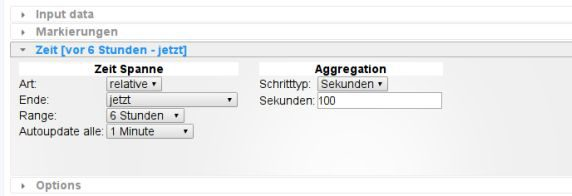

# Flot
Адаптер используется для графического отображения измеренных значений. С его помощью вы можете визуализировать данные, записанные с помощью адаптера истории. С одной стороны, непосредственно, когда регистрируемая точка данных вызывается через значок «Журнал» на вкладке «Объекты», но она также может использоваться как отдельное приложение для одновременного отображения нескольких точек данных.

[![] (Img / Flot-2_ioBroker_Adapter_Flot_001.jpg)](../../../de/adapterref/iobroker.flot/img/flot-2_ioBroker_Adapter_Flot_001.jpg)AСозданная диаграмма может отображаться в виджете iFrame в .vis

* * *

#  **Конфигурация**
[![] (Img / Flot-2_ioBroker_Adapter_Flot_000.jpg)](../../../de/adapterref/iobroker.flot/img/flot-2_ioBroker_Adapter_Flot_000.jpg) Конфигурация не требуется. Вот почему меню конфигурации здесь не предлагается.

* * *

#  **Операция**
Редактор адаптера Flot вызывается через `<IPdesServers>:8082/flot/edit.html/` или через гиперссылку на вкладке «Экземпляры» адаптера администратора.

Поля ввода разделены на 4 блока:

####  [![] (Img / Flot-2_ioBroker_Adapter_Flot_Groups.jpg)](../../../de/adapterref/iobroker.flot/img/flot-2_ioBroker_Adapter_Flot_Groups.jpg)
##  **Входные данные (1)**
Текущая установленная версия отображается в правом верхнем углу.

[![] (Img / Flot-2_ioBroker_Adapter_Flot_Input_Data.jpg)](../../../de/adapterref/iobroker.flot/img/flot-2_ioBroker_Adapter_Flot_Input_Data.jpg)

### Удалить настройки (мусорное ведро)
Очищает все записи в этом графике. При вызове /flot/edit.html/ последний отредактированный проект обычно вызывается в редакторе. Однако, если вы хотите создать совершенно другую диаграмму, вы можете использовать эту кнопку, чтобы сбросить все настройки до значений по умолчанию.

Добавить ### строку
Еще одна строка добавлена внизу таблицы ниже. Это получает другой цвет.

### Автообновление
Если изображение предварительного просмотра в нижней половине страницы должно обновляться при каждом изменении, этот флажок должен быть активирован. Это может занять некоторое время на очень сложных графиках. По умолчанию этот флажок не активирован.

Если флажок установлен, кнопка **_ Update Preview _** исчезнет справа над окном предварительного просмотра, в противном случае предварительный просмотр будет обновлен.

### Place Booleans
С помощью этой кнопки график делится на несколько вертикально наложенных участков, в каждом из которых отображается состояние точки данных. Это обеспечивает лучший обзор логических точек данных (вкл / выкл; истина / ложь)

### Параметр точки данных
Следующая таблица определяет параметры, с которыми должны отображаться соответствующие точки данных

#### Экземпляр
Здесь определяется, из какого экземпляра истории записанные данные должны быть взяты для графика.

default относится к экземпляру по умолчанию для сбора данных, указанному в системных настройках. Остальные точки соответствуют установленным экземплярам.

#### ID
Здесь выбирается точка данных для отображения. Точка данных должна быть зарегистрирована на вкладке _ **Objects** _ адаптера _ **Admin** _ с выбранным экземпляром истории в _ **Экземпляр** _.

#### Art
Здесь происходит выбор способа представления точек данных в строке.

[![] (Img / Flot-2_ioBroker_Adapter_Flot_Input_Data_Art.jpg)](../../../de/adapterref/iobroker.flot/img/flot-2_ioBroker_Adapter_Flot_Input_Data_Art.jpg)

** - minmax (по умолчанию): ** Отображаются как самое высокое, так и самое низкое значение в интервале агрегации

** - средний: ** Отображается среднее значение в интервале агрегации

** - мин: ** Отображается как самое низкое значение в интервале агрегации

** - max: ** Отображается самое высокое значение в интервале агрегации

** - всего: ** Это будет ??? Значение отображается в интервале агрегации

** - если изменено: ** Только значения отображаются при изменении значения

#### Тип диаграммы
Здесь определяется, в какой форме должны отображаться данные.

[![] (Img / Flot-2_ioBroker_Adapter_Flot_Input_Data_Chart_Type.jpg)](../../../de/adapterref/iobroker.flot/img/flot-2_ioBroker_Adapter_Flot_Input_Data_Chart_Type.jpg)

** Строка: ** Данные отображаются в виде строк. Отдельные точки связаны как прямая линия.

** Бар: ** Каждая отдельная точка измерения данных отображается в виде вертикальной полосы. Это представление рекомендуется только для нескольких точек измерения.

** Диаграмма рассеяния: ** Данные отображаются в виде изолированных точек. Отдельные точки не связаны.

** Шаги: ** Данные отображаются в виде строк. Отдельные точки соединяются горизонтально прямой линией до следующего изменения. Во время изменения вводится шаг.

** Сплайн: ** Данные отображаются в виде линий. Отдельные точки связаны друг с другом в виде кривой кривой.

#### Заполнить (0-1)
Здесь вы можете указать, должна ли быть нарисована поверхность между нарисованной линией и осью X (или линией через 0). Значение между 0 и 1 (например, 0,4) указывает на покрытие цвета (0 = прозрачный, 1 = непрозрачный).

#### Баллов
Если вы хотите выделить точки измерения в дополнение к линии, вы можете установить этот флажок.

#### Цвет
Цвет, с которым должны отображаться данные для этой точки данных, можно ввести как Hex (# FF0000), rgb (rgb (21, 120, 210)) или как rgba (rgba (0, 0, 255, 0.6)). Если щелкнуть поле, откроется палитра цветов rgba, в котором значение можно определить графически.

#### Мин
Здесь вы можете ввести минимальное значение для оси Y. Если значение не введено, ось масштабируется динамически.

#### Макс
Здесь вы можете ввести максимальное значение для оси Y. Если значение не введено, ось масштабируется динамически.

#### Единицы
Здесь вы можете указать единицу для масштабирования оси Y

#### Ось Y
Существует несколько способов представления оси Y каждой точки данных. По умолчанию для каждой точки данных отображается отдельная ось Y. Однако это может легко запутать. Поэтому есть следующие варианты.

[![] (Img / Flot-2_ioBroker_Adapter_Flot_Input_Data_Y_Achse.jpg)](../../../de/adapterref/iobroker.flot/img/flot-2_ioBroker_Adapter_Flot_Input_Data_Y_Achse.jpg)

** - ничего: ** для этой точки данных не следует рисовать собственную ось Y.

** - слева: ** ось Y для этой точки данных должна быть нарисована слева от графика

** - справа: ** ось Y для этой точки данных должна быть нарисована справа от графика

** - цвет слева: ** ось y для этой точки данных должна быть нарисована слева от диаграммы цветом точки данных

** - правильный цвет: ** ось Y для этой точки данных должна быть нарисована справа от диаграммы в цвете точки данных

#### Ось икс
Существует несколько способов представления оси X каждой точки данных. По умолчанию для каждой точки данных отображается отдельная ось х. Однако это может легко запутать. Поэтому есть следующие варианты.

[![] (Img / Flot-2_ioBroker_Adapter_Flot_Input_Data_X_Achse.jpg)](../../../de/adapterref/iobroker.flot/img/flot-2_ioBroker_Adapter_Flot_Input_Data_X_Achse.jpg)

** - ничего: ** для этой точки данных не следует рисовать собственную ось Y.

** - верх: ** ось x для этой точки данных должна быть нарисована над диаграммой

** - ниже: ** ось x для этой точки данных должна быть нарисована под диаграммой

** - цвет выше: ** ось x для этой точки данных должна быть нарисована над диаграммой в цвете точки данных

** - цвет ниже: ** ось х для этой точки данных должна быть нарисована под диаграммой в цвете точки данных

#### Имя
Здесь вы можете указать имя для точки данных, которая также отображается в легенде. Если здесь ничего не введено, используется полное имя точки данных.

#### Больше
За этим значком скрываются дополнительные настройки

[![] (Img / Flot-2_ioBroker_Adapter_Flot_Input_Data_more.jpg)](../../../de/adapterref/iobroker.flot/img/flot-2_ioBroker_Adapter_Flot_Input_Data_more.jpg)

** Смещение X: ** Чтобы установить кривую вне оси Y, здесь можно ввести значение, на которое следует выполнить это уменьшение.

** Смещение по оси Y: ** Чтобы установить кривую вне оси X, здесь можно ввести значение, на которое следует выполнить это уменьшение. Это будет США предотвращает затенение по оси X оси X

** Тики оси X: ** Количество маркеров оси X

** Тики оси Y: ** Количество маркеров оси Y

** ØL: ** Толщина линии в пикселях

** ØS: ** Толщина тени в пикселях

** Общая ось Y: ** по умолчанию = каждая строка имеет свою ось, каждое число представляет соответствующую строку

** NULL as: ** Это определяет, как должна быть проведена линия, если нет данных.

по умолчанию: нет строки;

Игнорировать нулевые значения: линия продолжается горизонтально

Используйте 0 вместо нуля: линия вытягивается до значения 0.

** Сглаживание: ** Сглаживание кривой. В принципе, скользящее среднее значение рисуется поверх заданного количества точек.

** После запятой: ** Количество десятичных знаков.

#### Удалить точку данных (мусорное ведро)
Нажатие на этот значок удаляет всю строку таблицы со всеми настройками.

## Маркировка (2)
С помощью этой опции горизонтальные линии могут быть введены в график, чтобы показать пороги. Маркеры могут также указывать области (например, зону комфорта при температуре или влажности). Затем должен быть указан верхний и нижний триггер.

### Добавить новый маркер
Нажмите эту кнопку, чтобы вставить еще одну строку в таблицу ниже, чтобы определить другой маркер.

### Параметры маркировки
Свойства выбранного маркера устанавливаются в одну строку каждый:

#### ID строки
Здесь выбран ряд данных из диаграммы. Это необходимо для того, чтобы маркировка основывалась на значениях соответствующей оси Y.

#### Верхнее значение или ID
Здесь вводится либо абсолютное значение, либо точка данных, которая должна рассматриваться как триггер для верхнего предела диапазона. Точка данных может быть найдена через проводник объекта.

#### Меньшее значение или ID
Здесь вы можете ввести либо абсолютное значение, либо точку данных, которая должна быть триггером для нижнего предела диапазона. Точка данных может быть найдена через проводник объекта.

#### Цвет
Цвет, которым должны отображаться линии для этой маркировки, может быть введен как Hex (# FF0000), rgb (rgb (21, 120, 210)) или как rgba (rgba (0, 0, 255, 0.6)). Если щелкнуть поле, откроется палитра цветов rgba, в котором значение можно определить графически.

#### Заполнить
Здесь вы можете указать, следует ли рисовать поверхность между нарисованной линией или между линией и осью X (или линией, проходящей через 0).

#### ØL
Толщина линии в пикселях

#### ØS
Толщина тени в пикселях

#### Текст
Здесь вы можете ввести информацию о маркере, который появляется на графике.

#### Текстовая позиция
Вы можете указать, должна ли эта информация отображаться справа или слева по оси Y.

#### Смещение текста
Это расстояние до линии разметки. Значение может быть указано как положительное или отрицательное.

#### Размер текста
Размер текста в пикселях. Также возможно указание в пт

#### Цвет текста
Цвет, с которым должна отображаться информация для этой маркировки, может быть введен как Hex (# FF0000), rgb (rgb (21, 120, 210)) или как rgba (rgba (0, 0, 255, 0.6)). Если щелкнуть поле, откроется палитра цветов rgba, в котором значение можно определить графически.

## Время (3)

### Промежуток времени
#### Art
Здесь вы можете выбрать между статическим и относительным.

[![] (Img / Flot-2_ioBroker_Adapter_Flot_Zeit_statisch.jpg)](../../../de/adapterref/iobroker.flot/img/flot-2_ioBroker_Adapter_Flot_Zeit_statisch.jpg)

С фиксированными статическими временными точками определены относительные временные диапазоны в переменное время, например, например, _ ** ** _ сегодня.

#### Конец
Эта точка может быть фиксированным временем или, если оно относительно выбрано, переменным временем повторения, в зависимости от настройки в вышележащей точке _ **Тип** _.

#### Диапазон
Здесь вы вводите временной диапазон (продолжительность), в течение которого на оси X должны отображаться данные.

[![] (Img / Flot-2_ioBroker_Adapter_Flot_Zeit_relativ_Range.jpg)](../../../de/adapterref/iobroker.flot/img/flot-2_ioBroker_Adapter_Flot_Zeit_relativ_Range.jpg)

#### Автообновить все:
Это значение определяет, как часто отображение точек данных на диаграмме должно обновляться автоматически:

[![] (Img / Flot-2_ioBroker_Adapter_Flot_Zeit_autoupdate.jpg)](../../../de/adapterref/iobroker.flot/img/flot-2_ioBroker_Adapter_Flot_Zeit_autoupdate.jpg)

Например, если В случае беспроводных датчиков Homematic данные изменяются только каждые 3 минуты, более частое обновление не требуется.

### Агрегация
Эта точка используется для уменьшения количества данных на графике. Вы можете указать количество зарегистрированных точек на точку данных (число) или интервал времени для отдельных точек в секундах.

## Опции (4)
Четвертый блок содержит множество дополнительных опций, чтобы сделать диаграмму привлекательной [![] (Img / Flot-2_ioBroker_Adapter_Flot_Options_all.jpg)](../../../de/adapterref/iobroker.flot/img/flot-2_ioBroker_Adapter_Flot_Options_all.jpg)

### Внешний вид
#### Ширина
Определяет, как широко должна отображаться диаграмма. Спецификация в пикс.

#### Высота
Указывает, насколько высоко должен отображаться график. Спецификация в пикс.

#### Без рамки
Выберите, следует ли рисовать границу вокруг всей области диаграммы, осей и их меток

#### Фон окна
Цвет, которым должно заполняться это окно, можно ввести как Hex (# FF0000), rgb (rgb (21, 120, 210)) или как rgba (rgba (0, 0, 255, 0.6)). Если щелкнуть поле, откроется палитра цветов rgba, в котором значение можно определить графически. Этот параметр относится ко всей области, включая оси с их метками.

#### Фон диаграммы пользователя
Если этот флажок активирован, раскрывающееся меню внизу исчезает, и вместо него появляется поле ввода.

#### Фон диаграммы
Этот параметр относится только к фону фактического графика. Если флажок активирован, то можно ввести собственное описание или цвет rgb (a). Если нет, вы можете выбрать из различных выпадающих фонов в выпадающем меню.

#### Цвет Y-метки
Цвет, с которым должна отображаться метка оси Y, может быть введен как Hex (# FF0000), rgb (rgb (21, 120, 210)) или как rgba (rgba (0, 0, 255, 0.6)). Если щелкнуть поле, откроется палитра цветов rgba, в котором значение можно определить графически.

Этот цвет не применяется, если описание точки данных _ **Ось Y вправо / влево было окрашено** _.

#### X-label color
Цвет, с которым должна отображаться метка оси X, может быть введен как Hex (# FF0000), rgb (rgb (21, 120, 210)) или как rgba (rgba (0, 0, 255, 0.6)). Если щелкнуть поле, откроется палитра цветов rgba, в котором значение можно определить графически.

Этот цвет не применяется, если ** было выбрано в описании точки данных ** _ Ось X справа / слева окрашена _ **.

#### Цвет рамки
Цвет, которым должен быть нарисован кадр вокруг фактического графика, может быть введен как Hex (# FF0000), rgb (rgb (21, 120, 210)) или как rgba (rgba (0, 0, 255, 0.6)). Если щелкнуть поле, откроется палитра цветов rgba, в котором значение можно определить графически.

#### Цвет сетки
Цвет, с помощью которого сетка должна быть нарисована на фоне диаграммы, может быть введен как Hex (# FF0000), rgb (rgb (21, 120, 210)) или как rgba (rgba (0, 0, 255, 0.6)) , Если щелкнуть поле, откроется палитра цветов rgba, в котором значение можно определить графически.

#### Ширина границы
Указание ширины границы, которая будет нарисована вокруг фона диаграммы. Спецификация в пикс.

### Настройки бара
Введенные здесь значения применяются только в том случае, если для типа диаграммы установлено значение cash.

#### Цвет заливки
Цвет, с помощью которого должна быть нарисована заливка полос, может быть введен как Hex (# FF0000), rgb (rgb (21, 120, 210)) или как rgba (rgba (0, 0, 255, 0.6)). Если щелкнуть поле, откроется палитра цветов rgba, в котором значение можно определить графически.

#### Показать ярлыки
Если вы хотите отобразить имя точек данных на панели, вы можете определить положение этого имени здесь.

** ничего: ** нет имени

** выше: ** выше бара

** верхний нижний: ** выше внутри стержня ниже верхнего края

** ниже: ** ниже в баре

** посередине: ** на полпути вверх по лучу

#### Ширина полосы
Задание ширины стержня в пикселях

#### Размер шрифта метки
Указание размера шрифта в пикселях

#### Цвет метки
Цвет, которым должно отображаться обозначение столбцов, можно ввести как Hex (# FF0000), rgb (rgb (21, 120, 210)) или как rgba (rgba (0, 0, 255, 0.6)). Если щелкнуть поле, откроется палитра цветов rgba, в котором значение можно определить графически.

### Заголовок
Эта категория имеет дело с возможной маркировкой диаграммы

#### Заголовок
Здесь вы можете установить метку, которая должна появляться на диаграмме или на ней. В большинстве случаев это будет заголовок диаграммы.

#### Позиция маркировки
Название может быть размещено в разных местах на графике. Они доступны через выпадающее меню.

#### Цвет заголовка
Цвет, отображаемый вместе с заголовком диаграммы, можно ввести как Hex (# FF0000), rgb (rgb (21, 120, 210)) или как rgba (rgba (0, 0, 255, 0.6)). Если щелкнуть поле, откроется палитра цветов rgba, в котором значение можно определить графически.

#### Размер заголовка
Размер шрифта метки может быть указан в% от стандартного размера, в пикселях или в пт. Если диаграмма будет отображаться позже в масштабируемом окне, рекомендуется использовать размер в%.

### Опции
В этой категории дополнительные элементы и функции настроены так, чтобы придать диаграмме завершающий штрих.

#### Показать легенду
Здесь вы можете выбрать, будет ли отображаться легенда, и если да, то где она будет размещена. Чтобы легенда не затеняла кривые, положение полезно зависит от структуры диаграммы.

#### Столбцы в легенде
Для большого количества точек данных может быть полезно отобразить точки данных в легенде в нескольких столбцах.

#### Непрозрачность легенды (0-1)
Плотность цвета легенды была задана значениями от 0 до 1 (0 = прозрачный, 1 = плотный)

#### Легенда фон
Цвет, которым должен отображаться фон легенды, может быть введен как Hex (# FF0000), rgb (rgb (21, 120, 210)) или как rgba (rgba (0, 0, 255, 0.6)). Если щелкнуть поле, откроется палитра цветов rgba, в котором значение можно определить графически.

#### Наведите курсор
Если этот флажок установлен, данные для кривой отображаются, когда вы наводите курсор мыши на линию.

#### Формат времени
По умолчанию формат времени используется в соответствии с настройками системы. Кроме того, многие другие формы могут быть использованы для диаграммы.

#### Используйте запятую
Если этот флажок установлен, запятая используется в качестве десятичного разделителя. В противном случае используется десятичная точка

#### Активируйте масштабирование и нажмите
Активация этого флажка позволяет масштабировать и перемещать диаграммы в режиме реального времени движениями мыши на временной шкале.

#### Нет кнопки «Редактировать»
Если этот флажок активирован, «значок карандаша» в правом верхнем углу окна графика не будет отображаться. В противном случае этот значок открывает этот график в режиме редактирования.

#### Анимация
Здесь вы можете указать, должно ли это быть немедленно доступно при открытии графика, или оно создается анимацией. Это определяет продолжительность этой анимации.

## Ссылка
В этом поле все данные, настроенные в предыдущих меню, суммируются в текстовом виде. Если вы скопируете эту ссылку в vis в виджет iFrame, диаграмма будет отображена полностью. Кнопка _ **в окне** _ открывает другую вкладку в браузере и отображает там график. Эта страница может быть добавлена в закладки для сохранения графика. Кнопка _ **Обновить предварительный просмотр** _ показывает последние изменения в окне предварительного просмотра. Если флажок автообновления установлен в поле _ **входные данные** _, эта кнопка недоступна. Окно предварительного просмотра автоматически обновляется при каждом изменении

## Changelog

### 1.9.2 (2018-08-18)
* (Seqway) Translations

### 1.9.1 (2018-06-04)
* (bluefox) Added dashed lines
* (bluefox) All JS files together are concatenated
* (bluefox) Show days of week (dow) in time axis.

### 1.8.0 (2018-05-04)
* (bluefox) Optimize communication

### 1.7.9 (2018-05-01)
* (bluefox) Added support of multi-languages in names

### 1.7.7 (2018-03-04)
* (Apollon77) fix month range

### 1.7.6 (2018-02-16)
* (Apollon77) remove alert windows from errors, log instead

### 1.7.5 (2018-01-13)
* (bluefox) try to fix small error

### 1.7.4 (2018-01-05)
* (bluefox) The loading via cloud is fixed

### 1.7.1 (2017-12-14)
* (bluefox) Fixed the loading of presets
* (bluefox) Added new date formats for X axis

### 1.7.0 (2017-10-17)
* (bluefox) Add presets

### 1.6.2 (2017-08-12)
* (bluefox) Show chart at start

### 1.6.1 (2017-03-25)
* (bluefox) Change edit layout

### 1.5.9 (2017-02-27)
* (bluefox) New color picker
* (bluefox) If 'none' for title selected => do not show any title
* (bluefox) add date format 'dd.mm.'

### 1.5.8 (2017-02-01)
* (bluefox) Add series as X ticks

### 1.5.7 (2017-01-26)
* (bluefox) Small fix in smoothing algorithm

### 1.5.6 (2016-11-04)
* (bluefox) fix marking line

### 1.5.4 (2016-10-13)
* (bluefox) remove area, line plot
* (bluefox) add fill value, points option

### 1.5.3 (2016-10-08)
* (bluefox) Allow using of IDs in the marking
* (bluefox) Support of filled markings

### 1.5.2 (2016-09-30)
* (bluefox) fix range and offset if month or year
* (bluefox) fix after comma settings

### 1.5.1 (2016-09-15)
* (bluefox) Filter IDs depends on storage instance

### 1.5.0 (2016-09-10)
* (bluefox) Support of marking lines

### 1.4.0 (2016-08-30)
* (bluefox) support bar chart (only one bar chart possible)

### 1.3.5 (2016-08-14)
* (bluefox) support of web-sockets force

### 1.3.4 (2016-07-23)
* (nobodyMO) Add app support
* (nobodyMO) Fix for jquery to the current version in vis

### 1.3.3 (2016-06-16)
* (bluefox) remove RTL direction in id field

### 1.3.2 (2016-06-13)
* (bluefox) add settings for border color and border width
* (bluefox) make splines work

### 1.3.1 (2016-06-07)
* (bluefox) add spline file

### 1.3.0 (2016-05-29)
* (bluefox) add animation
* (bluefox) remove smoothing, because does not work
* (bluefox) try to add splines, but it does not work always

### 1.2.5 (2016-05-28)
* (bluefox) do not include nulls by smoothing

### 1.2.4 (2016-05-27)
* (bluefox) show edit button

### 1.2.3 (2016-05-25)
* (bluefox) fix digits after comma
* (bluefox) fix start and finish points

### 1.2.2 (2016-05-22)
* (bluefox) change default aggregation name
* (bluefox) add units in tooltip

### 1.2.1 (2016-05-13)
* (bluefox) implement loading indicator

### 1.2.0 (2016-05-05)
* (bluefox) implement zoom and pan
* (bluefox) support ms
* (bluefox) support m4
* (bluefox) support of pan and zoom on touchable devices
* (bluefox) support of 3 types of "null" handling: use nulls, use last value instead of null, use 0 instead of 0
* (bluefox) update interval in seconds
* (bluefox) smoothing and "after comma" per variable

### 1.1.0 (2016-04-09)
* (bluefox) change splash screen
* (bluefox) ignoreNull per variable
* (bluefox) fix x axis

### 1.0.0 (2016-04-09)
* (bluefox) enable editing of created charts
* (bluefox) enable set of label colors
* (bluefox) enable set of window background

### 0.2.6 (2016-02-24)
* (Pmant) remove ignore null per state

### 0.2.5 (2016-02-14)
* (Pmant) add ignore null per state
* (Pmant) change commonYAxis per state

### 0.2.4 (2016-01-31)
* (ldsign) Title/help attribute for lineWidth and ShadowSize table head
* (ldsign) option for shadowSize
* (nobodyMO) Add option commonYAxis
* (bluefox) add favicon and title

### 0.2.3 (2016-01-26)
* (ldsign) user selectable time (hours/minutes) for static timeArt

### 0.2.2 (2015-12-17)
* (bluefox) fix SelectID for safary

### 0.2.1 (2015-12-14)
* (Smiling_Jack) support of new History concept
* (Smiling_Jack) new editor & working on axis
* (bluefox) add onchange aggregation
* (Smiling_Jack) add ignoreNull
* (Smiling_Jack) working on flot nav
* (bluefox) import old settings

### 0.1.1 (2015-07-13)
* (bluefox) fix time format

### 0.1.0 (2015-07-10)
* (bluefox) lines are implemented

### 0.0.2 (2015-07-09)
* (bluefox) implement title and sort points

### 0.0.1 (2015-03-27)
* (bluefox) initial commit

## License
The MIT License (MIT)

Copyright (c) 2014-2018 bluefox<dogafox@gmail.com>