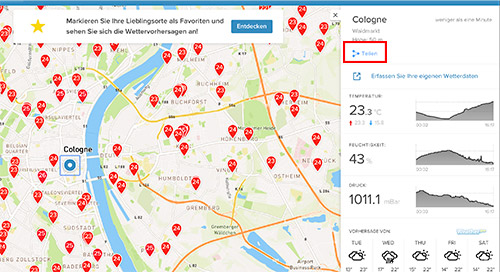
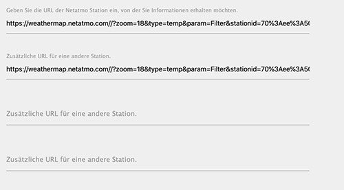

# IoBroker.netatmo-crawler
адаптер netatmo-crawler для ioBroker

=================

Сканирует информацию с общедоступных станций netatmo

Оглавление

=================

* [Инструкция] (# инструкция)
* [Общая информация] (# общая информация)
* [Влажность] (# влажность)
* [Дождь] (# дождь)
* [Давление] (# давление)
* [Температура] (# температура)
* [Ветер] (# ветер)
* [Кредиты] (# кредитов)
* [Список изменений] (# список изменений)
* [Лицензия] (# лицензия)

инструкция

===========

Чтобы найти URL-адрес предпочитаемой вами метеостанции, выполните следующие действия:

1. Откройте [Карта погоды Netatmo] (https://weathermap.netatmo.com).
2. Найдите свою станцию и щелкните значок "Поделиться".

   

3. Нажмите *скопировать ссылку*

   

4. Вставьте ссылку в настройки экземпляра адаптера

   

Главная Информация

===================

«Netatmo Crawler» анализирует много реальной местной информации рядом с вами. Что вы делаете со всей этой информацией? Вот некоторые общие факты и примеры:

Влажность -------- Netatmo использует относительную влажность, это отношение текущей абсолютной влажности к максимально возможной абсолютной влажности (которая зависит от текущей температуры воздуха). Относительная влажность 100 процентов означает, что воздух полностью насыщен водяным паром и больше не может удерживаться, что создает вероятность дождя. Это не означает, что относительная влажность должна быть 100 процентов, чтобы пошел дождь - она должна быть 100 процентов там, где формируются облака, но относительная влажность у земли может быть намного меньше.

Дождь ---- Использует миллиметры. Если вам нужна единица измерения литр на кубический метр, вы можете использовать это в любом случае. Можно использовать для полива в саду (например).

Давление -------- Воздух вокруг вас имеет вес, и он давит на все, чего касается. Это давление называется атмосферным давлением или давлением воздуха.
Что делать с этим значением? Звучит так просто: прогноз погоды! Высокое давление = хорошая погода, низкое давление = плохая погода.
Нормальное среднее значение составляет 1013 мбар.
Для «реального» прогноза погоды вам понадобится история давления за несколько часов (я использую четыре часа).
Если он падает, значит, в будущем будет плохая погода, если он поднимется, то должна быть хорошая погода.
Я нашел [скрипт для прогноза здесь](http://www.beteljuice.co.uk/zambretti/forecast.html) (он называется методом Замбретти для прогноза 90%).
Другие единицы: 1 мбар = 100 Па = 1 гПа

Температура ----------- Здесь вы можете рассчитать уровень температуры холода. Для низких температур (10 °C или ниже, рассчитывается с учетом ветра), для высоких температур можно использовать индекс тепла (25 ° C или выше, рассчитывать с учетом влажности).
пример сценария:

```
windchill1 = windchill(temp, windkmh); //Vars to-from IOBroker

function windchill(temperature, windspeed) {
	var windchill = 13.12 + 0.6215 * temperature - 11.37 * Math.pow(windspeed, 0.16) + 0.3965 *
			temperature * Math.pow(windspeed, 0.16);
	return windchill;
}

heatindex1 = heatindex(temp, hum); //Vars to-from IOBroker

function heat(temperature, humidity) {
	var heatindex = -8.784695 + 1.61139411 * temperature + 2.338549 * humidity - 0.14611605 *
			temperature * humidity - 0.012308094 * (temperature * temperature) -
			0.016424828 * (humidity * humidity) + 0.002211732* (temperature *
			temperature) * humidity + 0.00072546 * temperature * (humidity * humidity)
			- 0.000003582 * (temperature * temperature) * (humidity * humidity);
	return heatindex;
}
```

Ветер - скорость ветра - это мера движения воздуха от высокого к низкому давлению, обычно из-за изменений температуры.
Сила порыва ветра - это наивысшее значение ветра, измеренное за короткий промежуток времени (около трех секунд).
Вам следует сделать сценарий для вашего навеса или для метода Замбретти (см. Выше).

кредиты

=======

Большое спасибо [девочка-подросток](https://github.com/backfisch88) за идею и поддержку!

## Changelog


### 0.3.4
* (Bart19) optimizes error handling
### 0.3.3
* (Bart19) changes some log level
* (Backfisch) adds more documentation
### 0.3.2
* (Bart19) fixes, that rain_yesterday was saved with value rain_today
### 0.3.1
* (Bart19) optimizes error handling
### 0.3.0
* (Bart19) adds timestamps, when last info retrieved from Netatmo and timestamp, when each measure was updated last. In addition, rain_yesterday added
### 0.2.0
* (Bart19) changes admin view. Now you can enter as many station urls as you want. In addition, you can select, how the data should be stored
### 0.1.2
* (Bart19) fix for station4 and introduces allowInit, so adapter will run once on config edits
### 0.1.1
* (Bart19) removes files from archive which are unnecessary
### 0.1.0
* (Bart19) implements automatic tests
### 0.0.8
* (Bart19) updates logo
### 0.0.7
* (Bart19) changes loglevel
### 0.0.6
* (Bart19) updates description
### 0.0.5
* (Bart19) bugfixes
### 0.0.4
* (Bart19) bugfixes
### 0.0.3
* (Bart19) bugfixes
### 0.0.2
* (Bart19) bugfixes
### 0.0.1
* (Bart19) initial release

## License

MIT License

Copyright (c) 2020 Bart19 <webmaster@bart19.de>

Permission is hereby granted, free of charge, to any person obtaining a copy
of this software and associated documentation files (the "Software"), to deal
in the Software without restriction, including without limitation the rights
to use, copy, modify, merge, publish, distribute, sublicense, and/or sell
copies of the Software, and to permit persons to whom the Software is
furnished to do so, subject to the following conditions:

The above copyright notice and this permission notice shall be included in all
copies or substantial portions of the Software.

THE SOFTWARE IS PROVIDED "AS IS", WITHOUT WARRANTY OF ANY KIND, EXPRESS OR
IMPLIED, INCLUDING BUT NOT LIMITED TO THE WARRANTIES OF MERCHANTABILITY,
FITNESS FOR A PARTICULAR PURPOSE AND NONINFRINGEMENT. IN NO EVENT SHALL THE
AUTHORS OR COPYRIGHT HOLDERS BE LIABLE FOR ANY CLAIM, DAMAGES OR OTHER
LIABILITY, WHETHER IN AN ACTION OF CONTRACT, TORT OR OTHERWISE, ARISING FROM,
OUT OF OR IN CONNECTION WITH THE SOFTWARE OR THE USE OR OTHER DEALINGS IN THE
SOFTWARE.