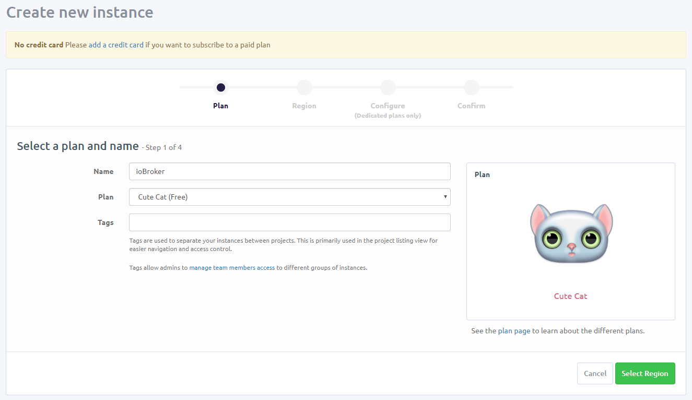
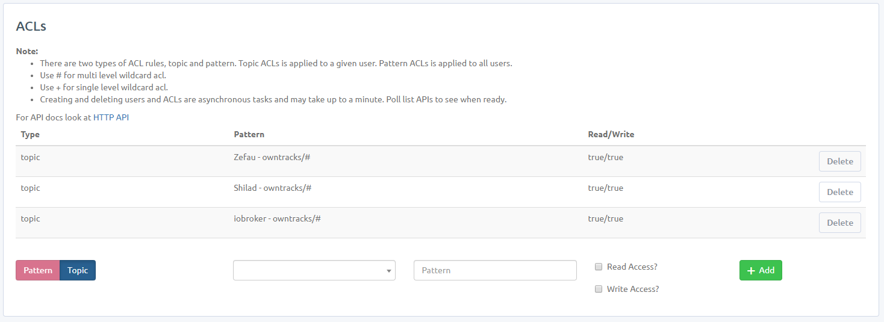
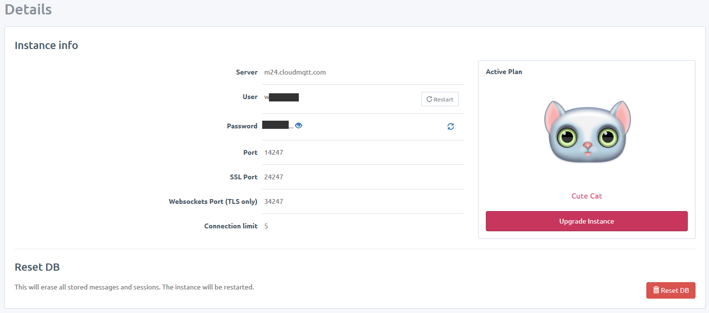

# IoBroker.owntracks [OwnTracks] (https://owntracks.org/) позволяет вам отслеживать ваше собственное местоположение. Вы можете создать свой личный дневник или поделиться им с семьей и друзьями. OwnTracks имеет открытый исходный код и использует открытые протоколы для связи, поэтому вы можете быть уверены, что ваши данные остаются безопасными и конфиденциальными. Соответствующие приложения для смартфонов можно найти в [Apple App Store (iOS)] (https://itunes.apple.com/us/app/mqttitude/id692424691?mt=8) или в [Google Play Store (Android)](https://play.google.com/store/apps/details?id=org.owntracks.android).
**Оглавление**

1. [Особенности] (# 1-функции)
2. [Инструкции по настройке] (# 2-инструкции по настройке)
   1. [используя MQTT-сервер] (# 21-connection-configuration-using-mqtt-server)
   2. [используя клиент MQTT] (# 22-connection-configuration-using-mqtt-client)
   3. [дополнительная конфигурация] (# 23-Additional-configuration-using-либо-mqtt-сервер-или-клиент)
3. [Каналы и состояния] (# 3-каналы - состояния)
   1. [Места] (# 31-мест)
   2. [Пользователи] (# 32-пользователи)
4. [Список изменений] (# список изменений)
5. [Лицензия] (# лицензия)

## 1. Особенности
TBD

## 2. Инструкция по настройке
Вы должны настроить ioBroker.owntracks в связи с [MQTT адаптер](https://github.com/ioBroker/ioBroker.mqtt), который будет установлен как зависимость. Адаптеры MQTT могут быть настроены как сервер MQTT или как клиент MQTT.

В следующих таблицах показано сравнение:

| Метод | Преимущества / Недостатки |
| ------ | ------------- |
| MQTT сервер | ![# c5f015] (https://placehold.it/15/c5f015/000000?text=+) возможна полностью зашифрованная полезная нагрузка <br> ! [# f03c15] (https://placehold.it/15/f03c15/000000?text=+) настройка [динамика DNS (DynDNS)] (https://en.wikipedia.org/wiki/Dynamic_DNS) обязательна <br> ! [# f03c15] (https://placehold.it/15/f03c15/000000?text=+) открыть порт в конфигурации маршрутизатора, необходимой для связи ([подробнее здесь)](https://owntracks.org/booklet/guide/broker/#firewall)) |
| MQTT клиент | ! [# c5f015] (https://placehold.it/15/c5f015/000000?text=+) возможно полное шифрование полезной нагрузки <br> ! [# f03c15] (https://placehold.it/15/f03c15/000000?text=+) использование MQTT в Интернете означает, что весь трафик направляется через неизвестного поставщика ([подробнее здесь] (https:// owntracks) .org / брошюра / гид / сценарии / # MQTT-режим)) <br> ! [# f03c15] (https://placehold.it/15/f03c15/000000?text=+) поддержка TLS возможна, только если она доступна у соответствующего поставщика |

** ВАЖНОЕ ПРИМЕЧАНИЕ: ** Состояния в ioBroker.owntracks будут генерироваться при получении конкретной полезной нагрузки! Это означает, что местоположения в ioBroker будут сгенерированы ** в первый раз, когда пользователь покидает или вводит местоположение **.
Ниже вы увидите целевую структуру ([см Каналы и Штаты для подробного списка](#channels--states)):

[![Структура] (IMG / structure.png)](../../../en/adapterref/iobroker.owntracks/img/structure.png)

### 2.1. Конфигурация соединения (с использованием MQTT-сервера)
Чтобы настроить ioBroker.owntracks через сервер MQTT, необходимо выполнить следующие шаги:

1. Установите DynDNS, указывающий на ваш IP-адрес, а также откройте порт в вашем маршрутизаторе.
2. Настройте адаптер MQTT как сервер с соответствующим портом
3. Настройте все клиенты с настройками сервера

#### 2.1.1. Настройка DynDNS и порта
При настройке локального сервера MQTT в ioBroker необходимо настроить динамический DNS (DynDNS), который всегда указывает на ваш текущий IP-адрес, а также открыть порт в маршрутизаторе для связи.

Таким образом, настройте DynDNS по вашему выбору, который указывает на ваш IP-адрес, например https://www.noip.com/.
Зарегистрируйтесь, чтобы создать учетную запись и выбрать имя хоста по вашему выбору, например, `example.ddns.net`. Помните, что срок действия этих имен хостов в бесплатной учетной записи истекает через 30 дней, а это значит, что для их активации необходимо регулярно входить в систему.

После настройки DynDNS настройте маршрутизатор для обновления DynDNS соответственно.
Если у вас есть ящик FRITZ!, Перейдите к `Internet` - `Freigaben` - `DynDNS` и настройте его в соответствии с вашими учетными данными:

[![MQTT Server - настройка маршрутизатора DynDNS] (img / mqtt_server_router_dyndns.png)](../../../en/adapterref/iobroker.owntracks/img/mqtt_server_router_dyndns.png)

Кроме того, откройте порт на вашем маршрутизаторе, который указывает на локальный IP-адрес вашего ioBroker.
Для этого перейдите к `Internet` - `Freigaben` - `Portfreigaben` и выберите `Gerät für Freigaben hinzufügen`. Выберите свой экземпляр ioBroker в поле `Gerät` и нажмите `Neue Freigabe`:

[![Сервер MQTT - настройка порта маршрутизатора] (img / mqtt_server_router_adddevice.png)](../../../en/adapterref/iobroker.owntracks/img/mqtt_server_router_adddevice.png)

Во всплывающем окне выберите `Portfreigabe`, а затем

- выберите «Andere Anwendung»,
- введите любое имя в поле `Bezeichnung`,
- выберите `TCP` в качестве протокола,
- введите желаемый порт во все поля `port` (например, 1987).

[![MQTT Server - настройка порта маршрутизатора] (img / mqtt_server_router_port.png)](../../../en/adapterref/iobroker.owntracks/img/mqtt_server_router_port.png)

Сохраните все, и вы сделали с этим шагом.

#### 2.1.2. Настроить MQTT и адаптер Owntracks
Теперь перейдите в ioBroker и создайте новый экземпляр адаптера MQTT.
В качестве типа выберите `Server/Broker` и введите порт, выбранный выше, который был открыт в конфигурации вашего маршрутизатора (например, 1987).

[![Настройка соединения с сервером MQTT] (img / mqtt_server_connection.png)](../../../en/adapterref/iobroker.owntracks/img/mqtt_server_connection.png)

Выберите любой `User` и `Password` на ваш выбор в разделе `Authentication settings`. Это необходимо для следующего шага.

Перейдите на вкладку _MQTT SETTINGS_ в ioBroker.mqtt и измените следующие настройки:

| Установка | Конфигурация | Примечание |
| ------- | ------------- | ---- |
| Префикс для всех тем | _leave empty_ | |
| Маска для публикации собственных государств | mqtt.0. * | Замените 0 на ваш экземпляр ioBroker.mqtt |
| Публиковать только при изменении | `yes` | |
| Публикация состояний по подписке | `yes` | |
| Вывод трассировки для каждого сообщения | `no` | |
| Отправлять состояния (ack = true) тоже | `no` | |
| Используйте разные названия тем для set и get | `no` | |
| Используйте разные названия тем для set и get | `нет` | |

Наконец, выберите настроенный экземпляр MQTT в адаптере ioBroker.owntracks и, при желании (но настоятельно рекомендуется __), установите ключ шифрования на ваш выбор:

[![Настройки адаптера Owntracks] (img / owntracks_server_settings.png)](../../../en/adapterref/iobroker.owntracks/img/owntracks_server_settings.png)

#### 2.1.3. Настройте всех клиентов
Следующие параметры должны быть установлены в приложении Android / iOS:

| Настройка Android | Конфигурация |
| ------- | ------------- |
| Соединение / Режим | `MQTT private` |
| Соединение / Хост / Порт | Порт, который вы выбрали (например, `1987`) |
| Соединение / Хост / WebSockets | `false` (если вы не знаете, что делаете) |
| Связь / Идентификация / Имя пользователя | `User`, который вы выбрали на предыдущем шаге |
| Соединение / Идентификация / Пароль | `Password`, который вы выбрали на предыдущем шаге |
| Соединение / Идентификация / Пароль | «Пароль», который вы выбрали на предыдущем шаге |
| Соединение / Идентификация / DeviceID | Имя устройства или человека (может быть любым) |
| Связь / Безопасность / TLS | `off` |
| Связь / Безопасность / TLS | `off` |
| Дополнительно / Ключ шифрования | __Очень рекомендуется__: Фраза-пароль для шифрования (выбрана на предыдущем шаге) |

Наконец, проверьте, подключен ли Owntracks к экземпляру ioBroker через запись «Status» в ящике:


Если все настроено успешно, ioBroker.owntracks создаст каналы и состояния, найденные ниже.

### 2.2. Конфигурация соединения (с использованием клиента MQTT)
Чтобы настроить ioBroker.owntracks через клиент MQTT, необходимо выполнить следующие шаги:

1. Настройте внешний сервер MQTT, размещенный в сети, например, [CloudMQTT] (https://www.cloudmqtt.com/)
2. Настройте MQTT Cloud Broker и настройте / аутентифицируйте клиентов
3. Настройте адаптер MQTT в качестве клиента с соответствующими настройками (URL, Порт и Аутентификация ioBroker).
4. Настройте все клиенты с настройками сервера

#### 2.2.1. Настройка внешнего сервера MQTT
Перейдите к [https://www.cloudmqtt.com/](https://www.cloudmqtt.com/) и зарегистрируйтесь с новой учетной записью.
Создайте новый экземпляр, выберите план (бесплатный план с именем _Cute Cat_ работает отлично) и назовите его _ioBroker_:



Перейдите к следующему шагу, нажав _Выберите регион_ и выберите центр обработки данных рядом с вами, например, _EU-West-1 (Ирландия) _:


Проверьте свои настройки, нажав _Review_ и, наконец, _Create Instance_.

#### 2.2.2. Настройка MQTT Cloud Broker
После создания экземпляра перейдите к _SETTINGS_ и установите для `Use username as clientid` значение `Yes`:


__Самое важное__, перейдите в _USERS & ACL_ и добавьте нужных пользователей для клиентов, которые вы используете (например, смартфоны), и, кроме того, добавьте конкретного пользователя для вашего ioBroker:


Наконец, добавьте необходимые _ACL_ для соответствующих пользователей далее на той же странице. Сделать это

1. выберите тему
2. выберите пользователя
3. введите шаблон `owntracks / #`
4. выберите оба `read` и` write`

Ваш результат должен выглядеть так:



Вы успешно настроили CloudMQTT, вы будете получать сообщения, которые можно просмотреть через _WEBSOCKET UI_.

#### 2.2.3. Настроить адаптер MQTT
Для этого шага вы найдете необходимую информацию в разделе _DETAILS_ CloudMQTT:



После настройки вашего MQTT Cloud Broker перейдите в ioBroker и настройте экземпляр MQTT.
В следующих таблицах показано сопоставление страницы сведений о CloudMQTT с вашей конфигурацией ioBroker.mqtt:

| Настройка CloudMQTT | Конфигурация ioBroker.MQTT | Пример |
| ----------------- | --------------------------- | ------- |
| Сервер | URL | `m24.cloudmqtt.com` |
| - | Безопасный | `yes` |
| - | Безопасный | `да` |

Для _Authentication settings_ вы можете использовать любого пользователя, который был авторизован в CloudMQTT через _ACL_ (см. Выше).
Перейдите на вкладку _MQTT SETTINGS_ в ioBroker.mqtt и измените следующие настройки:

| Установка | Конфигурация | Примечание |
| ------- | ------------- | ---- |
| Шаблоны подписки | `#` | |
| Префикс для всех тем | _leave empty_ | |
| Публиковать только при изменении | `yes` | |
| Публикуйте свои штаты по подключению | `yes` | |
| Вывод трассировки для каждого сообщения | `no` | |
| Отправлять состояния (ack = true) тоже | `no` | |
| Используйте разные названия тем для set и get | `no` | |
| Идентификатор клиента | `iobroker` | __Этот пользователь должен быть авторизован через _ACL_ в CloudMQTT__ |
| Публиковать только при изменении | `yes` |
| Публиковать только при изменении | `да` |

Наконец, перейдите к вашему экземпляру ioBroker.owntracks и выберите настроенный экземпляр MQTT.

Наконец, выберите настроенный экземпляр MQTT в адаптере ioBroker.owntracks и, при желании (но настоятельно рекомендуется __), установите ключ шифрования на ваш выбор:

[![Настройки адаптера Owntracks] (img / owntracks_client_settings.png)](../../../en/adapterref/iobroker.owntracks/img/owntracks_client_settings.png)

#### 2.2.4. Настройте всех клиентов
Следующие параметры должны быть установлены в приложении Android / iOS:

| Настройка Android | Конфигурация |
| ------- | ------------- |
| Соединение / Режим | `MQTT private` |
| Соединение / Хост / Порт | Порт CloudMQTT Sevrer (например, `24247`) |
| Соединение / Хост / WebSockets | `false` |
| Связь / Идентификация / Имя пользователя | A `User`, который был настроен с помощью _ACL_ на шаге 2 (см. Выше) |
| Соединение / Идентификация / Пароль | Соответствующий `Password` этого пользователя |
| Соединение / Идентификация / Пароль | Соответствующий `Пароль` этого пользователя |
| Соединение / Идентификация / DeviceID | Имя устройства или человека (может быть любым) |
| Связь / Безопасность / TLS | `off` (если у вас нет платного плана) |
| Связь / Безопасность / TLS | `off` (если у вас нет платного плана) |
| Дополнительно / Ключ шифрования | __Очень рекомендуется__: Фраза-пароль для шифрования (выбрана на предыдущем шаге) |

Наконец, проверьте, подключен ли Owntracks к экземпляру ioBroker через запись «Status» в ящике:


Если все настроено успешно, ioBroker.owntracks создаст каналы и состояния, найденные ниже.

### 2.3. Дополнительная настройка (с использованием MQTT-сервера или клиента)
#### 2.3.1 Настройка аватара (в адаптере ioBroker.owntracks)
Вы можете определить для каждого пользователя иконку. Просто загрузите за перетаскивание или щелкнув мышью изображение Он будет автоматически масштабирован до 64x64.
__Имя должно совпадать с DeviceID в приложении OwnTracks .__

#### 2.3.2 Конфигурация регионов
Чтобы настроить местоположения в адаптере owntracks, вам нужно создать регионы в приложении owntracks для Android / iOS.
Для этого перейдите в «Регионы» в ящике


Создайте новый регион, нажав на плюс (+) в правом верхнем углу


Используйте кнопку местоположения в верхнем правом углу, чтобы получить текущее местоположение или введите их в широте и долготе самостоятельно. Кроме того, укажите радиус для местоположения. Если вы поделитесь местоположением, ваши Друзья (см. В ящике приложения Android / iOS) получат уведомление, когда вы вводите / покидаете местоположение.


## 3. Каналы и состояния
Если вы успешно настроили ioBroker.owntracks, следующие каналы и состояния будут созданы **после получения соответствующей полезной нагрузки**

### 3.1. Места
Для каждого местоположения в пределах `locations.<locationId>`

| Государство | Описание (возможные значения) |
|:----- |:----------------------------- |
| ```accuracy``` | Точность географических координат местоположения |
| ```creationDatetime``` | Дата-Время создания местоположения |
| ```history``` | История пользователей вход / выход из местоположения |
| ```locationId``` | Местоположение ID местоположения |
| ```locationName``` | Местоположение название местоположения |
| ```presence``` | Указывает, присутствует ли какой-либо пользователь в местоположении [```true``` или ```false```] |
| ```refreshed``` | Отметка времени последнего изменения в пределах местоположения |
| ```refreshedDatetime``` | Дата-Время последнего изменения в пределах местоположения |
| ```users``` | Представить пользователей в локации |
| `` `users``` | Представить пользователей в локации |

### 3.2. пользователей
Для каждого пользователя в пределах `locations.<userId>`

| Канал | Государство | Описание (возможные значения) |
|:------- |:----- |:----------------------------- |
| ```location``` | ```current``` | Текущее местоположение пользователя |
| ```location``` | ```enteredDatetime``` | Дата-время, когда пользователь ввел текущее местоположение |
| ```location``` | ```history``` | История входа пользователя / выхода из локаций |
| ```location``` | ```last``` | Последнее местонахождение пользователя |
| ```location``` | ```left``` | Отметка времени, которую пользователь оставил в последнем месте |
| ```location``` | ```leftDatetime``` | Дата-Время, когда пользователь покинул последнее место |
| - | ```accuracy``` | Точность Широты / Долготы |
| - | ```alt_accuracy``` | Точность высоты |
| - | ```altitude``` | Высота над уровнем моря |
| - | ```battery``` | Уровень заряда устройства для пользователя |
| - | ```connection``` | Тип подключения пользователя <br> - ```w```: телефон подключен к WiFi-соединению <br> - ```o```: телефон не в сети <br> - ```m```: мобильные данные |
| - | ```encryption``` | Статус шифрования для пользователя [```true``` или ```false```] |
| - | ```latitude``` | Широта |
| - | ```longitude``` | Долгота |
| - | ```refreshed``` | Отметка времени последнего обновления |
| - | ```refreshedDatetime``` | Дата-Время последнего обновления |
| - | ```userConnected``` | Состояние соединения пользователя [```true``` или ```false```] |
| - | ```userId``` | Идентификатор пользователя |
| - | ```userName``` | Имя пользователя пользователя |
| - | ```userTid``` | Трекер ID пользователя |
| - | ```velocity``` | Скорость для пользователя |
| - | `` `скорость``` | Скорость для пользователя |

## Changelog

### 1.0.0-beta.3 (2019-05-XX) [IN DEVELOPMENT]
- (zefau) FEATURE: Regions can now be maintained through ioBroker and published / received from all connected clients
   - (zefau) FEATURE: added possibilty to publish all regions / waypoints from Android / iOS to ioBroker
   - (zefau) FEATURE: added possibilty to publish regions / waypoints from ioBroker to all conneced clients

### 1.0.0-beta.2 (2019-05-14)
- (zefau) BUG: fixed issue with deeply nested history on both locations and users
- (zefau) BUG: fixed issue with transition event being reported multiple times

### 1.0.0-beta.1 (2019-05-01)
Refactored entire code and removed all MQTT package dependencies (to avoid / fix security issues and reduce complexity). Thus, added [MQTT adapter as dependency](https://github.com/ioBroker/ioBroker.mqtt) to manage all MQTT communication.
This major change comes with the following advantages:
- use both MQTT server as well as MQTT client (to use Internet MQTT server, such as [CloudMQTT](https://www.cloudmqtt.com/)) functionality (this adapter subscribes to foreign states of MQTT adapter)
- user avatars available in both server and client variant
- support TLS and websockets

## License
The MIT License (MIT)

Copyright (c) 2019 Zefau <zefau@mailbox.org>

Copyright (c) 2016-2019 bluefox <dogafox@gmail.com>

Permission is hereby granted, free of charge, to any person obtaining a copy
of this software and associated documentation files (the "Software"), to deal
in the Software without restriction, including without limitation the rights
to use, copy, modify, merge, publish, distribute, sublicense, and/or sell
copies of the Software, and to permit persons to whom the Software is
furnished to do so, subject to the following conditions:

The above copyright notice and this permission notice shall be included in
all copies or substantial portions of the Software.

THE SOFTWARE IS PROVIDED "AS IS", WITHOUT WARRANTY OF ANY KIND, EXPRESS OR
IMPLIED, INCLUDING BUT NOT LIMITED TO THE WARRANTIES OF MERCHANTABILITY,
FITNESS FOR A PARTICULAR PURPOSE AND NONINFRINGEMENT. IN NO EVENT SHALL THE
AUTHORS OR COPYRIGHT HOLDERS BE LIABLE FOR ANY CLAIM, DAMAGES OR OTHER
LIABILITY, WHETHER IN AN ACTION OF CONTRACT, TORT OR OTHERWISE, ARISING FROM,
OUT OF OR IN CONNECTION WITH THE SOFTWARE OR THE USE OR OTHER DEALINGS IN
THE SOFTWARE.