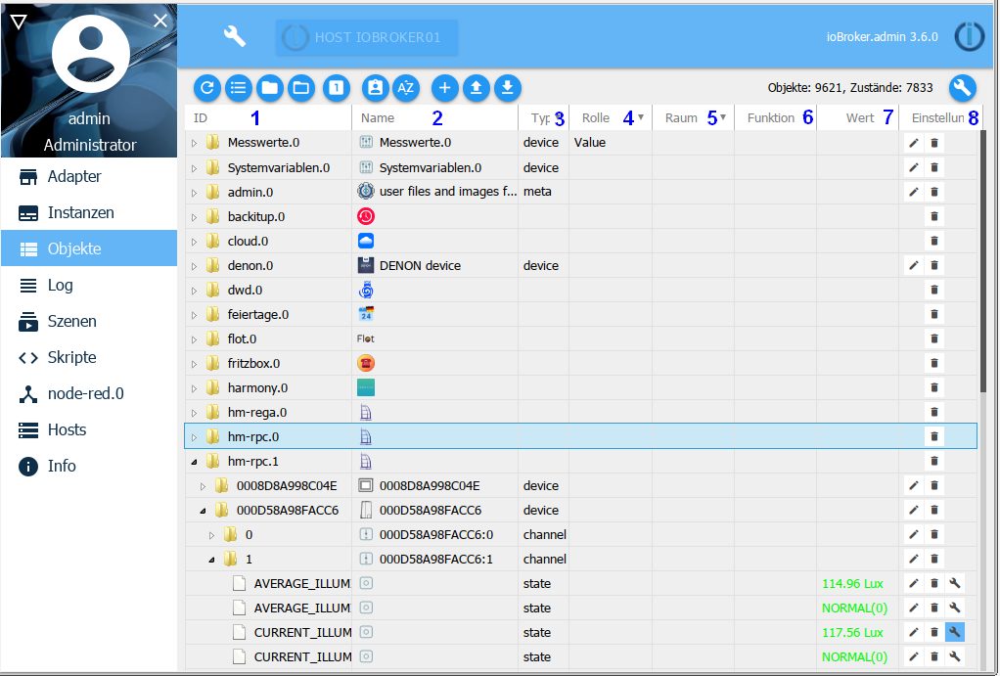
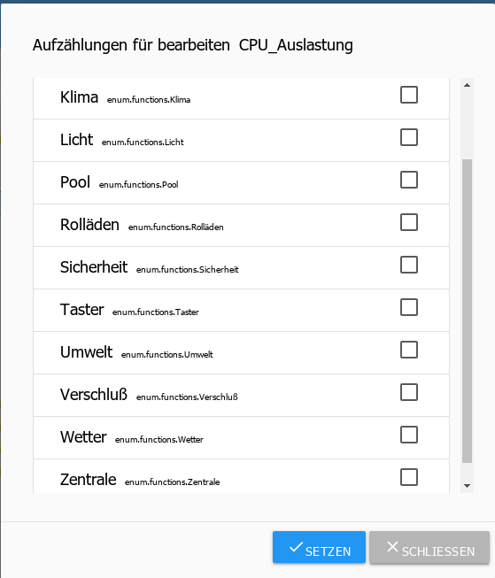

Все управляемые объекты находятся под этой вкладкой. Для каждого экземпляра создается папка, в которой созданные ею точки данных расположены в иерархической структуре. Здесь также можно создавать и удалять объекты вручную. Можно выгружать или скачивать целые структуры объектов. Другая кнопка позволяет отображать экспертное представление.

## Строка заголовка
В строке заголовка есть значки наиболее важных процессов. Для каждого значка есть контекстная справка. Для этого просто удерживайте некоторое время мышкой на значке.

### 1 - Обновить вид
Если только что созданные объекты не видны, щелчок по этому значку поможет обновить статус страницы.

### 2 - изменить отображение
Эта кнопка изменяет отображение объектов на этой странице.

Когда кнопка активна, все объекты сортируются в алфавитном порядке по идентификатору и перечисляются один под другим. Если эта кнопка не активна, объекты отображаются в иерархическом алфавитном порядке в соответствии с экземплярами в виде древовидной структуры.

В обоих случаях вверху показаны самостоятельно созданные пространства имен.

> Внимание! Смена взглядов может занять много времени

Следующие два значка также отображаются в древовидной структуре.

### 3 - Закройте все предметные области
### 4 - развернуть все предметные области
С помощью этих двух кнопок можно открыть или закрыть всю древовидную структуру.
быть закрытым.

### 5 - просмотр статуса
Эта кнопка отображает дополнительную информацию о соответствующих состояниях точек данных. (Переключить режим)

Здесь со свернутой строкой меню

> Внимание: из-за огромного потока данных дисплей может зависнуть при использовании этого вида> в виде списка.

### 6 - Режим администратора
При выборе этого значка отображаются другие объекты (функция переключения).

Эти объекты (и их каталоги) являются системными объектами и не должны использоваться для нормального использования, поскольку изменение / обновление со стороны администратора может привести к структурным изменениям и, следовательно, к потере личных данных.

### 7 - Сортировать по алфавиту
Это используется для сортировки в папке либо по идентификатору, либо по имени.

### 8 - Добавить
После выбора этого значка можно добавлять другие объекты.
Если папка выбрана, она принимается в качестве родительской в структуре объекта. Откроется окно конфигурации:

Здесь необходимо выбрать имя для нового объекта, при этом устройство, канал или точка данных будут доступны в качестве типа в соответствии с иерархической структурой. Логическое значение, переключатель, строка символов, число, список значений, поле, объект и смешанные доступны как типы точек данных.

Как только вы подтвердите окно ввода с помощью ok, откроется другое окно:

Некоторые данные все еще можно ввести сюда. К объекту можно добавить роль и значок.

Остальные вкладки содержат дополнительные свойства объекта. Такая информация доступна по каждому объекту.

Чтобы создать полностью новое пространство имен, необходимо соблюдать две вещи:

* Ни один объект не может быть выбран. Этого можно добиться, используя

Откроется вкладка «Новые объекты».

* Верхний элемент должен заканчиваться точкой и числом (например, MyNamespace.0).

Затем там могут быть созданы следующие уровни.

### 9 - загрузить
С помощью этой кнопки полная структура объекта загружается на сервер ioBroker в виде файла json.

### 10 - скачать
С помощью этой кнопки выбранная структура объекта загружается в виде файла json с сервера ioBroker и может быть сохранена.

## Содержание страницы

Существующие объекты отображаются в таблице на странице.

Таблица состоит из следующих столбцов (поля под заголовками столбцов 1 и 2, а также раскрывающиеся меню других столбцов служат критериями фильтрации). Таблица на картинке организована в соответствии с иерархией, и были открыты некоторые подпункты (узлы):

### 1 - ID
Это верхние уровни иерархии объектов. Здесь, например, имя экземпляра и соответствующая структура данных создаются как верхний уровень.

### 2 - имя
В этом столбце указано название объекта. Кроме того, предыдущий значок показывает, какой уровень иерархии здесь задействован (устройство, канал или точка данных).

Значения в этом столбце можно редактировать.

### 3 - тип
Тип на уровне иерархии, который уже был виден в столбце «Имя» на предыдущем значке, здесь снова явно упоминается. Выпадающее меню в заголовке столбца можно использовать для фильтрации этих типов и, например, для отображения только всех точек данных.

### 4 - роль
Роль определяет, как пользовательские интерфейсы, такие как .vis и material, должны обрабатывать эту точку данных. Это в основном функция этого объекта, кратко описываемая с помощью термина. Затем вы можете снова отфильтровать.

Значения в этом столбце можно редактировать. При нажатии на поле появляется раскрывающееся меню с большим количеством записей, но возможны и бесплатные записи.

### 5 - комната
Если этот объект уже был назначен комнате, он отображается здесь.
Это также служит, помимо прочего, для фильтрации при поиске объектов.

Значения в этом столбце можно редактировать. Таким образом, объекты могут быть назначены комнатам позже. Если вы нажмете на поле, откроется всплывающее окно с комнатами, которые были созданы на данный момент.

### 6 - функция
Этот столбец содержит сделку, которой назначен соответствующий объект.

Значения в этом столбце можно редактировать. Таким образом, объекты могут быть назначены сделкам позднее. Если вы нажмете на поле, откроется всплывающее окно с сделками, созданными на данный момент.

### 7 - значение
Если объект является точкой данных, здесь отображается текущее значение этой точки данных.

### 8 - настройки

1.) При нажатии на значок карандаша открывается окно со свойствами этого объекта. Это то же самое окно, которое появилось выше при создании нового объекта. Здесь можно изменить свойства объекта. Эту функцию следует использовать с особой осторожностью и только в том случае, если вы точно знаете, что с ней делаете.

2.) Щелчок по значку корзины удаляет этот объект и все объекты под ним в иерархии. На всякий случай появится окно, в котором необходимо снова подтвердить удаление.

3.) Значок гаечного ключа появляется только в том случае, если установлен хотя бы один экземпляр истории (History, InfluxDB или SQL). Здесь можно настроить точку данных для регистрации исторических данных.
Дополнительную информацию можно найти в описании адаптера истории.

Это действие можно выполнить одновременно для всех точек данных, соответствующих текущим критериям фильтра, с помощью гаечного ключа в строке заголовка. Поэтому важно тщательно проверить, выбраны ли критерии фильтрации на этой странице, чтобы были включены только желаемые точки данных.

Выпадающее меню для фильтрации этого столбца относится к точкам данных с зарегистрированными данными. С, без и все, а также установленные экземпляры истории доступны здесь.