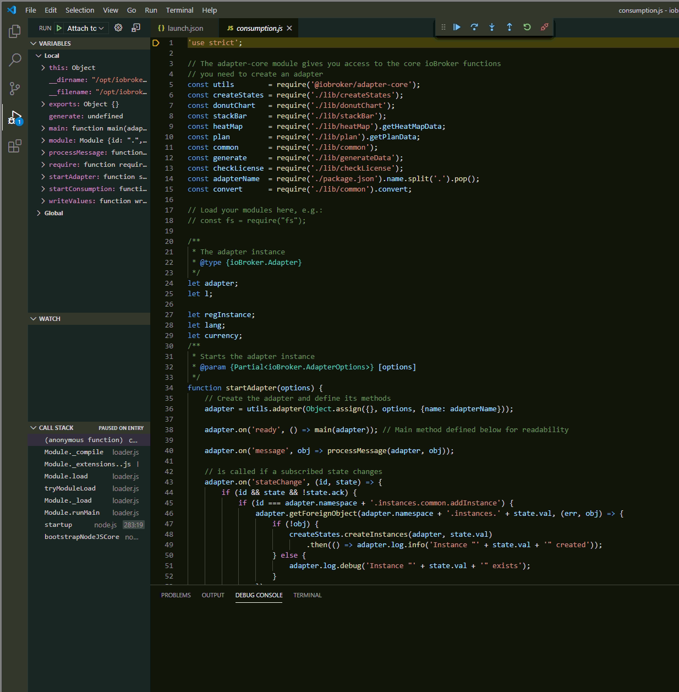

# Отладка адаптеров
Адаптер отладки с Chrome
Node.JS поддерживает отладку с помощью Chrome.

Если вы остановите адаптер в ioBroker, а затем запустите его из консоли:

```
cd /opt/iobroker
iobroker stop sayit
node --inspect node_modules/iobroker.sayit/main.js --debug
```

Важным является `-–inspect`

Тогда что-то вроде этого выводится:

```
Debugger listening on port 9229.
Warning: This is an experimental feature and could change at any time.
To start debugging, open the following URL in Chrome:
    chrome-devtools://devtools/remote/serve_file/@60cd6e859b9f557d2312f5bf532f6aec5f284980/inspector.html?experiments=true&v8only=true&ws=127.0.0.1:9229/9415dda6-0825-40ed-855c-83c6142e56e9
2016-12-27 15:23:02.637  - error: sayit.0 adapter disabled
starting. Version 1.3.1 in /opt/iobroker/node_modules/iobroker.sayit, node: v6.9.2
2016-12-27 15:23:02.647  - info: sayit.0 starting. Version 1.3.1 in /opt/iobroker/node_modules/iobroker.sayit, node: v6.9.2
Debugger attached.
```

Затем вы можете выполнить отладку в Chrome, если введете выходную ссылку в Chrome:


*Протестировано: Windows, Chrome 55, node.js 6.9.2*

### Удаленная отладка с помощью Chrome
Если iobroker не работает на том же компьютере, что и Chrome, то команда основана на приведенном выше примере:

```
node --inspect-brk=0.0.0.0:9229 node_modules/iobroker.sayit/main.js --debug
```

параметр `--inspect-brk` обеспечивает сравнение с вышеупомянутым,

точка останова устанавливается в первой строке вашего адаптера прямо в начале отладчика.

Если вы не всегда хотите копировать ссылку, чтобы запустить отладку по отдельности, вы также можете перейти на следующую страницу в Chrome:

```
chrome://inspect
```

затем введите IP-адрес и порт вашего компьютера **ioBroker** только один раз с помощью команды configure, как с помощью команды inspect.

Сеанс отладки отображается там после запуска команды и может быть запущен одним щелчком мыши.

Варианты отладки Chrome просто фантастические.
У вас есть все опции, которые вы также знаете из **веб-отладки** точки останова, также с условиями, наблюдением, стеком вызовов, проверкой области, выводом на консоль и т. Д.

Картинки и английское описание находится в [здесь](https://software.intel.com/en-us/xdk/articles/using-chrome-devtools-to-debug-your-remote-iot-nodejs-application)

Если он еще не установлен, на компьютере iobroker все еще требуется инспектор узлов:

```
npm install -g node-inspector
```

## Отладка с помощью WebStorm
## Отладка с помощью `Visual Studio Code`
Если вы откроете каталог с помощью `VS Code`, то после открытия каталога адаптера (меню `File=>Open folder...`) вы сможете отладить адаптер.

Конфигурация в файле `.vscode/launch.js` должна выглядеть следующим образом:

```
{
    "version": "0.2.0",
    "configurations": [
        {
            "type": "node",
            "request": "launch",
            "name": "Launch Program",
            "program": "${workspaceFolder}\\main.js",
            "args": ["--debug"]
        },
        {
            "name": "Attach to Process",
            "type": "node",
            "request": "attach",
            "address": "IO_BROKER_IP_ADDRESS",
            "port": 9229
          }
    ]
}
```

### Локальная отладка
После остановки адаптера (`iobroker stop ADAPTER_NAME`) можно запустить адаптер в коде VS: 

После выбора `Launch Program` и нажатия кнопки `Play` адаптер запускается, и вы можете выполнять локальную отладку.

### Удаленная отладка
Для этого вам следует запустить адаптер на сервере ioBroker.

```
d /opt/iobroker
obroker stop ADAPTERNAME
ode --inspect-brk=0.0.0.0:9229 node_modules/iobroker.ADAPTERNAME/main.js --debug
```

Затем вы можете подключить §SSSSS_0§§ к процессу (§SSSSS_1§§).

