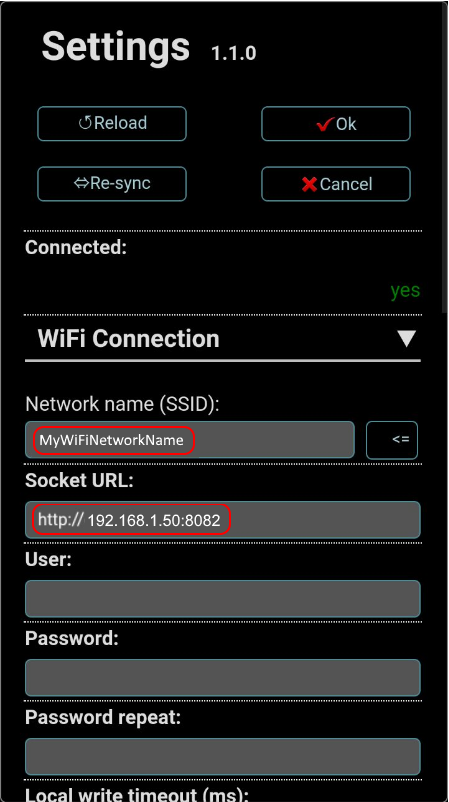

ioBroker.vis.cordova
============

WEB визуализация для платформы ioBroker как приложение для мобильных устройств.

Это приложение разработано для мобильных телефонов и планшетов и оно сохраняет все данные проекта и все картинки из проекта локально на устройстве и экономит таким образом мобильный трафик.

## Использование
Это приложение не может работать самостоятельно и требует предустановленный ioBroker с настроенными и активированными драйверами vis и web (или socket-io).
При использовании только web драйвера в связке с vis требуется активированная настройка внутреннего socket-io.
Также проект vis тоже должен существовать, например "main".

Порты и сервер ioBroker должны быть доступны с телефона и не заперты за файерволом.

Приложение можно установить с [App Store](https://play.google.com/store/apps/details?id=net.iobroker.vis&hl=ru)
После установки и первого запуска приложения должно автоматически открыться меню настроек. Что бы начать работать с приложением необходимо произвести минимальные настройки.

Что бы позднее вызвать меню настроек нужно нажать на полупрозрачную кнопку в верхнем левом углу.


## Настройки
Почти все настройки необязательны за исключением "WiFi соединения" and "Проекта".

### Кнопки
- *Обновить* - Просто загружает страницу заново, как будто в браузере нажали на кнопку "обновить".
- *Синхр.* - если vis проект изменился, то обновления **не** будут загружены с сервера автоматически. Для синхронизации данных проекта с сервером необходимо нажать кнопку *Синхр.*. Все данные и картинки (а также шрифты и аудио-файлы) будут загружены с сервера заново. Это делается для последующей экономии траффика и ускорения загрузки проекта, т.к. загрузить файл с внутренней памяти гораздо быстрее, чем с удаленного сервера.
- *Ok* - сохранить все изменения и обновить страницу. Синхронизации с сервером не происходит, ести только не поменялось имя проекта. Что бы загрузить изменения с сервера используйте кнопку *Синхр.*.
- *Отмена* - отменить все изменения и закрыть диалоговое окно настроек.

### Соединение
Приложение может с помошью имени WiFi сети распознать в какой сети находится телефон, в домашней (обычно без пароля) или нет (с паролем) и использовать разные настройки для подключения.
Обычно в домашней сети не используется защищённое соединение и пароль и наоборот за пределами домашней сети не желательно использовать соединени без пароля и без SSL.

- *Соединение* - показывает состояние соединения: есть ли связь с ioBroker сервером.
- *WIFI Имя сети (SSID)* - имя или имена (через запятую) беспроводных сетей, которые будут идентифицироватся, как домашняя сеть, что бы использовать соответствующие настройки для соединения.
- *WIFI Socket URL* - URL вида ```http://192.168.0.5:8082```. Важно иметь в начале строки http или https, таким образом приложение решает какое соединение использовть: защищенное или нет. Порт также важен. Обычно значение порта 8082 для драйвера *web* или *8084* для отдельного драйвера socketio.
- *WIFI Пользователь* - если включена аутенфикация пользователя, необходимо ввести имя пользователя с сервера iobroker. Имя пользователя должно быть предварительно создано через интерфейс администратора. Пользователь "admin" существует всегда и не может быть удалён.
- *WIFI Пароль* - пароль пользователя заданный в ioBroker
- *WIFI Повтор пароля* - повтор пароля

Следующие настройки активны только если задано имя домашней беспроводной сети и устройство находится вне домашней сети.
- *Мобильный Socket URL* - тоже самое, что *WIFI Socket URL*, только для внешней сети.
- *Мобильный Пользователь* - тоже самое, что *WIFI Пользователь*, только для внешней сети.
- *Мобильный Пароль* - тоже самое, что *WIFI Пароль*, только для внешней сети.
- *Мобильный Повтор пароля* - тоже самое, что *WIFI Повтор пароля*, только для внешней сети.

*Заметка*: Файл глобальных стилей CSS не обрабатывается. По этому, если есть настройки в CSS для конкретного проекта, необходимо скопировать эти стили в проектный CSS файл.

### Имя проекта и язык
- *Язык* - язык настроек. Поддерживаются английский, немецкий и русский языки. Для перенятия настроек нужно нажать *OK*.
- *Проект* - имя проекта с ioBroker сервера. Если имена не показываются, это охначает, что соединение с сервером отсутствует или нет ни одного проекта.

### Отображение и поведение
- *Ориенитация* - Ориентация страницы: **авто**, **горизонтальная** or **портретная**. Если выбрано **авто*, то ориентация выбирается в зависимости от положения устройства.
- *Не засыпать* - устройство не переходит в спящий режим и дисплей не гаснет если активирована эта функция. (Работает не на всех телефонах.)
- *Разрешить сдвиг окна* - позволяет изменять масштаб и передвигать страницу.
- *Полноэкранный режим* - включает полноэкранный режим на устройствах без настоящих кнопок "домой", "назад", "настройки".
- *Зум при верт. положении* - масштаб в процентах для портретной ориентации. Не устанавливайте масштаб слишком маленьким, иначе будет невозможно нажать на кнопку настроек. Значение по умолчанию 100% и нельзя выставить значение меньше 20%.
- *Зум при гор. положении* - тоже самое, что *Зум при верт. положении* только для горизонтального положения.

### Другие настройки
- *Замена URL* - если ваш vis проект содержит ссылки на изображения с локального сетевого URL, но отличного от iobroker URL, то вы можете прописать здесь этот URL и все изображения с этого сервера, которые используются в vis проекте, будут тоже загружены на мобильный телефон.
- *Идентификатор* - Уникальный ID этого VIS проекта на конкретном мобильном устройстве, если необходимо посылать команды только на этот vis проект. (Описание команд можно найти здесь [Команды интерфейса](#контрольный интерфейс))
- *Спать, если не активно* - Если vis приложение не показано (но бежит в фоне), то можно прекратить любую коммуникацию vis приложения с iobroker сервером. В этом случае изменения состояний и команды от iobroker не будут доставлены приложению, если приложение бежит в фоновом режиме.
- *Не кешировать файлы* - Не сохранять никакие конфигурационные файлы на телефоне и всё скачивать с сервера каждый раз.

### Распознавание речи
Вы можете активировать распознавание речи из приложения. Если эта функция активирована, то приложение будет постоянно пытается распознавать команды. Чтобы определить, говорите ли вы с приложением или с кем-нибудь еще, необходимо указать ключевое слово или фразу.
Выберите такое слово, которое может быть хорошо распознано и не используется в повседневном быте.

Для распознавания команд из текста используется драйвер text2command. Описание этого адаптера можно найти здесь [github](https://github.com/ioBroker/ioBroker.text2command) или на #01[http://iobroker.net].
Конечно один экземпляр драйвера text2command должен быть установлен и сконфигурирован.

*Заметка*: при распознавании обычно вся записанная речь отсылается на сервера google если не включена оффлайн распознавание. В настройках андроид можно включить оффлайн распознавание так: Настройки->Язык и клавиатура->Голосовой ввод Google->Распознавание речи офлайн, там выбрать языки и загрузить.

*Заметка*: в режиме распознавания система android воспроизводит громкий звуковой сигнал каждые 10-15 секунд. Что бы сигнала не было слышно, громкость звука выставляется на 0. При ответе голосом от или при использовании команд "tts"/"playSound" громкость будет выставлятся на предустановленную в натройках и убиратся по окончании проигрывания.

- *Распознавание речи активно* - активировать распознавание речи средством операционной системы телефона.
- *Ключевое слово* - Если в распознанном предложении будет найдено это слово (или фраза), то текст будет отправлен "text2command" для анализа. Не обязательно иметь ключевое слово в начале предложения. Вы можете пренебречь ключевым словом, но в этом случае все фразы будут отправлятся text2command для анализа.
- *Экземпляр Text2command* - номер экземпляра драйвера text2command. Обычно 0.
- *Громкость речи* - громкость для ответов голосом. Всё остальное время громкость будет установлена на 0.
- *Комната по умолчанию* - если телефон или планшет постоянно находится в одной комнате, то нет необходимости говорить "Включи свет в кабинете", если планшет находится в кабинете. Можно просто сказать "Включи свет". Что бы это было возможно, нужно задать комнату по умолчанию. Имя комнаты по умолчанию будет использоватся каждый раз, если в сообщении не найдено имя комнаты.
- *Отвечать голосом* - активирует ответы от text2command голосом. Для этого должна быть настроена TTS система на телефоне.

### Доступ к изображениям и другим ресурсам

Приложение копирует view файл выбранного проекта и все связанные
с ним изображения при синхронизации в телефон (внутренняя память).
Функция автоматического обновления отсутствует, поэтому вам самим
придется перезапустить синхронизацию вручную.

В телефон будут скопированы:

- view файлы и все остальные файлы в папке выбранного проекта с расширениями: .png .jpg .jpeg .gif
- все файлы изображений с расширением .png .jpg .jpeg .gif и файлы с расширением .wav .mp3 .bmp .svg, которые находятся в папке драйвера [iobroker data directory]/files/ и на которые ссылаются в описании view файла выбранного vis проекта. Первая часть ссылки [iobroker data directory]/files/ в  своем названии должна содержать знак &quot;.&quot; в противном случае, внутренние файлы не будут скопированы.

Чтобы приложение правильно заменило ссылки, файлы должны быть 
определены в виде абсолютной ссылки (например, /vis.0/main/img/test.png).
Относительные ссылки не поддерживаются. Если ссылки на ресурсы,
внедрены в виде HTML внутри виджетов, то тогда синтаксис должен в
точности соответствовать следующему шаблону  ```... src='/vis.0/main...'```
или ```... src ="/vis.0/main..."```. Другие обозначения не распознаются. Кроме
того, вы можете настроить URL подстановки в диалоге настроек. Этот URL
указывает на внешний URL-адрес веб-сервера VIS или другой локальный
веб-сервер. Все найденные ссылки на URL присутствуют в view файле,
который вместе с настроенным Test стартует при загрузке на устройство,
меняя URL на локальный путь при синхронизации. Обратите внимание, что
эта замена не реализована для встроенных ссылок в HTML-коде (например
```https://[your domain]/visweb```).

Замена ссылок во время выполнения, в настоящее время
ограничивается следующими виджетами:

- basic string (unescaped)
- basic string src
- basic json table

Поскольку значения передаются во время выполнения, файлы
передаются устройству только если они находятся в папке проекта или
ссылаются на другой статически настроенный виджет. Механизм загрузки
отсутствующих картинок отсутствует. Коллекции иконок, предлагаемые в
качестве отдельного драйвера ioBroker не являются частью приложения, но
также будут скопированы во время синхронизации, если изображения
определены в views.

Вы можете получить доступ к другим ресурсам в пределах
приложения, если будете использовать полные пути, начинающиеся с http:// или https://. 
Эти файлы не загружаются локально при синхронизации, но
загружаются непосредственно с соответствующего сервера через http: // или
https://, если view отображено в приложении. Если вы используете обратный
прокси-сервер с проверкой подлинности по http, то тогда учетные данные
могут быть внедрены в URL в следующей форме:

```https://[username]:[password]@[my domain]/vis.0/main/...```

Применение веб-модулей других драйверов типа VIS
Другие драйвера типа VIS также могут поставлять веб-данные. Эти
данные могут быть отображены внутри VIS view в iframe. Это особенно
актуально для драйверов Flot и Rickshaw схем.
На текущий момент внедрены в приложение только клиентские части
следующих драйверов:

- Flot
- Rickshaw

При использовании локальной версии Flot, источник iframe должен
начинаться с ```/flot/index.html?```.

Другие данные, в том числе и данные с различных серверов,
например, с веб-камер также могут быть отображены в приложении, при
условии, что используется полный URL для сервера.

### Выход из приложения

Приложение можно закрыть с помощью кнопки «Home». Но тогда в
этом случае приложение будет работать в фоновом режиме и продолжит
потреблять ресурсы памяти и аккумулятора. Опция «Sleep» в фоновом
режиме поможет уменьшить потребление. В этом случае socket.io
соединение прерывается, когда приложение неактивно.
Чтобы полностью завершить приложение необходимо трижды нажать
на кнопку «Back» в течении одной секунды. Кроме того, приложение
позволяет экстренно завершится. Для этого вам нужно вставить простую
статическую ссылку виджет в вашем view, содержащем следующую ссылку:
javascript:logout (). Здесь вы найдете такой виджет для импорта в VIS:
```
[{"tpl":"tplIconLink","data":{"visibility-cond":"==","visibility-val":1,"href":"javascript:logout ();","target":"_self","text":"","views":null,"gestures-offsetX":0,"gestures-offsetY":0,"signals-cond-0":"==","signals-val-0":true,"signals-icon-0":"/vis/signals/lowbattery.png","signals-icon-size-0":0,"signals-blink-0":false,"signals-horz-0":0,"signals-vert-0":0,"signals-hide-edit-0":false,"signals-cond-1":"==","signals-val-1":true,"signals-icon-1":"/vis/signals/lowbattery.png","signals-icon-size-1":0,"signals-blink-1":false,"signals-horz-1":0,"signals-vert-1":0,"signals-hide-edit-1":false,"signals-cond-2":"==","signals-val-2":true,"signals-icon-2":"/vis/signals/lowbattery.png","signals-icon-size-2":0,"signals-blink-2":false,"signals-horz-2":0,"signals-vert-2":0,"signals-hide-edit-2":false,"src":"/icons-material-png/action/ic_exit_to_app_black_48dp.png","name":"","class":""},"style":{"left":"1232px","top":"755px","z-index":"106","background":"none","border-style":"none","color":"#000000","font-family":"Arial, Helvetica, sans-serif","font-size":"large","letter-spacing":"","font-weight":"bold","width":"34px","height":"32px"},"widgetSet":"jqui"}]
```

### Использование приложения с облаком ioBroker.pro
Вы можете подключиться к своему дому через облако iobroker.pro. Для этого:
1. Настройте соединение WiFi.



Введите свое имя SSID для дома.
Вы можете просто нажать кнопку «<=», и текущий SSID будет автоматически вставлен в соответствующее поле.

В зависимости от имени SSID приложение определит, должен ли он использовать локальный адрес (URL-адрес сокета на последнем снимке) или iobroker.pro как способ подключения.

2. Вы должны ввести свои учетные данные ioBroker.pro в разделе «Мобильное соединение»:


Установите флажок «Использовать iobroker.pro» и введите ниже свой логин (email) и пароль для облака ioBroker.pro.

После этого, когда вы подключаетесь через iobroker.pro, вы увидите маленькую иконку в верхнем правом углу в течение первых 10 секунд, если соединение осуществляется через облако iobroker.pro.


