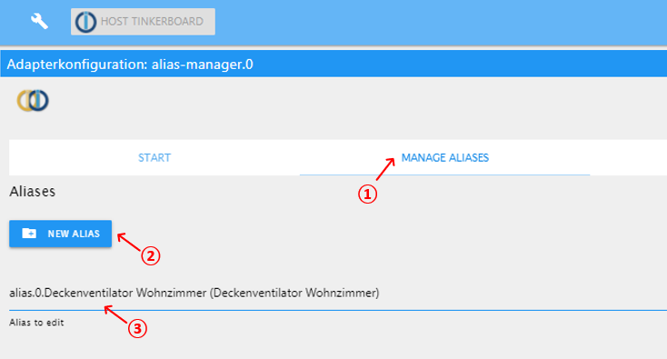

＃ioBroker.alias-manager
## IoBroker的别名管理器适配器
管理和创建别名。

##快速介绍
###管理别名

*（1）点击“管理别名”
*（2）要创建新别名，请点击“ NEW ALIAS”或
*（3）选择一个现有的别名进行编辑

*（1）然后，您将找到一个具有此别名常规设置的区域，例如名称或常用角色
*（2）在下面，您将找到一个列表，其中包含别名的所有数据点
*（3）您可以通过添加一个空的或通过选择现有的iobroker数据点并将其设置复制到新的别名数据点来将别名数据点添加到此列表中
*（4）您可以通过单击垃圾图标来删除数据点
*每个数据点都有几个用于配置它的字段：
    *在灰色区域，您可以设置名称或删除数据点
    *在蓝色区域中，您可以配置角色，类型和-可选-单位
*在绿色区域中，您可以设置可选的最小值和最大值，并确定数据点是否应为只读（common.write为关闭状态）以及是否可以访问其值（common.read为打开状态），这将是大多数情况下的正确设置情况）
*在红色区域中，您可以：
*（5）配置链接到该别名数据点的原始ioBroker数据点。两者（原始数据点和别名数据点）都保持同步。
*（6）此外，您可以配置读取和写入的转换功能。
*示例：如果将“ val / 10”设置为“ Read-Function”，则aias-datapoint的值将始终为原始数据点的10％。
*在大多数情况下，您随后将“ val * 10”配置为“写入功能”，以在写入别名数据点时也保持此比率。
*请在ioBroker-documenation中的https://www.iobroker.net/#en/documentation/dev/aliases.md下了解有关别名的更多信息

*（1）单击“复制别名”进行复制或
*（2）在“重命名别名”上重命名别名，将打开以下对话框：

\您可以在这里：

*（1）设置一个新的ID，然后
*（2）为别名设置一个新的通用名称
*（3）通过单击“添加替换”，您可以在以下列表中添加行，您可以在其中：
    *（4）输入一个字符串，将对其进行搜索，并将其替换为（5）该字符串
*使用此功能，您可以快速更改原始的ioBroker数据点，您的别名数据点已链接到
* 例子：
*您的风扇带有多个数据点，例如“ SET”，“ ERROR”和“ UNREACH”
*这些别名数据点链接到原始数据点，例如``hm-rpc.0.JEQ0698034.1.STATE''，``hm-rpc.0.JEQ0698034.0.ERROR''和``hm-rpc.0 .JEQ0698034.0.UNREACH``
*现在，如果您的设备坏了，必须更换一个新设备，其序列号将会更改，例如，更改为ASDF1234
*要一次性更新所有别名数据点中的所有链接，可以搜索hm-rpc.0.JEQ0698034并将其替换为hm-rpc.0.ASDF1234
*在创建与旧别名相似的新别名时，这也很有用。只需复制别名，设置新的ID和名称，然后使用替换功能即可调整链接的数据点

*更改设置后，您可以：
*（1）通过单击“保存所有更改”来一次性保存所有更改的别名数据点，或者
*（2）通过单击“保存更改”仅保存一个数据点
*（3）最后，您可以通过单击“删除别名”来删除整个别名

###自动创建别名

*（1）点击“自动别名”

*（1）首先从ioBroker对象树中选择设备的ID
*（2）然后单击“尝试从该设备创建别名”
*（3）之后，您将找到确定的Alias和
*（4）所选设备的所有数据点的列表
    *将检查所有自动识别的数据点（仅保存选中的行）
*如果自动识别，则数据点将设置“目的地ID”。这将是别名的相应数据点（原始数据点将链接到此新的别名数据点）。 autocreate-function尝试匹配已标准化的datapoint-id，具体取决于所识别的设备类型。但是，您可以根据需要更改设置，但是每个“目的地ID”都必须是唯一的。
*最后，您可以输入目标别名数据点的名称
*所有未自动识别的数据点均未选中，显示在列表中。您可以手动调整设置并激活复选框。
*（5）您也可以手动将其他数据点添加到此列表或清除完整列表
*（6）然后可以将新的别名与所有选中的（！）数据点一起保存（未选中的数据点将被丢弃）
*之后，您将被自动转移到“管理别名”标签，并且新的别名将被打开，以根据需要调整其设置

## Changelog

### 0.1.4 (2021-03-30)
* (sbormann) Updated dependencies.
* (sbormann) Removed bottom-border if used as tab.

### 0.1.3 (2021-03-29)
* (sbormann) Changed admin tab to singleton mode.

### 0.1.2 (2021-03-29)
* (sbormann) Fixed link to admin tab.
* (sbormann) Added translations.

### 0.1.1 (2021-03-28)
* (sbormann) Added alias-manager as tab to the ioBroker side menu.
* (sbormann) Added list of aliases to main tab.
* (sbormann) Enhanced open all / close all function for collapsibles.
* (sbormann) Added translations.

### 0.1.0 (2021-03-27)
* (sbormann) Alias-ID can now be an object with seperate datapoints for read and write.
* (sbormann) Alias-Datapoints can now be collapsed.
* (sbormann) Added Autocreate Alias function.

### 0.0.8 (2021-03-22)
* (sbormann) Added ability to create alias-datapoint from existing datapoint.

### 0.0.7 (2021-03-21)
* (sbormann) Fixed typos.
* (sbormann) Changed the way ioBroker-Objects are fetched (much faster).
* (sbormann) Added copy-button to datapoints.
* (sbormann) Empty fields are now removed (before they were set to null).
* (sbormann) Changed mode to onlyWWW.

### 0.0.6 (2021-01-18)
* (sbormann) Added delete datapoint.
* (sbormann) Some fixes .

### 0.0.1
* (sbormann) Initial release.

## License
MIT License

Copyright (c) 2021 Sebastian Bormann <sebastian@bormann.net>

Permission is hereby granted, free of charge, to any person obtaining a copy
of this software and associated documentation files (the "Software"), to deal
in the Software without restriction, including without limitation the rights
to use, copy, modify, merge, publish, distribute, sublicense, and/or sell
copies of the Software, and to permit persons to whom the Software is
furnished to do so, subject to the following conditions:

The above copyright notice and this permission notice shall be included in all
copies or substantial portions of the Software.

THE SOFTWARE IS PROVIDED "AS IS", WITHOUT WARRANTY OF ANY KIND, EXPRESS OR
IMPLIED, INCLUDING BUT NOT LIMITED TO THE WARRANTIES OF MERCHANTABILITY,
FITNESS FOR A PARTICULAR PURPOSE AND NONINFRINGEMENT. IN NO EVENT SHALL THE
AUTHORS OR COPYRIGHT HOLDERS BE LIABLE FOR ANY CLAIM, DAMAGES OR OTHER
LIABILITY, WHETHER IN AN ACTION OF CONTRACT, TORT OR OTHERWISE, ARISING FROM,
OUT OF OR IN CONNECTION WITH THE SOFTWARE OR THE USE OR OTHER DEALINGS IN THE
SOFTWARE.