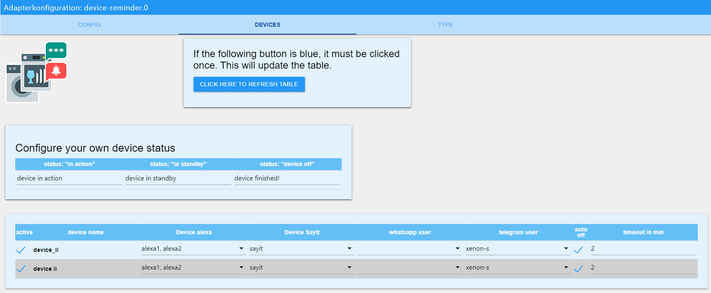

＃ioBroker.device-reminder

##需要德国自述文件吗？  [德语自述](https://github.com/Xenon-s/ioBroker.device-reminder/blob/master/README_GER.md)
 

**注意**：如果您使用的版本小于0.4，则绝对有必要删除所有现有实例！

##用于监视设备状态的适配器
该适配器可以通过测量插座检测设备是否已打开，正在运行或已关闭，并对此做出反应。然后可以通过电报，whatsapp，alexa和sayit自动输出消息（可以在每个设备上进行多次选择）。也可以在过程完成后（也有时间延迟）自动关闭套接字。 （以前开发此适配器的项目：https://github.com/Xenon-s/js.device-reminder）

##应该考虑什么？
对于大多数设备，从“实时消耗值（平均值**” _ energy“ **）”开始的刷新间隔不应超过10秒，否则可能会有非常延迟的消息。  Tasmota控制台中的命令：TelePeriod 10 

##目前可以监视哪些设备？
以下设备具有默认值：

- 洗衣机，
-烘干机
- 洗碗机，
- 电热水壶，
- 电脑，
- 微波

 此外，还提供5种自定义设备。这些可以由用户根据需要配置。所有设备类型的阈值也可以手动调整。 

##每个设备可能有什么？
-设备启动时的通知
-每次设备启动结束时发出通知
-电报通知（可以有多个ID）
-Alexa通知（可以使用多个ID）
-WhatsApp通知可能有多个ID）
-通知可以自由创建，也可以通过外部脚本进行预定义
-具有当前状态，实时消耗和最后发送的状态消息的数据点，以在其他脚本中使用此适配器的值
-确认过程已完成时，如有必要（也有时间延迟）关闭设备 

   

＃说明

首先，必须在配置中创建所有需要的设备，Alexas等，然后才能使用它们。完成所有条目后，您必须单击**“单击此处以重新加载” **。只有这样，设备才能真正创建，并且可以在选项卡“ ** DEVICES **”中进一步配置。

##创建设备
首先，必须使用**“ +添加设备” **创建一个新条目。这将创建下表行：

-**设备名称**：可自由选择的名称
-**设备类型**：在这里您必须选择它是哪个设备，以便可以正确执行适配器中的计算
-**路径消耗/能量**：单击带有三个白点的按钮以打开对象管理。您必须选择显示“当前实时消耗量**”的数据点。
-**路径开关开/关**：单击带有三个白点的按钮以打开对象管理。您必须选择用于打开/关闭插座的数据点（非强制性）
-**开始文本**：设备启动时将发送通知（也可以使用特殊字符）。不能有“。”在文字结尾！
-**结束文本**：设备完成其处理后将发送通知（也可以使用特殊字符）。不能有“。”在文字结尾！

使用“开始文本”和“结束文本”，您还可以从外部数据点获取消息。设备状态更改后，从数据点读取此消息的时间为1秒。因此，您可以使用外部脚本创建一条消息。适配器自动检测消息是否来自数据点，或者是否只是手动输入。要选择一个数据点，只需单击带有三个白点的按钮，然后选择相应的数据点。 **请注意**：只能使用一个数据点**或**一个手动输入的消息！  

##创建Alexa
首先必须使用**“ + add alexa device” **创建一个新条目。这将创建下表行：

-** alexa name **：可自由选择的名称，也可以使用特殊字符
-** alexa“公告” /“说话” **：在这里，您必须**选择使Alexa说话的数据点。要选择数据点，只需单击带有三个小白点的按钮。
-**音量0-100 **：*可选*在这里您可以设置音量（默认值：50）。介于0到100之间的值是可能的。

最后4个字段可用于创建允许您的Alexa讲话的时间段。默认情况下，从00:00-23:59的时间段处于活动状态。

-**“活动时间”：以小时为单位的开始时间
-**“活动时间最小” **：以分钟为单位的开始时间
-“非活动时间”：以小时为单位的结束时间
-**“非活动时间最小值” **：以分钟为单位的结束时间

   

##创建SayIt设备
首先，您必须使用**“ + add sayit设备” **创建一个新条目。这将创建下表行：

-**说明名称**：可以自由选择的名称，也可以使用特殊字符
-** sayit路径“ ../text” **“：在相应的sayIt设备文件夹中选择数据点“ text”。文本输出将发送到此文件夹。
-**音量0-100 **：*可选*在这里您可以设置音量（默认值：50）。介于0到100之间的值是可能的。
-**“活动时间”：以小时为单位的开始时间
-**“活动时间最小” **：以分钟为单位的开始时间
-“非活动时间”：以小时为单位的结束时间
-**“非活动时间最小值” **：以分钟为单位的结束时间

   

##创建whatsapp用户
首先，您必须使用**“ + add whatsapp用户” **创建一个新条目。这将创建以下表格行：

-** whatsapp名称**：可自由选择的名称，也可以使用特殊字符
-** whatsapp路径“ sendMessage” **：在相应的whatsapp文件夹中选择数据点“ sendMessage”，将在此处发送文本输出。

   

##保存配置
插入所有设备和Messenger后，您必须通过按页面上的“保存”按钮**单击此处重新加载**进行保存！这将更新标签“ **设备**”中的表格。由于显示出现问题，因此生成表的时间很短。  *注意：*如果更改现有设备的名称，然后单击“单击此处重新加载”按钮，则会在表中重新创建该设备，并且必须进行相应配置（分配alexa等）。

 仅当插入新设备或更改现有设备时，该按钮才有效！  

＃配置设备

##配置您自己的设备状态
-运作中**：设备运行时显示的状态。
-**待机**：设备处于待机状态时显示的状态。
-**设备关闭**：设备关闭时显示的状态。

##配置设备
在“配置”页面上单击按钮“ **单击此处重新加载**”后，将显示所有创建的设备，并可对其进行进一步配置。

-**激活**：默认情况下处于激活状态。您可以在此处暂时停用设备，以使其不再发送任何通知
-**设备名称**：自动创建
-** Alexa设备**：此处列出了所有以前创建的Alexa，可以通过单击添加
-** sayit ID **：此处列出了所有以前创建的sayit设备，可以通过单击添加
-** whatsapp用户**：此处列出了所有以前创建的whatsapp用户，可以通过单击添加
-**电报用户名**：此处将显示所有可用的电报用户，并可通过单击将其分配给设备。相应的实例在方括号中指出。

**如果不显示任何名称：**检查“ telegram.X.communicate.users”下的条目（X代表相应实例，例如0）是否包含以下结构：“ {” ID IN NUMBERS” ：{“ firstName”：“ User1”}}“，如果没有，可以轻松调整。适配器同时搜索** firstName **和** userName **。您可以决定要使用哪个名称。只能选择“名字”或“用户名”！

-**自动关闭**：如果选择此选项，则在过程完成后电源插座将自动关闭
-**计时器**：您可以在此处选择以**分钟**为单位输入超时。超时时间过后，如果激活了自动关闭功能，则电源插座将关闭。设备的结束通知不受超时的影响！

单击“ **保存并关闭**”后，现在在* Objects-> device-reminder *下为每个新创建的Device创建一个文件夹，其中

-当前运行时间：hh：mm：ss
-当前运行时间（以毫秒为单位）
-设备的当前状态
-当前的实时消费（从“路径消耗/能量*”获取）和
-给信使的信息
-averageConsumption（可用作确定自己的阈值的辅助手段）
-请勿打扰（如果激活，则不会发送任何消息）

被陈列。  

＃配置设备类型
**注意**：值的更改可能导致以下事实：设备不再正确记录，因此可能出现错误消息。

在第一个表中，显示“默认”值。这些值是在几个月的时间内确定的，不应进行调整。不过，我解释了单个值的含义。

-**起始值**：必须以瓦特为单位的起始值才能将设备识别为已启动
-**最终值**：必须以瓦特为单位的最终值，以便可以将设备识别为已完成
-值“开始” **的数量：在此指定“开始” **必须连续超过**的频率。如果该值一次低于该值，则启动中止。这些值的平均值必须高于起始值才能被识别为已启动。

*示例：该值应为10W，并连续超过3次。 1. 15W，2. 1W，15W =>启动阶段被中止，因为第二个值低于10. *。

-值“结束” **的数量：在此表示在计算之前要记录多少个值，以及设备是否完成。此处列出的值越少，结果越不准确，错误消息的危险也会增加。值越高，记录越准确。但是，缺点是完成的消息发送的延迟很长。仅当达到“值的数量结束”并且平均消耗低于“最终值”时才识别出结束。

   

*简短的示例计算：*消耗值每10秒出现一次。 **最终值**设置为50，**值结束**设置为100。在设备被识别为启动后，将记录100个值（*持续100个值x 10秒= 1000秒*），然后才记录平均值计算值。如果平均值低于50，则在大约16.5分钟后（我们记得**值结束** = 100个值）被识别为“完成”，并发出一条消息（如果已配置）。如果该值大于50，则不会发生任何事情，因为该设备仍在运行。现在，每个其他值都将替换最旧的值，并在每个新值之后计算一个新的平均值。  

如果您到目前为止已经阅读但仍然认为需要自定义值，则可以使用** 5种自定义类型**进行免费设计。
custom-devices.png]（admin / custom-devices.png）

要了解有关此功能的更多信息，只需在“ **默认设备**”中阅读有关此功能的信息。

＃支持
**如果您喜欢我的工作：** 

[]  

## Changelog
<!--
	Placeholder for the next version (at the beginning of the line):
	### __WORK IN PROGRESS__
-->

### 0.7.2 (2020-12-17)
* (xenon-s) Removed unnecessary debug message

### 0.7.1 (2020-12-17)
* (xenon-s) fix telegram bug
* (xenon-s) Deleted incorrect version numbers in the io package

### 0.7.0 (2020-12-10)
* (xenon-s) Data is now queried cyclically

### 0.6.2 (2020-12-04)
* (xenon-s) bugfix index_m

### 0.6.1 (2020-12-04)
* (xenon-s) bugfix: wrong status was displayed in the data point

### 0.6.0 (2020-12-03)
* (xenon-s) bugfix: alexa speak-volume when input is empty
* (xenon-s) bugfix: telegram now shows both names, otherwise there were errors in the notifications 
* (xenon-s) add: Device status can now be configured yourself

### 0.5.4 (2020-11-28)
* (xenon-s) calculation optimised, custom / default values may have to be adjusted if they have been changed by the user

### 0.5.3 (2020-11-26)
* (xenon-s) bugfix: can't find val of null alexa speak-volume

### 0.5.2 (2020-11-23)
* (xenon-s) bugfix: speak-volume Alexa has partially returned "undefined"

### 0.5.1 (2020-11-22)
* (xenon-s) bugfix: Alexa responds only to announcement

### 0.5.0 (2020-11-22)
* (xenon-s) bugfix: volume sayit
* (xenon-s) add: volume alexa
* (xenon-s) DP runtime in milliseconds

### 0.4.10 (2020-11-17)
* (xenon-s) bugfix main.js

### 0.4.9 (2020-11-14)
* (xenon-s) Bugfix: switch off detection
* (xenon-s) Bugfix: index_m save button was not displayed

### 0.4.8 (2020-11-13)
* (xenon-s) bugfix: Device status was partly recognized incorrectly

### 0.4.7 (2020-11-13)
* (xenon-s) readme translated into english

### 0.4.6 (2020-11-12)
* (xenon-s) Bugfix index_m

### 0.4.5 (2020-11-12)
* (xenon-s) error Adapterchecker fixed

### 0.4.4 (2020-11-12)
* (xenon-s) bugfix main.js

### 0.4.3 (2020-11-12)
* (xenon-s) release npm

### 0.4.2 (2020-11-12)
* (xenon-s) readme adapted 
* (xenon-s) index_m fixed

### 0.4.1 (2020-11-12)
* (xenon-s) bugfix: wrong status was displayed when program abort was detected

### 0.4.0 (2020-11-11)
* (xenon-s) config page revised to simplify the input of devices
* (xenon-s) inserted a break, so that it is recognized, if a device is switched off prematurely at the device switch
* (xenon-s) bugfix: telegram users are not always recognized correctly and displayed incorrectly
* (xenon-s) adjustable values inserted at "Type
* (xenon-s) readme extended and adapted

### 0.3.2 (2020-11-08)
* (xenon-s) bug: auto Off did not work anymore 

### 0.3.1 (2020-11-07)
* (xenon-s) bugfix

### 0.3.0 (2020-11-07)
* (xenon-s) standby detection, even if the power outlet should not be switched off
* (xenon-s) It is now possible to get messages from an external data point and send them as start / end message
* (xenon-s) device "microwave" added

### 0.2.1 (2020-11-05)
* (xenon-s) readme adapted

### 0.2.0 (2020-11-05)
* (xenon-s) update to version 0.2: index_m completely revised and whatsapp added

### 0.1.2 (2020-10-23)
* (xenon-s) fix bug in index_m.html: users are not always displayed correctly

### 0.1.1-beta.0 (2020-10-23)
* (xenon-s) fix package.json

### 0.1.0 (2020-10-23)
* (xenon-s) beta release

### 0.0.1 (2020-10-20)
* (xenon-s) initial commit

## License

MIT License

Copyright (c) 2020 xenon-s

Permission is hereby granted, free of charge, to any person obtaining a copy
of this software and associated documentation files (the "Software"), to deal
in the Software without restriction, including without limitation the rights
to use, copy, modify, merge, publish, distribute, sublicense, and/or sell
copies of the Software, and to permit persons to whom the Software is
furnished to do so, subject to the following conditions:

The above copyright notice and this permission notice shall be included in all
copies or substantial portions of the Software.

THE SOFTWARE IS PROVIDED "AS IS", WITHOUT WARRANTY OF ANY KIND, EXPRESS OR
IMPLIED, INCLUDING BUT NOT LIMITED TO THE WARRANTIES OF MERCHANTABILITY,
FITNESS FOR A PARTICULAR PURPOSE AND NONINFRINGEMENT. IN NO EVENT SHALL THE
AUTHORS OR COPYRIGHT HOLDERS BE LIABLE FOR ANY CLAIM, DAMAGES OR OTHER
LIABILITY, WHETHER IN AN ACTION OF CONTRACT, TORT OR OTHERWISE, ARISING FROM,
OUT OF OR IN CONNECTION WITH THE SOFTWARE OR THE USE OR OTHER DEALINGS IN THE
SOFTWARE.