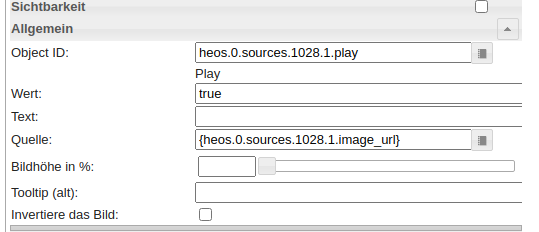
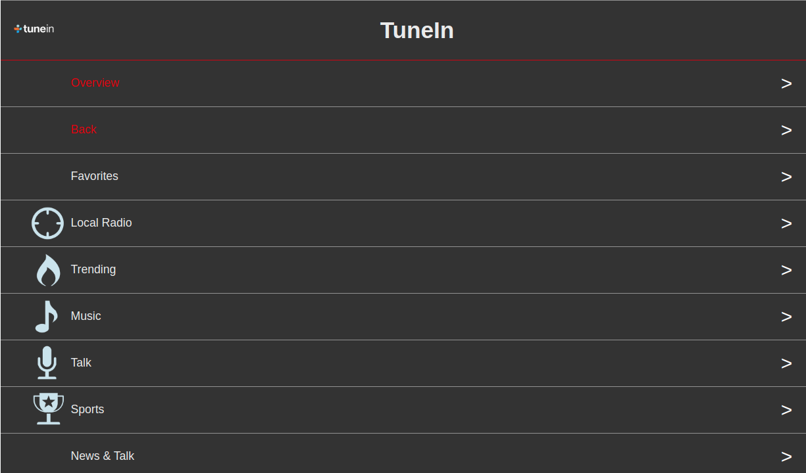

＃ioBroker.heos
## Heos ioBroker适配器
该适配器可以从ioBroker控制HEOS

＃＃ 配置
* **自动播放**：连接播放器或处于静音状态后自动播放音乐。可以在配置中全局配置。如果全局启用了该功能，则可以针对状态为“ auto_play”的一个特定玩家禁用该功能。
* **命令范围**：定义将“ scope / [cmd]”命令发送到哪个玩家。它可以发送给所有播放器，所有主要播放器或处于逗号分隔状态的所有PID：```heos.0.command_scope_pid```
* **静音正则表达式**：

在配置中，您可以根据歌曲信息的正则表达式匹配，激活使播放器静音的功能。可以用来自动使广告静音。例如，对于Spotify，您可以使用以下正则表达式：```spotify:ad:|Advertisement```。

* **ignore_broadcast_cmd** 如果播放器应该忽略对所有播放器的命令，则配置此播放器状态，例如播放器/ set_mute＆state = on或按播放按钮以获取预设/播放列表

＃＃ 寻找
查找功能不适用于所有来源。 Spotify和Amazon Music支持寻求。

##命令状态
HEOS CLI规范：http://rn.dmglobal.com/euheos/HEOS_CLI_ProtocolSpecification.pdf

### HEOS命令状态
*“系统/连接”：尝试连接到HEOS
*“系统/断开连接”：与HEOS断开连接
*“系统/重新连接”：断开并连接
*“ system / load_sources”：重新加载源
*“ group / set_group？pid = <pid1>，<pid2>，...”：使用玩家ID列表设置组，例如“ group / set_group？pid = 12345678,12345679”。
*“ group / set_group？pid = <pid1>”：删除现有的组，例如“组/ set_group？pid = 12345678”
*“ group / ungroup_all”：删除所有组
*“ group / group_all”：将所有玩家分组
*“ player / [cmd]”：将命令发送给所有玩家。例如玩家/ set_mute＆state = on
*“ leader / [cmd]”：将命令发送给所有领先玩家。例如领导者/ set_mute＆state = on
*“ scope / [cmd]”：将命令scope_pids中的所有播放器，前导播放器或逗号分隔的播放器pid发送到已配置的作用域
*“ ...”：尝试将所有其他命令发送到HEOS

###播放器命令状态
注意：如果多个命令与管道分开，则可能是多个命令，例如set_volume＆level = 20 | play_preset＆preset = 1

*“ set_volume＆level = 0 | 1 | .. | 100”：设置播放器音量
*“ set_play_state＆state =播放|暂停|停止”：设置播放器状态
*“ set_play_mode＆repeat = on_all | on_one | off＆shuffle = on | off”：设置重复和随机播放模式
*“ set_mute＆state = on | off”：静音播放器
*“ volume_down＆step = 1..10”：降低音量
*“ volume_up＆step = 1..10”：提高音量
*“ play_next”：继续播放
*“ play_previous”：播放上一个
*“ play_preset＆preset = 1 | 2 | .. | n”：播放预设n
*“ play_stream＆url = url_path”：播放URL流
*“ add_to_queue＆sid = 1025＆aid = 4＆cid = [CID]”：播放器上带有[CID]的播放列表（帮助：1 –现在播放； 2 –接下来播放； 3 –添加到结尾； 4 –替换并播放）

##图像颜色提取
使用1.7.6版时，歌曲封面的突出颜色将被提取并保存到三个新的播放器状态：

* **current_image_color_palette** 节点活跃选择的突出颜色。
* **current_image_color_background** 图像中人口最多的颜色。可用作VIS中播放器控件的背景色。
* **current_image_color_foreground** 图像中人口第二多的颜色，并且与背景颜色具有良好的读取对比度。可用作VIS中播放器控件的文本颜色。

##说
支持[SayIt转接器](https://github.com/ioBroker/ioBroker.sayit)。


##材质用户界面
支持[材质UI适配器](https://github.com/ioBroker/ioBroker.material)。


##预设和播放列表
适配器不会自动请求当前的播放列表和预设。要更新/请求数据并创建播放状态，您必须首先浏览源：

-预设/收藏夹：``heos.0.sources.1028.browse`''
-播放列表：```heos.0.sources.1025.browse`''

## VIS
＃＃＃ 安装
*创建以下字符串状态：
    * 0_userdata.0.heos.queue_pid
    * 0_userdata.0.heos.queue_html
    * 0_userdata.0.heos.browse_result_html

###播放器视图
*打开文件：[player_view.json]（docs / vis / views / player_view.json）
*将123456789替换为玩家pid
*将视图导入VIS


###预设
*单击按钮``heos.0.sources.1028.browse`''以加载预设
*打开文件：[presets_view.json]（docs / vis / views / presets_view.json）
*将视图导入VIS



＃＃＃ 队列
*队列小部件：[queue_player_widget.json]（docs / vis / views / queue_player_widget.json）
*队列视图：[queue_view.json]（docs / vis / views / queue_view.json）
*队列HTML生成脚本：[queue.js]（docs / vis / scripts / queue.js）


###浏览源
*浏览小工具：[browse_player_widget.json]（docs / vis / views / browse_player_widget.json）
*浏览视图：[browse_view.json]（docs / vis / views / browse_view.json）
*浏览HTML生成脚本：[browse.js]（docs / vis / scripts / browse.js）



或者，您可以使用Uhula中的脚本：https://forum.iobroker.net/post/498779

## Changelog

### 1.7.7 (2021-02-25)
* (withstu) add creation of missing version state

### 1.7.6 (2021-02-24)
* (withstu) add image color extraction

### 1.7.5 (2021-02-12)
* (withstu) add bit depth

### 1.7.4 (2021-02-01)
* (withstu) fix upnp init bug

### 1.7.3 (2021-02-01)
* (withstu) add upnp module and support bitrate, audio format and sample rate

### 1.7.2 (2021-01-30)
* (withstu) fix seek in groups

### 1.7.1 (2021-01-30)
* (withstu) add seek

### 1.7.0 (2021-01-29)
* (withstu) reboot not responding players
* (withstu) delete old presets and playlists

### 1.6.2 (2021-01-02)
* (withstu) fix "user not logged in" handling

### 1.6.1 (2020-11-25)
* (withstu) clear timeout and interval on unload; fix roles; remove sleep in tts module

### 1.6.0 (2020-11-22)
* (withstu) add regex mute

### 1.5.6 (2020-11-22)
* (withstu) add source images & optimize auto play

### 1.5.5 (2020-11-01)
* (withstu) update some packages and add sources event

### 1.5.4 (2020-10-24)
* (withstu) ignore invalid now playing responses

### 1.5.3 (2020-10-18)
* (withstu) minor improvements related to auto play feature

### 1.5.2 (2020-10-11)
* (withstu) improve tts stop method

### 1.5.1 (2020-10-11)
* (withstu) improve tts and don't update queue during tts

### 1.5.0 (2020-10-10)
* (withstu) add tts support and maximum volume

### 1.4.0 (2020-10-10)
* (withstu) add more play and queue settings
* (withstu) bugfixing for invalid heos responses (empty player name)

### 1.3.4 (2020-10-04)
* (withstu) remove sorting and available filter and fix browse play

### 1.3.3 (2020-10-04)
* (withstu) fix previous page button in browse feature

### 1.3.2 (2020-10-04)
* (withstu) fix preset sorting

### 1.3.1 (2020-10-03)
* (withstu) add back button to browse feature

### 1.3.0 (2020-10-03)
* (withstu) add queue and some browse improvements

### 1.2.4 (2020-09-29)
* (withstu) minor bugfix

### 1.2.3 (2020-09-29)
* (withstu) improve browse feature (add pictures and sources view)

### 1.2.2 (2020-09-28)
* (withstu) rename browse command

### 1.2.1 (2020-09-28)
* (withstu) introduce browse_result state

### 1.2.0 (2020-09-27)
* (withstu) Breaking change: restructure playlists/presets (you should delete the devices playlists, presets and sources before installation)

### 1.1.2 (2020-09-26)
* (withstu) log browse parameters

### 1.1.1 (2020-09-26)
* (withstu) add source browse feature (Click the button in the sources. You can find the possible next commands in the log.)

### 1.1.0 (2020-09-26)
* (withstu) encrypt password

### 1.0.1 (2020-09-21)
* (withstu) remove connected state, because it is included in the info channel

### 1.0.0 (2020-09-21)
* (withstu) initial release

## License
MIT License

Copyright (c) 2021 withstu <withstu@gmx.de>

derived from https://forum.iobroker.net/topic/10420/vorlage-denon-heos-script by Uwe Uhula
TTS derived from https://github.com/ioBroker/ioBroker.sonos

Permission is hereby granted, free of charge, to any person obtaining a copy
of this software and associated documentation files (the "Software"), to deal
in the Software without restriction, including without limitation the rights
to use, copy, modify, merge, publish, distribute, sublicense, and/or sell
copies of the Software, and to permit persons to whom the Software is
furnished to do so, subject to the following conditions:

The above copyright notice and this permission notice shall be included in all
copies or substantial portions of the Software.

THE SOFTWARE IS PROVIDED "AS IS", WITHOUT WARRANTY OF ANY KIND, EXPRESS OR
IMPLIED, INCLUDING BUT NOT LIMITED TO THE WARRANTIES OF MERCHANTABILITY,
FITNESS FOR A PARTICULAR PURPOSE AND NONINFRINGEMENT. IN NO EVENT SHALL THE
AUTHORS OR COPYRIGHT HOLDERS BE LIABLE FOR ANY CLAIM, DAMAGES OR OTHER
LIABILITY, WHETHER IN AN ACTION OF CONTRACT, TORT OR OTHERWISE, ARISING FROM,
OUT OF OR IN CONNECTION WITH THE SOFTWARE OR THE USE OR OTHER DEALINGS IN THE
SOFTWARE.