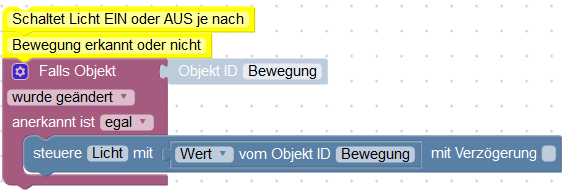
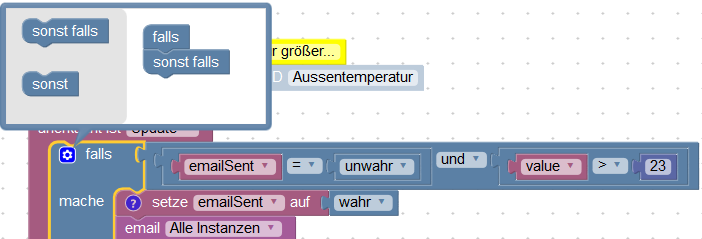
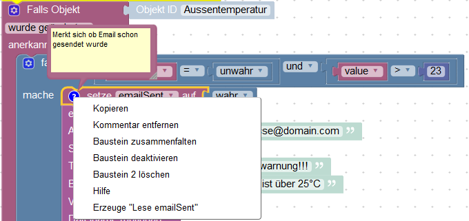
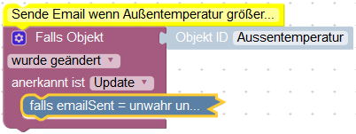
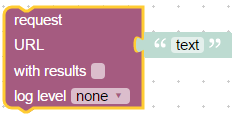
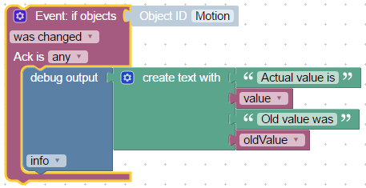
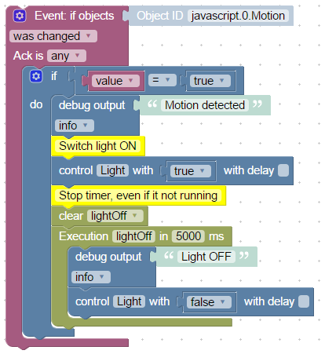
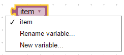

＃内容
-[说明]（＃个说明）
-[使用入门]（＃使用入门）
    -[示例1]（＃示例1）
    -[示例2]（＃示例2）
    -[示例3]（＃示例3）
-[方块]（＃方块）
    -[系统块]（＃个系统块）
        -[调试输出]（＃调试输出）
        -[评论]（＃条评论）
        -[转向状态]（＃转向状态）
        -[更新状态]（＃个更新状态）
        -[绑定状态]（＃个绑定状态）
        -[写入状态]（＃个写入状态）
        -[创建状态]（＃创建状态）
        -[获取状态值]（＃获取状态值）
        -[获取对象ID]（＃get-object-id）
    -[动作块]（＃个动作块）
        -[执行命令]（＃exec ---命令）
        -[请求网址]（＃个请求网址）
    -[SendTo块]（＃sendTo块）
        -[发送至电报]（＃发送至电报）
        -[发送至SayIt]（＃发送到sayit）
        -[发送到推送]（＃发送到推送）
        -[发送电子邮件]（＃个发送电子邮件）
        -[自定义sendTo块]（＃个自定义发送块）
    -[日期和时间块]（＃个日期和时间块）
        -[时间比较]（＃时间比较）
        -[实际时间比较]（＃个实际时间比较）
        -[以特定格式获取实际时间]（＃以特定格式获取实际时间）
        -[获取今天的astro事件的时间]（＃获取今天的astro事件的时间）
    -[转换块]（＃个转换块）
        -[转换为数字]（＃转换为数字）
        -[转换为布尔值]（＃转换为布尔值）
        -[获取变量的类型]（＃获取变量的类型）
        -[转换为日期/时间对象]（＃转换为日期时间对象）
        -[将日期/时间对象转换为字符串]（＃convert-datetime-object-to-string）
        -[将JSON转换为对象]（＃convert-json-to-object）
        -[将对象转换为JSON]（＃convert-object-to-json）
        -[通过JSONata表达式转换]（＃convert-by-jsonata-expression）
    -[触发]（＃触发）
        -[状态变更触发]（＃状态触发变更）
        -[状态变更触发]（＃状态变更触发）
        -[触发器信息]（＃触发器信息）
        -[时间表]（＃个时间表）
        -[触发astro事件]（＃触发astro事件）
        -[命名时间表]（＃个命名时间表）
        -[清除时间表]（＃清除时间表）
        -[CRON对话框]（＃cron-dialog）
        -[CRON规则]（＃cron-rule）
    -[超时]（＃次超时）
        -[延迟执行]（＃个延迟执行）
        -[清除延迟执行]（＃清除延迟执行）
        -[按时间间隔执行]（按时间间隔执行＃次）
        -[按间隔停止执行]（按间隔＃停止执行）
    -[逻辑]（＃逻辑）
        -[If else块]（＃if-else-block）
        -[比较块]（＃比较块）
        -[逻辑与/或块]（＃逻辑与或块）
        -[取反块]（＃取反块）
        -[逻辑值TRUE / FALSE]（＃逻辑值-true-false）
        -[空块]（＃个空块）
        -[测试块]（＃个测试块）
    -[循环]（＃个循环）
        -[重复N次]（＃次重复n次）
        -[重覆播放]（＃重覆播放）
        -[计数]（＃个计数）
        -[每个]（每个为＃）
        -[突破循环]（＃突破循环）
    -[数学]（＃数学）
        -[数字值]（＃数字值）
        -[算术运算+-\ * / ^]（＃算术运算-）
        -[平方根，Abs，-，ln，log10，e ^，10 ^]（＃方根-abs --- ln-log10-e-10）
        -[sin，cos，tan，asin，acos，atan]（＃sin-cos-tan-asin-acos-atan）
        -[数学常数：pi，e，phi，sqrt（2），sqrt（1/2），无穷大]（＃math-constants-pi-e-phi-sqrt2-sqrt12-infinity）
        -[偶数，奇数，素数，整数，正数，负数，除数]（＃为奇数-整数-负数-负数-除数）
        -[按值正负可变地修改]（＃按值正负可变地修改）
        -[圆，底，天花板值]（＃圆底天花板值）
        -[值列表上的操作：总和，最小值，最大值，平均值，中位数，众数，偏差，随机项]（值列表中的＃个操作总和-最小值-最大值-平均中位数-模式偏差随机项目）
        -[模数]（＃模数）
        -[最小和最大限制一些值]（＃最小和最大限制一些值）
        -[随机值从0到1]（＃随机值从0到1）
        -[最小值和最大值之间的随机值]（＃最小值和最大值之间的随机值）
    -[文字]（＃文字）
        -[字符串值]（＃个字符串值）
        -[连接字符串]（＃个连接字符串）
        -[将字符串附加到变量]（＃将字符串附加到变量）
        -[字符串长度]（＃字符串长度）
        -[字符串是否为空]（＃is-string-empty）
        -[在字符串中查找位置]（＃在字符串中查找位置）
        -[在特定位置的字符串中获取符号]（＃在特定位置的字符串中获取符号）
        -[获取子字符串]（＃获取子字符串）
        -[转换为大写或小写]（＃转换为大写或小写）
        -[修剪字符串]（＃修剪字符串）
    -[列表]（＃个列表）
        -[创建空列表]（＃create-empty-list）
        -[使用值创建列表]（＃个带有值的创建列表）
        -[创建具有相同值N次的列表]（＃创建具有相同值n次的列表）
        -[获取列表长度]（＃get-length-of-list）
        -[列表是否为空]（＃is-list-empty）
        -[在列表中查找项目的位置]（＃在列表中查找项目的位置）
        -[在列表中获取项目]（＃在列表中获取项目）
        -[在列表中设置项目]（列表中的＃个设置项目）
        -[获取列表的子列表]（＃get-sublist-of-list）
        -[将文本转换为列表，反之亦然]（＃将文本转换为列表，反之亦然）
    -[颜色]（＃颜色）
        -[颜色值]（＃颜色值）
        -[随机颜色]（＃随机颜色）
        -[RGB颜色]（＃rgb颜色）
        -[混合颜色]（＃种混合颜色）
    -[变量]（＃个变量）
        -[设置变量的值]（＃set-variables-value）
        -[获取变量的值]（＃get-variables-value）
    -[功能]（＃个功能）
        -[从无返回值的块创建函数]（＃从无返回值的块创建函数）
        -[从具有返回值的块创建函数]（＃从具有返回值的块创建函数）
        -[函数中的返回值]（＃函数中的返回值）
        -[创建无返回值的自定义函数]（＃创建无返回值的自定义函数）
        -[使用返回值创建自定义函数]（＃创建具有返回值的自定义函数）
        -[通话功能]（＃通话功能）

＆nbsp;

＃说明Blockly是一个图形编辑器，允许用户通过组装块来创建脚本。
它是为没有计算机编程经验的用户开发的。
＆nbsp;

＃入门
##示例1
**更改另一个数据点时更改一个数据点的状态**



这是更改数据点时切换其他内容的经典示例。

当检测到运动或没有运动时，此处的灯会打开或关闭。

首先插入块“触发器=>如果对象”。选择对象ID，以将对象的状态用作此脚本的触发器。

添加另一个块-“系统=>控制”，然后在对话框中选择要由触发器更改的其他状态。

在此控制块中插入“系统=>对象ID的值”块，然后在对话框中选择“运动”对象，以将其状态写入“浅”：

**触发块有一个特殊的变量“ Value”。这总是在这里定义，可以用于各种目的。它包含触发对象的当前值，因此您可以通过使用块“变量=>对象ID”并将其重命名为“值”来创建更简单的脚本。


＆nbsp;导入示例：

```xml 
<xml xmlns="http://www.w3.org/1999/xhtml">
  <block type="comment" id="s7s**k+Cc_KjDnJW`(h~" x="12" y="63">
    <field name="COMMENT">Switch light ON or OFF it motion detected or IDLE</field>
    <next>
      <block type="on_ext" id="#}:B(M-o5:/]k,_msr%y">
        <mutation items="1"></mutation>
        <field name="CONDITION">ne</field>
        <field name="ACK_CONDITION"></field>
        <value name="OID0">
          <shadow type="field_oid" id="o~6)!C0IVy{WD%Km(lkc">
            <field name="oid">javascript.0.Motion</field>
          </shadow>
        </value>
        <statement name="STATEMENT">
          <block type="control" id="(ZqzhS_7*jGpk;`zJAZg">
            <mutation delay_input="false"></mutation>
            <field name="OID">javascript.0.Light</field>
            <field name="WITH_DELAY">FALSE</field>
            <value name="VALUE">
              <block type="get_value" id="a-E@UcwER=knNljh@:M/">
                <field name="ATTR">val</field>
                <field name="OID">javascript.0.Motion</field>
              </block>
            </value>
          </block>
        </statement>
      </block>
    </next>
  </block>
</xml>
```

＆nbsp;

##示例2 ** 10分钟内没有任何活动时，请打开和关闭灯。


如果状态“运动”已更新为值“ true”，请执行以下操作：

-打开“灯”
-启动10分钟的延迟以关闭“指示灯”，并删除该数据点的所有先前延迟。

如您所见，最后一个命令清除了“清除延迟”标志。这将删除该数据点的所有计时器，并启动一个新计时器

＆nbsp;导入示例：

<！-```xml <xml xmlns =“ http://www.w3.org/1999/xhtml”>-> <block type =“ comment” id =“ s7s ** k + Cc_KjDnJW`（h 〜“ x =” 112“ y =” 63“> <field name =” COMMENT“>在10分钟的空闲状态下打开和关闭灯</ field> <next> <block type =” on_ext“ id =”＃} ：B（M-o5：/] k，_msr％y“> <变异项=” 1“> </ mutation> <字段名=” CONDITION“> true </ field> <字段名=” ACK_CONDITION“> true </ field> <值名称=“ OID0”> <阴影类型=“ field_oid” id =“ o〜6）！C0IVy {WD％Km（lkc”> <field name =“ oid”> javascript.0.Motion < / field> </ shadow> </ value> <statement name =“ STATEMENT”> <block type =“ control” id =“（ZqzhS_7 * jGpk;`zJAZg”> <mutation delay_input =“ false”> </ mutation> <field name =“ OID”> javascript.0.Light </ field> <field name =“ WITH_DELAY”> False </ field> <值名称=“ VALUE”> <块类型=“ logic_boolean” id =“％^ ADwe * 2l0tLw8Ga5F * Y“> <字段名=” BOOL“>是</ field> </ block> </ value> <next> <block type =” control“ id =” =] vmzp6j ^ V9：3？R ？2Y，x“> <mutation delay_input =” true“> </ mutation> <字段名称=” OID“> javascript.0.Light </ field> <字段名称=” WITH_DELAY“> TR UE </ field> <field name =“ DELAY_MS”> 600000 </ field> <field name =“ CLEAR_RUNNING”> TRUE </ field> <value name =“ VALUE”> <block type =“ logic_boolean” id =“！ ; DiIh，D] l1oN {D; skYl“> <field name =” BOOL“> FALSE </ field> </ block> </ value> </ block> </ next> </ block> </ statement> < / block> </ next> </ block> </ xml>

```


&nbsp;
## Beispiel 3
**Verschicke eine eMail wenn die Außentemperatur höher als 25 Grad Celsius ist.**


Erklärung:

Zuerst müssen wir eine Variable definieren um zu speichern, dass die eMail für den aktuellen Temperaturalarm bereits gesendet wurde und diese Variable auf "falsch" setzen.
Dann beobachten wir die Veränderungen der Temperatur. Wir könnten dieses Skript auch periodisch ausführen, aber das ist nicht so effektiv.

Wenn sich die Temperatur ändert vergleichen wir den aktuellen Wert mit 25 und prüfen ob die eMail bereits verschickt wurde oder nicht.
Wenn die eMail noch nicht versendet war, speichern wir dass wir sie jetzt senden und senden sie auch. Natürlich muss der eMail-Adapter vorher installiert und konfiguriert worden sein.

Wenn die Temperatur unter 23 Grad fällt setzen wir die Variable "emailSent" zurück, damit beim nächsten Temperaturalarm wieder eine eMail gesendet wird.
Dazu wird die aktuelle Temperatur mit 23 verglichen und es werden keine eMails geschickt, solange die Temperatur um 25 Grad schwankt.

Um den "falls ... sonst falls ..." Block zu erstellen klickt man auf das Zahnrad und fügt die zusätzlich benötigten Elemente dem "falls" Block hinzu.



Man kann zu jedem Block einen Kommentar hinterlegen, indem man "Kommentar hinzufügen" im Kontextmenü des Blocks anklickt. Diesen Kommentar kann man später durch anklicken des Fragezeichens ansehen.



Man kann größere Blöcke einklappen um eine bessere Übersicht zu erhalten, indem man im Kontextmenü den Punkt "Block einklappen" auswählt.




&nbsp;
Beispiel zum importieren:

```xml
<xml xmlns="http://www.w3.org/1999/xhtml">
  <block type="comment" id="r53:ZiP]3DYe;Ly;@!v5" x="87" y="13">
    <field name="COMMENT"> Send email if outside temperature is more than 25 grad Celsius.</field>
    <next>
      <block type="variables_set" id="oyEg!Z7~qid+!HYECD8C">
        <field name="VAR">emailSent</field>
        <value name="VALUE">
          <block type="logic_boolean" id="gakxd?9T354S1#_(=)%K">
            <field name="BOOL">FALSE</field>
          </block>
        </value>
        <next>
          <block type="on_ext" id="DR}w0I%EUL-FCI%`w5L4">
            <mutation items="1"></mutation>
            <field name="CONDITION">ne</field>
            <field name="ACK_CONDITION">true</field>
            <value name="OID0">
              <shadow type="field_oid" id="}TdS?2Lg~Mt[0!o0iMG.">
                <field name="oid">javascript.0.Outside_temperature</field>
              </shadow>
            </value>
            <statement name="STATEMENT">
              <block type="controls_if" id="rBBI(VLLLRnwd|ys59si">
                <mutation elseif="1"></mutation>
                <value name="IF0">
                  <block type="logic_operation" id="B5R%#,6F,xYI1gB!jjq|">
                    <field name="OP">AND</field>
                    <value name="A">
                      <block type="logic_compare" id="I=R,TaB*pge*l#j|[HZ0">
                        <field name="OP">EQ</field>
                        <value name="A">
                          <block type="variables_get" id="wd1I0gzqle,y-:h@GF)v">
                            <field name="VAR">emailSent</field>
                          </block>
                        </value>
                        <value name="B">
                          <block type="logic_boolean" id="q5~/ZIb))r`w]/RaSXUu">
                            <field name="BOOL">FALSE</field>
                          </block>
                        </value>
                      </block>
                    </value>
                  </block>
                </value>
                <statement name="DO0">
                  <block type="variables_set" id="i):z[{@|*;4zOruzXH46">
                    <field name="VAR">emailSent</field>
                    <comment pinned="false" h="80" w="160">Remember, that email was sent</comment>
                    <value name="VALUE">
                      <block type="logic_boolean" id="56A@]MZKiuL(iuuj)MRI">
                        <field name="BOOL">FALSE</field>
                      </block>
                    </value>
                    <next>
                      <block type="email" id="3J#TXZ`oei_NMEL,_w8K">
                        <field name="INSTANCE"></field>
                        <field name="IS_HTML">FALSE</field>
                        <field name="LOG">log</field>
                        <value name="TO">
                          <shadow type="text" id="j*x?kanQQyGH/pN,r9B2">
                            <field name="TEXT">myaddress@domain.com</field>
                          </shadow>
                        </value>
                        <value name="TEXT">
                          <shadow type="text" id="QE(T_Z]{=o8~h~+vz!ZU">
                            <field name="TEXT">Temperature is over 25°C</field>
                          </shadow>
                        </value>
                        <value name="SUBJECT">
                          <shadow type="text" id="/_AxN7@=T|t@XW.^Fu1(">
                            <field name="TEXT">Temperature alert</field>
                          </shadow>
                        </value>
                      </block>
                    </next>
                  </block>
                </statement>
                <value name="IF1">
                  <block type="logic_compare" id="S?0|;{3V3!_rqUk]GJ4)">
                    <field name="OP">LT</field>
                    <value name="A">
                      <block type="variables_get" id="IJwq1,|y;l7ueg1mF{~x">
                        <field name="VAR">value</field>
                      </block>
                    </value>
                    <value name="B">
                      <block type="math_number" id="m(.v?M3ezTKz(kf5b9ZE">
                        <field name="NUM">23</field>
                      </block>
                    </value>
                  </block>
                </value>
                <statement name="DO1">
                  <block type="variables_set" id="M0{G}QBtF!FYrT,xWBnV">
                    <field name="VAR">emailSent</field>
                    <value name="VALUE">
                      <block type="logic_boolean" id="ti#H=_:;-XRC%CzR/+/0">
                        <field name="BOOL">FALSE</field>
                      </block>
                    </value>
                  </block>
                </statement>
              </block>
            </statement>
          </block>
        </next>
      </block>
    </next>
  </block>
</xml>
```

＆nbsp;

＆nbsp;

＃块
##系统块
###调试输出


除了在日志中写一行外，该块什么都不做。您可以使用它来调试脚本，如下所示：


＆nbsp;导入示例：

```xml 
<xml xmlns="http://www.w3.org/1999/xhtml">
  <block type="comment" id="K|2AnJ|5})RoNZ1T%Hh#" x="38" y="13">
    <field name="COMMENT">Print time into log every second</field>
    <next>
      <block type="timeouts_setinterval" id="LNsHTl,!r6eR8J9Yg,Xn">
        <field name="NAME">interval</field>
        <field name="INTERVAL">1000</field>
        <statement name="STATEMENT">
          <block type="debug" id=".oLS7P_oFU0%PWocRlYp">
            <field name="Severity">log</field>
            <value name="TEXT">
              <shadow type="text" id="X^Z/.qUry9B5Rr#N`)Oy">
                <field name="TEXT">test</field>
              </shadow>
              <block type="time_get" id="TPo6nim+=TBb-pnKMkRp">
                <mutation format="false" language="false"></mutation>
                <field name="OPTION">hh:mm:ss</field>
              </block>
            </value>
          </block>
        </statement>
      </block>
    </next>
  </block>
</xml>
```

您可以为消息定义4个不同的严重性级别：

-调试（为此必须激活Javascript实例的调试级别。）
-info（默认，至少必须在Javascript实例中激活info日志级别。）
-警告
-错误（始终显示。如果在Javascript实例中进行了相应设置，则可以忽略其他级别。）

＆nbsp;

###评论
在脚本中添加注释，以便以后更好地理解。

块无关紧要，仅是注释。

＆nbsp;

###税收州
有两种写状态的方法：

-控制某物并将其值发送到硬件（此块）
-编写仅用于信息的新值，例如温度变化（[下一块]（＃更新状态））

＆nbsp;此块的典型用法：


在对话框中选择对象ID，必须指定要发送的值。根据数据点的类型，该值可以是[字符串]（＃个字符串值），[数字]（＃个数字值）或[布尔值](#ogical-value-trueflase)类型。

还有进一步的说明[在这里](https://github.com/ioBroker/ioBroker/wiki/Adapter-Development-Documentation#commands-and-statuses)。

该块将命令写入数据点（ack = false）。也可以指定延迟。
如果延迟不为0，则不会立即设置状态，而是仅在指定时间（以毫秒为单位）之后设置。

您可以通过选中复选框来删除此数据点的所有其他延迟。

在下面的示例中，数据点“ light”仅切换一次（2秒后）：

＆nbsp;导入示例：

```xml 
<xml xmlns="http://www.w3.org/1999/xhtml">
  <block type="comment" id="K|2AnJ|5})RoNZ1T%Hh#" x="38" y="13">
    <field name="COMMENT">Will be executed only once</field>
    <next>
      <block type="control" id="IWceY@BFn9/Y?Ez^b(_-">
        <mutation delay_input="true"></mutation>
        <field name="OID">javascript.0.Light</field>
        <field name="WITH_DELAY">TRUE</field>
        <field name="DELAY_MS">1000</field>
        <field name="CLEAR_RUNNING">FALSE</field>
        <value name="VALUE">
          <block type="logic_boolean" id="I/LUv5/AknHr#[{{qd-@">
            <field name="BOOL">TRUE</field>
          </block>
        </value>
        <next>
          <block type="control" id=".Ih(K(P)SFApUP0)/K7,">
            <mutation delay_input="true"></mutation>
            <field name="OID">javascript.0.Light</field>
            <field name="WITH_DELAY">TRUE</field>
            <field name="DELAY_MS">2000</field>
            <field name="CLEAR_RUNNING">TRUE</field>
            <value name="VALUE">
              <block type="logic_boolean" id="B?)bgD[JZoNL;enJQ4M.">
                <field name="BOOL">TRUE</field>
              </block>
            </value>
          </block>
        </next>
      </block>
    </next>
  </block>
</xml>
```

与前面的示例相反，在下面的示例中，“光”的状态切换了两次（在1秒后和2秒后）：

```xml 
<xml xmlns="http://www.w3.org/1999/xhtml">
  <block type="comment" id="K|2AnJ|5})RoNZ1T%Hh#" x="38" y="13">
    <field name="COMMENT">Will be executed twice</field>
    <next>
      <block type="control" id="IWceY@BFn9/Y?Ez^b(_-">
        <mutation delay_input="true"></mutation>
        <field name="OID">javascript.0.Light</field>
        <field name="WITH_DELAY">TRUE</field>
        <field name="DELAY_MS">1000</field>
        <field name="CLEAR_RUNNING">FALSE</field>
        <value name="VALUE">
          <block type="logic_boolean" id="I/LUv5/AknHr#[{{qd-@">
            <field name="BOOL">TRUE</field>
          </block>
        </value>
        <next>
          <block type="control" id=".Ih(K(P)SFApUP0)/K7,">
            <mutation delay_input="true"></mutation>
            <field name="OID">javascript.0.Light</field>
            <field name="WITH_DELAY">TRUE</field>
            <field name="DELAY_MS">2000</field>
            <field name="CLEAR_RUNNING">FALSE</field>
            <value name="VALUE">
              <block type="logic_boolean" id="B?)bgD[JZoNL;enJQ4M.">
                <field name="BOOL">FALSE</field>
              </block>
            </value>
          </block>
        </next>
      </block>
    </next>
  </block>
</xml>
```

＆nbsp;

###更新状态
该块类似于[控制块](#steuere-state)，但是它仅设置当前值。没有发送控制硬件的命令。

此块的典型用法：


＆nbsp;

###绑定状态
该块将两个状态绑定在一起。

您可以对以下块执行相同的操作：


您可以选择是仅在源更改时还是在每次更新时转发值。

＆nbsp;导入示例：

```xml 
<block xmlns="http://www.w3.org/1999/xhtml" type="on_ext" id="w/@=5/5!D;8wn4DZ;jzG" x="287.99999999999943" y="37.999999999999716">
  <mutation items="1"></mutation>
  <field name="CONDITION">ne</field>
  <field name="ACK_CONDITION"></field>
  <value name="OID0">
    <shadow type="field_oid" id="tQBL3[;V1luVO[`h2ONM">
      <field name="oid">javascript.0.Motion</field>
    </shadow>
  </value>
  <statement name="STATEMENT">
    <block type="control" id="w=sN]yxb)5Jv!,YK[C5%">
      <mutation delay_input="false"></mutation>
      <field name="OID">javascript.0.Light</field>
      <field name="WITH_DELAY">FALSE</field>
      <value name="VALUE">
        <block type="variables_get" id="6`1|t;T%_h^|ES+nd~/?">
          <field name="VAR">value</field>
        </block>
      </value>
    </block>
  </statement>
</block>
```

＆nbsp;

###写入状态
通用写块可以一起执行[“更新状态”]（＃更新状态）和[“控制状态”](#control-state)的作用。

但是与它们相比，您可以定义对象ID和其他块的延迟，以使脚本更具通用性。

###创建状态
可以在脚本中创建两种类型的变量：

-本地[变量]（＃set-variables-value）
-全局变量或状态。

全局状态在所有脚本中均可见，而局部状态仅在此当前脚本中可见。

全局状态可以在vis，mobile和所有其他逻辑或可视化模块中使用，可以登录到db等。

该块创建全局状态，如果该状态还存在，则将忽略该命令。您可以在每次脚本启动时安全地调用此块。

该块创建全局状态，如果已经存在，则忽略该命令。因此，此块可在任何脚本启动时使用，没有任何风险。

＆nbsp;此块的典型用法：


```xml 
<xml xmlns="http://www.w3.org/1999/xhtml">
  <block type="comment" id="dBV.{0z/{Fr@RB+10H5i" x="38" y="13">
    <field name="COMMENT">Create state and subscribe on it changes</field>
    <next>
      <block type="create" id="D%[{T~!b9^V#Z.7bI+3y">
        <field name="NAME">myState</field>
        <statement name="STATEMENT">
          <block type="on_ext" id="H@F~z_,FpvXo8BptmAtL">
            <mutation items="1"></mutation>
            <field name="CONDITION">ne</field>
            <field name="ACK_CONDITION"></field>
            <value name="OID0">
              <shadow type="field_oid" id="hn{OMH9y7AP_dns;KO6*">
                <field name="oid">javascript.0.myState</field>
              </shadow>
            </value>
            <statement name="STATEMENT">
              <block type="debug" id="DjP1pU?v=))`V;styIRR">
                <field name="Severity">log</field>
                <value name="TEXT">
                  <shadow type="text" id="de?mCXefl4v#XrO])~7y">
                    <field name="TEXT">test</field>
                  </shadow>
                  <block type="text_join" id="^33}.]#ov(vUAEEn8Hdp">
                    <mutation items="2"></mutation>
                    <value name="ADD0">
                      <block type="text" id="_-p%CZq4%)v1EYvh)lf@">
                        <field name="TEXT">Value of my state is </field>
                      </block>
                    </value>
                    <value name="ADD1">
                      <block type="variables_get" id="6r!TtpfrfQ@5Nf[4#[6l">
                        <field name="VAR">value</field>
                      </block>
                    </value>
                  </block>
                </value>
              </block>
            </statement>
          </block>
        </statement>
      </block>
    </next>
  </block>
</xml>
```

您已经可以在secber块中使用新创建的状态。

以下代码在首次运行时会引发错误，因为“ myState”的“订阅”找不到对象：


在第二次执行中，由于现在存在数据点，因此不会输出任何错误。

＆nbsp;

对象ID的###值
该块用于读取数据点的值。可以读取数据点的以下属性：

-价值
-确认命令= false或update = true
-1970年1月1日以来的时间戳（以毫秒为单位）（类型为“日期对象”）
-自1970年1月1日以来最后一次以毫秒为单位的值更改（类型为“日期对象”）
-质量
-源-写入最后一个值的实例的名称，例如“ system.adapter.javascript.0”

＆nbsp;输出值的最后更改时间的示例：


```xml 
<xml xmlns="http://www.w3.org/1999/xhtml">
  <block type="comment" id="GVW732OFexZ9HP[q]B3," x="38" y="13">
    <field name="COMMENT">Print time of last change for myState</field>
    <next>
      <block type="debug" id="t,GmgLjo]1d0{xT+@Yns">
        <field name="Severity">log</field>
        <value name="TEXT">
          <shadow type="text" id="w{UF-|ashrP4e*jl~{9_">
            <field name="TEXT">test</field>
          </shadow>
          <block type="text_join" id="i~L{r:B9oU}.ANc.AV8F">
            <mutation items="2"></mutation>
            <value name="ADD0">
              <block type="text" id="r5=i|qvrII+NCAQ~t{p5">
                <field name="TEXT">Last change of myState was at</field>
              </block>
            </value>
            <value name="ADD1">
              <block type="convert_from_date" id="?cGS1/CwThX!tTDMVSoj">
                <mutation format="false" language="false"></mutation>
                <field name="OPTION">hh:mm:ss</field>
                <value name="VALUE">
                  <block type="get_value" id="k+#N2u^rx)u%Z9lA`Yps">
                    <field name="ATTR">lc</field>
                    <field name="OID">javascript.0.myState</field>
                  </block>
                </value>
              </block>
            </value>
          </block>
        </value>
      </block>
    </next>
  </block>
</xml>
```

＆nbsp;

###对象ID


这是一个简单的辅助块，用于舒适地选择对象ID以触发该块。

通过单击“对象ID”打开ID选择对话框。

＆nbsp;此块的典型用法：


```xml 
<xml xmlns="http://www.w3.org/1999/xhtml">
  <block type="comment" id="GVW732OFexZ9HP[q]B3," x="38" y="13">
    <field name="COMMENT">Typical usage of Object ID selector</field>
    <next>
      <block type="on_ext" id="D+1_tP(lF!R]wy?R#|~A">
        <mutation items="1"></mutation>
        <field name="CONDITION">ne</field>
        <field name="ACK_CONDITION"></field>
        <value name="OID0">
          <shadow type="field_oid" id="rpg#*-DXMVqzexE8-^Xc">
            <field name="oid">default</field>
          </shadow>
          <block type="field_oid" id="YYTRKxeC@l3WE~OJx4ei">
            <field name="oid">javascript.0.myState</field>
          </block>
        </value>
        <statement name="STATEMENT">
          <block type="debug" id="{;_x6LATJ,b^leE,xgz9">
            <field name="Severity">log</field>
            <value name="TEXT">
              <shadow type="text" id="-)V}_9Cxt2kj:]36y,7#">
                <field name="TEXT">Changed</field>
              </shadow>
            </value>
          </block>
        </statement>
      </block>
    </next>
  </block>
</xml>
```

＆nbsp;

＆nbsp;

行动块
###执行命令


该块执行在系统中输入的命令，就好像它是通过SSH在命令行中输入的一样。

以启动ioBroker的用户权限执行命令。

如果不需要输出，则可以将其抑制：


如果要输出：


＆nbsp;

```xml 
<xml xmlns="http://www.w3.org/1999/xhtml">
  <block type="comment" id="GVW732OFexZ9HP[q]B3," x="313" y="38">
    <field name="COMMENT">Execute some system command</field>
    <next>
      <block type="exec" id="hGkHs.IkmiTa{jR^@-}S">
        <mutation with_statement="true"></mutation>
        <field name="WITH_STATEMENT">TRUE</field>
        <field name="LOG"></field>
        <value name="COMMAND">
          <shadow type="text" id=":KG#hyuPRhQJWFSk)6Yo">
            <field name="TEXT">ls /opt/</field>
          </shadow>
        </value>
        <statement name="STATEMENT">
          <block type="debug" id="ELv(y5V4[hZ,F8,]D51x">
            <field name="Severity">log</field>
            <value name="TEXT">
              <shadow type="text" id="J[o*Fylexfu41}smph).">
                <field name="TEXT">result</field>
              </shadow>
              <block type="variables_get" id="gWo7Y^,QI=PqL(Q;7D=^">
                <field name="VAR">result</field>
              </block>
            </value>
          </block>
        </statement>
      </block>
    </next>
  </block>
</xml>
```

＆nbsp;

创建了三个特殊变量来分析输出：

-结果，包含到控制台的常规输出（例如，对于命令“ ls / opt”，输出为“ iobroker nodejs”）
-错误对象，如果该命令无法由JavaScript模块执行
-stderr，已执行程序的错误输出

此外，如果未将日志级别设置为“无”，则相同的输出也将出现在日志中。

＆nbsp;

###请求网址


检索URL并返回结果。

＆nbsp;例如：


创建了三个特殊变量来分析输出：

-结果，包含所请求页面的正文
-错误，包含错误说明
-答案（仅适用于高级用户），类型为[http.IncomingMessage]（https://nodejs.org/api/http.html#http_class_http_incomingmessage）的特殊对象

如果不需要输出，则可以将其抑制。选中选项“ with result”。

＆nbsp;

＆nbsp;

## SendTo块
###发送电报


该块用于使用电报适配器通过电报发送消息。

当然，电报适配器必须事先安装和配置。

为了通过特定实例发送消息，必须选择适配器的所需实例（通常为telegram.0），否则将通过所有可用实例发送消息。

* Message *字段是必填字段，它包含的文本以完全相同的方式发送给客户端。

用户名ID是可选的，这是[电报](https://core.telegram.org/bots/api#user)（用户或漫游器的唯一标识符）中的ID。

此外，如果日志级别不是“ none”，则将同一条消息发送到日志。

＆nbsp;

###发送至SayIt


此块用于将文本发送到sayit实例以发音该文本。

当然，必须安装和配置sayit适配器。

要将消息发送到某个特定实例，应选择已安装的适配器实例（通常为sayit.0），否则，消息将发送到所有现有实例。

属性*消息*是必填项，确切地说，此文本将发音。

您必须检查语言属性。这将用于text2speech引擎。

音量是可选的（通常从0到100）。

此外，如果日志级别不是“ none”，则将同一条消息发送到日志。

＆nbsp;

###发送到pushover


此块用于将文本发送到下推式客户端。您可以阅读有关推入驱动程序[在这里](https://github.com/ioBroker/ioBroker.pushover)的信息。

当然，必须安装和配置下推式适配器。

要将消息发送到某个特定实例，您应该选择已安装的适配器实例（通常为pushover.0），否则消息将发送到所有现有实例。

属性*消息*是必填项，确切地说，此文本将发送给客户端。

所有其他属性都是可选的，您可以阅读以下内容[在这里](https://pushover.net/api)：

-*设备ID *-您的用户设备名称，用于直接将消息发送到该设备，而不是所有用户设备（多个设备可以用逗号分隔）
-*标题*-您邮件的标题，否则使用您应用的名称
-* URL *-随邮件一起显示的补充URL
-* URL标题*-补充URL的标题，否则仅显示URL
-*优先级*-发送为-2不产生通知/警报，-1始终作为安静的通知发送，1显示为高优先级并绕过用户的安静时间，或2也需要用户确认
-*时间（以毫秒为单位）*-消息的日期和时间显示给用户的Unix时间戳，而不是我们的API收到消息的时间
-*声音*-设备客户端支持的声音之一，以覆盖用户的默认声音选择

此外，如果日志级别不是“ none”，则将同一条消息发送到日志。

＆nbsp;

###发送电子邮件


此块用于将文本作为电子邮件发送。

当然，必须安装，配置和测试电子邮件适配器。

要将消息发送到某个特定实例，您应该选择已安装的适配器实例（通常为email.0），否则消息将被发送到所有现有实例。

属性*文本*是必填项，确切地说，此文本将发送给客户端。

当然，目的地（*到*）必须填写有效的电子邮件地址。

您可以将文件（通常是图像）附加到电子邮件中。要在文本中使用图片，您必须将格式更改为HTML（选中“以HTML格式发送”选项），文本可能如下所示：

```html
<p>Embedded image 1: </p>
<p>Embedded image 2: </p>
```

您可以将文件称为``````。 “ file1”和“ file2”是保留的ID，无法更改。

“文件名”必须包含磁盘上映像的完整路径。


```xml 
<block xmlns="http://www.w3.org/1999/xhtml" type="email" id="VeysPTJXFh^.CW1t(s@Q" x="563" y="63">
  <field name="INSTANCE"></field>
  <field name="IS_HTML">FALSE</field>
  <field name="LOG"></field>
  <value name="TO">
    <shadow type="text" id=".6+6Rp^N7JHiNkP/.^09">
      <field name="TEXT"></field>
    </shadow>
    <block type="text" id="NC6==~4g|OB^`xZ:|Rlx">
      <field name="TEXT">user@myemail.com</field>
    </block>
  </value>
  <value name="TEXT">
    <shadow type="text" id="jaGOyI%O4wl(.s.wo(Y`">
      <field name="TEXT"></field>
    </shadow>
    <block type="text" id=")--+u-+rdoAyWpi9I87+">
      <field name="TEXT">&lt;p&gt;Embedded image 1: &lt;img src='cid:file1'/&gt;&lt;/p&gt;</field>
    </block>
  </value>
  <value name="SUBJECT">
    <shadow type="text" id="|49=rPOCP]hwFD[HX@_I">
      <field name="TEXT">From Sweet Home</field>
    </shadow>
  </value>
  <value name="FILE_1">
    <block type="text" id="tlb_Kuh5?JvPTQr)A{}4">
      <field name="TEXT">/opt/video/imageCam.png</field>
    </block>
  </value>
</block>
```

此外，如果日志级别不是“ none”，则将同一条消息发送到日志。

＆nbsp;

###自定义sendTo块


这只是一个将内部系统消息（sendTo）发送到任何适配器的帮助块。

当然，您可以使用自定义功能块来疯狂地做任何事情，并发送消息。

您可以为sendTo命令定义自己的参数：


阅读更多关于“ sendTo”的[在这里](https://github.com/ioBroker/ioBroker.javascript#sendto)。

示例如何将SQL查询发送到sql适配器：


```xml 
<xml xmlns="http://www.w3.org/1999/xhtml"> -->
  <block type="comment" id="GVW732OFexZ9HP[q]B3," x="163" y="13">
    <field name="COMMENT">Send query to SQL adapter</field>
    <next>
      <block type="sendto_custom" id="84lYloO4o+RvLszPVHZ5">
        <mutation items="" with_statement="true"></mutation>
        <field name="INSTANCE">sql.0</field>
        <field name="COMMAND">query</field>
        <field name="WITH_STATEMENT">TRUE</field>
        <field name="LOG">log</field>
        <value name="ARG0">
          <shadow type="text" id=")faamoSD,nGPXawY4|(Z">
            <field name="TEXT">SELECT * FROM datapoints</field>
          </shadow>
        </value>
        <statement name="STATEMENT">
          <block type="debug" id="Q#UJl]^_g/VHzM*G/a:f">
            <field name="Severity">log</field>
            <value name="TEXT">
              <shadow type="text" id="#!NJS43!0z@}z:6~_,9(">
                <field name="TEXT">test</field>
              </shadow>
              <block type="procedures_callcustomreturn" id="0E2fmQQduf4)-({z(om|">
                <mutation name="JSON.stringify">
                  <arg name="obj"></arg>
                </mutation>
                <value name="ARG0">
                  <block type="variables_get" id=",^2E2eT#598hI^TvABD9">
                    <field name="VAR">result</field>
                  </block>
                </value>
              </block>
            </value>
          </block>
        </statement>
      </block>
    </next>
  </block>
  <block type="procedures_defcustomreturn" id="lm*.n3kQXll8o9X^*m,k" x="163" y="263">
    <mutation statements="false">
      <arg name="obj"></arg>
    </mutation>
    <field name="NAME">JSON.stringify</field>
    <field name="SCRIPT">cmV0dXJuIEpTT04uc3RyaW5naWZ5KG9iaik7</field>
    <comment pinned="false" h="80" w="160">Describe this function...</comment>
  </block>
</xml>
```

如果仅使用一个名称为空的参数，那么将不会创建任何结构，例如：

```javascript
var obj, result;

/**
 * Describe this function...
 */
function JSON_stringify(obj) {
    return JSON.stringify(obj);
}


// Send query to SQL adapter
sendTo("sql.0", "query", 'SELECT * FROM datapoints', function (result) {
    console.log((JSON_stringify(result)));
  });
console.log("sql.0: " + "");
```

或如何从SQL适配器请求历史记录：


```XML
<xml xmlns="http://www.w3.org/1999/xhtml">
  <block type="comment" id="GVW732OFexZ9HP[q]B3," x="263" y="13">
    <field name="COMMENT">Get history from SQL adapter</field>
    <next>
      <block type="variables_set" id="J;8I^fN*4YQ1+jPI3FS#">
        <field name="VAR">end</field>
        <value name="VALUE">
          <block type="time_get" id="kZFFxa-2%7/:=IHU|}eB">
            <mutation format="false" language="false"></mutation>
            <field name="OPTION">object</field>
          </block>
        </value>
        <next>
          <block type="sendto_custom" id="84lYloO4o+RvLszPVHZ5">
            <mutation items="id,options" with_statement="true"></mutation>
            <field name="INSTANCE">sql.0</field>
            <field name="COMMAND">getHistory</field>
            <field name="WITH_STATEMENT">TRUE</field>
            <field name="LOG"></field>
            <value name="ARG0">
              <shadow type="text" id=")faamoSD,nGPXawY4|(Z">
                <field name="TEXT">system.adapter.admin.0.memRss</field>
              </shadow>
            </value>
            <value name="ARG1">
              <shadow type="text" id="/nmT=qDw;S`#*tXN=C6n">
                <field name="TEXT">{start: end - 3600000, end: end, aggregate: "minmax"}</field>
              </shadow>
            </value>
            <statement name="STATEMENT">
              <block type="debug" id="Q#UJl]^_g/VHzM*G/a:f">
                <field name="Severity">log</field>
                <value name="TEXT">
                  <shadow type="text" id="#!NJS43!0z@}z:6~_,9(">
                    <field name="TEXT">test</field>
                  </shadow>
                  <block type="procedures_callcustomreturn" id="0E2fmQQduf4)-({z(om|">
                    <mutation name="JSON.stringify">
                      <arg name="obj"></arg>
                    </mutation>
                    <value name="ARG0">
                      <block type="variables_get" id=",^2E2eT#598hI^TvABD9">
                        <field name="VAR">result</field>
                      </block>
                    </value>
                  </block>
                </value>
              </block>
            </statement>
          </block>
        </next>
      </block>
    </next>
  </block>
  <block type="procedures_defcustomreturn" id="lm*.n3kQXll8o9X^*m,k" x="263" y="313">
    <mutation statements="false">
      <arg name="obj"></arg>
    </mutation>
    <field name="NAME">JSON.stringify</field>
    <field name="SCRIPT">cmV0dXJuIEpTT04uc3RyaW5naWZ5KG9iaik7</field>
    <comment pinned="false" h="80" w="160">JSON.stringify object</comment>
  </block>
</xml>
```

生成的javascript代码：

```javascript
var obj, end, result;

/**
 * JSON.stringify object
 */
function JSON_stringify(obj) {
    return JSON.stringify(obj);
}


// Get history from SQL adapter
end = (new Date().getTime());
sendTo("sql.0", "getHistory", {
   "id": 'system.adapter.admin.0.memRss',
   "options": {start: end - 3600000, end: end, aggregate: "minmax"}
}, function (result) {
    console.log((JSON_stringify(result)));
  });
```

如果以“ {”开头的值将被解释为JSON字符串，请在字符串中使用双引号。

＆nbsp;

＆nbsp;

##日期和时间块
###时间比较


如果使用“在...之间”或“不在...之间”运算符，则该块如下所示：


您可以指定一个必须比较的时间。块期望时间为“日期对象”。


有以下比较模式：

-小于，请检查实际时间是否小于指定时间。
-等于或小于
-大于
-等于或大于
-等于
-之间，请检查是否有一天之间的时间。
    -例如如果时间必须在12:00和20:00之间。将检查实际时间是否大于或等于12:00且小于20:00。 20:00将返回false。
    -或例如在21:00至8:00之间。在最后一种情况下，将检查时间是否大于或等于21:00或小于8:00。

-如果时间不在一天中的给定时间段内，则不在此之间。如果时间小于开始而大于或等于结束。 （如果开始时间大于结束时间，则将检查时间是否大于或等于结束时间并且小于开始时间）

以下时间格式有效：

-YYYY-MM-DD hh：mm：ss
-YYYY-MM-DD hh：毫米
-hh：mm：ss
-时：毫米

＆nbsp;

###实际时间比较


该块用于将白天时间与实际时间进行比较。它具有与[时间比较](#time-comparision)相同的逻辑，但是限制不能是一个块，并且只能比较实际时间。 （与旧版本兼容）

＆nbsp;

###以特定格式获取实际时间


以某种指定的格式返回实际时间。

支持以下格式：

-毫秒-仅返回从0到999的当前秒的毫秒数（不是历元毫秒）。要获取纪元毫秒，请使用“日期对象”；
-秒-仅返回当前分钟的秒，范围是0到59，
-一天中的秒数-返回从一天中开始的秒数（0到24 * 3600-1），
-分钟-返回当前小时的分钟数，从0到59，
-一天中的分钟-返回从一天开始的分钟数（0到24 * 60-1），
-小时-返回当天的小时数，从0到23，
-每月的某天-每月的某天从1到31，
-月份为数字-月份为1到12之间的数字
-以月份为文本-以月份为文本。必须指定语言。
-月份为短文本-月份为文本：1月，2月，3月，4月，5月，6月，7月，8月，9月，10月，11月，12月必须指定语言。
-短年份-年份从0到99，例如2016年的结果为16。
-全年-全年：2016年
-周日文本-获取星期几作为文本。
-星期几-以星期几作为简短文本：Su，Mo，Tu，We，Th，Fr，Sa。
-星期几作为数字-星期几作为从1（星期一）到7（星期日）的数字。
-自定义格式-您可以指定自己的[格式]（https://github.com/ioBroker/ioBroker.javascript#formatdate）。
-日期对象-返回日期和时间，以从纪元开始（格林尼治标准时间1970.1.1 00：00：00.000Z）开始的毫秒数为单位。这始终是格林尼治标准时间。
-yyyy.mm.dd-2016年9月14日
-yyyy / mm / dd-2016/09/14
-yy.mm.dd-16.09.14
-yy / mm / dd-16/09/14
-dd.mm.yyyy-14.09.2016
-dd / mm / yyyy-14/09/2016
-dd.mm.yy-9/14/16
-dd / mm / yy-16/09/16
-毫米/日/年-2016/09/14
-毫米/日/年-09/14/16
-dd.mm。 -14.09。
-dd / mm-14/09
-mm.dd-09.14
-毫米/日-09/14
-时：毫米-12:00
-hh：mm：ss-12:00:00
-hh：mm：ss.sss-12:00：00.000

＆nbsp;

###获取今天的astro事件时间


返回某个特定占星事件当前日期的时间。

属性“偏移”是以分钟为单位的偏移。定义astro事件之前的时间也可以是负数。

以下值可用作astro函数的属性：

-日出：日出（太阳的上边缘出现在地平线上）
-日出结束：日出结束（太阳的底部触及地平线）
-goldenHourEnd：金色的早晨（柔和的光线，最佳摄影时间）结束
-solarNoon：太阳正午（太阳处于最高位置）
-goldenHour：黄金时段傍晚开始
-sunsetStart：日落开始（太阳的底部接触地平线）
-日落：日落（太阳消失在地平线下，傍晚的民航开始）
-黄昏：黄昏（夜间航海黄昏开始）
-nauticalDusk：航海黄昏（傍晚天文暮光开始）
-夜晚：夜晚开始（足够黑暗以进行天文观测）
-nightEnd：夜晚结束（早晨开始的天文暮光）
-nauticalDawn：航海黎明（早晨开始航海黄昏）
-黎明：黎明（早晨，航海暮色结束，早晨民间暮色开始）
-最低点：最低点（夜晚最暗的时刻，太阳处于最低位置）

返回值的类型为“日期对象”，即1970年1月1日以来的毫秒数。

**注意：**要使用“ astro”功能，必须在javascript适配器设置中定义“纬度”和“经度”。

＆nbsp;

＆nbsp;

##转换块
有时需要将值转换为其他类型。以下块允许将值转换为特定类型。

###转换为数字


将值转换为数字（浮点数）。

＆nbsp;

###转换为布尔值


将值转换为布尔值（真或假）。

＆nbsp;

###转换为字符串


将值转换为字符串。

＆nbsp;

###获取变量类型


获取值的类型。类型可以是：布尔值，数字，字符串，对象。

＆nbsp;

###转换为日期/时间对象


将值转换为“日期对象”。阅读[在这里](#get-actual-time-im-specific-format)，“日期对象”是什么。

＆nbsp;

###将日期/时间对象转换为字符串


将“日期对象”转换为字符串，它具有与[以特定格式获取实际时间](#get-actual-time-im-specific-format)相同的格式选项。

＆nbsp;

###将JSON转换为对象


将JSON字符串转换为javascript对象。如果发生错误，将返回空对象。 （仅适用于专家）

＆nbsp;

###将对象转换为JSON


将Javascript对象转换为JSON字符串。如果选择prettify选项，则结果字符串如下所示：

```json
{
  "a": 1,
  "b": 2
}
```

如果没有：

```
{"a": 1, "b": 2}
```

###通过JSONata表达式转换


通过JSONata表达式转换Javascript对象。您可以在此处了解更多信息：[https://jsonata.org/](https://jsonata.org/)

有效负载示例：

```
{"example": [{"value": 4},{"value": 7},{"value": 13}]}
```

结果：

```
[{"value": 4},{"value": 7},{"value": 13}]
24
4
13
```

##触发
###触发状态更改


如果给定对象的状态发生更改或更新，则此块将执行某些操作。这是在不同状态与相应系统之间建立交互的主要模块。

使用此块，您可以将不同的状态绑定在一起，或者在值更改时发送消息或电子邮件。

块的典型用法：


```xml 
<xml xmlns="http://www.w3.org/1999/xhtml">
  <block type="comment" id="]L0d;6j+=OH*[4n{C7v^" x="112" y="13">
    <field name="COMMENT">Switch light on if motion detected</field>
    <next>
      <block type="on_ext" id="QYVeQlu|#2hwniNg)=z8">
        <mutation items="1"></mutation>
        <field name="CONDITION">ne</field>
        <field name="ACK_CONDITION"></field>
        <value name="OID0">
          <shadow type="field_oid" id="Xe6D#r|nf9SEK`.oAuS0">
            <field name="oid">javascript.0.Motion</field>
          </shadow>
        </value>
        <statement name="STATEMENT">
          <block type="control" id="J(HiEvnNKw2B%V1~WXsX">
            <mutation delay_input="false"></mutation>
            <field name="OID">javascript.0.Light</field>
            <field name="WITH_DELAY">FALSE</field>
            <value name="VALUE">
              <block type="logic_boolean" id="o;j8lE#h.XE,0:0_LcW{">
                <field name="BOOL">TRUE</field>
              </block>
            </value>
          </block>
        </statement>
      </block>
    </next>
  </block>
</xml>
```

您可以通过扩展对话框定义任意数量的ObjectID：


如果仅使用一个对象ID，则在语句块中可以使用特殊变量：

-值-状态的实际值
-oldValue-状态的旧值



```xml 
<block xmlns="http://www.w3.org/1999/xhtml" type="on_ext" id="QYVeQlu|#2hwniNg)=z8" x="38" y="39">
  <mutation items="1"></mutation>
  <field name="CONDITION">ne</field>
  <field name="ACK_CONDITION"></field>
  <value name="OID0">
    <shadow type="field_oid" id="Xe6D#r|nf9SEK`.oAuS0">
      <field name="oid">javascript.0.Motion</field>
    </shadow>
  </value>
  <statement name="STATEMENT">
    <block type="debug" id="jT6fif_FI9ua|,rL[Ra1">
      <field name="Severity">log</field>
      <value name="TEXT">
        <shadow type="text" id="}=qIm)a0)};f+J/JRgy^">
          <field name="TEXT">test</field>
        </shadow>
        <block type="text_join" id="wjgpY(Whewaqy0d8NVx%">
          <mutation items="4"></mutation>
          <value name="ADD0">
            <block type="text" id="M?[Xy1(Fu36A;b#=4~[t">
              <field name="TEXT">Actual value is</field>
            </block>
          </value>
          <value name="ADD1">
            <block type="variables_get" id="W)*G#(JDzuVpV^1P|[2m">
              <field name="VAR">value</field>
            </block>
          </value>
          <value name="ADD2">
            <block type="text" id="7TW;voPvdc#c4e/SWCjZ">
              <field name="TEXT">Old value was</field>
            </block>
          </value>
          <value name="ADD3">
            <block type="variables_get" id="s`6)4s:}%L#f]pu4E[vK">
              <field name="VAR">oldValue</field>
            </block>
          </value>
        </block>
      </value>
    </block>
  </statement>
</block>
```

否则，如果使用多个对象ID进行触发，则可以通过[触发信息](#trigger-info)访问值和旧值。

＆nbsp;

###触发状态更改


这与“状态触发时触发”相同，但无法使用多个对象ID进行触发（以实现版本兼容性）。

＆nbsp;

###触发信息


获取有关触发触发器的值，时间戳或状态ID的信息。

该块只能在[“状态更改触发”]（＃状态触发更改）或[“状态更改触发”](#trigger-on-state-change)块内使用。

可以访问以下信息：

-对象ID-触发触发器的状态ID
-名称-common.name中的状态名称
-描述-common.desc中的状态描述
-通道ID-所属状态的通道ID。如果不在此处引导，它将为null
-通道名称-所属状态的通道名称。如果不在此处引导，它将为null
-设备ID-属于状态的设备的ID。如果不在此处引导，它将为null
-设备名称-属于状态的设备的名称。如果不在此处引导，它将为null
-状态值-触发状态的实际值
-状态时间戳记-作为Date对象的实际时间戳记
-状态质量-价值的实际质量代码
-值的来源-引起更改的实例名称
-是命令还是更新-是命令（ack = false）还是更新（ack = true）
-状态的最后一次更改-此值的最后一次更改的时间戳
-之前的值-在触发触发器之前，此状态的之前的值
-触发时间戳之前，此状态的先前时间戳-
-触发质量-触发触发之前，此状态的先前质量
-触发之前的状态-此状态的触发源
-之前的命令或更新-在触发触发器之前，此值的先前类型
-触发之前，此状态的先前“最后更改”-此状态的先前“最后更改值”

典型用法：


```xml 
<block xmlns="http://www.w3.org/1999/xhtml" type="on_ext" id="QYVeQlu|#2hwniNg)=z8" x="113" y="238">
  <mutation items="1"></mutation>
  <field name="CONDITION">ne</field>
  <field name="ACK_CONDITION"></field>
  <value name="OID0">
    <shadow type="field_oid" id="Xe6D#r|nf9SEK`.oAuS0">
      <field name="oid">javascript.0.Motion</field>
    </shadow>
  </value>
  <statement name="STATEMENT">
    <block type="debug" id="jT6fif_FI9ua|,rL[Ra1">
      <field name="Severity">log</field>
      <value name="TEXT">
        <shadow type="text" id="}=qIm)a0)};f+J/JRgy^">
          <field name="TEXT">test</field>
        </shadow>
        <block type="text_join" id="wjgpY(Whewaqy0d8NVx%">
          <mutation items="4"></mutation>
          <value name="ADD0">
            <block type="text" id="M?[Xy1(Fu36A;b#=4~[t">
              <field name="TEXT">Actual value is</field>
            </block>
          </value>
          <value name="ADD1">
            <block type="on_source" id="_q8v0HD`c[7e76O{@4Tq">
              <field name="ATTR">state.val</field>
            </block>
          </value>
          <value name="ADD2">
            <block type="text" id="7TW;voPvdc#c4e/SWCjZ">
              <field name="TEXT">Old value was</field>
            </block>
          </value>
          <value name="ADD3">
            <block type="on_source" id="D`gpXSShKRQuy:jyMK}6">
              <field name="ATTR">oldState.val</field>
            </block>
          </value>
        </block>
      </value>
    </block>
  </statement>
</block>
```

＆nbsp;

###时间表


这是[“触发状态变化”](#trigger-on-states-change)之后的第二个自动化主要模块。该块使您可以定期执行一些动作。

计划规则的定义将在记录充分的CRON[格式](https://en.wikipedia.org/wiki/Cron)中进行。通过扩展，也可以定义该秒数。
如果应使用秒，则必须将它们定义为CRON规则的第一个参数，规则将分为6部分。

通常，CRON规则由5或6部分组成：

-秒规则（可选）
-分钟规则
-小时规则
-月中的一天规则
-月的规则
-以及星期几规则。

对于每个部分，允许使用以下格式：

-\ *-每隔（秒，分钟，小时，...）开火
-X（例如5）-仅在此秒，分钟，小时内触发...
-从头到尾（例如1-9）-仅在此间隔内发射
-\ * / X（例如\ * / 5）-每X秒，每分钟触发一次……如果“ \ * / 5”持续数小时，则触发器将在0、5、10、15和20小时触发。
-数字和间隔可以用逗号组合（例如1,3,4-6）。不要在数字之间留空格，因为空格是规则各部分的分隔符。

\ */ 10 \* \ *\* 6.7-在星期六和星期日每10分钟点火一次。

\ */ 30 \* \ *\* \ *\* 每30秒触发一次。

```
 ┌───────────── min (0 - 59)
 │ ┌────────────── hour (0 - 23)
 │ │ ┌─────────────── day of month (1 - 31)
 │ │ │ ┌──────────────── month (1 - 12)
 │ │ │ │ ┌───────────────── day of week (0 - 6) (0 to 6 are Sunday to Saturday; 7 is also Sunday)
 │ │ │ │ │
 │ │ │ │ │
 │ │ │ │ │
 * * * * *  schedule
```

或如果使用秒：

```
 ┌───────────── seconds (0 - 59)
 │ ┌───────────── min (0 - 59)
 │ │ ┌────────────── hour (0 - 23)
 │ │ │ ┌─────────────── day of month (1 - 31)
 │ │ │ │ ┌──────────────── month (1 - 12)
 │ │ │ │ │ ┌───────────────── day of week (0 - 6) (0 to 6 are Sunday to Saturday; 7 is also Sunday)
 │ │ │ │ │ │
 │ │ │ │ │ │
 │ │ │ │ │ │
 * * * * * *  schedule
```

但是，建立这样的规则对您有很好的帮助。通过单击规则，将打开CRON对话框，您可以通过鼠标指定规则。


＆nbsp;

###在astro事件上触发


对占星事件执行一些动作。可能发生以下事件：

-日出：日出（太阳的上边缘出现在地平线上）
-日出结束：日出结束（太阳的底部触及地平线）
-goldenHourEnd：金色的早晨（柔和的光线，最佳摄影时间）结束
-solarNoon：太阳正午（太阳处于最高位置）
-goldenHour：黄金时段傍晚开始
-sunsetStart：日落开始（太阳的底部接触地平线）
-日落：日落（太阳消失在地平线下，傍晚的民航开始）
-黄昏：黄昏（夜间航海黄昏开始）
-nauticalDusk：航海黄昏（傍晚天文暮光开始）
-夜晚：夜晚开始（足够黑暗以进行天文观测）
-nightEnd：夜晚结束（早晨开始的天文暮光）
-nauticalDawn：航海黎明（早晨开始航海黄昏）
-黎明：黎明（早晨，航海暮色结束，早晨民间暮色开始）
-最低点：最低点（夜晚最暗的时刻，太阳处于最低位置）

**注意：**要使用“ astro”功能，必须在javascript适配器设置中定义“纬度”和“经度”。

此外，您可以按分钟设置占星事件的偏移量，例如在掉落前1小时触发扳机：


如您所见，偏移量也可以是负数，以指定占星事件发生的时间。

＆nbsp;

###命名时间表


该块与[日程安排](#schedule)相同，但是可以按字符串设置CRON规则，并且可以停止计划。

您可以指定此计划块的唯一名称，然后再使用[明确的时间表](#clear-schedule)清除它。

以下是可配置闹钟的示例：


```xml 
<xml xmlns="http://www.w3.org/1999/xhtml">
  <block type="comment" id="QWp.l96v1;-4{x)j5K5y" x="38" y="13">
    <field name="COMMENT">Configurable alarm. Set time as: hh:mm</field>
    <next>
      <block type="create" id="5*XX`C;PgnU(q#Nk~D,o">
        <field name="NAME">alarmTime</field>
        <statement name="STATEMENT">
          <block type="on_ext" id="ot:9oFMh.(c)sxkufTxA">
            <mutation items="1"></mutation>
            <field name="CONDITION">ne</field>
            <field name="ACK_CONDITION"></field>
            <value name="OID0">
              <shadow type="field_oid" id="qV#=^mz,%qxL#}VsA)3C">
                <field name="oid">javascript.0.alarmTime</field>
              </shadow>
            </value>
            <statement name="STATEMENT">
              <block type="schedule_clear" id="ukGIQYyTpip_9!1H_xnN">
                <field name="NAME">alarm</field>
                <next>
                  <block type="schedule_create" id=")^!A|k+`1=[pFp(S-*sw">
                    <field name="NAME">alarm</field>
                    <value name="SCHEDULE">
                      <shadow type="field_cron" id="uSka7fK[T7j0m_4!4+fO">
                        <field name="CRON">* * * * *</field>
                      </shadow>
                      <block type="procedures_callcustomreturn" id=")E!Ljg1z9iQ3)Nb#CX~n">
                        <mutation name="time to CRON">
                          <arg name="time"></arg>
                        </mutation>
                        <value name="ARG0">
                          <block type="on_source" id="qs+k30Lnd1V(BSNs{}P!">
                            <field name="ATTR">state.val</field>
                          </block>
                        </value>
                      </block>
                    </value>
                    <statement name="STATEMENT">
                      <block type="debug" id="7arB5vcx^ci2Un#}TLKh">
                        <field name="Severity">log</field>
                        <value name="TEXT">
                          <shadow type="text" id="N;`AY!p#T_do@vP_OQr9">
                            <field name="TEXT">Wake up!</field>
                          </shadow>
                        </value>
                      </block>
                    </statement>
                  </block>
                </next>
              </block>
            </statement>
          </block>
        </statement>
      </block>
    </next>
  </block>
  <block type="procedures_defcustomreturn" id="_*_L4XpCr!7eLsYWS(R(" x="38" y="337">
    <mutation statements="false">
      <arg name="time"></arg>
    </mutation>
    <field name="NAME">time to CRON</field>
    <field name="SCRIPT">dmFyIHBhcnRzID0gdGltZS5zcGxpdCgnOicpOwovLyBpZiBpdCBpcyBDUk9OCmlmIChwYXJ0cy5sZW5ndGggPT09IDEpIHJldHVybiB0aW1lOwpyZXR1cm4gcGFydHNbMV0gKyAnICcgKyBwYXJ0c1swXSArICcgKiAqIConOw==</field>
    <comment pinned="false" h="80" w="160">Describe this function...</comment>
  </block>
</xml>
```

＆nbsp;

###清除时间表


使用此功能块，您可以清除已命名的时间表。如果您再定义一次命名时间而不清除它，那么旧时间将仍然有效。

请参阅[时间表](#named-schedule)中的示例

＆nbsp;

### CRON对话框


从对话框创建CRON规则。该块可以与[时间表](#named-schedule)连接。


```xml 
<xml xmlns="http://www.w3.org/1999/xhtml">
  <block type="comment" id="]aB;GhQJvYrr~:H4Ft9l" x="63" y="38">
    <field name="COMMENT">Every 0th minute every hour</field>
    <next>
      <block type="schedule_create" id="?}upFtiA@CE_Gd)SmDo|">
        <field name="NAME">schedule</field>
        <value name="SCHEDULE">
          <shadow type="field_cron" id="1Ag|noK^~u]GFEW/(lb)">
            <field name="CRON">* * * * *</field>
          </shadow>
          <block type="field_cron" id="phjg#B~@BJTO9i[HmZ4O">
            <field name="CRON">0 * * * *</field>
          </block>
        </value>
        <statement name="STATEMENT">
          <block type="debug" id="Lv[a}BtvBDO-2Lt,s+z4">
            <field name="Severity">log</field>
            <value name="TEXT">
              <shadow type="text" id="evxnn0R1(AC^Y_U`oT_a">
                <field name="TEXT">It is exactly</field>
              </shadow>
              <block type="text_join" id="6!2uB_db8.g}63I{^e}#">
                <mutation items="3"></mutation>
                <value name="ADD0">
                  <block type="text" id="HH((bCdxr?A5)8Svuo6(">
                    <field name="TEXT">It is exactly </field>
                  </block>
                </value>
                <value name="ADD1">
                  <block type="time_get" id="7{BBfF0jmKD[qX,y6voK">
                    <mutation format="false" language="false"></mutation>
                    <field name="OPTION">h</field>
                  </block>
                </value>
                <value name="ADD2">
                  <block type="text" id="edML0zJ2V9kN}5/DLdS5">
                    <field name="TEXT"> o'clock</field>
                  </block>
                </value>
              </block>
            </value>
          </block>
        </statement>
      </block>
    </next>
  </block>
</xml>
```

＆nbsp;

### CRON规则


合并来自不同部分的CRON规则。

您可以将规则显示为块或行：


通过附加参数“ with seconds”，您也可以为CRON规则指定秒数


可以使用此块（例如[CRON对话框]（＃cron-dialog））仅带有[命名时间表](#named-schedule)块）。

＆nbsp;

＆nbsp;

##超时
###延迟执行


使用该块，您可以执行其他延迟了以毫秒为单位指定时间的块。
如果您知道javascript，则它与setTimeout的功能相同。

块中没有“暂停”，但是您可以使用此块来模拟暂停。如果放置了所有块，则必须在暂停后执行这些块，您将获得与暂停相同的效果。

另一个功能是通过使用变量来设置时间间隔，只需将“ ms”替换为预定义的变量即可：

每个延迟执行可以有唯一的名称。可以被其他程序段取消。 [清除延迟执行](#clear-delayed-execution)


```xml 
<xml xmlns="http://www.w3.org/1999/xhtml">
  <block type="debug" id=":6GZ!E*FHy@vPKKl{`hV" x="487" y="163">
    <field name="Severity">log</field>
    <value name="TEXT">
      <shadow type="text" id="LV!-dx[I(8bAu(_kcG.U">
        <field name="TEXT">Make a pause 5 seconds</field>
      </shadow>
    </value>
    <next>
      <block type="timeouts_settimeout" id="~?BW3eBK_t:TzNk}x9l3">
        <field name="NAME">timeout</field>
        <field name="DELAY">5000</field>
        <statement name="STATEMENT">
          <block type="debug" id="glbs:mQxsDfEieLaru!0">
            <field name="Severity">log</field>
            <value name="TEXT">
              <shadow type="text" id="_7T9e{FEJTWcpLl*BltU">
                <field name="TEXT">After pause</field>
              </shadow>
            </value>
          </block>
        </statement>
      </block>
    </next>
  </block>
</xml>
```

＆nbsp;

###清除延迟执行


此块用于按名称取消运行延迟。典型用法是模拟运动检测方案。
通过第一动作，灯应该点亮，并且在30秒后的最后动作之后，灯应该熄灭。



```xml 
<xml xmlns="http://www.w3.org/1999/xhtml">
  <block type="on_ext" id="+nZ`H6mh/;g(e3u,t;wJ" x="163" y="12">
    <mutation items="1"></mutation>
    <field name="CONDITION">ne</field>
    <field name="ACK_CONDITION"></field>
    <value name="OID0">
      <shadow type="field_oid" id="{mRcPH:!k^_5q-hwg1q%">
        <field name="oid">node-red.0.javascript.0.Motion</field>
      </shadow>
    </value>
    <statement name="STATEMENT">
      <block type="controls_if" id="]lX4.m?HnwXigM.6wY/D">
        <value name="IF0">
          <block type="logic_compare" id="s0DHFun9e*,c3AawmP_~">
            <field name="OP">EQ</field>
            <value name="A">
              <block type="variables_get" id="g}IH`Bx0T(mkht8~{Ul0">
                <field name="VAR">value</field>
              </block>
            </value>
            <value name="B">
              <block type="logic_boolean" id="Meek9{gS-NOR?|(fgbVg">
                <field name="BOOL">TRUE</field>
              </block>
            </value>
          </block>
        </value>
        <statement name="DO0">
          <block type="debug" id=":6GZ!E*FHy@vPKKl{`hV">
            <field name="Severity">log</field>
            <value name="TEXT">
              <shadow type="text" id="LV!-dx[I(8bAu(_kcG.U">
                <field name="TEXT">Motion detected</field>
              </shadow>
            </value>
            <next>
              <block type="comment" id="6_T-s#wApgZhu0+4uEk}">
                <field name="COMMENT">Switch light ON</field>
                <next>
                  <block type="control" id="fxgT@s0r?[`LJIsqR~M_">
                    <mutation delay_input="false"></mutation>
                    <field name="OID">javascript.0.Light</field>
                    <field name="WITH_DELAY">FALSE</field>
                    <value name="VALUE">
                      <block type="logic_boolean" id="0mgo#`N%Zm{MTELxw%~0">
                        <field name="BOOL">TRUE</field>
                      </block>
                    </value>
                    <next>
                      <block type="comment" id="rZ^o06`}^uFftKj2oYvE">
                        <field name="COMMENT">Stop timer, even if it not running</field>
                        <next>
                          <block type="timeouts_cleartimeout" id="#H#~HxipC8_-/{%,2R1P">
                            <field name="NAME">lightOff</field>
                            <next>
                              <block type="timeouts_settimeout" id="~?BW3eBK_t:TzNk}x9l3">
                                <field name="NAME">lightOff</field>
                                <field name="DELAY">5000</field>
                                <statement name="STATEMENT">
                                  <block type="debug" id="glbs:mQxsDfEieLaru!0">
                                    <field name="Severity">log</field>
                                    <value name="TEXT">
                                      <shadow type="text" id="_7T9e{FEJTWcpLl*BltU">
                                        <field name="TEXT">Light OFF</field>
                                      </shadow>
                                    </value>
                                    <next>
                                      <block type="control" id="McdOD=k4)MlO42RVgB~r">
                                        <mutation delay_input="false"></mutation>
                                        <field name="OID">javascript.0.Light</field>
                                        <field name="WITH_DELAY">FALSE</field>
                                        <value name="VALUE">
                                          <block type="logic_boolean" id="XLHrXB)/|dqGlh,nXl^[">
                                            <field name="BOOL">FALSE</field>
                                          </block>
                                        </value>
                                      </block>
                                    </next>
                                  </block>
                                </statement>
                              </block>
                            </next>
                          </block>
                        </next>
                      </block>
                    </next>
                  </block>
                </next>
              </block>
            </next>
          </block>
        </statement>
      </block>
    </statement>
  </block>
</xml>
```

＆nbsp;

###按间隔执行


该块使您可以定期执行一些操作。当然有一个CRON块，但CRON块的最小间隔为一秒。
该块可以执行毫秒级的操作。

如果您将间隔设置得太小（小于100毫秒），则间隔可能会更大。

与超时阻止类似，您也可以设置唯一的时间间隔名称。

＆nbsp;

###按时间间隔停止执行


借助该块，您可以按名称取消定期执行间隔块的操作。

＆nbsp;

＆nbsp;

##逻辑
### If else阻止
###比较块
###逻辑AND / OR块
###否定块
###逻辑值TRUE / FALSE
###空块
###测试块
＆nbsp;

＆nbsp;

##循环
###重复N次
###重复一会儿
###计数
###每个
###跳出循环
＆nbsp;

＆nbsp;

##数学
###数字值
###算术运算+-* / ^
###平方根，Abs，-，ln，log10，e ^，10 ^
### Sin，cos，tan，asin，acos，atan
###数学常数：pi，e，phi，sqrt（2），sqrt（1/2），无穷大
###是偶数，奇数，质数，整体，正数，负数
###按值（正负）可变地修改
###圆，底，天花板值
###值列表上的运算：求和，最小值，最大值，平均值，中位数，众数，偏差，随机项
###模数
###通过最小和最大限制一些值
###从0到1的随机值
最小值和最大值之间的随机值
＆nbsp;

＆nbsp;

##文字
###字符串值
###连接字符串
###将字符串追加到变量
###字符串长度
###字符串为空
###在字符串中查找位置
###获取特定位置的字符串中的符号
###获取子字符串
###转换为大写或小写
###修剪字符串
＆nbsp;

＆nbsp;

##列表
###创建空列表
###使用值创建列表
###创建N次相同值的列表
###获取列表长度
###列表为空
###查找项目在列表中的位置
###获取列表中的项目
###在列表中设置项目
###获取列表的子列表
###将文本转换为列表，反之亦然
＆nbsp;

＆nbsp;

##颜色
###颜色值
###颜色随机
### RGB颜色
###混合颜色
＆nbsp;

＆nbsp;

##变量
###设置变量的值


要使用此块，您应该了解基本的编程规则：如何使用变量。

使用此块，您可以写入全局变量（在脚本中随处可见），并使用它存储一些值。如果变量不存在，它将被自动声明。

该块可以创建新变量或使用现有变量。


这段代码：


```xml 
<block xmlns="http://www.w3.org/1999/xhtml" type="variables_set" id="ch{H@omhfzI(QA{syxAG" x="212.99999999999977" y="37.99999999999994">
  <field name="VAR">item</field>
  <value name="VALUE">
    <block type="math_number" id="SbmD7,uR:hMW!(P%IZRc">
      <field name="NUM">0</field>
    </block>
  </value>
</block>
```

仅这样做：

```javascript
var item;
item = 0;
```

＆nbsp;

###获取变量的值


该块获取变量的值。您可以创建一个新的或使用现有的一个。



触发块[状态更改时触发]（＃状态更改时触发）和[状态更改时触发](#trigger-on-state-change)有一个例外。
在这些块中，变量“值”仍然存在，但是无论如何要读取它们的值，必须将变量重命名为值，然后使用它。


＆nbsp;

＆nbsp;

##函数
###从没有返回值的块创建函数
###从具有返回值的块中创建函数
###函数中的返回值
###创建没有返回值的自定义函数
###使用返回值创建自定义函数
###通话功能