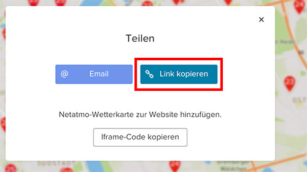

＃ioBroker.netatmo-crawler
ioBroker的netatmo-crawler适配器

=================

从Netatmo公用站检索信息

目录

=================

* [说明]（＃说明）
* [一般信息]（＃一般信息）
* [湿度]（＃湿度）
* [雨]（＃rain）
* [压力]（＃压力）
* [温度]（＃temperature）
* [Wind]（＃wind）
* [信息]（＃信息）
* [学分]（＃credits）
* [变更日志]（＃changelog）
* [许可证]（＃license）

指令

===========

若要查找您的首选气象站的URL，请按照下列步骤操作：

1.打开[Netatmo天气图]（https://weathermap.netatmo.com）
2.找到您的电台，然后单击共享图标

   

3.点击*复制链接*

   

4.将链接插入适配器的实例设置

   

一般信息

===================

“ Netatmo Crawler”会解析您附近的许多实际本地信息。您如何处理所有这些信息？以下是一些一般事实和示例：

湿度-------- Netatmo使用相对湿度，这是当前绝对湿度与最高可能绝对湿度（取决于当前空气温度）的比率。相对湿度为100％的读数表示空气完全被水蒸气饱和，不能再容纳更多的水，从而可能下雨。这并不意味着要下雨就必须使相对湿度为100％-云正在形成的地方必须为100％，但是靠近地面的相对湿度可能要小得多。

雨----用单位毫米。如果您希望每米立方米的单位升，则仍然可以使用。您可以将其用于在花园中浇水（例如）。

压力--------周围的空气很重，它压着它碰到的所有东西。该压力称为大气压或气压。
您应该用这个值做什么？听起来很简单：天气预报！高压=好天气，低压=坏天气。
正常的中间值为1013 mBar。
对于“真实的”天气预报，您应该需要几个小时的压力记录（我使用四个小时）。
如果下降，则未来应该是恶劣的天气，如果上升，则应该是良好的天气。
我找到了[预测脚本在这里](http://www.beteljuice.co.uk/zambretti/forecast.html)（称为zambretti方法，可预测90％）。
其他单位：1 mbar = 100 Pa = 1 hPa

温度-----------在这里您可以计算冷却温度水平。对于低温，风速（10°C或更低，用风计算）对于高温，可以使用热指数（25°C或更高，用湿度计算）。
示例脚本：

```
windchill1 = windchill(temp, windkmh); //Vars to-from IOBroker

function windchill(temperature, windspeed) {
	var windchill = 13.12 + 0.6215 * temperature - 11.37 * Math.pow(windspeed, 0.16) + 0.3965 *
			temperature * Math.pow(windspeed, 0.16);
	return windchill;
}

heatindex1 = heatindex(temp, hum); //Vars to-from IOBroker

function heat(temperature, humidity) {
	var heatindex = -8.784695 + 1.61139411 * temperature + 2.338549 * humidity - 0.14611605 *
			temperature * humidity - 0.012308094 * (temperature * temperature) -
			0.016424828 * (humidity * humidity) + 0.002211732* (temperature *
			temperature) * humidity + 0.00072546 * temperature * (humidity * humidity)
			- 0.000003582 * (temperature * temperature) * (humidity * humidity);
	return heatindex;
}
```

风----风速是衡量空气从高压向低压移动的一种方法，通常是由于温度变化引起的。
阵风强度是风的最高值，在短时间内（大约三秒钟）测量。
您应该为遮阳篷或Zambretti方法（上图）做一个脚本。

信息---- **此适配器使用Sentry库自动向开发人员报告异常和代码错误。**有关更多详细信息以及如何禁用错误报告的信息，请参见[哨兵插件文档](https://github.com/ioBroker/plugin-sentry#plugin-sentry)！ Sentry报告从js-controller 3.0开始使用。

学分

=======

非常感谢[反击](https://github.com/backfisch88)的最初想法和支持！

## Changelog

### 0.3.8
* (Bart19) small fix in error handling
### 0.3.7
* (Bart19) caches authorization token
### 0.3.6
* (Bart19) adds Sentry for error reporting
### 0.3.5
* (Bart19) fix for new netatmo website
### 0.3.4
* (Bart19) optimizes error handling
### 0.3.3
* (Bart19) changes some log level
* (Backfisch) adds more documentation
### 0.3.2
* (Bart19) fixes, that rain_yesterday was saved with value rain_today
### 0.3.1
* (Bart19) optimizes error handling
### 0.3.0
* (Bart19) adds timestamps, when last info retrieved from Netatmo and timestamp, when each measure was updated last. In addition, rain_yesterday added
### 0.2.0
* (Bart19) changes admin view. Now you can enter as many station urls as you want. In addition, you can select, how the data should be stored
### 0.1.2
* (Bart19) fix for station4 and introduces allowInit, so adapter will run once on config edits
### 0.1.1
* (Bart19) removes files from archive which are unnecessary
### 0.1.0
* (Bart19) implements automatic tests
### 0.0.8
* (Bart19) updates logo
### 0.0.7
* (Bart19) changes loglevel
### 0.0.6
* (Bart19) updates description
### 0.0.5
* (Bart19) bugfixes
### 0.0.4
* (Bart19) bugfixes
### 0.0.3
* (Bart19) bugfixes
### 0.0.2
* (Bart19) bugfixes
### 0.0.1
* (Bart19) initial release

## License

MIT License

Copyright (c) 2020 Bart19 <webmaster@bart19.de>

Permission is hereby granted, free of charge, to any person obtaining a copy
of this software and associated documentation files (the "Software"), to deal
in the Software without restriction, including without limitation the rights
to use, copy, modify, merge, publish, distribute, sublicense, and/or sell
copies of the Software, and to permit persons to whom the Software is
furnished to do so, subject to the following conditions:

The above copyright notice and this permission notice shall be included in all
copies or substantial portions of the Software.

THE SOFTWARE IS PROVIDED "AS IS", WITHOUT WARRANTY OF ANY KIND, EXPRESS OR
IMPLIED, INCLUDING BUT NOT LIMITED TO THE WARRANTIES OF MERCHANTABILITY,
FITNESS FOR A PARTICULAR PURPOSE AND NONINFRINGEMENT. IN NO EVENT SHALL THE
AUTHORS OR COPYRIGHT HOLDERS BE LIABLE FOR ANY CLAIM, DAMAGES OR OTHER
LIABILITY, WHETHER IN AN ACTION OF CONTRACT, TORT OR OTHERWISE, ARISING FROM,
OUT OF OR IN CONNECTION WITH THE SOFTWARE OR THE USE OR OTHER DEALINGS IN THE
SOFTWARE.