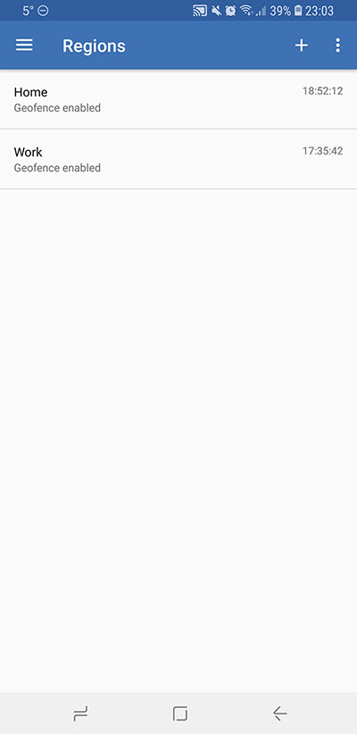

＃ioBroker.owntracks[OwnTracks]（https://owntracks.org/）可让您跟踪自己的位置。您可以建立您的私人位置日记或与您的家人和朋友分享。 OwnTracks是开源的，使用开放协议进行通信，因此您可以确保您的数据保持安全和私密。您可以在[Apple App Store（iOS）]（https://itunes.apple.com/us/app/mqttitude/id692424691?mt=8）或[Google Play商店（Android）中找到相应的智能手机应用程序](https://play.google.com/store/apps/details?id=org.owntracks.android)。
**目录**

1. [特点]（＃1-features）
2. [设置说明]（＃2-setup-instructions）
   1. [使用MQTT服务器]（＃21-connection-configuration-using-mqtt-server）
   2. [使用MQTT客户端]（＃22-connection-configuration-using-mqtt-client）
   3. [附加配置]（＃23-additional-configuration-using-mqtt-server-or-client）
3. [频道和状态]（＃3频道 - 州）
   1. [地点]（＃31-地点）
   2. [用户]（＃32用户）
4. [更改日志]（#changelog）
5. [许可证]（#licence）

## 1.特点
TBD

## 2.安装说明
您必须设置与[MQTT适配器](https://github.com/ioBroker/ioBroker.mqtt)相关的ioBroker.owntracks，它将作为依赖项安装。 MQTT适配器可以设置为MQTT服务器或MQTT客户端。

下表显示了一个比较：

|方法|优点/缺点|
| ------ | ------------- |
| MQTT服务器| ![＃c5f015]（https://placehold.it/15/c5f015/000000?text=+）完全加密的有效负载可能<br> ！[＃f03c15]（https://placehold.it/15/f03c15/000000?text=+）需要设置[动态DNS（DynDNS）]（https://en.wikipedia.org/wiki/Dynamic_DNS） <br> ！[＃f03c15]（https://placehold.it/15/f03c15/000000?text=+）打开通信所需的路由器配置端口（[更多此处](https://owntracks.org/booklet/guide/broker/#firewall)）|
| MQTT客户端| ！[＃c5f015]（https://placehold.it/15/c5f015/000000?text=+）完全加密的有效载荷可能<br> ！[＃f03c15]（https://placehold.it/15/f03c15/000000?text=+）使用Internet MQTT意味着所有流量都通过未知提供商进行路由（[更多信息，请参阅此处]（https：// owntracks） .ORG /小册子/导向/场景/＃MQTT模式）） <br> ！[＃f03c15]（https://placehold.it/15/f03c15/000000?text=+）仅在相应的提供商处提供对TLS的支持。 |

**重要说明：**收到特定有效载荷时，将生成ioBroker.owntracks中的状态！这意味着ioBroker中的位置将在用户第一次离开或进入该位置时生成**。
您将在下面看到目标结构（[有关详细列表，请参阅频道和州](#channels--states)）：

[![结构]（IMG / structure.png）](../../../en/adapterref/iobroker.owntracks/img/structure.png)

### 2.1。连接配置（使用MQTT服务器）
您必须完成以下步骤才能通过MQTT服务器设置ioBroker.owntracks：

1.设置指向您的IP地址的DynDNS，以及打开路由器中的端口
2.将MQTT适配器配置为具有相应端口的服务器
3.使用服务器设置配置所有客户端

#### 2.1.1。设置DynDNS和端口
在ioBroker中设置本地MQTT服务器时，必须设置动态DNS（DynDNS），它始终指向您当前的IP地址，并在路由器中打开端口以进行通信。

因此，设置您选择的DynDNS，它指向您的IP地址，例如https://www.noip.com/。
注册以创建帐户并选择您选择的主机名，例如`example.ddns.net`。请记住，这些主机名将在30天后在免费帐户中过期，这意味着您必须定期登录才能激活它们。

设置DynDNS后，将路由器配置为分别更新DynDNS。
如果您拥有FRITZ！Box，请导航至`Internet` - `Freigaben` - `DynDNS`并根据您的凭据进行配置：

[![MQTT服务器 - 路由器DynDNS配置]（img / mqtt_server_router_dyndns.png）](../../../en/adapterref/iobroker.owntracks/img/mqtt_server_router_dyndns.png)

此外，在路由器上打开一个端口，该端口指向ioBroker的本地IP地址。
通过导航到`Internet` - `Freigaben` - `Portfreigaben`并选择`Gerät für Freigaben hinzufügen`来完成此操作。在字段`Gerät`中选择您的ioBroker实例，然后单击`Neue Freigabe`：

[![MQTT服务器 - 路由器端口配置]（img / mqtt_server_router_adddevice.png）](../../../en/adapterref/iobroker.owntracks/img/mqtt_server_router_adddevice.png)

在弹出窗口中，选择`Portfreigabe`然后

 - 选择`Andere Anwendung`，
 - 在“Bezeichnung”字段中键入任何名称，
 - 选择`TCP`作为协议，
 - 在所有`port`字段中键入所需的端口（例如1987）。

[![MQTT服务器 - 路由器端口配置]（img / mqtt_server_router_port.png）](../../../en/adapterref/iobroker.owntracks/img/mqtt_server_router_port.png)

保存所有内容，您已完成此步骤。

#### 2.1.2。配置MQTT和Owntracks适配器
现在，转到ioBroker并创建MQTT适配器的新实例。
作为类型选择`Server/Broker`并键入上面选择的端口，该端口已在路由器配置中打开（例如1987）。

[![MQTT服务器连接配置]（img / mqtt_server_connection.png）](../../../en/adapterref/iobroker.owntracks/img/mqtt_server_connection.png)

在`Authentication settings`部分中选择您选择的任何`User`和`Password`。这些是下一步所必需的。

切换到ioBroker.mqtt中的_MQTT SETTINGS_选项卡并更改以下设置：

|设置|配置|注意|
| ------- | ------------- | ---- |
|所有主题的前缀| _leave empty_ | |
|掩盖发布自己的状态| mqtt.0。* |用您的ioBroker.mqtt实例替换0 |
|仅在更改时发布`yes`| |
|在订阅上发布状态| `yes`| |
|每条消息的跟踪输出| `no`| |
|发送状态（ack = true）也是`no`| |
|为set和get |使用不同的主题名称`no`| |
|为set和get |使用不同的主题名称`不`| |

最后，在ioBroker.owntracks适配器中选择已配置的MQTT实例，并可选择（但__highly recommended__）设置您选择的加密密钥：

[![Owntracks适配器设置]（img / owntracks_server_settings.png）](../../../en/adapterref/iobroker.owntracks/img/owntracks_server_settings.png)

#### 2.1.3。配置所有客户端
必须在Android / iOS应用中设置以下首选项：

| Android设置|配置|
| ------- | ------------- |
|连接/模式| `MQTT private`|
|连接/主机/端口|您选择的端口（例如`1987`）|
|连接/主机/ WebSockets | `false`（除非你知道你在做什么）|
|连接/标识/用户名|您在上一步中选择的`User` |
|连接/识别/密码|您在上一步中选择的`Password` |
|连接/识别/密码|您在上一步中选择的“密码” |
|连接/识别/ DeviceID |设备或人的名字（可以是任何东西）|
|连接/安全/ TLS | `off`|
|连接/安全/ TLS | `off` |
|高级/加密密钥| __highly recommended__：用于加密的密码短语（在上一步中选择）|

最后，通过抽屉中的“状态”条目验证Owntracks是否已连接到ioBroker实例：


如果一切都已成功设置，ioBroker.owntracks将创建下面的渠道和状态。

### 2.2。连接配置（使用MQTT客户端）
您必须完成以下步骤才能通过MQTT客户端设置ioBroker.owntracks：

1.设置在线托管的外部MQTT服务器，例如[CloudMQTT]（https://www.cloudmqtt.com/）
2.配置MQTT Cloud Broker并设置/验证客户端
3.使用相应设置（ioBroker的URL，端口和身份验证）将MQTT适配器配置为客户端
4.使用服务器设置配置所有客户端

#### 2.2.1。设置外部MQTT服务器
转到[https://www.cloudmqtt.com/](https://www.cloudmqtt.com/)并使用新帐户注册。
创建一个新实例，选择一个计划（名为_Cute Cat_的免费计划工作正常）并将其命名为_ioBroker_：


单击_Select Region_转到下一步，然后选择您附近的数据中心，例如_EU-West-1（爱尔兰）_：


单击_Review_验证您的设置，最后_Create Instance_。

#### 2.2.2。配置MQTT Cloud Broker
创建实例后，转到_SETTINGS_并将`Use username as clientid`设置为`Yes`：


__最重要的是___，转到_USERS和ACL_并为您正在使用的客户（例如智能手机）添加所需的用户，此外，为您的ioBroker添加特定用户：


最后，在同一页面上为下面的相应用户添加必要的_ACL_。这样做

1.选择`topic`
2.选择用户
3.输入“owntracks /＃”模式
4.选择`read`和`write`

您的结果应如下所示：


您已成功设置CloudMQTT，您将收到可通过_WEBSOCKET UI_查看的消息。

#### 2.2.3。配置MQTT适配器
对于此步骤，您将在CloudMQTT的_DETAILS_部分中找到必要的信息：


设置MQTT Cloud Broker后，转到ioBroker并设置MQTT实例。
下表显示了从CloudMQTT详细信息页面到ioBroker.mqtt配置的映射：

| CloudMQTT设置| ioBroker.MQTT配置|示例|
| ----------------- | --------------------------- | ------- |
|服务器|网址| `m24.cloudmqtt.com`|
| -  |安全| `yes`|
| -  |安全| `yes` |

对于_Authentication settings_，您可以通过_ACL_使用已在CloudMQTT上授权的任何用户（参见上文）。
切换到ioBroker.mqtt中的_MQTT SETTINGS_选项卡并更改以下设置：

|设置|配置|注意|
| ------- | ------------- | ---- |
|订阅模式| `#`| |
|所有主题的前缀| _leave empty_ | |
|仅在更改时发布`yes`| |
|在连接上发布自己的状态`yes`| |
|每条消息的跟踪输出| `no`| |
|发送状态（ack = true）也是`no`| |
|为set和get |使用不同的主题名称`no`| |
|客户ID | `iobroker`| __此用户必须通过CloudMQTT__ |上的_ACL_进行授权 |
|仅在更改时发布`yes`|
|仅在更改时发布`yes` |

最后，转到您的ioBroker.owntracks实例并选择已配置的MQTT实例

最后，在ioBroker.owntracks适配器中选择已配置的MQTT实例，并可选择（但__highly recommended__）设置您选择的加密密钥：

[![Owntracks适配器设置]（img / owntracks_client_settings.png）](../../../en/adapterref/iobroker.owntracks/img/owntracks_client_settings.png)

#### 2.2.4。配置所有客户端
必须在Android / iOS应用中设置以下首选项：

| Android设置|配置|
| ------- | ------------- |
|连接/模式| `MQTT private`|
|连接/主机/端口| CloudMQTT Sevrer端口（例如`24247`）|
|连接/主机/ WebSockets | `false`|
|连接/标识/用户名|在步骤2中通过_ACL_设置的`User`（见上文）|
|连接/识别/密码|该用户的各自`Password` |
|连接/识别/密码|分别是该用户的“密码” |
|连接/识别/ DeviceID |设备或人的名字（可以是任何东西）|
|连接/安全/ TLS | `off`（除非您有付费计划）|
|连接/安全/ TLS | `off`（除非你有付费计划）|
|高级/加密密钥| __highly recommended__：用于加密的密码短语（在上一步中选择）|

最后，通过抽屉中的“状态”条目验证Owntracks是否已连接到ioBroker实例：


如果一切都已成功设置，ioBroker.owntracks将创建下面的渠道和状态。

### 2.3。其他配置（使用MQTT服务器或客户端）
#### 2.3.1头像配置（在ioBroker.owntracks适配器内）
您可以为每个用户定义一个图标。只需按拖放或鼠标单击即可上传图像。它将自动缩放到64x64。
__名称必须等于OwnTracks app中的DeviceID .__

#### 2.3.2区域配置
要在owntracks适配器中设置位置，您必须在owntracks Android / iOS应用程序中创建区域。
为此，请转到抽屉中的“区域”


单击右上角的加号（+）创建一个新区域



使用右上角的位置按钮检索当前位置或自己在纬度和经度中键入它们。此外，指定位置的半径。如果您共享该位置，您的朋友（请参阅Android / iOS应用程序的抽屉）会在您进入/离开某个位置时收到通知。


## 3.频道和国家
如果您成功设置了ioBroker.underracks，则在收到相应的有效负载时将创建以下通道和状态**：

### 3.1。地点
对于`locations.<locationId>`中的每个位置

|国家|描述（可能的值）|
|:----- |:----------------------------- |
| ```accuracy```|位置地理坐标的准确性|
| ```creationDatetime```|日期 - 位置创建时间的时间|
| ```history```|用户进入/离开位置的历史记录|
| ```locationId```|位置的位置ID |
| ```locationName```|位置的名称|
| ```presence```|指示位置是否存在任何用户[```true```或```false```] |
| ```refreshed```|位置内最后一次更改的时间戳 |
| ```refreshedDatetime```|日期 - 位置内最后一次更改的时间 |
| ```users```|在位置呈现用户|
| ```users``` |在位置呈现用户|

### 3.2。用户
对于`locations.<userId>`中的每个用户

|频道|国家|描述（可能的值）|
|:------- |:----- |:----------------------------- |
| ```location```| ```current```|用户的当前位置|
| ```location```| ```enteredDatetime```|日期 - 用户输入当前位置的时间|
| ```location```| ```history```|用户进入/离开位置的历史记录|
| ```location```| ```last```|用户的最后位置|
| ```location```| ```left```|用户离开最后一个位置的时间戳|
| ```location```| ```leftDatetime```|日期 - 用户离开最后一个位置的时间|
| -  | ```accuracy```|纬度/经度的准确性|
| -  | ```alt_accuracy```|海拔准确度|
| -  | ```altitude```|海拔高度|
| -  | ```battery```|用户的设备电池电量|
| -  | ```connection```|用户的连接类型<br> - ```w```：电话连接到WiFi连接<br> - ```o```：手机离线<br> - ```m```：移动数据|
| -  | ```encryption```|用户的加密状态[```true```或```false```] |
| -  | ```latitude```|纬度|
| -  | ```longitude```|经度|
| -  | ```refreshed```|上次刷新的时间戳|
| -  | ```refreshedDatetime```|上次刷新的日期时间|
| -  | ```userConnected```|用户的连接状态[```true```或```false```] |
| -  | ```userId```|用户的用户ID |
| -  | ```userName```|用户的用户名|
| -  | ```userTid```|用户的跟踪器ID |
| -  | ```velocity```|用户的速度|
| -  | ```velocity``` |用户的速度|

## Changelog

### 1.0.0-beta.3 (2019-05-XX) [IN DEVELOPMENT]
- (zefau) FEATURE: Regions can now be maintained through ioBroker and published / received from all connected clients
   - (zefau) FEATURE: added possibilty to publish all regions / waypoints from Android / iOS to ioBroker
   - (zefau) FEATURE: added possibilty to publish regions / waypoints from ioBroker to all conneced clients

### 1.0.0-beta.2 (2019-05-14)
- (zefau) BUG: fixed issue with deeply nested history on both locations and users
- (zefau) BUG: fixed issue with transition event being reported multiple times

### 1.0.0-beta.1 (2019-05-01)
Refactored entire code and removed all MQTT package dependencies (to avoid / fix security issues and reduce complexity). Thus, added [MQTT adapter as dependency](https://github.com/ioBroker/ioBroker.mqtt) to manage all MQTT communication.
This major change comes with the following advantages:
- use both MQTT server as well as MQTT client (to use Internet MQTT server, such as [CloudMQTT](https://www.cloudmqtt.com/)) functionality (this adapter subscribes to foreign states of MQTT adapter)
- user avatars available in both server and client variant
- support TLS and websockets

## License
The MIT License (MIT)

Copyright (c) 2019 Zefau <zefau@mailbox.org>

Copyright (c) 2016-2019 bluefox <dogafox@gmail.com>

Permission is hereby granted, free of charge, to any person obtaining a copy
of this software and associated documentation files (the "Software"), to deal
in the Software without restriction, including without limitation the rights
to use, copy, modify, merge, publish, distribute, sublicense, and/or sell
copies of the Software, and to permit persons to whom the Software is
furnished to do so, subject to the following conditions:

The above copyright notice and this permission notice shall be included in
all copies or substantial portions of the Software.

THE SOFTWARE IS PROVIDED "AS IS", WITHOUT WARRANTY OF ANY KIND, EXPRESS OR
IMPLIED, INCLUDING BUT NOT LIMITED TO THE WARRANTIES OF MERCHANTABILITY,
FITNESS FOR A PARTICULAR PURPOSE AND NONINFRINGEMENT. IN NO EVENT SHALL THE
AUTHORS OR COPYRIGHT HOLDERS BE LIABLE FOR ANY CLAIM, DAMAGES OR OTHER
LIABILITY, WHETHER IN AN ACTION OF CONTRACT, TORT OR OTHERWISE, ARISING FROM,
OUT OF OR IN CONNECTION WITH THE SOFTWARE OR THE USE OR OTHER DEALINGS IN
THE SOFTWARE.