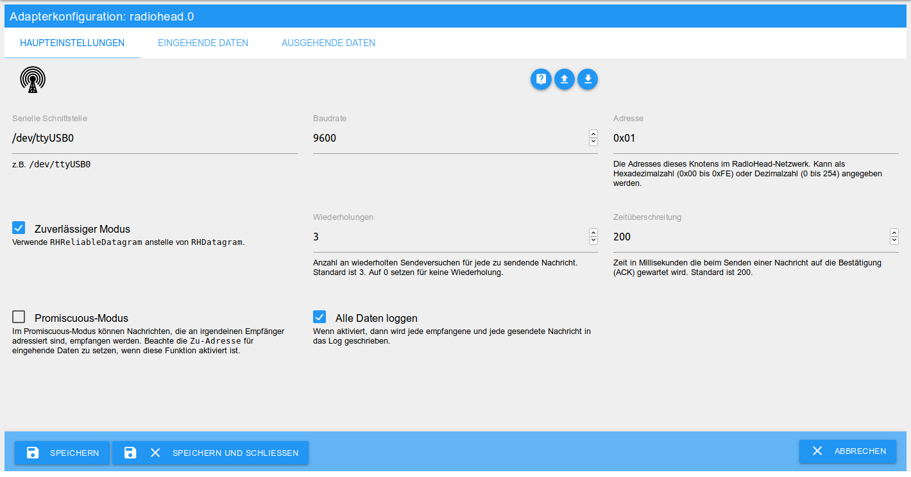

＃ioBroker.radiohead
适配器`radiohead`允许将RadioHead网络连接到ioBroker。

通过串行接口进行通信。
为了连接无线硬件，可以使用小型微处理器（例如，Arduino nano）作为网关。

[电台司令](http://www.airspayce.com/mikem/arduino/RadioHead/)是一个用于微处理器的基于数据包的开源无线电模块库。
它提供寻址，可靠，重复传输和确认的可变长度消息。

##功能
*从RadioHead网络中的其他节点接收消息/命令。
*将消息/命令发送到RadioHead网络中的其他节点。
*可单独配置的传入和传出数据对象。
*能够通过脚本发送RadioHead消息。
*可以通过脚本评估收到的RadioHead消息。

如果通过串行接口接收到与传入数据的对象模式匹配的消息，则从中提取数据并由适配器将数据写入对象的状态。

要发送数据，只需将数据写入配置的出站对象的状态，然后适配器根据已设置的模式发送数据。

##安装
适配器目前可通过* latest *存储库获得。

或者，可以通过URL`https://github.com/crycode-de/ioBroker.radiohead.git`进行安装。

##配置
配置窗口坚持三骑：

*主要设置
*传入数据
*传出数据

###主要设置


####串行接口
RadioHead通信的串行端口。

例子：

*`/ dev / ttyUSB0`（Linux）
*`COM1`（Windows）

####波特率
通信发生的波特率。对于RadioHead网络中的所有节点，这应该是相同的。

默认为`9600`。

####地址
RadioHead网络中ioBroker适配器的地址。

可以指定为十六进制数（`0x00`至`0xFE`）或十进制数（`0``254`）。不可能使用`0xFF`（或`255`），因为这是广播地址。

####可靠的模式
在可靠模式中，对于发送的每个消息，期望接收器确认（ACK）。
如果在设定的时间内未确认消息，则会再次发送。

如果激活，则使用`RHReliableDatagram`而不是RadioHead的`RHDatagram`。

####重复
如果缺少确认，则为要发送的每条消息发送重试次数。

默认为`3`。在`0`设置为不重复。

####超时
等待消息发送到确认（ACK）的时间（以毫秒为单位）。

默认为`200`。

####混杂模式
在混杂模式下，可以接收发往任何收件人的邮件。

启用此功能时，应正确设置传入数据的传入地址。

####所有数据日志
如果激活，则每个接收和发送的消息都将写入日志。

###传入数据


####名称
ioBroker对象的名称。对于适配器实例的传入数据必须是唯一的。

可以通过在名称中使用点来形成组。

对于每个数据记录，根据模式`radiohead.<instanz>.data.in.<name>`创建对象。

####角色
数据的作用对于处理接收的数据很重要。

开关，按钮和指示器被评估为真值。
对于所有其他角色，从接收的数据中提取数值并进行评估。

#### From-address
RadioHead网络中消息发送方的地址。

可以指定为十六进制数（`0x00`至`0xFE`）或十进制数（`0``254`）。
对于任何From地址，也可以使用`*`。

#### To-address
RadioHead网络中邮件收件人的地址。

可以指定为十六进制数（`0x00`至`0xFF`）或十进制数（`0``255`）。
对于任何其他地址，也可以使用`*`。

*注意：*如果没有激活混杂模式，则只能接收到自己地址和广播地址`0xFF`（或`255`）的消息。

####数据
这些是以逗号分隔的单个字节中接收的消息的数据。
基于该数据，分析和处理接收的消息。

字节可以指定为十六进制数（`0x00`至`0xFF`）或十进制数（`0``255`）。
作为任何字节的通配符，可以使用`*`。

要为接收值提取的数据字节必须用大的`D`标记，以便在处理期间识别数据。连续`D`字节的数量取决于所选的数据类型。

**特殊情况开关和指示灯：**

对于开关和指示器，可以指定由分号分隔的两组数据字节。
第一组用于`true`值，第二组用于`false`值。
如果仅指定了一个组，则接收当前状态。

**范例**

*固定字节“0x10”，32位浮点数，4个任意字节：`0x01，D，D，D，D，*，*，*，*`
*按钮的两个固定字节：`0x01,0x00`
*两组每个字节一个用于一个开关：`0x05; 0x06`

#### Type
这是ioBroker中的数据类型。
这里可能是* number *和* truth value *之间的选择。在真值的情况下，接收的值被转换为真值（`true`或`false`）。

####数据类型
数据类型定义接收的数据类型，从而定义数据字节的读取方法。

见[数据类型](#datentypen)。

####单位
ioBroker中相应值的单位。

#### Factor和offset
将接收值乘以并为其添加偏移量的因子。

`Wert = (Wert * Faktor) + Offset`

####十进制位置
舍入接收值（在分解和偏移计算之后）的小数位数。

###传出数据


####名称
ioBroker对象的名称。对于适配器实例的出站数据必须是唯一的。

可以通过在名称中使用点来形成组。

对于每个数据记录，根据模式`radiohead.<instanz>.data.out.<name>`创建对象。

####角色
数据的作用对于处理要发送的数据很重要。

开关，按钮和指示器作为真值发送。
对于所有其他角色，数值将嵌入要发送的数据中。

#### To-address
RadioHead网络中邮件收件人的地址。

可以指定为十六进制数（`0x00`至`0xFF`）或十进制数（`0``255`）。

对于到所有节点的广播消息，必须使用地址`0xFF`（或`255`）。

####数据
这是以逗号分隔的单个字节发送的消息数据。
基于该数据，建立要发送的消息。

字节可以指定为十六进制数（`0x00`至`0xFF`）或十进制数（`0``255`）。

要使用的数据的使用字节必须由大的`D`标识。连续`D`字节的数量取决于所选的数据类型。

**特殊情况开关和指示灯：**

对于开关和指示器，可以指定由分号分隔的两组数据字节。
第一组用于`true`值，第二组用于`false`值。
如果仅指定了一个组，则始终会发送该组。

**范例**

*固定字节“0x42”，16位整数：`0x42，D，D`
*按钮的两个固定字节：`0x01,0x02`
*两组两个字节，每组用于一个开关：`0x01,0x00; 0x01,0xFF`

#### Type
这是ioBroker中的数据类型。
这里可能是* number *和* truth value *之间的选择。对于真值，要发送的值将转换为`0x01`（`true`）或`0x00`（`false`）。

####数据类型
数据类型定义要发送的数据类型，因此也定义数据字节中的写入方法。

见[数据类型](#datentypen)。

####单位
ioBroker中相应值的单位。

##数据类型
接收和发送数据时，以下数据类型可用：

|数据类型|说明|价值范围|数据字节|
|---|---|---|---|
| `int8`|有符号的8位整数| -128到127 | 1 |
| `int16_le`，`int16_be`|有符号的16位整数| 0到32767 | 2 |
| `uint16_le`，`uint16_be`|无符号16位整数| 0到65535 | 2 |
| `int32_le`，`int32_be`|有符号的32位整数| 0至4294967295 | 4 |
| `uint32_le`，`uint32_be`|无符号32位整数| 0至4294967295 | 4 |
| `float32_le`，`float32_be`| 32位浮点数| -3.4E + 38到+ 3.4E + 38,7位小数| 4 |
| `double64_le`，`double64_be`| 64位浮点数| -1.7E + 308到+ 1.7E + 30，小数点后16位| 8 |
| `double64_le`，`double64_be` | 64位浮点数| -1.7E + 308到+ 1.7E + 30，小数点后16位| 8 |

结尾`_le`和`_be`各自表示具有多个字节的数据类型的字节顺序（字节顺序）。这取决于远程站如何发送或处理数据。

*`_le` - *little-endian* 首先是最低有效字节
*`_be` - *big-endian* 最重要的字节优先

##在脚本中使用
可以使用脚本发送RadioHead消息并评估收到的消息。

###通过脚本发送
对于通过脚本发送，可以使用函数`sendTo`。

**实施例：**

```js
sendTo('radiohead.0', 'send', {
    to: 0x02, // Zu-Adresse
    data: [0x01,0x02,255] // zu sendende Daten-Bytes als Array oder Buffer
}, (ret) => {
    log('ret: ' + JSON.stringify(ret));
    // -> ret: {}
    if (ret.error) {
        log('error sending message', 'warn');
    }
});
```

如果消息未成功发送，则`ret.error`设置为相应的错误。

###通过脚本评估收到的消息
对于每个收到的消息，更新对象`radiohead.<instanz>.data.incoming`，并将值设置为具有接收数据的对象。
可以相应地评估此更改。

**实施例：**

```js
on({id: "radiohead.0.data.incoming", change:'any'}, (obj) => {
    log('incoming changed: ' + JSON.stringify(obj.state.val));
    // -> incoming changed: {"data":[1,0],"length":2,"headerTo":1,"headerFrom":2,"headerId":47,"headerFlags":0}
});
```

##适配器信息
适配器的每个实例都提供以下信息：

|对象|说明|
|---|---|
| info.connection |适配器是否连接到串口的指示灯 |
| info.lastReceived |收到最后一个RadioHead消息的时间|
| info.lastSentOk |成功发送最后一个RadioHead消息的时间|
| info.lastSentError |最后一次RadioHead消息发送错误的时间|
| info.receivedCount |收到的RadioHead消息数量|
| info.retransmissionsCount |重试尝试发送消息的次数|
| info.sentErrorCount |错误发送的消息数|
| info.sentOkCount |已成功发送的消息数|

如有必要，可以通过写入对象`actions.resetCounters`将消息的计数器重置为0。

## Changelog
### 1.0.1 (2019-07-30)
* (Peter Müller) license  update

### 1.0.0 (2019-07-28)
* (Peter Müller) initial release

## License

Copyright (c) 2019 Peter Müller <peter@crycode.de>