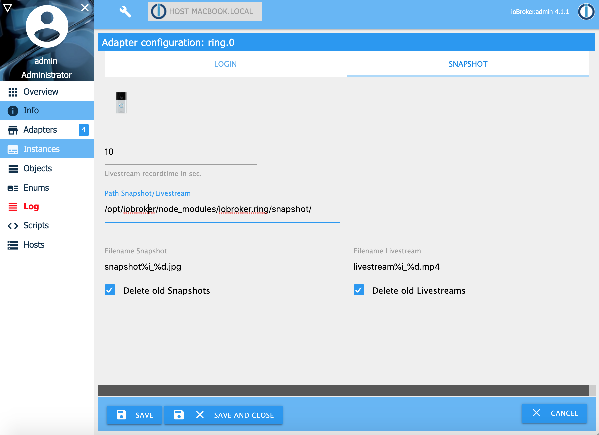

＃环适配器
需要node.js 10.0或更高版本以及Admin v3。

Ring适配器可与Ring设备一起使用，例如Ring Video门铃和Ring Cam，并显示是否有人敲响了门铃或是否检测到运动。如果检测到运动或门铃，或者您将SIP信息与SIP客户端一起用于SIP视频会议，则Ring Video Doorbell或Cam将发送视频流。
不幸的是，快照和实时流功能无法正常工作。不幸的是，我对此没有任何影响。在创建问题之前，请考虑这一点。
适配器将不提供所有环形设备，因为使用的API不包括所有环形设备。

例如，您可以在[http://icanblink.com/](http://icanblink.com/)上使用Blink SIP客户端。要使视频正常播放，请进入Blink的偏好设置，然后在“帐户”下，将标签切换到“媒体”，然后取消选中“ RTP选项”下的“加密音频和视频”。请注意，几秒钟后SIP信息就会过期！希望我能尽快支持视频流。不幸的是，[ring.com](https://ring.com)没有支持此功能的官方API。
如果您按下livestreamrequest按钮，则会获得新的SIP信息以建立SIP视频通话会话。如果您使用的是[ring.com](https://ring.com)云，则在历史记录下会找到指向上一个运动/门铃录制视频的http链接。

##安装与配置
安装适配器后，您必须输入[ring.com](https://ring.com)帐户的电子邮件和密码以及令牌。现在，Ring要求所有帐户都使用双向身份验证（2fa）。要获取令牌，请在您的shell上执行以下操作。

```
npx -p ring-client-api ring-auth-cli
```

要么

```
# Unix
cd /opt/iobroker/node_modules/iobroker.ring/
npm i ring-client-api

cd /opt/iobroker/node_modules/iobroker.ring/node_modules/ring-client-api
node ring-auth-cli
```


您可以在直播中使用特殊变量，并在snapshort路径和文件名中使用。此变量将被计数器，时间戳记，振铃ID或振铃种类代替。

*％d：Unix时间戳。示例：test_％d-> test_1588331430061
*％i：您的环形设备的ID：例如：test_％i-> test_234567890
*％n：自环实例启动以来的计数器。示例：test_％n-> test_1
*％k：您的铃声设备的种类：例如：test_％k-> test_doorbel



##对象


##示例
如果检测到运动或门环，则进行更改的示例：

```
on({id: "ring.0.doorbell_4711.kind"/*Kind*/},  (obj) => {
  if(obj.state.val == 'ding')   console.log("Someone is at the door");
  if(obj.state.val == 'motion') console.log("Motion detected");
});
```

## Changelog

### 1.1.4 (23.05.2020)
* (Stübi) Add new libraries  

### 1.1.3 (06.05.2020)
* (Stübi) Fixed error of missing objects 

### 1.1.2 (02.05.2020)
* (Stübi) Fixed health info like missing battery status (Issue #22, Issue #25) 
* (Stübi) Change error handling
* (Stübi) Providing Stick Up Cam (BETA)
* (Stübi) Using variables in the filename of the livestream or snapshot 

### 1.1.1 (02.05.2020)
* (Stübi) Bugfixing
* (Stübi) User can enable/disable external sentry logging

### 1.1.0 (01.05.2020)
* (Stübi) Node 10 is now required, Node 12 recommended. If you use Node 8 or less, the adapter will stop immediately.
* (Stübi) Tested with js-controller 3. I recommend using js-controller 3 or higher because of sentry logging and more features in the future 
* (Stübi) Snapshot link will be shown as https or http in state (Issue #18)
* (Stübi) Livestream link added and a request button added to get new livestream
* (Stübi) Old snapshots and livestreams can be deleted on the filesystem
* (Stübi) Sentry logging added
* (Stübi) Small improvements and bugfixing   
* (Stübi) Add a Two-Factor Auth (2fa) description (Issue #14, Issue #13, Issue #19)

### 1.0.7 (24.12.2019)
* (Stübi) Bugfixing

### 1.0.6 (20.12.2019)
* (Stübi) Bugfixing: Login with username and password changed
* (Stübi) New feature (BETA): Now you can make snapshots in jpg and a livestream in mp4 format. Unfortunately the snapshot / livestream does not work always! 

### 1.0.5 (18.04.2019)
* (Stübi) Bugfixing 
* (Stübi) Using new API. With this API livestreaming and snapshots are possible (work still in progress and not supported in this version)
* (Stübi) Fixed an error with js-controller 2.0. You need at least this version with js-controller 2.0
* (Stübi) two face authentication


### 1.0.4 (17.04.2019)
* (Stübi) Bugfixing for Ring Pro 

### 1.0.3 (09.03.2019)
* (Stübi) Major change! I had to change the used ring.com API to an other API. The old one did not work anymore. For this reason, a lot has to be redesigned.  

### 1.0.2 (01.02.2019)
* (Stübi) More debug information 

### 1.0.1 (05.01.2019)
* (Stübi) Support js-controller compact mode 

### 1.0.0 (04.01.2018)
* (Stübi) Add camera device. For this reason, the device name changed from doorbot to doorbell.

### 0.1.3 (20.12.2018)
* (Stübi) Update error handling

### 0.1.2 (17.12.2018)
* (Stübi) Update error handling

### 0.1.1 (15.12.2018)
* (Stübi) Improvements

### 0.1.0 (14.12.2018)
* (Stübi) First Version

## License
The MIT License (MIT)

Copyright (c) 2020 Thorsten <thorsten@stueben.de> / <https://github.com/schmupu>

Permission is hereby granted, free of charge, to any person obtaining a copy
of this software and associated documentation files (the "Software"), to deal
in the Software without restriction, including without limitation the rights
to use, copy, modify, merge, publish, distribute, sublicense, and/or sell
copies of the Software, and to permit persons to whom the Software is
furnished to do so, subject to the following conditions:

The above copyright notice and this permission notice shall be included in
all copies or substantial portions of the Software.

THE SOFTWARE IS PROVIDED "AS IS", WITHOUT WARRANTY OF ANY KIND, EXPRESS OR
IMPLIED, INCLUDING BUT NOT LIMITED TO THE WARRANTIES OF MERCHANTABILITY,
FITNESS FOR A PARTICULAR PURPOSE AND NONINFRINGEMENT. IN NO EVENT SHALL THE
AUTHORS OR COPYRIGHT HOLDERS BE LIABLE FOR ANY CLAIM, DAMAGES OR OTHER
LIABILITY, WHETHER IN AN ACTION OF CONTRACT, TORT OR OTHERWISE, ARISING FROM,
OUT OF OR IN CONNECTION WITH THE SOFTWARE OR THE USE OR OTHER DEALINGS IN
THE SOFTWARE.