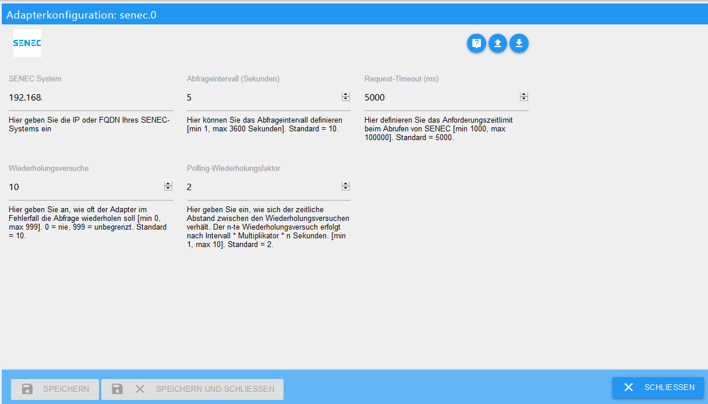

＃ioBroker.senec
##用于ioBroker的SENEC适配器
该适配器是为Senec Home V2.1系统开发的。
Senec.Home系统中不能更改任何值。故意避免了安全负担。
Senec当前不再提供通过Web界面影响削峰的可靠方法。为此，必须尝试mein-senec.de。
其他系统（例如V3）是否也可以使用它取决于它们是否也基于lala.cgi并提供相同的JSON信息。
即使集成到Senec.Clound中，也不能保证仍可以通过Web界面访问数据（请参考现场报告）。

### SENEC.Home
它是一个系统，其核心是锂离子电池，该电池可存储和释放屋顶上太阳能系统产生的电能。它的工作原理与智能手机，笔记本电脑或无绳螺丝刀中的电池完全相同。原则上，它也具有相同的成熟技术。如果您在屋顶上发电的电量超过了在房屋中使用自己的电量，那么电力不会流入电网，而是流入您的仓库。您可以在天黑或有云升起且发电量少或没有电时使用它。然后，您还可以在晚上使用自己的太阳能来操作电视或烹饪食物。

##安装前的要求
使用ioBroker来运行Senec.Home存储系统的前提是电工必须成功安装该系统。该系统还必须与ioBroker位于同一网络中。

###安装
适配器的实例是通过ioBroker管理界面安装的。
适配器实例的安装完成后，配置窗口将自动打开。

##配置
###主设置窗口

|领域|描述 |
|:-------------|:-------------|
| SENEC系统|将在此处指定所需的Senec.Home系统的IP地址。如果网络中有可用的DNS，则还可以指定FQDN |
|查询间隔|在这里您可以输入Senec.Home系统将检索的时间间隔（毫秒）。 （默认值：10） |
|请求超时|在此处输入毫秒数，在该毫秒数之前，Senec.Home系统必须响应请求，然后才能取消请求。 （默认值：5000） |
|重试尝试|发生错误时查询Senec系统的尝试次数。启动适配器时，此方法不适用-如果无法访问系统，则适配器将结束其工作。 （默认值：10） |
|轮询重试因子|此值可用于影响重试尝试之间的间隔。适用以下条件：第n次重试尝试发生在间隔*乘数*尝试n-1之后的n秒之后。示例：使用默认值，第一次重试尝试是在初始尝试后20秒，第二次重试尝试是在第一次尝试后40秒，成功的数据检索将重置计数器以进行重试。 |

完成配置后，使用`SPEICHERN UND SCHLIEßEN`退出配置对话框。
然后，这将重新启动适配器。

##个实例
适配器的安装已在§SSSSS_0§§区域中创建了Sonnen适配器的活动实例。

可以在ioBroker服务器上创建多个Senec Adapter实例。相反，Senec.Home系统也可以与多个ioBroker服务器一起运行。如果一台ioBroker服务器要控制多个设备，则应为每个系统创建一个实例。   实例的状态字段的颜色显示适配器是否已激活并已连接到系统。如果鼠标指针指向该符号，则会显示更多详细信息。

##适配器的对象
在§SSSSS_0§§部分中，树状结构中列出了集线器中适配器识别的所有设备和活动。

然后将对象分为状态。
列出每个数据点及其关联的数据类型和授权。
当前只能读取权限（R）。每个数据点至少可以读取（R）。
要搜索特定的数据点，我们建议使用“ CTRL + F”组合键。

###状态
####频道：信息
*信息连接

    |数据类型|权限|
    |:---:|:---:|
    |布尔值| R |

   *仅可读的布尔值，在ioBroker和Senec.Home之间建立连接时为true。

####频道：BMS
* MODULES_CONFIGURED

    |数据类型|权限|
    |:---:|:---:|
    |号| R |

   *仅可读数字，表示系统中配置了多少个模块。

* MODULE_COUNT

    |数据类型|权限|
    |:---:|:---:|
    |号| R |

   *仅可读的数字，表示系统中连接了多少个模块（包括未配置的模块）。

####频道：ENERGY
* GUI_BAT_DATA_CURRENT

    |数据类型|权限|
    |:---:|:---:|
    |号| R |

   *唯一可读的数字，指示当前电池电流（以安培为单位）。

* GUI_BAT_DATA_FUEL_CHARGE

    |数据类型|权限|
    |:---:|:---:|
    |号| R |

   *仅可读数字，以系统百分比表示。

* GUI_BAT_DATA_VOLTAGE

    |数据类型|权限|
    |:---:|:---:|
    |号| R |

   *仅可读数字，表示当前电池电压（伏特）*

* GUI_BAT_DATA_POWER

    |数据类型|权限|
    |:---:|:---:|
    |号| R |

   *仅可读数字，表示当前正在向电池供电或从电池中移除多少瓦特（负值）。

* GUI_BOOSTING_INFO

    |数据类型|权限|
    |:---:|:---:|
    |布尔值| R |

   *仅可读的布尔值，其含义尚不清楚。

* GUI_CHARGING_INFO

    |数据类型|权限|
    |:---:|:---:|
    |布尔值| R |

   *仅可读的布尔值，指示电池是否正在充电。

* GUI_GRID_POW

    |数据类型|权限|
    |:---:|:---:|
    |号| R |

   *唯一可读的数字，指示当前从电网拉出或馈入电网的瓦数（负值）。

* GUI_HOUSE_POW

    |数据类型|权限|
    |:---:|:---:|
    |号| R |

   *唯一可读的数字，表示房屋当前正在使用多少瓦特。

* GUI_INVERTER_POWER

    |数据类型|权限|
    |:---:|:---:|
    |号| R |

   *仅可读数字，表示光伏系统当前正在产生多少瓦特。

* STAT_HOURS_OF_OPERATION

    |数据类型|权限|
    |:---:|:---:|
    |号| R |

   *唯一可读的数字，表示系统的工作时间。

* STAT_MAINT_REQUIRED

    |数据类型|权限|
    |:---:|:---:|
    |布尔值| R |

   *仅可读的布尔值，指示系统是否需要维护。

* STAT_STATE

    |数据类型|权限|
    |:---:|:---:|
    |号| R |

   *唯一的代表系统状态的数字。

* STAT_STATE_Text

    |数据类型|权限|
    |:---:|:---:|
    |字符串| R |

   *仅可读的字符串，以纯文本形式指示系统的状态。不幸的是，我们只有德文的Senec原始文本。

####频道：STATISTIC
* STAT_DAY_BAT_CHARGE

    |数据类型|权限|
    |:---:|:---:|
    |号| R |

   *唯一可读的数字，表示今天的电池已存储了多少kWh。

* STAT_DAY_BAT_DISCHARGE

    |数据类型|权限|
    |:---:|:---:|
    |号| R |

   *唯一可读的数字，表示今天从电池中移除了多少千瓦时。

* STAT_DAY_E_GRID_EXPORT

    |数据类型|权限|
    |:---:|:---:|
    |号| R |

   *唯一可读取的数字，表示今天已向电网馈送了多少千瓦时。

* STAT_DAY_E_GRID_IMPORT

    |数据类型|权限|
    |:---:|:---:|
    |号| R |

   *唯一可读的数字，表示今天从网络中汲取了多少千瓦时。

* STAT_DAY_E_HOUSE

    |数据类型|权限|
    |:---:|:---:|
    |号| R |

   *唯一可读的数字，表示当前的房屋消耗（千瓦时）。

* STAT_DAY_E_PV

    |数据类型|权限|
    |:---:|:---:|
    |号| R |

   *唯一可读取的数字，表示今天的光伏系统产生了多少千瓦时。

####频道：SYS_UPDATE
* NPU_IMAGE_VERSION

    |数据类型|权限|
    |:---:|:---:|
    |号| R |

   *仅可读取的数字，其值为修订版NPU-IMAGE（*

* NPU_VER

    |数据类型|权限|
    |:---:|:---:|
    |号| R |

   *唯一的数字，带有修订号NPU-REGS的值*

* UPDATE_AVAILABLE

    |数据类型|权限|
    |:---:|:---:|
    |布尔值| R |

   *唯一的可读布尔值，指示是否有可用的更新（但是，这些值由Senec提供并自动导入）。

####频道：WIZARD
* APPLICATION_VERSION

    |数据类型|权限|
    |:---:|:---:|
    |字符串| R |

   *仅可读文本，带有修订版MCU的值。

* CONFIG_LOADED

    |数据类型|权限|
    |:---:|:---:|
    |布尔值| R |

   *仅可读的布尔值，指示是否已加载配置（此值不应永久不正确）。

* INTERFACE_VERSION

    |数据类型|权限|
    |:---:|:---:|
    |字符串| R |

   *仅可读文本，具有修订版GUI的值。

* SETUP_NUMBER_WALLBOXES

    |数据类型|权限|
    |:---:|:---:|
    |号| R |

   *唯一可读的数字，表示系统中配置了多少个墙盒。

* SETUP_WALLBOX_SERIAL [0..3]

    |数据类型|权限|
    |:---:|:---:|
    |字符串| R |

   *仅可读取的文本，指定可能存在的壁挂箱0-3的序列号。

## Changelog

### 1.0.6 (NoBl)
* Added missing state descriptions

### 1.0.5 (2020-03-07) (NoBl)
* Added States for: Energy: GUI_BAT_DATA_VOLTAGE, GUI_BAT_DATA_CURRENT, STAT_HOURS_OF_OPERATION; Sys_update: NPU_VER, NPU_IMAGE_VERSION, Wizard: APPLICATION_VERSION, INTERFACE_VERSION
* Readme and Documentation (EN exists, now) updated
* Changed behavior for unknown values completely. They will now be stored as string plus prefixed with "REPORT TO DEV:" so users can easily report back what needs updating.
* added handling for "st_" values in json
* added additional configuration options
* changed retry-behaviour in case of connection issues, ...

### 1.0.4 (2020-03-06)
* (NoBl) Repo URL updated
### 1.0.3 (2020-03-06)
* (NoBl) added link to documentation in german
### 1.0.2 (2020-03-04)
* (NoBl) added missing status codes (85 in total now)
* (NoBl) added status code to status message for easier reference
* (NoBl) added states for wallboxes and battery modules
### 1.0.1
* (NoBl) updated readme
### 1.0.0
* (NoBl) initial release

## License
MIT License

Copyright (c) 2020 Norbert Bluemle <github@bluemle.org>

Permission is hereby granted, free of charge, to any person obtaining a copy
of this software and associated documentation files (the "Software"), to deal
in the Software without restriction, including without limitation the rights
to use, copy, modify, merge, publish, distribute, sublicense, and/or sell
copies of the Software, and to permit persons to whom the Software is
furnished to do so, subject to the following conditions:

The above copyright notice and this permission notice shall be included in all
copies or substantial portions of the Software.

THE SOFTWARE IS PROVIDED "AS IS", WITHOUT WARRANTY OF ANY KIND, EXPRESS OR
IMPLIED, INCLUDING BUT NOT LIMITED TO THE WARRANTIES OF MERCHANTABILITY,
FITNESS FOR A PARTICULAR PURPOSE AND NONINFRINGEMENT. IN NO EVENT SHALL THE
AUTHORS OR COPYRIGHT HOLDERS BE LIABLE FOR ANY CLAIM, DAMAGES OR OTHER
LIABILITY, WHETHER IN AN ACTION OF CONTRACT, TORT OR OTHERWISE, ARISING FROM,
OUT OF OR IN CONNECTION WITH THE SOFTWARE OR THE USE OR OTHER DEALINGS IN THE
SOFTWARE.