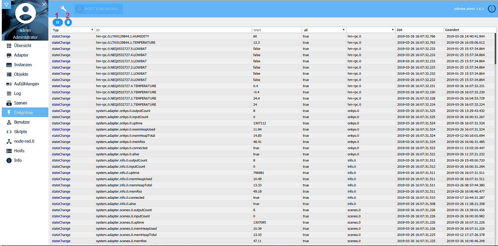

所有数据点的当前状态都显示在此选项卡中。
此处无法更改值。

##标题行
在标题行中有最重要流程的图标。每个图标都有上下文帮助。为此，只需在图标上按住鼠标一段时间即可。

###详细图标：
### 1 - 暂停视图
使用此按钮，您可以停止最新事件的当前显示。然后按钮变为黄色背景，在该背景上“错过”事件的数量会增加。

!> 由于事件有时会在毫秒范围内更新，因此可能会有延迟，包括显示冻结

再次单击该按钮将启动实时显示。

### 2 - 删除显示
此按钮清除屏幕

##页面内容
现有事件显示在页面上的表格中。最近的事件在顶部。

通过单击列标题，您可以根据特定条件进行过滤。

### 1 - 类型
这里要么 ***stateChange*** 是一个值的更新，要么 ***objectChange*** 这些也是两个过滤器选项。

### 2 - 身份证
这是对应数据点的唯一名称，根据由适配器名称、实例编号、设备名称、通道名称、数据点名称组成的结构。

在这里，您可以过滤完整的 ID，也可以过滤其中的一部分，例如所有 TEMPERATURE 数据点。

### 3 - 值
这是相应数据点的当前值。

### 4 - 确认
如果此值已更改并且已被系统采用，则该值为真，否则为假。

这些也是过滤器选项

### 5 - 来源
这表明哪个实例对数据点进行了最后一次更改。

您可以在此列中过滤这些内容。

### 6 - 时间
这是上次更新数据点的时间戳。

### 7 - 改变
这是数据点的值上次更改的时间戳。