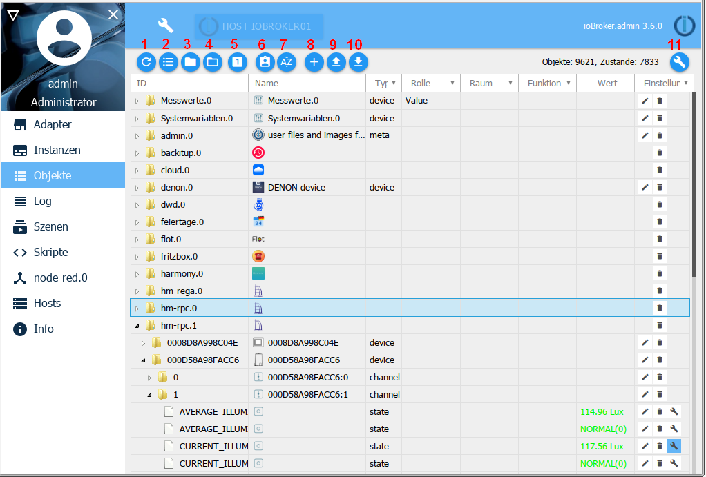
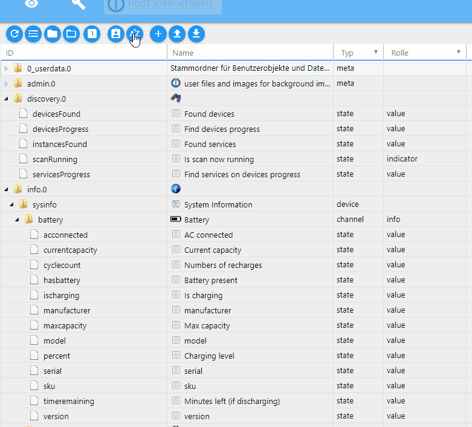
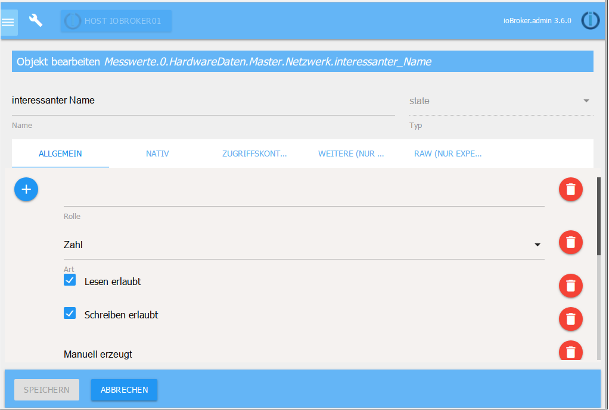

＃对象窗口
？&gt; ***这是一个占位符***。   帮助ioBroker并扩展本文。请注意[ioBroker样式指南](community/styleguidedoc)，以便更容易接受更改。

＃对象选项卡
所有托管对象都位于此选项卡下。对于每个实例，都会在此处创建一个文件夹，其中创建的数据点处于分层结构中。也可以在此处手动创建和删除对象。可以上传或下载整个对象结构。另一个按钮可以显示专家视图。

##标题行
标题栏包含最重要过程的图标。每个图标都有上下文帮助。
只需用鼠标停留在图标上一会儿即可。

###详细的图标：
** 1.）刷新视图**

如果看不到刚刚创建的对象，则单击此图标有助于更新页面状态。

** 2.）更改显示**

此按钮更改此页面上对象的显示。

如果该按钮处于活动状态，则所有对象均按ID的字母顺序列出。如果未激活此按钮，则根据实例以树状结构按字母顺序分层显示对象。

在这两种情况下，顶部都会显示自己创建的名称空间。

>注意！切换视图可能需要很长时间

接下来的两个图标在树形结构中可见。

** 3.）折叠所有主题**

** 4.）扩大所有学科领域**

使用这两个按钮，可以打开或关闭整个树结构。

** 5.）状态视图**

该按钮显示有关数据点各自状态的更多信息。 （切换模式）

折叠菜单栏

>注意：由于大量数据，在列表视图中使用此视图可能会导致显示器挂起。

** 6.）管理员模式**

选择此图标时，将显示更多对象（切换功能）。

这些对象（及其目录）是系统对象，不应常规使用，因为管理员的更改/更新可能导致结构更改，从而导致个人数据丢失。

** 7.）按字母顺序排序**

在文件夹中按ID或名称排序。

** 8.）添加**

选择此图标后，可以添加其他对象。如果选择了文件夹，则将其作为对象结构中的父文件夹。将打开一个配置窗口：

现在必须选择新对象的名称，从而根据层次结构将设备，通道或数据点用作类型。逻辑值，开关，字符串，数字，值列表，字段，对象和混合值可用作数据点类型。

单击确定确认输入窗口后，将打开另一个窗口：

仍然可以在此处输入一些数据。因此，可以将角色和图标添加到对象中。

在其他选项卡下，对象还有其他属性。每个对象都有此类信息。

创建全新的名称空间时，需要考虑两件事：

*不能选择任何对象。您可以通过重新打开“对象”选项卡来完成此操作。
*顶部对象必须以句点和数字结尾（例如MyNamespace.0）。

然后可以在其中创建下一个级别。

** 9.）上传**

使用此按钮，完整的对象结构作为json文件上传到ioBroker服务器

** 10.）下载**

使用此按钮，所选的对象结构从ioBroker服务器作为json文件下载并可以保存。

##页面内容

现有对象以表格形式显示在页面上。

该表由以下几列组成（列标题1和2和其他列的下拉菜单下的字段用作过滤条件）。图片中的表按层次结构排序，并且已经打开了一些子项目（节点）：

*** 1.）ID ***

这些是对象层次结构的顶层。这里的顶层是实例的名称，包括数据的相应结构。

** 2.）名称**

在此列中指定对象的名称。此外，前面的图标显示了它是哪个层次结构级别（设备，通道或数据点）

此列中的值是可编辑的。

** 3.）类型**

此处再次明确提到层次结构级别的类型，该类型已经在前面的图标的“名称”列中显示。使用列标题中的下拉菜单，您可以按这些类型进行过滤，例如仅显示所有数据点。

** 4.）角色**

角色指定用户界面（例如.vis和material）应如何处理此数据点。
原则上，使用术语简要描述此对象的功能。然后，您可以再次过滤。

此列中的值是可编辑的。单击该字段将显示一个包含大量条目的下拉菜单，但是也可以提供免费条目

** 5.）房间**

如果此对象已分配给房间，则在此处显示。这也可以搜索对象时进行过滤。

此列中的值是可编辑的。这样，仍然可以将对象分配给房间。如果单击该字段，则会打开一个弹出窗口，其中包含先前创建的房间。

** 6.）功能**

此列包含分配了相应对象的交易。

此列中的值是可编辑的。这样，仍然可以将对象分配给交易。如果您单击该字段，则会打开一个弹出窗口，其中包含先前创建的交易。

** 7.）价值**

如果对象是数据点，则在此显示该数据点的当前值。

** 8.）设置**

1.）如果单击铅笔图标，则会打开一个窗口，其中包含该对象的属性。创建新对象时，该窗口已经显示在上方。可以在此处更改对象的属性。仅当您确切知道使用该功能时，才应格外小心地使用此功能。

2.）单击垃圾桶图标将删除该对象及其层次结构中位于其下方的所有对象。出于安全原因，将出现一个窗口，在其中必须再次确认删除。

3.）仅在至少安装了一个历史记录实例（历史记录，InfluxDB或SQL）时，才会显示扳手图标。可以在此处配置用于记录历史数据的数据点。可以在历史记录适配器的描述中找到更多信息。

使用标题栏中的扳手，可以对所有符合当前过滤条件的数据点同时执行此操作。因此，有必要仔细检查是否以仅包含所需数据点的方式选择了此页面上的过滤条件。

用于过滤此列的下拉菜单与带有记录数据的数据点有关。
在这里，有，没有和所有以及已安装的历史实例均可用。