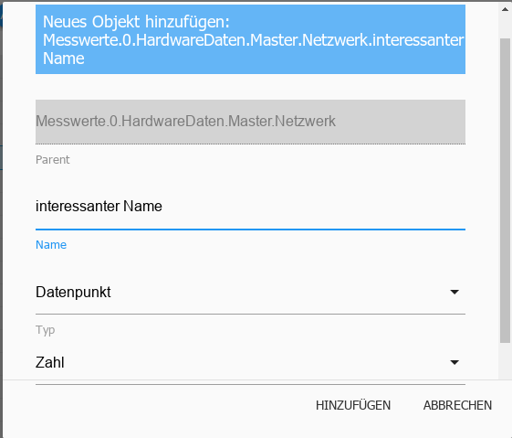

#The Objects窗口
？&gt; ***这是一张通配符***。   帮助ioBroker并扩展这篇文章。请注意[ioBroker风格指南](community/styleguidedoc)，以便更容易采用这些更改。

＃标签对象
在此选项卡下是所有托管对象。对于每个实例，在此创建一个文件夹，其中由其创建的数据点处于分层结构中。也可以在此处手动创建和删除对象。可以上载或下载整个对象结构。另一个按钮允许您查看专家视图。

##标题栏
标题栏包含最重要流程的图标。每个图标都有一个上下文帮助。
只需将鼠标停留在图标上一段时间即可。

###详细图标：
** 1.）更新视图**

如果刚刚创建的对象不可见，单击此图标将有助于使页面状态保持最新。

** 2.）更改演示**

此按钮可更改此页面上对象的显示。

如果按钮处于活动状态，则所有对象都按ID按字母顺序排序。如果此按钮未激活，则按实例将对象按字母顺序显示为树结构。

在这两种情况下，自创建的命名空间都显示在顶部。

>注意！观点的改变可能需要很长时间

然后，在树结构中可以看到接下来的两个图标。

** 3.）关闭所有主题**

** 4.）展开所有主题**

使用这两个按钮，可以打开或关闭整个树结构。

** 5.）状态视图**

此按钮显示有关数据点各自状态的更多信息。 （切换模式）

这里有折叠的菜单栏

>注意：由于数据泛滥，在列表视图中使用此视图可能会导致显示挂起。

** 6.）管理员模式**

选择此图标后，将显示更多对象（切换功能）。

这些对象（及其目录）是系统对象，不应用于正常使用，因为管理员的更改/更新可能导致结构更改，从而导致个人数据丢失。

** 7.）按字母顺序排序**

此按钮在此处无效

** 8.）添加**

选择此图标后，可以添加更多对象。如果选择了文件夹，则在对象结构中将其用作父文件夹。配置窗口打开：

这里，现在必须选择新对象的名称，从而根据分层结构将设备，通道或数据点作为类型提供。数据点类型包括逻辑值，开关，字符串，数字，值列表，字段，对象和混合。

只要您确认输入窗口，就会打开另一个窗口：

在这里您可以输入更多数据。因此，您可以向对象添加角色和图标。

其他选项卡中包含对象的其他属性。每个对象都存在这样的信息。

要创建一个完整的新命名空间，需要记住两件事：

*不能选择任何对象。这是通过重新打开选项卡对象来实现的。
*最上面的对象必须以句点和数字结尾（例如，MyNamespace.0）。

然后可以在其中创建下一个级别。

** 9.）上传**

使用此按钮，将完整的对象结构作为json文件上载到ioBroker服务器

** 10.）下载**

使用此按钮，所选对象结构将从ioBroker服务器下载为json文件，并可以保存。

##页面内容

在页面上，现有对象列表。

该表由以下列组成（列标题1和2下的字段以及其他列的下拉菜单用作过滤条件）。图中的表按层次结构排序，并且已打开一些子节点：

*** 1.）ID ***

这些是对象层次结构的顶级。这里，作为顶层，例如实例的名称，包括创建的数据的结构。

** 2.）姓名**

此列指定对象的名称。此外，前面的图标显示它是哪个层级（设备，通道或数据点）

此列的值是可编辑的。

** 3.）类型**

层次结构级别中的类型（在前面的图标的名称列中已经可见）在此处再次明确提及。通过列标题中的下拉菜单，您可以根据这些类型进行过滤。仅显示所有数据点。

** 4.）滚动**

该角色指示.vis和材料等用户界面应如何处理此数据点。
原则上，这个对象的功能由术语简要描述。之后，您可以再次过滤。

此列的值是可编辑的。单击该字段会显示包含许多条目的下拉菜单，但也可以进行免费输入

** 5.）房间**

如果此对象已分配给房间，则此处将显示此对象。这也适用于美国。搜索对象时进行过滤。

此列的值是可编辑的。这样，以后仍然可以将对象分配给房间。如果单击该字段，将打开一个弹出窗口，其中包含先前创建的房间。

** 6.）功能**

此列包含分配相应对象的交易。

此列的值是可编辑的。因此，可以稍后将对象分配给交易。如果单击该字段，将打开一个弹出窗口，其中包含先前创建的交易。

** 7.）价值**

如果对象是数据点，则此处显示此数据点的当前值。

** 8.）设置**

1.）单击铅笔图标将打开一个包含此对象属性的窗口。它与创建新对象时出现的窗口相同。这里可以更改对象的属性。只有当您确切知道自己在做什么时，才应极其谨慎地使用此功能。

2.）单击垃圾桶图标也会删除此对象及层次结构中位于其下的所有对象。为安全起见，会出现一个窗口，其中必须再次确认删除。

3.）只有在安装了至少一个历史记录实例（History，InfluxDB或SQL）时才会出现扳手图标。您可以在此处配置用于记录历史数据的数据点。可以在历史适配器的描述中找到更多信息。

使用标题栏中的扳手，可以同时对与当前过滤条件匹配的所有数据点执行此操作。因此，检查是否选择了此页面的过滤条件以便仅包含所需的数据点非常重要。

用于过滤此列的下拉菜单是指具有记录数据的数据点。
以下是可用的，没有和所有已安装的历史记录实例。