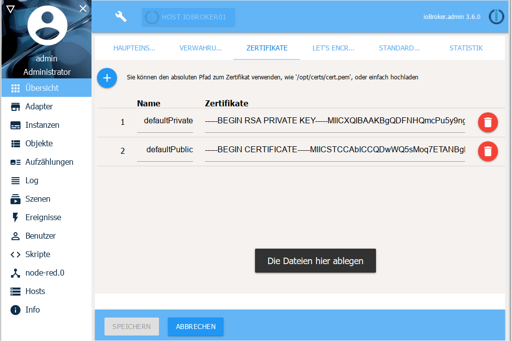

＃系统设置
可以通过屏幕标题栏中的扳手图标从管理员的每个菜单点访问系统设置。

系统设置分布在几个子页面上：

##主要设置
在主要设置中，设置了ioBroker的基本参数，ioBroker中的适配器也使用了这些参数。

一些参数已从主机设置中获取。

**系统语言**

因此您可以在不同的系统语言之间进行选择。可能尚未完全支持所有语言。

**温度单位**

某些适配器使用此值。可以是°C或°F。

**货币**

当前没有使用适配器

** 日期格式 **

选择日期应如何在admin和vis中显示。

**小数点分隔符**

浮点值的逗号或句点

**标准历史记录实例**

默认情况下，此实例中记录数据，并将其用于flot和人力车的图表中。

如果仅安装一个历史记录适配器（SQL / History / InfluxDB），则使用它；如果有多个，则可以选择一个。

**有效存管**

通过下拉菜单选择要从其安装适配器版本的所需存储库。下拉菜单中提供了“存储位置”子页面上列出的存储库

##存放地点

ioBroker可以从不同来源获取适配器列表。在安装过程中输入了以下来源：

*默认值（=稳定）：http://download.iobroker.net/sources-dist.json
*最新（= Beta）：http://download.iobroker.net/sources-dist-latest.json

如果在此输入了来自较旧安装的其他存储库，则应将其删除，因为它们将不再维护。

##证书

这是用于SSL / HTTPS通信的证书的中心点。证书由admin，web，simple-api，socketio使用。默认情况下安装标准证书。您无法使用它进行任何验证。它们仅用于SSL通信。由于证书是开放的，因此您应该使用自己的（自签名）证书，购买真实证书或切换到“让我们加密”。使用默认证书的通信是不安全的，如果有人想读取流量，则可以这样做。确保安装自己的证书。
例如。在linux下。

可以将证书指定为路径，也可以使用拖放操作完全上传证书

##让我们加密

Let's Encrypt是独立的Internet安全研究小组（ISRG）的免费，自动化和开源证书颁发机构。

有关“让我们加密”的更多信息，请参见[这里](https://letsencrypt.org/)。

某些安装使用动态DNS或类似的软件。为了通过在此分配的地址到达您自己的域。 ioBroker在Let's Encrypt组织中支持证书的自动请求和续订。

几乎每个可以启动Web服务器并支持HTTPS的适配器中都存在使用免费的Let's Encrypt证书的选项。

如果您激活使用证书而不是自动更新的选项，则相应的实例将尝试使用保存的证书。

如果激活了自动更新，则实例将尝试从Let's Encrypt请求证书并自动更新它们。

首次调用相关地址时，首次请求证书。即如果你例如将“ Sub.domain.com”配置为地址，然后调用https://sub.domain.com，这是首次请求证书，这可能需要一段时间才能得出答案。

证书的颁发是一个复杂的过程，但是如果您按照以下说明进行操作，则很容易获得免费证书。

**方法：**

必须使用输入的电子邮件地址创建一个新帐户（在系统设置中进行设置）

生成一个随机密钥作为该帐户的密码。

创建帐户后，系统会在端口80上打开一个小型网站以确认地址。

让我们始终使用端口80进行加密来检查地址。

如果端口80已被其他服务使用，则适用第4点-即为其他服务分配其他端口！

当小型Web服务器启动时，系统设置中指定地址的证书请求将发送到Let's加密服务器。

Let's Encrypt服务器响应请求发送回一个质询短语，过一会儿尝试在地址“ http：// yourdomain：80 / .well-known / acme-challenge /”下读取该质询短语。

如果服务器从我们这边获得此质询短语，则“加密”服务器将发送证书。这些文件保存在系统设置中输入的目录中。

这听起来很复杂，但是您要做的就是激活一些复选框，然后在系统设置中输入电子邮件地址和网址。

收到的证书有效期约为90天。首次颁发这些证书后，将启动另一个任务，该任务会自动扩展有效性。

这个主题非常复杂，成千上万的事情可能出错。如果这不起作用，建议在移动中使用IoT适配器进行访问。

让我们加密仅适用于node.js版本> = 4.5

＃＃ 访问权限

在此子页面中，可以为所有用户/组定义不同区域的访问权限

##统计

为了使我们对安装（使用的适配器）和地理分布有所了解，如果我们收到此信息，我们将非常高兴。

您可以发送不同数量的信息。可以在左侧选择此范围。

然后，将在右侧显示发送此数据的确切格式。
该数据是绝对匿名评估的。