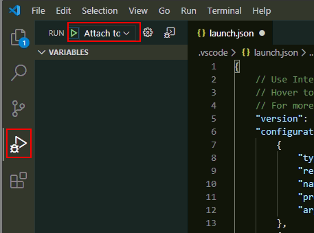

＃调试适配器
带有Chrome的调试适配器
Node.JS支持使用Chrome进行调试。

如果您在ioBroker中停止适配器，然后从控制台启动它：

```
cd /opt/iobroker
iobroker stop sayit
node --inspect node_modules/iobroker.sayit/main.js --debug
```

重要的是`-–inspect`

然后输出如下内容：

```
Debugger listening on port 9229.
Warning: This is an experimental feature and could change at any time.
To start debugging, open the following URL in Chrome:
    chrome-devtools://devtools/remote/serve_file/@60cd6e859b9f557d2312f5bf532f6aec5f284980/inspector.html?experiments=true&v8only=true&ws=127.0.0.1:9229/9415dda6-0825-40ed-855c-83c6142e56e9
2016-12-27 15:23:02.637  - error: sayit.0 adapter disabled
starting. Version 1.3.1 in /opt/iobroker/node_modules/iobroker.sayit, node: v6.9.2
2016-12-27 15:23:02.647  - info: sayit.0 starting. Version 1.3.1 in /opt/iobroker/node_modules/iobroker.sayit, node: v6.9.2
Debugger attached.
```

然后，如果您在Chrome中输入输出链接，则可以使用Chrome进行调试：


*经过测试：Windows，Chrome 55，node.js 6.9.2 *

###使用Chrome进行远程调试
如果iobroker与chrome不在同一台计算机上运行，则该命令基于以上示例：

```
node --inspect-brk=0.0.0.0:9229 node_modules/iobroker.sayit/main.js --debug
```

参数`--inspect-brk`确保与上述相比，

在调试器开始时，在适配器的第一行上设置了一个断点。

如果您不总是希望复制链接以单独启动调试，也可以转到chrome中的以下页面：

```
chrome://inspect
```

然后就像配置inspect命令一样，只需一次通过configure输入ioBroker计算机**的IP地址和端口即可。

启动命令后，调试会话将显示在此处，单击即可启动。

chrome调试选项很棒。
您拥有从**网络调试**中也知道的所有选项：断点，以及条件，监视，调用堆栈，作用域检查，控制台输出等。

图片和英文说明位于[在这里](https://software.intel.com/en-us/xdk/articles/using-chrome-devtools-to-debug-your-remote-iot-nodejs-application)

如果尚未安装，则iobroker计算机上仍需要节点检查器：

```
npm install -g node-inspector
```

##使用WebStorm进行调试
使用`Visual Studio Code`进行##调试
如果使用`VS Code`打开目录，则在打开适配器目录（`File=>Open folder...`菜单）之后，可以调试适配器。

`.vscode/launch.js`文件中的配置应如下所示：

```
{
    "version": "0.2.0",
    "configurations": [
        {
            "type": "node",
            "request": "launch",
            "name": "Launch Program",
            "program": "${workspaceFolder}\\main.js",
            "args": ["--debug"]
        },
        {
            "name": "Attach to Process",
            "type": "node",
            "request": "attach",
            "address": "IO_BROKER_IP_ADDRESS",
            "port": 9229
          }
    ]
}
```

###本地调试
适配器停止运行后（`iobroker stop ADAPTER_NAME`），可以在VS代码中启动适配器：

选择`Launch Program`并单击`Play`按钮后，适配器将启动，您可以在本地调试。

###远程调试
为此，您应该专门在ioBroker服务器上启动适配器。

```
d /opt/iobroker
obroker stop ADAPTERNAME
ode --inspect-brk=0.0.0.0:9229 node_modules/iobroker.ADAPTERNAME/main.js --debug
```

然后，您可以将`VS Code`连接到进程（`attach`）。

