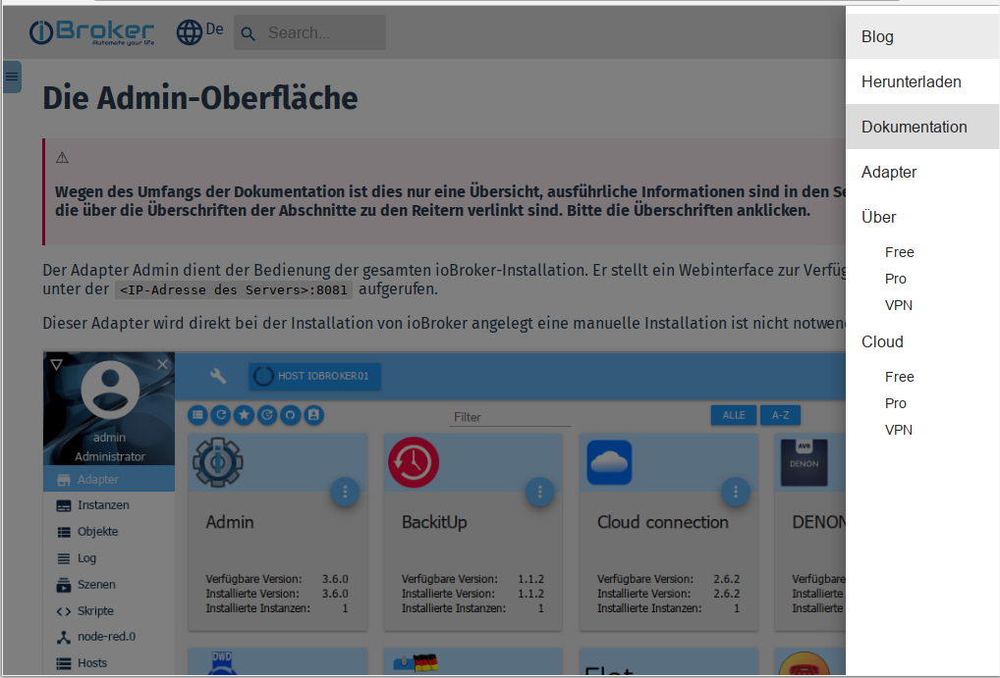

**本文档是所有ioBroker用户的主要参考资料：**

##页面结构
此页面是采用***响应式设计***创建的。这意味着根据阅读设备（PC /平板电脑/手机）的分辨率，其显示方式有所不同，以实现最佳的可读性。

在低（有效）分辨率的情况下，操作元素会部分隐藏，以便为主窗口腾出空间。

因此，当前显示可能与屏幕截图有所不同。

###不同的菜单
为了获得最佳的概览，共有三个不同的菜单：

---

#### 1-主菜单
通常，该菜单的要点在PC上页面的标题栏中可见；整个菜单以低分辨率隐藏。
然后必须通过单击汉堡图标将其打开：

单击菜单项后，菜单会自动关闭以为内容腾出更多空间。

---

#### 2-文档菜单此菜单通常在PC上可见，但以低分辨率隐藏。然后必须通过单击汉堡图标将其打开：

第一行有一个过滤器字段。通过输入术语，将过滤整个菜单树以显示该术语，并且仅显示适当的菜单项。

可以再次使用带有箭头的图标来隐藏菜单，以便为内容腾出更多空间。

---

#### 3-主题菜单
在此菜单中，显示了所选文章的主要主题，以便能够更快地导航到所需的位置。

可以使用带有** X **的图标再次隐藏菜单。

###更多控件
#### 4-语言选择
该网站是多语言的。将会一点一点地增加更多的语言。首先会自动生成一些内容，邀请母语人士来改进文本。

可以在地球图标上选择所需的语言。

如有必要，将扩展此语言列表。

#### 5-搜索
该字段不需要任何解释。请广泛使用！

---

*对于初学者，我们建议您先阅读有关ioBroker的一些基础知识。

在[基础] []一章中对此有更多的了解。

*在[下载] []页面上，为不同系统准备了图像。

此处还提供了一些硬件平台的详细安装说明。

*有关所有适配器的信息，请参见中央的[适配器参考] []。
*控制规则的创建在[逻辑与自动化] []部分中进行了描述。

我们感谢每一个伸出援助之手。如果您想为ioBroker的进一步发展做出贡献，可以在[Developer area] []中找到信息。

本文档正在不断扩展。如果您认为缺少某些内容或需要更好的描述，请[帮助我们] []改进文档！

[Grundlagen]: https://www.iobroker.net/#de/documentation/basics/README.md

[Download]: https://www.iobroker.net/#de/download

[Adapter-Referenz]: https://www.iobroker.net/#de/adapters

[Logik & Automatisierung]: https://www.iobroker.net/#de/documentation/logic/examples.md

[Developer Bereich]: https://www.iobroker.net/#de/documentation/dev/adapterdev.md

[helfen Sie uns dabei]: https://forum.iobroker.net/viewtopic.php?f=8&t=16933