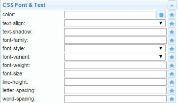

#Widgets
##一般
在此上下文中的小部件（“设备，事物”）是以各种方式表示数字，文本，图像或图表并提供交互可能性的显示元素。

## ** ioBroker.vis小工具**
对于带有vis的ioBroker中的可视化，有不同的小部件集。

-------------------------------------------------------------------------------  
-------------------------------------------------------------------------------

###小部件的基本设置
####一般来说

|属性|说明|
|-----|----|

|名称|在此您可以为此窗口小部件输入唯一名称评论|在这里您可以输入简短描述| CSS类|：构造：|过滤词|：构造：|在视图中显示|在此您可以选择此窗口小部件是仅应出现在当前视图中还是出现在多个窗口中。
|不活动（锁定）|：构造：

#### **可见性**
可以使小部件的可见性取决于数据点的状态。

|属性|说明|
|----|----|

| `Object ID`|输入应控制所选窗口小部件可见性的数据点的ID。可以通过按钮搜索数据点。
|条件|如果在此处为o.a输入条件，则窗口小部件将可见。数据点...
|条件的值| ...对应于此处输入的值。

#### **一般**
“常规”部分特定于每个窗口小部件，并为每个窗口小部件详细描述。
在本节中，对象ID字段中的所需数据点将映射到窗口小部件。

***小部件的** CSS设置**可以在以下菜单项中找到，可以根据您自己的意愿进行调整：

#### **一般的CSS **

|属性|说明|
|-----|----|

| `left`|距视图左边缘的距离`top`|距视图顶部的距离| `width`|小部件的宽度| `height`|小部件的高度| `z-index`|指示小部件所在的平面（0 =背景，正值=值越高，越远）| `overflow-y`|

| `溢出y` |
| `opacity`|透明度（0 =不透明 - >图像不可见.. 1 =透明 - >图像可见） |

#### CSS字体和文字

|属性|说明|
|-----|----|

| `color`|字体颜色（通过选择对话框或颜色代码）| `text-align`|文本协议（左，右，居中）| `text-shadow`|文本阴影的颜色| `font-family`|字体| `font-style`|字符集类型（正常，斜体，倾斜，初始，继承）| `font-variant`|字符集变体（普通，小写字母，......）| `font-weight`|字符集强度| `font-size`|字体大小| `line-height`|行间距| `letter-spacing`|字符空间| `word-spacing`|字间距

#### ** CSS背景**

|属性|说明|
|-----|-----|

| `background`|在这里，您可以指定多个以下属性`-color`|背景颜色| `-image`|壁纸| `-repeat`|确定是否在元素的整个宽度和/或高度上重复背景。
| `-attachement`|指定滚动时背景图像是固定的还是移动的`-position`|背景图像的方向（https://www.w3schools.com/cssref/pr_background-position.asp）| `-size`|壁纸的大小| `-clip`|控制与边界重叠| `-origin`|图像坐标的坐标系原点

#### ** CSS边框**

|属性|说明|
|----|----|
| -width |边框的厚度| |
| -style |边框的线条样式|
| -color |边框颜色|
| -radius |边界的角半径;最多可以是小部件的较短范围的一半 |

|属性|说明|
|-----|----|

| `-width`|边界的厚度| `-style`|边界线条样式| `-color`|边界颜色| `-radius`|边界的圆角半径;最多可以是小部件较短范围的一半

#### CSS阴影和距离

|属性|说明|
|----|----|
| padding |从小部件框的边缘偏移|
| padding-left |左侧偏移|
| padding-top |顶部偏移|
| padding-right |右侧偏移|
| padding-bottom |下侧偏移|
| box-shadow |小部件框阴影的颜色|
| margin-top |小部件周围的顶部边框（auto，％，px，pt，cm）|
| margin-right |小部件周围的右边距|
| margin-bottom |小部件周围的下边距|
| margin-left |小部件周围的左边距|

|属性|说明|
|-----|----|

| `padding`|从小部件框的边缘偏移| `padding-left`|左侧偏移| `padding-top`|偏移在上侧| `padding-right`|右侧偏移| `padding-bottom`|下侧偏移| `box-shadow`|小部件框阴影的颜色| `margin-top`|小部件周围的顶部边框（auto，％，px，pt，cm）| `margin-right`|小部件周围的右边距| `margin-bottom`|小部件的底部| `margin-left`|小部件周围的左边距