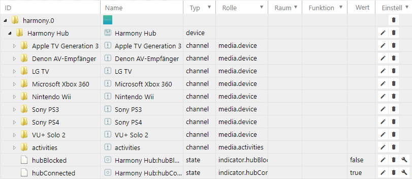
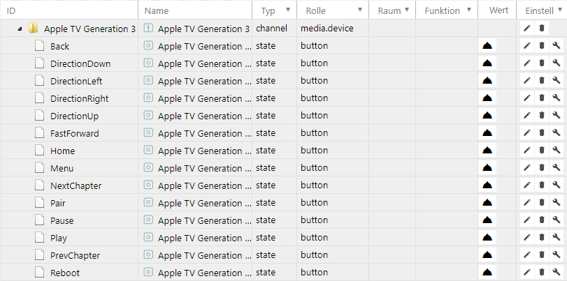

# Logitech Harmony-Adapter
Der Logitech Harmony-Adapter ermöglicht die einfache Einbindung eines oder 
auch mehrerer Logitech Harmony Hubs in ein ioBroker-System. 

Mit Hilfe des Logitech Harmony Hubs können eine Vielzahl von Unterhaltungs- und
Smart Home-Geräten gesteuert werden. Mit dem ioBroker lassen sich über den Hub 
Aktivitäten starten und beenden, der Status von Aktivitäten abfragen sowie 
Geräte durch virtuelle Tastendrücke fernsteuern.


 <span style="color:grey">  
*Logitech Harmony Hub mit Harmony Elite Fernbedienung*</span>


## Steckbrief
> Achtung! Die folgende Tabelle dient nur als Beispiel. Sie wird vom 
  Dokumentengenerator dynamisch erzeugt und an dieser Stelle eingefügt.
  Je nach den ausgewählten Feldern sind die Datenquellen z.B. `frontmatter`,
  `io-package.json` und `package.json` des jeweilgen Adapters.
  Eventuell kann der Steckbrief auch an einer anderen Stelle der Dokumentation
  plaziert werden.

|                         |                                         |
|-------------------------|:---------------------------------------:|
| Stand der Doku          | 29.07.2018                              |
| aktuelle Version stable | ![stable][logo]                         |
| aktuelle Version latest | ![latest][logo]                         | 
| OS                      | Linux, Windows; OS X                    |
| node-Version            | >= 4.x                                  |
| Entwickler              | Pmant                                   |
| Github                  | LINK                                    |
| Lizenz                  | MIT                                     |
| Kategorie               | Multimedia                              |
| Keywords                | `harmony` `hub` `logitech` `home automation`             |
| Abhängigkeiten          | `harmonyhubjs-client` `harmonyhubjs-discover` `semaphore`|          


## Überblick

### Logitech Harmony
Logitech Harmony ist kompatibel mit mehr als 270.000 Entertainment- und Smart 
Home-Geräten. Dazu gehören Fernseher und Kabelboxen, Disc-Player und Spielkonsolen 
bis hin zu AV-Receivern und Streaming-Media-Playern sowie intelligente Beleuchtung,
Schlösser, Thermostate und vieles mehr.

Mit Logitech Harmony kann man Programme wechseln, die Lautstärke regulieren, 
Favoriten festlegen sowie Beleuchtung und anderer Smart-Geräte steuern. Das Highlight
des Systems ist das Erstellen von Aktionen zur Steuerung von mehreren Geräten mit nur
einem Tastendruck.

1. Der Logitech Harmony Hub verbindet sich mit dem Heimnetzwerk über WLAN. 
2. Harmony Hubs haben keinen Ethernet-Anschluss.
3. Der Hub unterstützt nur das WLAN 2,4 GHz-Frequenzband. Das 5 GHz-Frequenzband wird 
   nicht unterstützt.
4. Es sollte ein 802.11 g/n-Router verwendet werden. 802.11 a/b wird nicht unterstützt.
5. Als Verschlüsselung für das WLAN wird vom Hub WEP 64/128, WPA Personal und 
   WPA2-AES unterstützt.
6. UPnP muss für Harmony nicht aktiviert sein, damit die Harmony-App den 
   Hub erkennen und mit ihm kommunizieren kann. Hingegen muss es aktiviert sein,
   damit der Hub andere Geräte im Netzwerk erkennt und mit ihnen zusammenarbeitet.
   Das betrifft zum Beispiel Geräte wie Philips hue, Sonos, Nest, Roku oder Smart TVs.
7. Die maximale Geräteanzahl pro Hub beträgt 8 Geräte. 15 Geräte sind möglich, wenn als
   Fernbedienung mindestens ein Harmony Touch oder Ultimate one am Hub registriert ist.
8. Die maximale Anzahl an bevorzugten Kanälen sind 50 pro mobilem Gerät.

### Logitech Harmony-Adapter
Der Logitech Harmony-Adapter findet automatisch alle Logitech Harmony-Hubs, die sich 
über eine WLAN-Verbindung zuammen mit dem ioBroker-Server im gleichen Netzwerksubnetz
befinden.

Objekte zur Auslösung von Funktionen und Aktivitäten (=Befehlsmakros) werden vom
Adapter automatisch im ioBroker angelegt. Auch der aktuelle Status des Hubs steht
zur Verfügung. Durch geziehltes Beschreiben oder Lesen der angelegten Objekten 
kann deren Status geändert und damit Aktionen ausgelöst oder auch abgefragt werden.  


## Voraussetzungen vor der Installation
Über den ioBroker Adapter für das Logitech Harmony-System lassen sich keine Geräte oder
Aktivitäten neu anlegen oder verändern. Deshalb ist es erforderlich, dass vor der Nutzung 
des Adapters das Fernbedienungssystem, wie in der Anleitung von Logitech beschrieben, 
eingerichtet ist und mit den gesteuerten Geräten zusammen funktioniert.


## Installation
Eine Instanz des Adapters wird über die ioBroker Admin-Oberfläche installiert. Die 
ausführliche Anleitung für die dazu notwendigen Installatonschritte finden sie **hier**.

Nach Abschluß der Installation einer Adapterinstanz öffnet sich automatisch 
ein Konfigurationsfenster.


##  Konfiguration
Der Adapter findet automatisch alle Harmony Hubs, die sich im Subnetz des 
ioBroker-Servers befinden.


### Fenster "Logitech Harmony adapter settings"
<span style="color:grey">  
*Admin Oberfläche*</span>

| Feld         | Beschreibung |                                                                       
|:-------------|:-------------|
|**Hub User**|Für den Fall, dass Sie den Zugang zur Harmony Hub-Konfiguration mit einem Benutzer und einem Kennwort versehen haben, geben Sie bitte hier den Benutzernamen ein. Achten Sie dabei auf die Groß- und Kleinschreibung.|
|**Hub Passwort**|Für den Fall, dass Sie den Zugang zur Harmony Hub-Konfiguration mit einem Benutzer und einem Kennwort versehen haben, geben Sie bitte hier das Kennwort ein. Achten Sie dabei auf die Groß- und Kleinschreibung.|

Die beiden Felder brauchen nur dann ausgefüllt werden, wenn der Hub mit einem Benutzernamen
und einem Passwort gesichert ist.

Nach Abschluß der Konfiguration wird der Konfigurationsdialog mit `SPEICHERN UND SCHLIEßEN`
verlassen. Dadurch efolgt im Anschluß ein Neustart des Adapters.


##  Instanzen
Die Installation des Adapters hat im Bereich `Objekte` eine aktive Instanz des 
Logitech Harmony-Hub-Adapters angelegt.

<span style="color:grey">  
*Erste Instanz*</span>

Auf einem ioBroker Server lässt sich immer nur eine Instanz des Logitech 
Harmony-Adapters installieren.

Ob der Adapter aktiviert oder mit dem Logitech Harmony Hub verbunden ist, wird 
mit der Farbe des Status-Feldes der Instanz verdeutlicht. Zeigt der Mauszeiger
auf das Symbol, werden weitere Detailinformationen dargestellt. 


## Objekte des Adapters

Im Bereich `Objekte` werden in einer Baumstruktur alle vom Adapter im Hub 
erkannten Geräte und Aktivitäten aufgelistet. Zusätzlich wird auch noch 
darüber informiert, ob die Kommunikation mit dem Hub reibungslos erfolgt. 

<span style="color:grey">  
*Objekte des Harmony-Adapters*</span>

Die angelegten Objekte und ihre Bedeutungen sind wie folgt definiert:

Objekt | Zugriff | Bescheibung 
:------|:-------:|:-----------
**harmony.0** | R | Name der ersten *Instanz* des Logitech Harmony-Adapters
&emsp;**Harmony Hub**| R | Name des *Hubs*
&emsp;&emsp;**Apple TV Generation 3**| R | Name eines *Geräts*, enthält Gerätefunktionen 
&emsp;&emsp;**Denon AV-Empfänger**| R | Name eines *Geräts*, enthält Gerätefunktionen 
&emsp;&emsp;**:**| R | Weitere *Geräte*
&emsp;&emsp;**activities**| R | Liste mit allen im Harmony Hub programmierten *Aktivitäten* 
&emsp;&emsp;***hubBlocked***| R | Zeigt an, ob der Hub gerade beschäftigt ist
&emsp;&emsp;***hubConnected***| R | Status der Verbindung zwischen Adapter und Hub

### Gerätefunktionen
Öffnet man ein Gerät, so erhält man eine Liste mit allen zum Gerät gehörenden
Funktionalitäten. Diese Gerätefunktionen sind gerätespezifisch und unterscheiden sich 
deshalb bei Geräten unterschiedlichen Typs.

<span style="color:grey">  
*Gerätefunktionen*</span>

#### Auslösen einer Gerätefunktion
Jede Gerätefunktion `{Instanz}.{Hub Name}.{Gerät}.{Gerätefunktion}` löst eine 
entsprechende Reaktion des angesprochenen Geräts aus. Die Werte von Gerätefunktionen 
können gelesen und beschrieben werden. Die Auslösung kann man testen, in dem 
man mit dem Mauszeiger die Glocke rechts der Funktion betätigt. Alternativ kann man 
mit dem Stiftsymbol dort auch einen Wert eintragen. 
Werte haben die Einheit `Millisekunden`. Wird ein Wert zwischen 1 und 250ms
eingegeben, wird vom Harmony Hub meist ein einfacher Tastendruck in der 
vorgegeben Länge ausgegeben. Größere Werte als 250ms können zur 
Mehrfachbetätigung der Gerätefunktion führen.
Nach dem Auslösen der Gerätefunktion ändert sich der Wert wieder auf 0.


### Aktivitäten
Unterhalb von `activities`werden alle am Harmony Hub programmierten Aktivitäten
aufgelistet.

<span style="color:grey">  
*Aktivitäten*</span>

#### Starten einer Aktivität
Aktivitäten werden gestartet, wenn man bei einer Aktivität 
`{Instanz}.{Hub Name}.activities.{Aktivität}` eine Zahl größer als 0 einträgt. 
Während der Ausführung der Aktivität ändert sich dieser Wert zuerst 
nach 1 (=startend) und dann nach 2 (=aktiv).

#### Beenden einer Aktivität
Laufende Aktivitäten können gestoppt werden, in dem man ihren Wert auf 0 setzt.
Alternativ kann man zum Beenden einer Aktivität im Objekt 
`{Instanz}.{Hub Name}.activities.currentStatus` eine beliebige Zahl eintragen. 
Während des Beendens der Aktivität ändert sich 
`{Instanz}.{Hub Name}.activities.currentStatus` von 3 (=beendend) auf 0 (=inaktiv).

#### Weitere Statuswerte
`{Instanz}.{Hub Name}.activities.currentActivity` liefert die aktuell ausgeführte
Aktivität als Zeichenfolge.

`{Instanz}.{Hub Name}.activities.currentStatus` zeigt den Status des Harmony Hubs 
an. Dabei bedeuten die Werte
- 0 = inaktiv
- 1 = startend
- 2 = aktiv
- 3 = beendend

`{Instanz}.{Hub Name}.activities.{Aktivität}` zeigt den Status einer Aktivität an.
Die Bedeutung der Werte ist analog zu 
`{Instanz}.{Hub Name}.activities.currentStatus`.


<a name="deinstallation"/>

## Deinstallation
> T: Ich bin der Meinung, dass eine Standarddeinstallation eines Adapters in einem 
  zentralen Artikel ausführlich dokumentiert wird. Beim Adapter wird (immer) 
  auf diesen zentralen Artikel verwiesen. Nur Abweichungen vom Standardverfahren 
  werden hier dokumentiert.

sollte die Instanz wieder entfernt werden sollen wird diese über das zugeordnete Mülleimer-Icon 
in der Rubrik Instanzen entfernt


Es erscheint eine Sicherheitsabfrage, die mit ***OK*** bestätigt werden muss


Anschließend erscheint wieder ein Fenster, dass die Abarbeitung der Deinstallationsbefehle zeigt


Bei dieser Deinstallation werden alle zu der Instanz gehörenden Objekte vollständig entfernt.

Sollten die Installationsdateien vollständig von dem Host gelöscht werden, muss dies über das Mülleimer-Icon 
in der Kachel des Harmony-Adapters in der Rubrik Adapter geschehen.


<a name="besonderheiten"/>

## Besonderheiten
Backup  
Multihost  
History  
Performance


<a name="faq"/>

## FAQ
>Im Forum nach häufig auftretenden Fragen suchen und hier Referenzantwort geben

1. **Die Verbindung zum Hub wird immer wieder unterbrochen.**  

   Der Harmony-Hub benötigt für die Kommunikation mit dem Adapter eine ausgezeichnete
   Funkverbindung. Die Verwendung eines WLAN-Accesspoints in unmittelbarer räumlicher
   Nähe des Hubs wird empfohlen. 

2. **Wie kann man am einfachsten den Knopf "alles aus" via ioBroker implementieren?**  

   Setze `{Instanz}.{Hub Name}.activities.currentStatus` auf 0.  

3. **Unter Windows erscheint bei der Installation des Adapters die Meldung 
   `ERR! code ENOGIT` und der Adapter funktioniert nicht.**  
   
   Vor der Installation des Harmony-Adapters GIT von der Webseite 
   https://git-scm.com/download/win laden und installieren.

4. **Unter Linux erscheint bei der Installation des Adapters die Meldung 
   `ERR! code ENOGIT` und der Adapter funktioniert nicht.**
   
   Vor der Installation des Harmony-Adapters GIT mittels Kommandozeile und 
   `sudo apt install git` installieren.

6. **Skripte funktionieren mit neueren Versionen des Adapters nicht mehr.**

   Ab Version 0.9.1 dees Adapters werden Objekte anders benannt. Aus alt 
   `harmony.0.Harmony_Hub` wurde z.B. neu `harmony.0.Harmony Hub`. Bitte
   die Objekte prüfen und darauf aufsetzende Komponenten wie z.B. Skripte 
   anpassen.

7. **Das WLAN wird nachts automatisch deaktiviert. Der Adapter stellt nach dem
   Wiedereinschalten des WLANs die Verbindung zum HUB nicht mehr automatisch her.**

   Füge einen automatischen Restart der harmony-Instanz (Expertenmodus) etwa 
   5-10 Minuten nach dem WLAN-Routerstart ein.

8. **Der HUB wird nicht gefunden.**
   
   Prüfe nach, ob der Hub sich wirklich um gleichen Netzwerksubnetz und VLAN
   wie der ioBroker-Server befindet. Sind Multicasts erlaubt oder werden diese 
   vom Router gefiltert? Leuchtet die Status-LED am Hub grün?
   Ist der Hub über die Logitech App zu erreichen? Gehe nach der Anleitung 
   von Logitech vor, um Konnektivitätsprobleme zu lösen.

9. **Es lässt sich nur eine Instanz des Adapters installieren.**
    
   Auf einem ioBroker Server lässt sich immer nur eine Instanz des Logitech 
   Harmony-Adapters installieren.
 


<a name="beispiele"/>

## Beispiele

### JavaScript
Auslösen von Gerätefunktionen. Hier wird der Denon AV-Empfänger ein- oder ausgeschaltet,
wenn sich der Wert eines anderen Datenpunktes verändert.
```javascript
if (getState("hm-rpc.0.MEQ01234567.2.STATE").val == true) {
  setState("harmony.0.Harmony Hub.Denon AV-Empfänger.PowerOn"/*Denon AV-Empfänger:PowerOn*/, '1', true);
  // Bei Kontrolle Schalter == AN keine Verzögerung Schalter
} else if (getState("hm-rpc.0.MEQ01234567.2.STATE").val == false) {
  // Bei Kontrolle Schalter == AUS schalte mit Verzögerung
  var timeout = setTimeout(function () {
    setState("harmony.0.Harmony Hub.Denon AV-Empfänger.PowerOn"/*Denon AV-Empfängerr:PowerOn*/, '1', true);
  }, 1000);
}
```

### Blockly
Auslösen von Gerätefunktionen. Hier wird der Denon AV-Empfänger ein- oder ausgeschaltet,
wenn sich der Wert eines anderen Datenpunktes verändert.

<span style="color:grey">  
*Blockly*</span>

[Quelltext][blockly]

### Node-Red
> zugehörige node-red-Elemente
> Beispiele
> Exporte zum Weiterverwenden

### vis
> zugehörige vis-Elemente
> Beispiele
> Exporte zum Weiterverwenden
> Code-Fragmente


<a name="links"/>

## Links
> Referenzen auf andere Dokumente im ioBroker-Portal
> Weblinks z.B. zum Hersteller
> GitHub-Links
* Herstellerseite https://www.logitech.com/de-de/product/harmony-hub (20.07.2018)


<a name="historie"/>

## Historie
> Der folgende Text dient nur als Platzhalter. Die Historie wird  
  vom Dokumentengenerator dynamisch erzeugt und hier eingefügt. Datenquelle
  ist io-package.json -> common.news in der jeweiligen Doku-Sprache

| Version | Änderung                                  |
|:-------:|:------------------------------------------|
|0.9.1    |Fix für problematische Zeichen             |
|0.7.1    |Bug fixes                                  |
|0.7.0    |Unterstützung für mehrere Hubs hinzugefügt |
|0.6.2    |falscher Port korrigiert                   |
|0.1.0    |Initialer commit                           |   


[logo]: https://badge.fury.io/js/svgo.svg "npm logo"
[blockly]: media/a_harmony_blockly.xml "Blockly"
