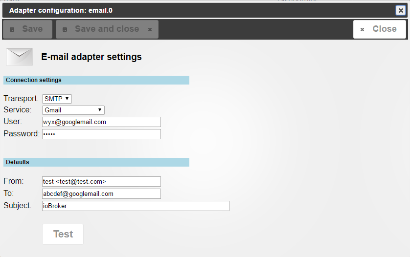
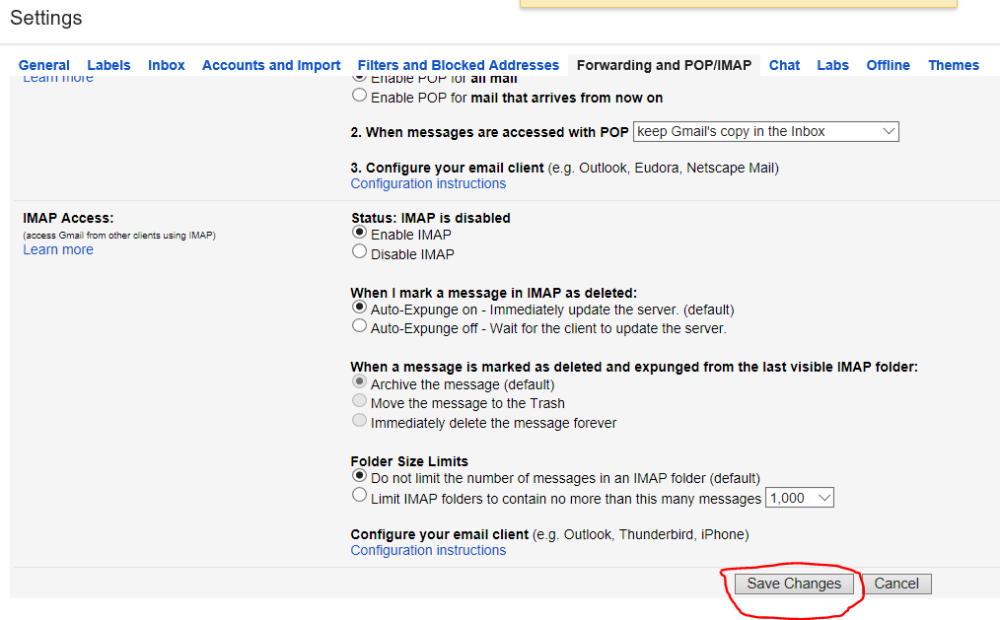
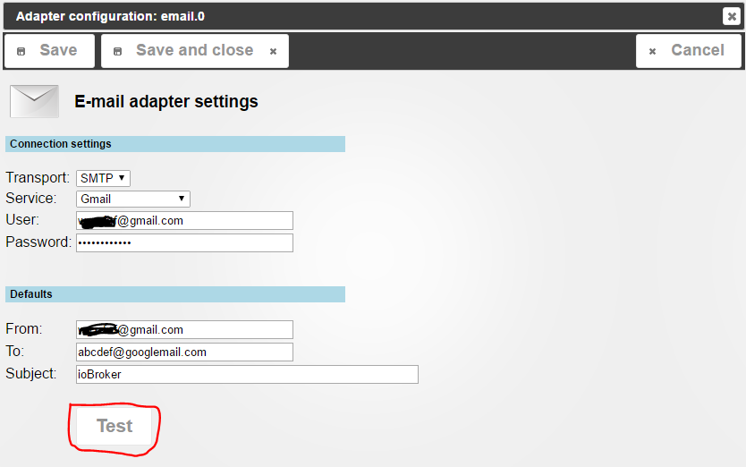
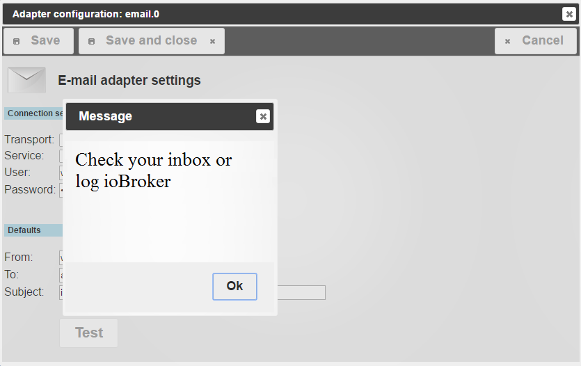
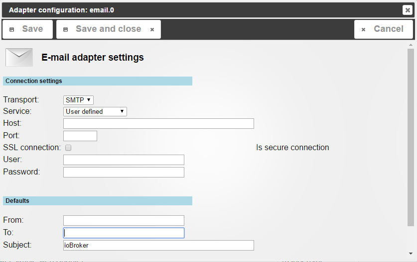
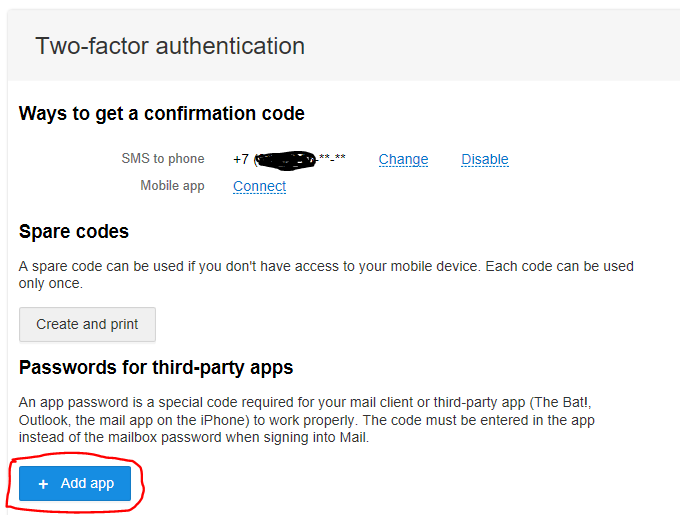
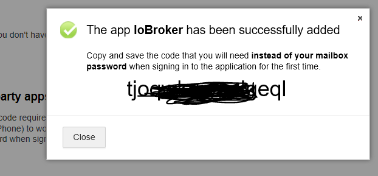
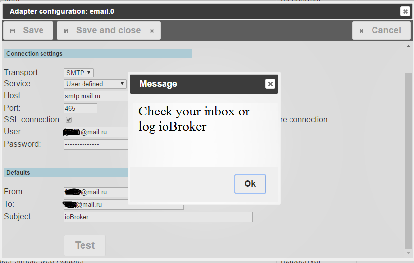

## Description

The Email driver is used for sending e-mails from IoBroker to e-mail specified in the settings.

##  Information

##  Setting

After installing the driver, you must make the settings, specify the data to connect to the mail server. [

 **Protocol:** the protocol used for sending mail – SMTP **Service:** the used mail service **User:** the username for connection to the service (in most cases it is the full email address with the @ sign) **Password:** user password **From:** specify the E-mail of the sender (usually matches the User field)* **To:** specify the E-mail recipient* **Subject:** the general for all, a letter subject* * _It is possible to set any value in a script._ **Important!** To use the driver on the mail services, using two-stage authentication on the server, you need to allow the use of third-party e-mail programs, and set the password in the settings of your e-mail service to connect third-party program to your mail server. It can reduce safety of your mail account.

## Supported services

At the moment, the driver supports the following postal services:

*   1und1
*   AOL
*   DebugMail.io
*   DynectEmail
*   FastMail
*   GandiMail
*   Gmail
*   Godaddy
*   GodaddyAsia
*   GodaddyEurope
*   hot.ee
*   Hotmail
*   iCloud
*   mail.ee
*   Mail.ru
*   Mailgun
*   Mailjet
*   Mandrill
*   Naver
*   Office365
*   OpenMailBox
*   Postmark
*   QQ
*   QQex
*   SendCloud
*   SendGrid
*   SES
*   SES-US-EAST-1
*   SES-US-WEST-2
*   SES-EU-WEST-1
*   Sparkpost
*   web.de
*   Yahoo
*   Yandex
*   Zoho
*   User defined _// Allows to specify a mail service not from the list, with arbitrary data connection._

## **Example of use**

To send mail from your scripts using the following syntax in Javascript adapter:

<pre class="lang:default decode:true">// To send the letter from all instances of the email driver
sendTo("email", "Text of the letter");

// To send the letter from a certain instance of the email driver
sendTo("email.1", "Text of the letter");

// It is possible to set arbitrary subject and other parameters of the letter
sendTo("email", {
    from:    "iobroker@mydomain.com",
    to:      "aabbcc@gmail.com",
    subject: ""Message from ioBroker",
    text:    "Test letter!"
});

// Sending attachments
sendTo("email", {
    attachments: [
       // Use of the file on a disk for attachment in the letter
       {path: "/pathToImage/picture1.jpg"},
       {   // Using the URL links to file attachments in email
            filename: 'license.txt',
            path: 'https://raw.github.com/andris9/Nodemailer/master/LICENSE'
       }
    ]
});

// Sending the letter in a HTML format
sendTo("email", {
    html: "
Embedded image: 
",
    attachments:[
        {path: "path/to/file/image1.jpg", cid: "image1"}
    ]
});</pre>

If you write the own driver, then for sending the letter from other driver is used **adapter.sendTo** function.

<pre class="lang:default decode:true ">adapter.sendTo("email", "Text of the letter");</pre>

## Example of setting

### Gmail setting

Let's try to configure the driver as an example the Gmail service. First of all, it is necessary to include in settings of mail access according to the IMAP protocol: [

   Attention! Perhaps it will be required to reduce the safety of access to your Google account. If you use two-stage authentication on Google then you need to change settings of access to the account for unreliable applications. You can read information about it on the reference [page](https://support.google.com/accounts/answer/6010255) of Google. It is also required to add the password for the third-party application, you can read about it on this [page](https://support.google.com/accounts/answer/185833). After introduction of all settings, click the **Test** button: [

   If all settings are correct then there should appear a message about successful sending letter. [

  

### Setting to arbitrary service

Consider the point of service settings – **User defined**. As an example, we will try to connect our driver to the mail.ru service. Select Tools in the settings – User defined: [

   Go to the website of a mail service and find, in help or settings, parameters for connection of third-party email clients. We are looking for data to connect to the mail service: Incoming IMAP:

*   Server name – imap.mail.ru
*   Port – 993;
*   SSL – SSL/TLS;
*   Authentication - usual password.

Outgoing SMTP:

*   Server name – smtp.mail.ru
*   Port – 465;
*   SSL – SSL/TLS;
*   Authentication - usual password

  From this list we are interested only in connection to the outgoing mail server (SMTP). Due to the fact that I have enabled two-factor authentication on the service, so I need to get the password for the e-mail program by adding a new application to the mailbox settings: [

   Enter any name of our application and click **Create**: [

   Enter the current password of access and receive the password, which needs to be copied in settings of our email driver in the field the **Password**. [

   Specify all obtained data in settings of our driver, click the **Test** button and see a message about successful sending the letter. On it our settings are finished. [

