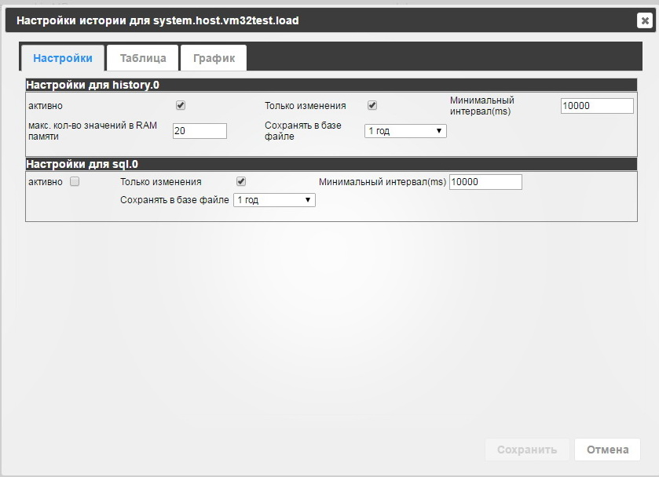
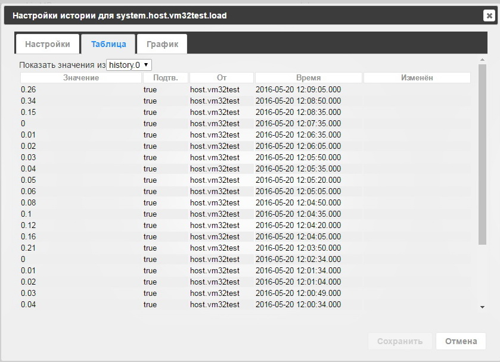

## Описание

Драйвер **History** используется для архивирования значений переменных в формате JSON в виде текстовых файлов. Запись данных происходит в два этапа: сначала информация накапливается в оперативной памяти, а затем записывается в каталоге хранения (при достижении максимального количества записей - настраивается).

## Информация

## Установка

Установка осуществляется на вкладке **Драйвера** странички [администрирования](http://www.iobroker.net/?page_id=3800&lang=ru) системы. В группе **Хранилище** находим строчку с названием **History** и нажимаем кнопку со значком плюса в этой строке справа. На экране появится всплывающее окно установки драйвера, в конце установки оно автоматически закроется. Если все прошло удачно, на вкладке **Настройка драйверов** появится строка **history.0 **с установленным экземпляром драйвера. Чтобы драйвер начал работу, нужно его запустить (нажать на кнопку старт). Если драйвер запущен, то при перезагрузке системы, он стартует автоматически. 

## Настройка

 **Путь для файлов**. Если это поле оставить пустым, то драйвер будет сохранять файлы по пути `/iobroker-data/history` в директории самой программы (в Linux по-умолчанию `/opt/iobroker`). Можно вписать своё значение, тогда путь будет абсолютным, к примеру `/mnt/history` (Linux) или `D:/History` (Windows). Когда количество событий в памяти (RAM) превысит заданный порог (см. настройку ниже), то в каталоге хранения адаптер создаст папку с текущей датой в формате **YYYYMMDD** (если еще не создана). В этой папке для каждой архивируемой переменной создается файл с именем `history.[имя переменной].json`. Настройки **Сохранять подтверждение события** и **Сохранять источник события** добавляют в объект JSON данные `"ack": true/false` и `"from": "имя переменной"`. Эту информацию можно использовать при работе с историческими данными драйвера из других адаптеров или скриптов. Настройка **Количество событий в RAM,** как уже писалось выше, позволяет использовать буфер в памяти ОЗУ. Если система хранения данных на флеш-памяти (к примеру система установлена на Raspberry Pi или Cubieboard, где ОС и все данные хранятся на карте памяти MicroSD), это может увеличить срок службы карты. Так же, не следует забывать, что в случае аварийной перезагрузки системы, данные из буфера будут утеряны безвозвратно. **Минимальный интервал** (в мс) - минимальный интервал записи данных. **Время хранения в базе** - время хранения данных в файлах JSON, старые данные удаляются. Чтобы проверить, добавляются ли записи в файлы JSON, можно настроить архивирование какой нибудь переменной. К примеру, рассмотрим переменные работы хоста ioBroker (нагрузку ЦП, память и пр.). Для этого на вкладке **Объекты** в верхнем левом углу нажимаем кнопку **Показать системные объекты**, в таблице ищем группу **system.host.имя_хоста**, раскрываем список и настаиваем хранение истории для выбранных переменных (кнопка в строке крайняя справа):

*   ставим галочку **активно** в группе **Настройки для history.0**,
*   остальные настройки можно оставить по-умолчанию,
*   нажимаем кнопку **Сохранить**.

[

 [

 Через некоторое время можно открыть эту же настройку переменной (к примеру, **system.host.vm32test.load**) и перейти на вкладку **Таблица** – там отобразятся архивные значения из файлов JSON. Возможно, надо подождать подольше, так как информация в файлы пишется из буфера в ОЗУ по заполнению (как описано выше). [

 Можно зайти в директорию хранения файлов драйвера History и просмотреть содержимое файлов JSON. [

 

## Использование

### Пользовательские запросы

Сохраненные значения могут быть доступны из Javascript драйвера или скрипта. Например, последующий код, с помощью которого можно запросить список событий за последний час: `// Выдать значения для переменной "system.adapter.admin.0.memRss" за последний час` `var end = new Date().getTime();` `sendTo('history.0', 'getHistory', {` `  id: 'system.adapter.admin.0.memRss',` `  options: {` `    start: end - 3600000,` `    end: end,` `    aggregate: 'onchange'` `  }` `}, function (result) {` `  for (var i = 0; i < result.result.length; i++) {` `    console.log(result.result[i].id + ' ' + new Date(result.result[i].ts).toISOString());` `  }` `});` Или последние 50 событий: `// Выдать 50 последних значений всех переменных` `sendTo('history.0', 'getHistory', {` `  id: '*',` `  options: {` `    end: new Date().getTime(),` `    count: 50,` `    aggregate: 'onchange'` `  }` `}, function (result) {` `  for (var i = 0; i < result.result.length; i++) {` `    console.log(result.result[i].id + ' ' + new Date(result.result[i].ts).toISOString());` `  }` `});` Можно использовать следующие опции в запросе:

*   **start** - (optional) время в ms - `new Date().getTime()`
*   **end** - (optional) время в ms - `new Date().getTime()`, по-умолчанию (сейчас + 5000 секунд)
*   **step** - (optional) используется для объединения (m4, max, min, average, total) данных по интервалам
*   **count** - число значений, если используется объединение данных 'по изменению' или число интервалов, если другой метод объединения.
*   **from** - если поле _from_ должно быть включено в ответ
*   **ack** - если поле _ack_ должно быть включено в ответ
*   **q** - если поле _q_ должно быть включено в ответ
*   **addId** - если поле _id_ должно быть включено в ответ
*   **limit** - не возвращает записи более установленного лимита
*   **ignoreNull** - если нулевые значения следует включить (false), заменить последним, не нулевым значением (true) или заменить нулем (0)
*   **aggregate** - метод объединения:
    *   _minmax_- используется следующий алгоритм. Объединяется весь диапазон значений в небольшие интервалы по времени и для каждого интервала находится минимальные, максимальные, начальные и конечные значения,
    *   _max_ - Объединяется весь диапазон значений в небольшие интервалы по времени и для каждого интервала используется максимальное значение (null игнорируется)
    *   _min_ - Похожий метод как max, только для каждого интервала отбираются минимальные значения,
    *   _average_ - Похожий метод как max, только для каждого интервала вычисляются средние значения,
    *   _total_ - Похожий метод как max, только для каждого интервала вычисляются общие значения,
    *   _count_ - Похожий метод как max, только для каждого интервала вычисляется число значений (nulls участвует в вычислениях).

### Графическое представление исторических данных

В составе системы есть драйвера, которые могут выводить графики изменения переменных от времени на экран, с учетом записей в БД. К примеру, драйвер [Flot](http://www.iobroker.net/?page_id=4034&lang=ru) – позволяет гибко настраивать вывод графической информации, рисовать несколько временных рядов на одной странице и [встраивать](http://www.iobroker.net/?page_id=4034&lang=ru#i-6) графику в iframe драйвера визуализации VIS. 