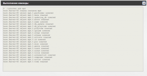
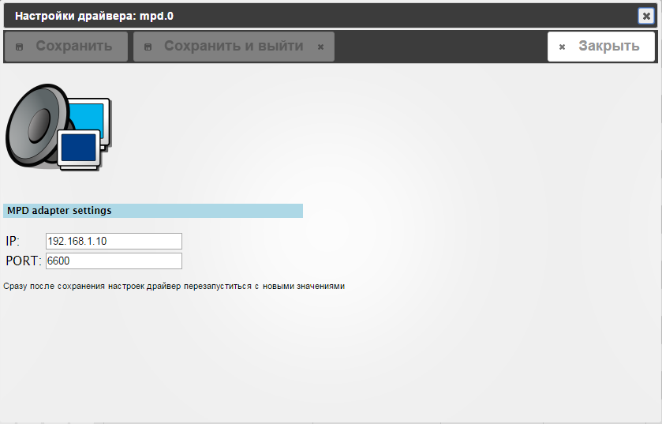

## Описание

**Драйвер mpd** является клиентом для управления проигрывателем MPD (Music Player Daemon).

MPD - музыкальный аудио проигрыватель с клиент-серверной архитектурой, который воспроизводит музыку из указанного каталога (библиотеки). Воспроизведением управляют при помощи клиента. Управлять сервером (демоном) можно с любого компьютера, телефона или планшета (iOS/Android) в сети, а с помощью данного драйвера со странички в VIS или из JS скриптов в iobroker. Выводить звук можно как локально на том устройстве где установлен демон так и через потоковое аудио по HTTP. Соответствующие настройки задаются в конфигурационном файле. Описание протокола проигрывателя находится [тут](https://www.musicpd.org/doc/protocol/).

##  Информация

## Установка драйвера

Установка осуществляется на вкладке **Драйвера** странички [администрирования](http://www.iobroker.net/?page_id=3800&lang=ru) системы. В группе драйверов **Медиа **находим строчку с названием **mpd client adapter** и нажимаем кнопку со значком плюса в этой строке справа.

## [

На экране появится всплывающее окно установки драйвера, в конце установки оно автоматически закроется. [

 Если все прошло удачно, на вкладке **Настройка драйверов** появится строка **mpd.0 **с установленным экземпляром драйвера. [

По-умолчанию драйвер не запущен, чтобы его стартовать, нажимаем на кнопку **Неактивно. Нажать для старта** (красная с иконкой play). Если драйвер настроен верно установлено соединение с сервером MPD, то индикатор состояния (значок) слева от названия инстанции драйвера (mpd.0) будет **зеленый**. Если он **желтый** то это означает, что драйвер запущен, но не установлено соединение с сервером MPD.

[

## Настройка драйвера

Для перехода на окно настроек нажимаем кнопку **Настроить.** [

 Откроется окно настроек драйвера. В поле **IP** и **PORT **задается ip адрес  устройства на котором запущена серверная часть проигрывателя MPD и порт на котором он работает. [

 После ввода значений нажимаем кнопку **Сохранить и выйти**, при этом окно настроек закрывается, драйвер перезапустится уже с новыми параметрами и если все настройки верны, и серверная часть MPD работает, то индикатор состояния загорится зеленым.

## Установка MPD на Linux

Установим mpd с помощью apt-get (или любым удобным для вас способом) `sudo apt-get install mpd` Переходим к настройке. За конфигурацию демона mpd отвечает файл /etc/mpd.conf `sudo -e /etc/mpd.conf` Нам откроется структурированный файл с кучей комментариев после каждой из переменных настроек. Отредактируем некоторые из них: Указываем пути на наши папки, не забыв создать необходимые с помощью команды `mkdir -p ~/.mpd/playlists`

<pre class="theme:github toolbar:2 striped:false nums:false trim-code-tag:false lang:default decode:true">music_directory "/home/username/Music"
playlist_directory "/home/username/.mpd/playlists"
db_file "/home/username/.mpd/tag_cache"
log_file "/home/username/.mpd/mpd.log"
pid_file "/home/username/.mpd/pid"
state_file "/home/username/.mpd/state"</pre>

Настроим пользователя и адрес нашего демона

<pre class="lang:default decode:true">user "mpd" #оставим без изменений
bind_to_address "localhost" #оставим без изменений</pre>

Отключим вывод через alsa закомментировав знаком '#' следующий строки:

<pre class="lang:default decode:true ">#audio_output {
# type "alsa"
# name "My ALSA Device"
# device "hw:0,0" # optional
# format "44100:16:2" # optional
# mixer_device "default" # optional
# mixer_control "PCM" # optional
# mixer_index "0" # optional
#}</pre>

Настроим вывод звука через pulseaudio

<pre class="lang:default decode:true">audio_output {
   type "pulse"
   name "My Pulse Output"
   # server "remote_server" # optional
   # sink "remote_server_sink" # optional
}</pre>

Настроим потоковое вещание (открыть :8000/mpd.ogg в любой плеере, например vlc. Если хотите проигрывать поток как mp3 - замените ниже vorbis на lame).

<pre class="lang:default decode:true">audio_output {
   type "httpd"
   name "My HTTP Stream"
   encoder "vorbis" # optional, vorbis or lame
   port "8000"
   # quality "5.0" # do not define if bitrate is defined
   bitrate "128" # do not define if quality is defined
   format "44100:16:1"
}</pre>

Еще раскомментируйте опцию **mixer_type**, выбрав наиболее подходящий вам. Например: mixer_type "software" Основные настройки закончены. Теперь применим несколько команд, позволяющих избежать проблем с уровнем доступа или с pulseaudio. Вы можете как столкнуться с этими проблемами, так и не встретить их. В любом случае перестраховка не помешает. #Настроим права доступа `sudo usermod -a -G {folder_owner} {mpd_user} sudo chmod g+rX {path_to_folder}` где folder_owner - имя владельца папки (в моем случае - username), mpd_user - пользователь указанный в mod.conf (в нашем случае - mpd), ну и path_to_folder в нашем случае /home/username/Music и /home/username/.mpd `sudo usermod -a -G username mpd sudo chmod g+rX /home/username/Music sudo chmod a+rwx /home/username/.mpd/` #Настраиваем права доступа в pulseaudio для mpd_user `sudo usermod -a -G pulse-access mpd sudo usermod -a -G pulse mpd` Перезапустим mpd (после установки он запускается автоматически): `sudo /etc/init.d/mpd stop sudo /etc/init.d/mpd start-create-db` При наличии на рабочей станции нескольких звуковых карт могут возникать проблемы - звук через нужную карту не воспроизводится.

#### **Для вывода звука аудиоплеером MPD через именную звуковую карту:**

уточняем наличие и маркировку звуковых карт

<pre class="">  # cat /proc/asound/cards
    0 [I82801DBICH4   ]: ICH4 - Intel 82801DB-ICH4
                         Intel 82801DB-ICH4 with ALC650E at irq 17
    1 [Live           ]: EMU10K1 - SB Live! 5.1 [SB0060]
                         SB Live! 5.1 [SB0060] (rev.7, serial:0x80611102) at 0xa000, irq 19
</pre>

в файле конфигурации _/etc/mpd.conf_ секция _audio_output_ приводится например к виду

<pre class="">  audio_output {
       type            "alsa"          # тип устройства воспроизведение
       name            "My ALSA Device"
       device          "hw:Live"       # указание вывода звука через SB Live! 5.1
       mixer_type      "hardware"      # тип регулировки звука - аппаратный
       mixer_device    "hw:Live"       # устройство регулировки звука
       mixer_control   "Master"        # канал регулировки звука "Master"
      #mixer_control   "PCM"           # или "PCM"
  }</pre>

## Установка MPD на Windows

Скачать версию MPD Windows можно по [этой](http://download.iobroker.net/2017_01_18_mpd_017_win.zip) ссылке. Распаковываем проигрыватель в любой каталог, _например на диск **D:** в каталог **mpd** (**d:/mpd/**)._ Изменяем настройки в конфигурационном файле **mpd.conf**. Стоит отметить что все пути в конфигурационном файле пишутся  через два обратных слеша (\\) или через одну косую черту (/). Файл конфигурации **mpd.conf **для Windows:

<pre class="lang:default decode:true"># Плей-листы
playlist_directory "d:\\mpd\\playlists"
# База данных с тегами
db_file "d:\\mpd\\database\\mpd.db"
# Каталог записи лог файлов
log_file "d:\\mpd\\log\\mp.log"
pid_file "d:\\mpd\\log\\pid"
state_file "d:\\mpd\\log\\state"
# Каталог с музыкой. Вложенные подкаталоги также поддерживаются
music_directory "e:\\Music\\"

bind_to_address "0.0.0.0" 
port "6600"
log_level "default"
auto_update "yes"
#id3v1_encoding "cp1251" 
#filesystem_charset "cp1251"

input {
	plugin "curl"
	# proxy "proxy.isp.com:8080"
	# proxy_user "user"
	# proxy_password "password"
}

#windows multimedia output
audio_output {
	type "winmm"
	name "Speakers"
	#device "Speakers (Realtek High Definition Audio)"
}</pre>

После этого можно запускать проигрыватель командой:

<pre class="lang:default decode:true">mpd.exe mpd.conf</pre>

Либо запустив файл **start_mpd.bat**, для автоматического запуска проигрывателя при загрузке Windows, добавляем файл в автозагрузку.

## Конфигурационный файл MPD

Конфигурация вывода потокового аудио через HTTP:

<pre class="lang:default decode:true">audio_output {
    type "httpd"
    name "My HTTP Stream"
    # Используемый кодек, может быть vorbis или lame
    encoder "vorbis"
    port "8000"
    # quality "5.0"
    # Параметры quality и bitrate взаимоисключающие
    bitrate "128"
    # Формат аудиопотока (44,1 кГц, 16 бит, стерео)
    format "44100:16:2"
}</pre>

## Возможности проигрывателя

*   Поддержка форматов Ogg Vorbis, FLAC, OggFLAC, MP2, MP3, MP4/AAC, MOD, Musepack, APE и WAV, а также всех остальных, которые поддерживаются FFMpeg.
*   Удалённое управление MPD через сеть (есть поддержка IPv4 и IPv6).
*   Потоковое HTTP воспроизведение FLAC, OggFLAC, MP3 и Ogg Vorbis.
*   Читает и кэширует информацию метаданных (теги) — (ID3 (id3v1 и id3v2)), комментарии Vorbis и теги MP4.
*   MPD умеет перекодировать теги.
*   Поддержка буфера при проигрывании (предотвращает пропуски при высокой загруженности или большом времени отклика сети).
*   Воспроизведение музыки без кратковременных пауз между композициями (gapless playback — особенно важен при прослушивании записей с концертов, а также оперы).
*   Поддержка плавного наложения/плавного перехода (Crossfading).
*   Поддержка прокрутки.
*   Поддержка Cue sheets (как встроенных в теги файла, так и внешних), но только в старых версиях, в новых нет.
*   Возможность обновления только части базы данных.
*   Сохранение, загрузка и управление плей-листами (в формате m3u, с относительными или абсолютными путями).
*   Контроль громкости (OSS, ALSA и программные микшеры).
*   Поддержка широкого диапазона аудиоустройств (OSS, ALSA, Sun, esd, ARts, PulseAudio и др.), в том числе и потокового вещания (Icecast, также имеет встроенный сервер).
*   Минимальные системные требования.
*   Демон тестирован на Linux, FreeBSD, OpenBSD, NetBSD, Solaris и HP-UX.
*   Возможность скроблинга на Last.fm

## Описание объектов

*   **play, pause, stop, next, previous **- Воспроизвести, пауза, стоп, следующий трек, предыдущий трек.
*   **mute **- Отключение звука, воспроизведение при этом продолжается.
*   **random** - включает/отлючает случайное воспроизведение.
*   **repeat** - Повтор воспроизведения плейлиста.
*   **volume** - Регулировка уровня громкости от 0 до 100.
*   **add** - добавить файл или папку в текущий плейлист, путь относительно библиотеки.
*   **save** - Записав сюда произвольное имя, в каталоге _playlists_ сохранится текущий плейлист с заданным именем.
*   **addplay** - добавить в текущий плейлист и воспроизвести добавленный трек, путь относительно библиотеки либо http ссылка на аудио поток.
*   **lsinfo** - навигация по библиотеке. В этот объект записываем путь, в ответ получаем объект с содержимым папки.

Например: Вид получаемого объекта на запрос содержимого папки _Flac/Armin van Buuren - Mirage (2010):_

<pre class="lang:default decode:true">{
	"files": [{
		"file": "Flac/Armin van Buuren - Mirage (2010)/01 - Armin van Buuren feat. Susana - Desiderium 207.flac",
		"filetype": "file",
		"title": "Desiderium 207",
		"lastmodified": "2010-10-08 10:46:52",
		"time": "129",
		"track": "1",
		"date": "2010",
		"artist": "Armin van Buuren feat. Susana",
		"album": "Mirage",
		"genre": "Trance"
	},
	{
		"file": "Flac/Armin van Buuren - Mirage (2010)/16 - Armin van Buuren - Youtopia.flac",
		"filetype": "file",
		"title": "Youtopia",
		"lastmodified": "2010-10-08 10:46:50",
		"time": "240",
		"track": "16",
		"date": "2010",
		"artist": "Armin van Buuren",
		"album": "Mirage",
		"genre": "Trance"
	}]
}</pre>

*   **playlist_list** -  Объект содержания текущего плейлиста:

<pre class="lang:default decode:true">[{
	"artist": "",
	"album": "",
	"bitrate": 0,
	"title": "",
	"file": "Flac/Astrud Gilberto Plus James Last Orchestra/01-Samba Do Soho.flac",
	"genre": "",
	"year": 0,
	"len": "00:00",
	"rating": "",
	"cover": ""
},
{
	"artist": "",
	"album": "",
	"bitrate": 0,
	"title": "",
	"file": "Flac/Astrud Gilberto Plus James Last Orchestra/11-Agua De Beber.flac",
	"genre": "",
	"year": 0,
	"len": "00:00",
	"rating": "",
	"cover": ""
}]</pre>